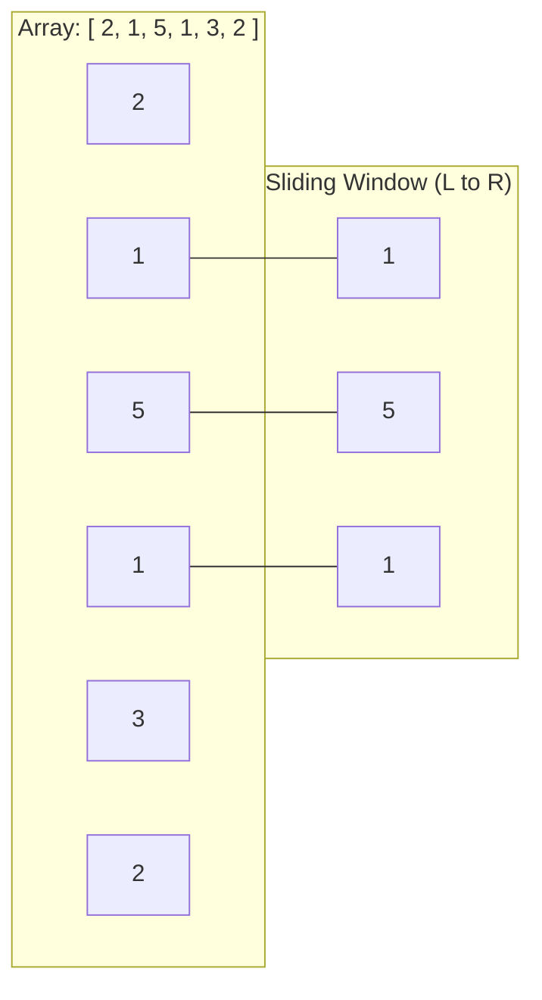

# 🪟 Sliding Window Pattern

## 🎯 Learning Objectives
- Distinguish between **Fixed-size** and **Dynamic-size** sliding window problems.
- Implement the standard sliding window template using `left` and `right` pointers in JavaScript.
- Avoid common $O(N^2)$ brute force traps by maintaining window state variables dynamically.
- Solve LeetCode classics like *Minimum Size Subarray Sum* and *Longest Substring Without Repeating Characters*.

---

## 💡 Core Concept

The Sliding Window pattern converts nested loops ($O(N^2)$ or $O(N^3)$) into a single linear pass ($O(N)$) when operating on contiguous elements (arrays or strings).



### Types of Sliding Window
1. **Fixed Window Size $K$:** The window width is constant. As the right edge advances by 1, the left edge advances by 1.
2. **Dynamic Window Size:** The window expands rightwards until a condition is satisfied or violated, then contracts from the left to optimize or restore validity.

---

## 🛠️ General Templates (JavaScript)

### 1. Dynamic Window Template (Flexible Length)

```javascript
/**
 * Generic Dynamic Sliding Window Template
 * @param {Array|string} items 
 * @returns {number} optimal length or result
 */
function slidingWindowDynamic(items) {
  let left = 0;
  let windowState = 0; // or Map/Object for frequency track
  let result = 0;

  for (let right = 0; right < items.length; right++) {
    // 1. Expand window by adding items[right]
    windowState += items[right];

    // 2. Shrink window from left while condition is met/violated
    while (/* condition violated or need minimization */ windowState >= TARGET) {
      // Record valid window metric
      result = Math.max(result, right - left + 1);

      // 3. Remove items[left] from window and shrink left pointer
      windowState -= items[left];
      left++;
    }
  }

  return result;
}
```

### 2. Fixed Window Template (Length $K$)

```javascript
/**
 * Generic Fixed Sliding Window Template
 * @param {number[]} nums 
 * @param {number} k 
 * @returns {number}
 */
function slidingWindowFixed(nums, k) {
  let currentSum = 0;
  let maxSum = -Infinity;

  for (let i = 0; i < nums.length; i++) {
    currentSum += nums[i]; // Add current element

    // Once window reaches size k, slide it
    if (i >= k - 1) {
      maxSum = Math.max(maxSum, currentSum);
      currentSum -= nums[i - (k - 1)]; // Remove element exiting window
    }
  }

  return maxSum;
}
```

---

## 💻 Runnable JavaScript Examples

### Problem 1: Minimum Size Subarray Sum (LeetCode 209)
*Given an array of positive integers `nums` and a positive integer `target`, return the minimal length of a contiguous subarray whose sum is $\ge$ `target`. If none exists, return 0.*

```javascript
function minSubArrayLen(target, nums) {
  let left = 0;
  let currentSum = 0;
  let minLength = Infinity;

  for (let right = 0; right < nums.length; right++) {
    currentSum += nums[right];

    while (currentSum >= target) {
      minLength = Math.min(minLength, right - left + 1);
      currentSum -= nums[left];
      left++;
    }
  }

  return minLength === Infinity ? 0 : minLength;
}

// Verification
console.log(minSubArrayLen(7, [2, 3, 1, 2, 4, 3])); // Output: 2 (subarray [4, 3])
```

### Problem 2: Longest Substring Without Repeating Characters (LeetCode 3)
*Given a string `s`, find the length of the longest substring without repeating characters.*

```javascript
function lengthOfLongestSubstring(s) {
  const charSet = new Set();
  let left = 0;
  let maxLength = 0;

  for (let right = 0; right < s.length; right++) {
    // If duplicate found, shrink window until duplicate is removed
    while (charSet.has(s[right])) {
      charSet.delete(s[left]);
      left++;
    }
    charSet.add(s[right]);
    maxLength = Math.max(maxLength, right - left + 1);
  }

  return maxLength;
}

// Verification
console.log(lengthOfLongestSubstring("abcabcbb")); // Output: 3 ("abc")
```

---

## ⚠️ Common Pitfalls
- **Non-contiguous assumptions:** Sliding window ONLY works on contiguous subarrays or substrings. For non-contiguous subsets, consider Dynamic Programming or Backtracking.
- **Negative numbers:** Standard sliding window for sum constraints assumes positive numbers. If array contains negative numbers, expansion does not guarantee sum increase (use Prefix Sum + Hash Map instead).
- **Off-by-one errors:** Window length calculation is always `right - left + 1`.

---

## 🔀 How It Compares

| Technique | Applicability | Time Complexity | Space Complexity |
|---|---|---|---|
| **Brute Force** | Any subarray problem | $O(N^2)$ or $O(N^3)$ | $O(1)$ |
| **Sliding Window** | Contiguous subarrays/substrings | $O(N)$ | $O(1)$ or $O(K)$ |
| **Prefix Sum + Hash Map** | Subarrays with positive & negative numbers | $O(N)$ | $O(N)$ |

---

## ✅ Quick Reference / Cheatsheet

```text
Fixed Window Size K:
  Expand right -> i >= k-1 -> Record Result -> Subtract nums[i - k + 1]

Dynamic Window (Max Length):
  Expand right -> Add to state -> While invalid: remove left, left++ -> Record max length

Dynamic Window (Min Length):
  Expand right -> Add to state -> While valid: record min length, remove left, left++
```

---

[← Overview](./index) | [Index](./index) | [Next: 02 Binary Search →](./02-binary-search)
