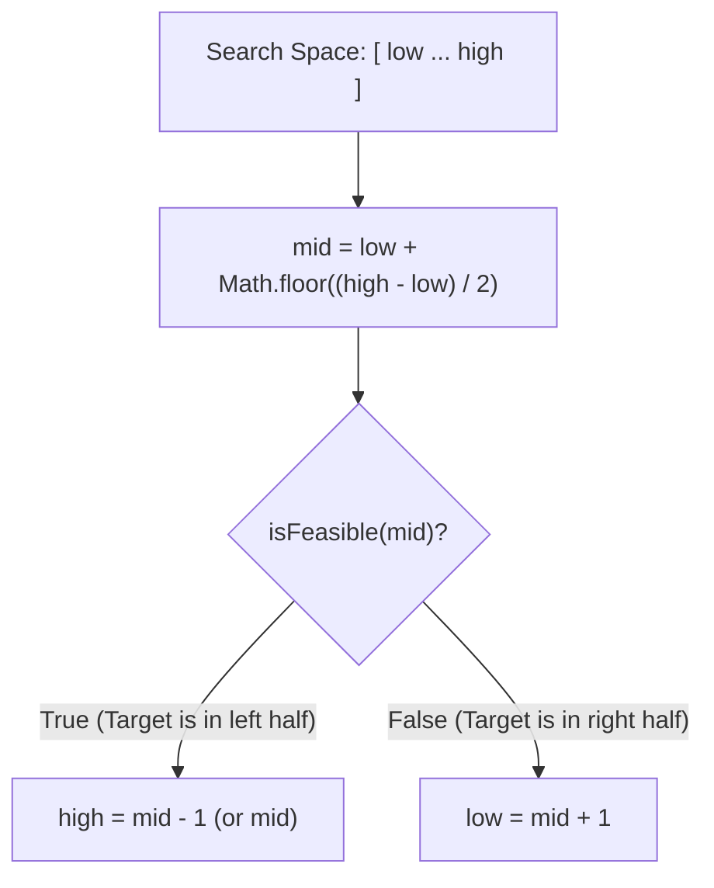

# 🔍 Binary Search Template & Patterns

## 🎯 Learning Objectives
- Master the canonical `low <= high` Binary Search template without infinite loops.
- Implement Lower Bound (first occurrence) and Upper Bound (last occurrence) routines in JavaScript.
- Apply **Binary Search on Answer Space** for minimization/maximization problems with monotonic feasibility functions.
- Solve LeetCode problems like *Search in Rotated Sorted Array* and *Capacity to Ship Packages*.

---

## 💡 Core Concept

Binary Search eliminates half of the search space at each iteration, achieving $O(\log N)$ time complexity. It requires the search space to be monotonic (sorted or partitionable by a boolean predicate `isFeasible(mid)`).



---

## 🛠️ Essential Templates (JavaScript)

### Template 1: Classic Exact Value Search

```javascript
/**
 * Classic Binary Search
 * @param {number[]} nums 
 * @param {number} target 
 * @returns {number} index of target, or -1 if not found
 */
function binarySearch(nums, target) {
  let low = 0;
  let high = nums.length - 1;

  while (low <= high) {
    // Avoid integer overflow
    const mid = low + Math.floor((high - low) / 2);

    if (nums[mid] === target) return mid;
    if (nums[mid] < target) {
      low = mid + 1;
    } else {
      high = mid - 1;
    }
  }

  return -1;
}
```

### Template 2: Boundary Search (Lower Bound / First Position)

```javascript
/**
 * Finds the first index where nums[index] >= target
 * @param {number[]} nums 
 * @param {number} target 
 * @returns {number}
 */
function lowerBound(nums, target) {
  let low = 0;
  let high = nums.length - 1;
  let ans = nums.length;

  while (low <= high) {
    const mid = low + Math.floor((high - low) / 2);
    if (nums[mid] >= target) {
      ans = mid; // Candidate answer found, try left half for earlier occurrence
      high = mid - 1;
    } else {
      low = mid + 1;
    }
  }

  return ans;
}
```

### Template 3: Binary Search on Answer Space

```javascript
/**
 * Minimizes an answer in range [minPossible, maxPossible]
 */
function binarySearchAnswer(minPossible, maxPossible, isFeasible) {
  let low = minPossible;
  let high = maxPossible;
  let result = maxPossible;

  while (low <= high) {
    const mid = low + Math.floor((high - low) / 2);
    if (isFeasible(mid)) {
      result = mid;     // Record valid answer
      high = mid - 1;   // Try smaller valid answer
    } else {
      low = mid + 1;    // Must increase mid
    }
  }

  return result;
}
```

---

## 💻 Runnable JavaScript Examples

### Problem 1: Search in Rotated Sorted Array (LeetCode 33)

```javascript
function search(nums, target) {
  let low = 0;
  let high = nums.length - 1;

  while (low <= high) {
    const mid = low + Math.floor((high - low) / 2);
    if (nums[mid] === target) return mid;

    // Check if left half is sorted
    if (nums[low] <= nums[mid]) {
      if (nums[low] <= target && target < nums[mid]) {
        high = mid - 1;
      } else {
        low = mid + 1;
      }
    } 
    // Otherwise, right half is sorted
    else {
      if (nums[mid] < target && target <= nums[high]) {
        low = mid + 1;
      } else {
        high = mid - 1;
      }
    }
  }

  return -1;
}

// Verification
console.log(search([4, 5, 6, 7, 0, 1, 2], 0)); // Output: 4
```

### Problem 2: Capacity To Ship Packages Within D Days (LeetCode 1011)

```javascript
function shipWithinDays(weights, days) {
  // Lower bound: maximum single weight package
  let low = Math.max(...weights);
  // Upper bound: sum of all packages
  let high = weights.reduce((a, b) => a + b, 0);

  function canShip(capacity) {
    let requiredDays = 1;
    let currentWeight = 0;

    for (const w of weights) {
      if (currentWeight + w > capacity) {
        requiredDays++;
        currentWeight = 0;
      }
      currentWeight += w;
    }

    return requiredDays <= days;
  }

  let minCapacity = high;
  while (low <= high) {
    const mid = low + Math.floor((high - low) / 2);
    if (canShip(mid)) {
      minCapacity = mid;
      high = mid - 1;
    } else {
      low = mid + 1;
    }
  }

  return minCapacity;
}

// Verification
console.log(shipWithinDays([1, 2, 3, 4, 5, 6, 7, 8, 9, 10], 5)); // Output: 15
```

---

## ⚠️ Common Pitfalls
- **Midpoint Overflow:** Avoid `(low + high) / 2` when dealing with large numbers. Use `low + Math.floor((high - low) / 2)`.
- **Infinite Loops:** Using `low = mid` without `Math.ceil` or using `high = mid` in `low <= high` loop condition causes infinite loops.
- **Unsorted Input:** Binary Search strictly requires monotonic invariant.

---

## ✅ Quick Reference / Cheatsheet

```text
Target Search:
  low <= high | mid = low + Math.floor((high - low) / 2)
  if match -> return mid; if smaller -> low = mid + 1; if larger -> high = mid - 1

Lower Bound (First index >= target):
  if nums[mid] >= target -> ans = mid, high = mid - 1; else -> low = mid + 1

Minimization Predicate:
  if isFeasible(mid) -> ans = mid, high = mid - 1; else -> low = mid + 1
```

---

[← Previous: 01 Sliding Window](./01-sliding-window) | [Index](./index) | [Next: 03 Two Pointers →](./03-two-pointers)
