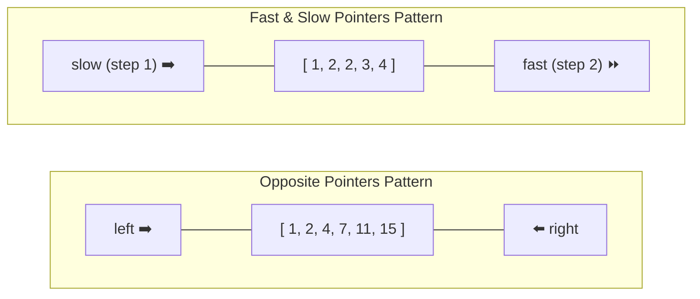

# 👈👉 Two-Pointers Technique & Patterns

## 🎯 Learning Objectives
- Differentiate between **Opposite Pointers** and **Fast & Slow (Same-Direction) Pointers**.
- Implement standard 2-pointer solutions for sorted arrays and palindrome verifications.
- Apply Floyd's Cycle Finding algorithm (Tortoise and Hare) on linked lists.
- Solve LeetCode classics like *3Sum*, *Container With Most Water*, and *Remove Duplicates*.

---

## 💡 Core Concept

The Two-Pointers strategy uses two indices iterating through a sequence to reduce search space from $O(N^2)$ to $O(N)$.



---

## 🛠️ Essential Templates (JavaScript)

### Template 1: Opposite Pointers (Sorted Array / Palindrome)

```javascript
function oppositePointers(arr) {
  let left = 0;
  let right = arr.length - 1;

  while (left < right) {
    const currentVal = evaluate(arr[left], arr[right]);

    if (currentVal === TARGET) {
      return [left, right];
    } else if (currentVal < TARGET) {
      left++; // Need larger value
    } else {
      right--; // Need smaller value
    }
  }

  return [];
}
```

### Template 2: Fast & Slow Pointers (In-place Array Mutation)

```javascript
function fastSlowPointers(nums) {
  let slow = 0;

  for (let fast = 0; fast < nums.length; fast++) {
    if (isValidCondition(nums[fast])) {
      nums[slow] = nums[fast];
      slow++;
    }
  }

  return slow; // New length of modified array
}
```

---

## 💻 Runnable JavaScript Examples

### Problem 1: Container With Most Water (LeetCode 11)

```javascript
function maxArea(height) {
  let left = 0;
  let right = height.length - 1;
  let maxWater = 0;

  while (left < right) {
    const w = right - left;
    const h = Math.min(height[left], height[right]);
    maxWater = Math.max(maxWater, w * h);

    // Move the pointer pointing to the shorter line
    if (height[left] < height[right]) {
      left++;
    } else {
      right--;
    }
  }

  return maxWater;
}

// Verification
console.log(maxArea([1, 8, 6, 2, 5, 4, 8, 3, 7])); // Output: 49
```

### Problem 2: 3Sum (LeetCode 15)

```javascript
function threeSum(nums) {
  nums.sort((a, b) => a - b);
  const result = [];

  for (let i = 0; i < nums.length - 2; i++) {
    // Skip duplicate elements for first position
    if (i > 0 && nums[i] === nums[i - 1]) continue;

    let left = i + 1;
    let right = nums.length - 1;

    while (left < right) {
      const sum = nums[i] + nums[left] + nums[right];

      if (sum === 0) {
        result.push([nums[i], nums[left], nums[right]]);

        // Skip duplicates for left and right
        while (left < right && nums[left] === nums[left + 1]) left++;
        while (left < right && nums[right] === nums[right - 1]) right--;

        left++;
        right--;
      } else if (sum < 0) {
        left++;
      } else {
        right--;
      }
    }
  }

  return result;
}

// Verification
console.log(threeSum([-1, 0, 1, 2, -1, -4])); // Output: [ [ -1, -1, 2 ], [ -1, 0, 1 ] ]
```

### Problem 3: Linked List Cycle Detection (Floyd's Algorithm)

```javascript
function hasCycle(head) {
  if (!head || !head.next) return false;

  let slow = head;
  let fast = head;

  while (fast !== null && fast.next !== null) {
    slow = slow.next;
    fast = fast.next.next;

    if (slow === fast) {
      return true; // Cycle detected
    }
  }

  return false;
}
```

---

## ⚠️ Common Pitfalls
- **Forgetting to sort:** Opposite pointers for target sum matching require a sorted array.
- **Skipping duplicates improperly:** In 3Sum/4Sum, skipping duplicates must occur after recording a valid tuple, not before.
- **Null Pointer Dereference:** In Fast/Slow list traversal, always check `fast !== null && fast.next !== null` before `fast.next.next`.

---

## ✅ Quick Reference / Cheatsheet

```text
Sorted Target Sum (Two Sum II / 3Sum):
  Sort array -> left = 0, right = n-1
  sum < target -> left++; sum > target -> right--; sum == target -> record & advance both

In-Place Array Modification:
  slow = 0; loop fast from 0 to n-1:
  if nums[fast] is valid -> nums[slow] = nums[fast]; slow++;

Cycle Detection (Linked List):
  slow = head, fast = head; while fast && fast.next: slow = slow.next, fast = fast.next.next
```

---

[← Previous: 02 Binary Search](./02-binary-search) | [Index](./index) | [Next: 04 Dynamic Programming →](./04-dynamic-programming)
