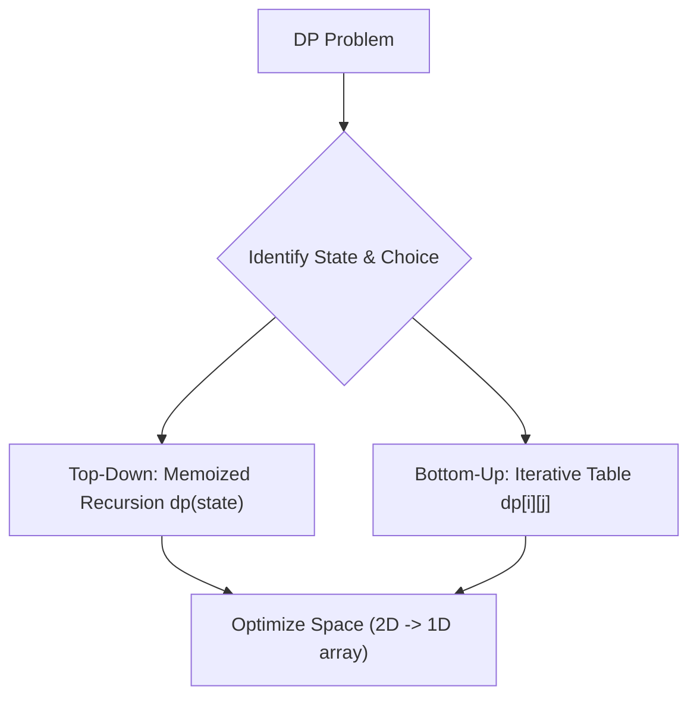

# 💎 Dynamic Programming Core Patterns

## 🎯 Learning Objectives
- Identify the two key properties of DP: **Overlapping Subproblems** and **Optimal Substructure**.
- Master Top-Down (Recursion + Memoization) and Bottom-Up (Tabulation) conversions.
- Learn state transitions for the 5 canonical DP categories.
- Optimize 2D matrix DP solutions into 1D space-optimized arrays in JavaScript.

---

## 💡 Core Concept

Dynamic Programming breaks complex problems into simpler subproblems, solving each subproblem once and storing its answer.



---

## 🛠️ The 5 Canonical DP Archetypes

### 1. 1D Array / Linear DP (e.g., Climbing Stairs, House Robber)
- **State:** `dp[i]` = optimal solution considering elements up to index `i`.
- **Recurrence:** `dp[i] = Math.max(dp[i - 1], dp[i - 2] + nums[i])`.

### 2. 0/1 Knapsack & Unbounded Knapsack (e.g., Coin Change)
- **0/1 Knapsack:** Each item used at most once. Outer loop over items, inner loop backwards over capacity.
- **Unbounded Knapsack:** Items can be reused infinitely. Inner loop forwards over capacity.

### 3. Grid / Matrix Paths (e.g., Unique Paths, Minimum Path Sum)
- **State:** `dp[r][c]` = result at cell `(r, c)`.
- **Recurrence:** `dp[r][c] = cellVal + Math.min(dp[r - 1][c], dp[r][c - 1])`.

### 4. String / Double Sequence (e.g., LCS, Edit Distance)
- **State:** `dp[i][j]` = answer for `str1[0...i-1]` and `str2[0...j-1]`.
- **Recurrence (LCS):** If characters match: `1 + dp[i-1][j-1]`; else: `Math.max(dp[i-1][j], dp[i][j-1])`.

### 5. Longest Increasing Subsequence (LIS)
- **State:** `dp[i]` = length of LIS ending at index `i`.
- **Recurrence:** `dp[i] = 1 + Math.max(dp[j])` for all `j < i` where `nums[j] < nums[i]`.

---

## 💻 Runnable JavaScript Examples

### Example 1: Coin Change (Unbounded Knapsack — LeetCode 322)

```javascript
/**
 * Bottom-Up Tabulation DP for Coin Change
 * @param {number[]} coins 
 * @param {number} amount 
 * @returns {number}
 */
function coinChange(coins, amount) {
  // Initialize dp array filled with Infinity
  const dp = new Array(amount + 1).fill(Infinity);
  dp[0] = 0; // Base case: 0 amount requires 0 coins

  for (let i = 1; i <= amount; i++) {
    for (const coin of coins) {
      if (i - coin >= 0) {
        dp[i] = Math.min(dp[i], dp[i - coin] + 1);
      }
    }
  }

  return dp[amount] === Infinity ? -1 : dp[amount];
}

// Verification
console.log(coinChange([1, 2, 5], 11)); // Output: 3 (5 + 5 + 1)
```

### Example 2: Longest Common Subsequence (LeetCode 1143)

```javascript
/**
 * 2D Matrix Tabulation DP
 * @param {string} text1 
 * @param {string} text2 
 * @returns {number}
 */
function longestCommonSubsequence(text1, text2) {
  const m = text1.length;
  const n = text2.length;
  const dp = Array.from({ length: m + 1 }, () => new Array(n + 1).fill(0));

  for (let i = 1; i <= m; i++) {
    for (let j = 1; j <= n; j++) {
      if (text1[i - 1] === text2[j - 1]) {
        dp[i][j] = dp[i - 1][j - 1] + 1;
      } else {
        dp[i][j] = Math.max(dp[i - 1][j], dp[i][j - 1]);
      }
    }
  }

  return dp[m][n];
}

// Verification
console.log(longestCommonSubsequence("abcde", "ace")); // Output: 3 ("ace")
```

### Example 3: Space-Optimized House Robber (LeetCode 198)

```javascript
function rob(nums) {
  if (nums.length === 0) return 0;
  let prev2 = 0; // dp[i-2]
  let prev1 = 0; // dp[i-1]

  for (const num of nums) {
    const current = Math.max(prev1, prev2 + num);
    prev2 = prev1;
    prev1 = current;
  }

  return prev1;
}

// Verification
console.log(rob([2, 7, 9, 3, 1])); // Output: 12 (2 + 9 + 1)
```

---

## ⚠️ Common Pitfalls
- **Incorrect DP table size:** 1-based indexing for strings requires size `m + 1` by `n + 1`.
- **0/1 Knapsack loop order:** For 0/1 knapsack with 1D array space optimization, loop capacity **backwards** (`for w = capacity down to coin`) to prevent using the same item multiple times.
- **Missing base cases:** Forgetting `dp[0] = 0` or boundary initializations.

---

## ✅ Quick Reference / Cheatsheet

```text
DP Problem Solving Framework:
1. Define State: What does dp[i][j] represent?
2. Find Recurrence: State transitions based on decisions.
3. Base Cases: Smallest trivial subproblems.
4. Computation Order: Bottom-up (iterative) or Top-down (memoized).
5. Space Optimization: Can dp[i] be computed using only dp[i-1]?
```

---

[← Previous: 03 Two Pointers](./03-two-pointers) | [Index](./index) | [Next: 05 Substring Patterns →](./05-substring-patterns)
