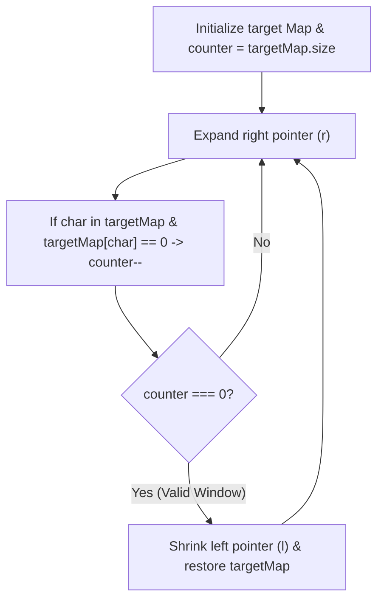

# 🧵 10-Line Substring Sliding Window Template

## 🎯 Learning Objectives
- Learn the universal 10-line Frequency Map + Two Pointers substring template.
- Understand how tracking a single `counter` variable eliminates hash map comparison overhead.
- Adapt the template to solve *Minimum Window Substring*, *Find All Anagrams*, and *Longest Substring with K Distinct Characters*.

---

## 💡 Core Concept

Most complex string problems ask for a substring matching specific target frequencies. Instead of re-checking the hash map at every step ($O(26 \cdot N)$ or $O(N \cdot K)$), we maintain a single `counter` indicating how many unique characters still need to be satisfied.



---

## 🛠️ The Legendary 10-Line Template (JavaScript)

```javascript
function substringTemplate(s, target) {
  const map = new Map();
  for (const char of target) map.set(char, (map.get(char) || 0) + 1);
  let count = map.size; // Number of unique characters to satisfy

  let left = 0, right = 0;
  let minLen = Infinity, start = 0;

  while (right < s.length) {
    const endChar = s[right];
    if (map.has(endChar)) {
      map.set(endChar, map.get(endChar) - 1);
      if (map.get(endChar) === 0) count--; // Character requirement satisfied
    }
    right++;

    while (count === 0) { // Window valid
      // Update result metric here (e.g., minLen = right - left)
      
      const startChar = s[left];
      if (map.has(startChar)) {
        if (map.get(startChar) === 0) count++; // Requirement broken
        map.set(startChar, map.get(startChar) + 1);
      }
      left++;
    }
  }

  return minLen === Infinity ? "" : s.substring(start, start + minLen);
}
```

---

## 💻 Runnable JavaScript Examples

### Problem 1: Minimum Window Substring (LeetCode 76)

```javascript
function minWindow(s, t) {
  if (s.length < t.length) return "";

  const map = new Map();
  for (const c of t) map.set(c, (map.get(c) || 0) + 1);
  let count = map.size;

  let left = 0, right = 0;
  let minLen = Infinity, start = 0;

  while (right < s.length) {
    const c = s[right];
    if (map.has(c)) {
      map.set(c, map.get(c) - 1);
      if (map.get(c) === 0) count--;
    }
    right++;

    while (count === 0) {
      if (right - left < minLen) {
        minLen = right - left;
        start = left;
      }

      const leftChar = s[left];
      if (map.has(leftChar)) {
        if (map.get(leftChar) === 0) count++;
        map.set(leftChar, map.get(leftChar) + 1);
      }
      left++;
    }
  }

  return minLen === Infinity ? "" : s.slice(start, start + minLen);
}

// Verification
console.log(minWindow("ADOBECODEBANC", "ABC")); // Output: "BANC"
```

### Problem 2: Find All Anagrams in a String (LeetCode 438)

```javascript
function findAnagrams(s, p) {
  const result = [];
  if (s.length < p.length) return result;

  const map = new Map();
  for (const c of p) map.set(c, (map.get(c) || 0) + 1);
  let count = map.size;

  let left = 0, right = 0;

  while (right < s.length) {
    const c = s[right];
    if (map.has(c)) {
      map.set(c, map.get(c) - 1);
      if (map.get(c) === 0) count--;
    }
    right++;

    while (count === 0) {
      if (right - left === p.length) {
        result.push(left);
      }

      const leftChar = s[left];
      if (map.has(leftChar)) {
        if (map.get(leftChar) === 0) count++;
        map.set(leftChar, map.get(leftChar) + 1);
      }
      left++;
    }
  }

  return result;
}

// Verification
console.log(findAnagrams("cbaebabacd", "abc")); // Output: [0, 6]
```

---

## ⚠️ Common Pitfalls
- **Negative counts in Map:** Notice `map.set(c, map.get(c) - 1)` can go negative if duplicate characters exist in window; that's why `count--` only triggers when `map.get(c) === 0`, NOT when `<= 0`.
- **Right Pointer Increment Timing:** Incrementing `right++` right after reading `s[right]` ensures `right - left` measures exact current window width.

---

## ✅ Quick Reference / Cheatsheet

```text
1. Build Target Map & set count = Map.size
2. Expand right: Decrement map entry. If entry === 0 -> count--
3. While count === 0:
     Record/Check match
     Increment map entry for leftChar. If entry was 0 -> count++
     Increment left
```

---

[← Previous: 04 Dynamic Programming](./04-dynamic-programming) | [Index](./index) | [Next: 06 String Questions Pattern →](./06-string-questions-pattern)
