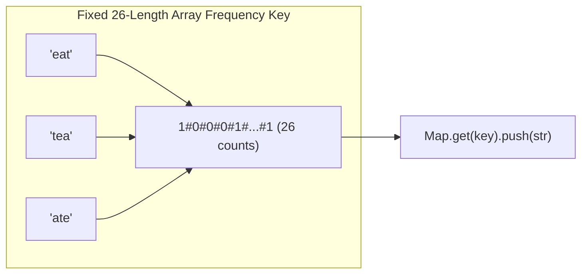

# 🔤 String Questions & Manipulation Patterns

## 🎯 Learning Objectives
- Perform fast frequency hashing using fixed arrays (`Int32Array(26)`) vs `Map` in V8.
- Master the **Expand Around Center** technique for palindromic substring problems.
- Implement **Group Anagrams** using tuple frequency keys in JavaScript.
- Avoid string immutability performance traps when constructing large strings in JavaScript.

---

## 💡 Core Concept

In JavaScript, strings are primitive immutable values. Modifying a string in a loop via `s += char` creates a new string object every time, leading to $O(N^2)$ time complexity. Always use arrays (`arr.push(char)`) and `join('')` for string building.



---

## 🛠️ Key Techniques & Patterns

### 1. ASCII Frequency Key Generator
Using an explicit delimiter (e.g. `#`) to join character frequencies prevents ambiguous keys like `[1, 11]` vs `[11, 1]`.

```javascript
function getFrequencyKey(str) {
  const freq = new Array(26).fill(0);
  for (let i = 0; i < str.length; i++) {
    freq[str.charCodeAt(i) - 97]++;
  }
  return freq.join('#');
}
```

### 2. Expand Around Center for Palindromes
Palindromes are symmetric. Every palindrome has either an odd center (1 character) or an even center (2 characters).

```javascript
function expandAroundCenter(s, left, right) {
  while (left >= 0 && right < s.length && s[left] === s[right]) {
    left--;
    right++;
  }
  // Return length of valid palindrome
  return right - left - 1;
}
```

---

## 💻 Runnable JavaScript Examples

### Problem 1: Group Anagrams (LeetCode 49)

```javascript
function groupAnagrams(strs) {
  const map = new Map();

  for (const s of strs) {
    const count = new Array(26).fill(0);
    for (let i = 0; i < s.length; i++) {
      count[s.charCodeAt(i) - 97]++;
    }
    const key = count.join('#');

    if (!map.has(key)) map.set(key, []);
    map.get(key).push(s);
  }

  return Array.from(map.values());
}

// Verification
console.log(groupAnagrams(["eat", "tea", "tan", "ate", "nat", "bat"]));
// Output: [ [ 'eat', 'tea', 'ate' ], [ 'tan', 'nat' ], [ 'bat' ] ]
```

### Problem 2: Longest Palindromic Substring (LeetCode 5)

```javascript
function longestPalindrome(s) {
  if (!s || s.length < 1) return "";
  let start = 0, end = 0;

  function expand(left, right) {
    while (left >= 0 && right < s.length && s[left] === s[right]) {
      left--;
      right++;
    }
    return right - left - 1;
  }

  for (let i = 0; i < s.length; i++) {
    const len1 = expand(i, i);     // Odd length center
    const len2 = expand(i, i + 1); // Even length center
    const maxLen = Math.max(len1, len2);

    if (maxLen > end - start) {
      start = i - Math.floor((maxLen - 1) / 2);
      end = i + Math.floor(maxLen / 2);
    }
  }

  return s.substring(start, end + 1);
}

// Verification
console.log(longestPalindrome("babad")); // Output: "bab" or "aba"
```

---

## ⚠️ Common Pitfalls
- **String Concatenation in Loops:** `str += c` inside a loop of length $N$ takes $O(N^2)$ total time in V8 engine. Use an array buffer and `arr.join('')`.
- **ASCII Index Out of Bounds:** Always check if the input contains uppercase/lowercase or unicode characters before using `charCodeAt(i) - 97`.

---

## ✅ Quick Reference / Cheatsheet

```text
String Building:
  Use arr = [], arr.push(), return arr.join('')

Frequency Hashing:
  Array(26).fill(0) -> count[charCodeAt(i) - 97]++ -> key = count.join('#')

Palindrome Search:
  Loop i from 0 to N-1: expandAroundCenter(i, i) and expandAroundCenter(i, i+1)
```

---

[← Previous: 05 Substring Patterns](./05-substring-patterns) | [Index](./index) | [Next: 07 Graph For Beginners →](./07-graph-for-beginners)
