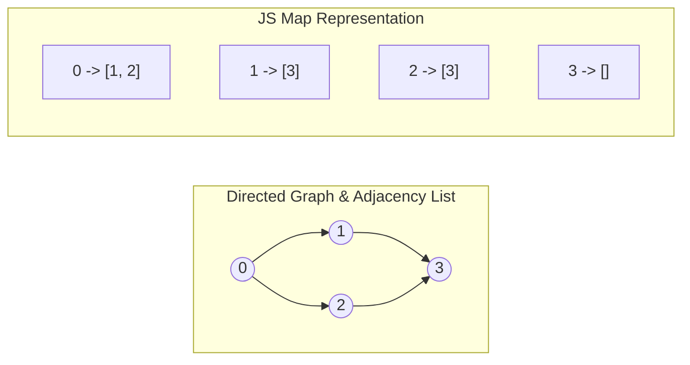

# 🕸️ Graph Algorithms for Beginners

## 🎯 Learning Objectives
- Construct Adjacency Lists in JavaScript using native `Map` or Array structures.
- Implement Topological Sort using Kahn's Algorithm (BFS + In-Degree count).
- Build a robust **Disjoint Set Union (DSU / Union-Find)** class with Path Compression and Union by Rank.
- Detect cycles in Directed Acyclic Graphs (DAGs) and Undirected Graphs.

---

## 💡 Core Concept

Graph problems are represented as $G = (V, E)$ where $V$ is a set of Vertices (nodes) and $E$ is a set of Edges.



---

## 🛠️ Essential Data Structures & Templates (JavaScript)

### 1. Adjacency List Builder

```javascript
function buildGraph(numCourses, prerequisites) {
  const adjList = Array.from({ length: numCourses }, () => []);
  const inDegree = new Array(numCourses).fill(0);

  for (const [u, v] of prerequisites) {
    adjList[v].push(u); // Directed edge v -> u
    inDegree[u]++;
  }

  return { adjList, inDegree };
}
```

### 2. Disjoint Set Union (DSU / Union-Find) Class

```javascript
class UnionFind {
  constructor(n) {
    this.parent = Array.from({ length: n }, (_, i) => i);
    this.rank = new Array(n).fill(0);
  }

  find(i) {
    if (this.parent[i] === i) return i;
    // Path compression
    this.parent[i] = this.find(this.parent[i]);
    return this.parent[i];
  }

  union(i, j) {
    const rootI = this.find(i);
    const rootJ = this.find(j);

    if (rootI !== rootJ) {
      if (this.rank[rootI] < this.rank[rootJ]) {
        this.parent[rootI] = rootJ;
      } else if (this.rank[rootI] > this.rank[rootJ]) {
        this.parent[rootJ] = rootI;
      } else {
        this.parent[rootJ] = rootI;
        this.rank[rootI]++;
      }
      return true; // Union successful
    }
    return false; // Already connected (cycle detected)
  }
}
```

---

## 💻 Runnable JavaScript Examples

### Problem 1: Course Schedule — Topological Sort (LeetCode 207)

```javascript
function canFinish(numCourses, prerequisites) {
  const adjList = Array.from({ length: numCourses }, () => []);
  const inDegree = new Array(numCourses).fill(0);

  for (const [course, pre] of prerequisites) {
    adjList[pre].push(course);
    inDegree[course]++;
  }

  // Queue of courses with 0 prerequisites
  const queue = [];
  for (let i = 0; i < numCourses; i++) {
    if (inDegree[i] === 0) queue.push(i);
  }

  let processedCount = 0;

  while (queue.length > 0) {
    const current = queue.shift();
    processedCount++;

    for (const neighbor of adjList[current]) {
      inDegree[neighbor]--;
      if (inDegree[neighbor] === 0) {
        queue.push(neighbor);
      }
    }
  }

  return processedCount === numCourses;
}

// Verification
console.log(canFinish(2, [[1, 0]])); // Output: true
console.log(canFinish(2, [[1, 0], [0, 1]])); // Output: false (cycle)
```

### Problem 2: Redundant Connection — DSU (LeetCode 684)

```javascript
function findRedundantConnection(edges) {
  const uf = new UnionFind(edges.length + 1);

  for (const [u, v] of edges) {
    if (!uf.union(u, v)) {
      return [u, v]; // Cycle edge found
    }
  }

  return [];
}

// Verification
console.log(findRedundantConnection([[1, 2], [1, 3], [2, 3]])); // Output: [2, 3]
```

---

## ⚠️ Common Pitfalls
- **Using `Array.shift()` for large queues:** JS `array.shift()` is $O(N)$. For very large graphs ($N > 10^5$), use a index pointer (`let head = 0`) to maintain $O(1)$ amortized pop time.
- **Graph Direction:** Distinguish between directed (`u -> v`) and undirected (`u <-> v`) edges when populating the adjacency list.

---

## ✅ Quick Reference / Cheatsheet

```text
Kahn's Topological Sort:
  Build AdjList & InDegree array
  Push all nodes with inDegree == 0 into queue
  Pop node -> processedCount++ -> decrement neighbors' inDegrees
  If neighbor inDegree == 0 -> push to queue
  Return processedCount === totalNodes

Union-Find (DSU):
  find(i): path compression parent[i] = find(parent[i])
  union(i, j): find roots, merge smaller rank under larger rank
```

---

[← Previous: 06 String Questions Pattern](./06-string-questions-pattern) | [Index](./index) | [Next: 08 DFS & BFS Tree Traversal →](./08-dfs-bfs-tree-traversal)
