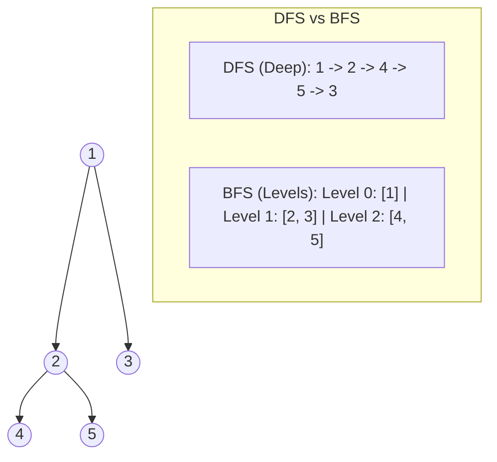

# 🌲 DFS & BFS Tree Traversal Patterns

## 🎯 Learning Objectives
- Implement **Pre-order**, **In-order**, and **Post-order** DFS traversals (both Recursive and Iterative).
- Execute level-order tree traversal using BFS queues.
- Master the **Bottom-Up** vs **Top-Down** tree recursion strategy.
- Solve LeetCode classics like *Lowest Common Ancestor*, *Binary Tree Level Order Traversal*, and *Diameter of Binary Tree*.

---

## 💡 Core Concept

Trees are directed acyclic graphs where every node has exactly one parent (except the root).



---

## 🛠️ Tree Node & Essential Patterns (JavaScript)

```javascript
// Binary Tree Node definition
function TreeNode(val, left = null, right = null) {
  this.val = val;
  this.left = left;
  this.right = right;
}
```

### 1. Standard BFS Level-Order Traversal Template

```javascript
function levelOrder(root) {
  if (!root) return [];
  const result = [];
  const queue = [root];

  while (queue.length > 0) {
    const levelSize = queue.length; // Capture exact nodes in current level
    const currentLevel = [];

    for (let i = 0; i < levelSize; i++) {
      const node = queue.shift();
      currentLevel.push(node.val);

      if (node.left) queue.push(node.left);
      if (node.right) queue.push(node.right);
    }

    result.push(currentLevel);
  }

  return result;
}
```

### 2. Iterative In-Order DFS Template (Stack)

```javascript
function inorderTraversalIterative(root) {
  const result = [];
  const stack = [];
  let curr = root;

  while (curr !== null || stack.length > 0) {
    while (curr !== null) {
      stack.push(curr);
      curr = curr.left; // Traverse to leftmost leaf
    }

    curr = stack.pop();
    result.push(curr.val); // Process node
    curr = curr.right;     // Move to right subtree
  }

  return result;
}
```

---

## 💻 Runnable JavaScript Examples

### Problem 1: Lowest Common Ancestor (LeetCode 236)

```javascript
function lowestCommonAncestor(root, p, q) {
  // Base cases
  if (!root || root === p || root === q) {
    return root;
  }

  // Recursive calls on left and right subtrees
  const left = lowestCommonAncestor(root.left, p, q);
  const right = lowestCommonAncestor(root.right, p, q);

  // If both left and right returned non-null, root is LCA
  if (left !== null && right !== null) {
    return root;
  }

  // Otherwise return the non-null child
  return left !== null ? left : right;
}
```

### Problem 2: Binary Tree Zigzag Level Order Traversal (LeetCode 103)

```javascript
function zigzagLevelOrder(root) {
  if (!root) return [];
  const result = [];
  const queue = [root];
  let leftToRight = true;

  while (queue.length > 0) {
    const size = queue.length;
    const level = new Array(size);

    for (let i = 0; i < size; i++) {
      const node = queue.shift();

      // Place value based on direction flag
      const index = leftToRight ? i : size - 1 - i;
      level[index] = node.val;

      if (node.left) queue.push(node.left);
      if (node.right) queue.push(node.right);
    }

    result.push(level);
    leftToRight = !leftToRight; // Flip direction
  }

  return result;
}

// Verification with sample tree
const root = new TreeNode(3, new TreeNode(9), new TreeNode(20, new TreeNode(15), new TreeNode(7)));
console.log(zigzagLevelOrder(root));
// Output: [ [ 3 ], [ 20, 9 ], [ 15, 7 ] ]
```

---

## ⚠️ Common Pitfalls
- **Confusing Level Size in BFS:** Always snapshot `const levelSize = queue.length` *before* the inner loop. Modifying `queue.length` dynamically inside the loop destroys level boundaries.
- **Deep Recursion Stack Overflow:** In unbalanced skewed trees of height $N=10^5$, recursion will overflow V8 call stack limit (~10,000 frames). Use an explicit array stack for deep trees.

---

## ✅ Quick Reference / Cheatsheet

```text
DFS Orders:
  Pre-Order:  Node -> Left -> Right
  In-Order:   Left -> Node -> Right  (yields sorted order in BST)
  Post-Order: Left -> Right -> Node  (useful for bottom-up cleanup / height calculations)

BFS Level Order:
  queue = [root]
  while queue not empty:
    size = queue.length; loop size times: node = queue.shift(); push children
```

---

[← Previous: 07 Graph For Beginners](./07-graph-for-beginners) | [Index](./index) | [Next: 09 Backtracking Pattern →](./09-backtracking-pattern)
