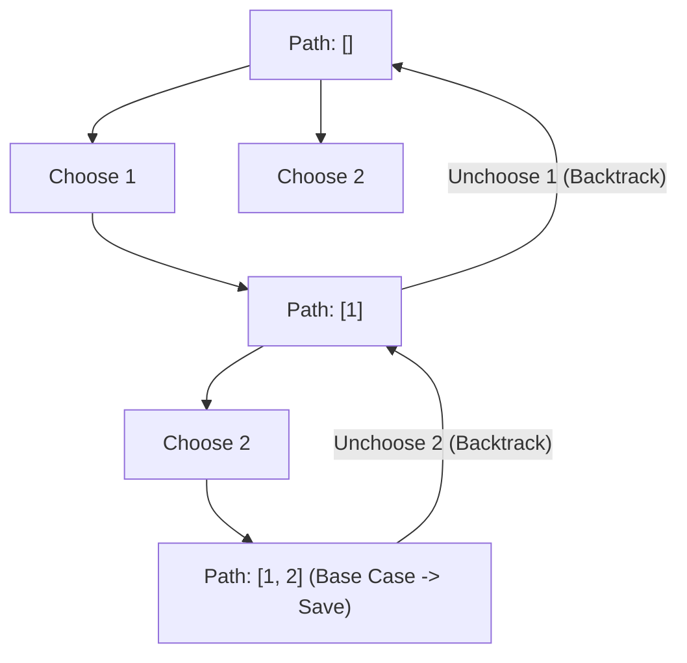

# 🔄 Backtracking Core Pattern & Template

## 🎯 Learning Objectives
- Master the **Choose -> Explore -> Unchoose** recursive state search template.
- Identify when to pass `startIndex` (combinations/subsets) vs `visited` array (permutations).
- Prune search branches early using bounding functions to optimize runtime.
- Deduplicate combination results when input contains duplicates.

---

## 💡 Core Concept

Backtracking systematically explores the search tree of all possible candidates, backtracking (reverting changes) as soon as a path cannot yield a valid solution.



---

## 🛠️ The Canonical Backtracking Template (JavaScript)

```javascript
function backtrackTemplate(nums) {
  const results = [];
  const currentPath = [];

  function backtrack(startIndex, state) {
    // 1. Base Case: Evaluate if current path is a complete valid solution
    if (isGoal(currentPath)) {
      results.push([...currentPath]); // Push a shallow copy!
      // Return if exact length/goal reached
    }

    for (let i = startIndex; i < nums.length; i++) {
      // 2. Pruning / Skip Duplicates
      if (shouldPrune(i, nums)) continue;

      // 3. CHOOSE: Modify state / path
      currentPath.push(nums[i]);

      // 4. EXPLORE: Recurse into next state
      backtrack(i + 1, state);

      // 5. UNCHOOSE: Revert state / path for next iteration
      currentPath.pop();
    }
  }

  backtrack(0, initialState);
  return results;
}
```

---

## 💻 Runnable JavaScript Examples

### Problem 1: Subsets / Power Set (LeetCode 78)

```javascript
function subsets(nums) {
  const result = [];
  const path = [];

  function backtrack(startIndex) {
    // Every state in the decision tree is a valid subset
    result.push([...path]);

    for (let i = startIndex; i < nums.length; i++) {
      path.push(nums[i]);     // CHOOSE
      backtrack(i + 1);        // EXPLORE
      path.pop();              // UNCHOOSE
    }
  }

  backtrack(0);
  return result;
}

// Verification
console.log(subsets([1, 2, 3]));
// Output: [[], [1], [1,2], [1,2,3], [1,3], [2], [2,3], [3]]
```

### Problem 2: Permutations (LeetCode 46)

```javascript
function permute(nums) {
  const result = [];
  const path = [];
  const used = new Array(nums.length).fill(false);

  function backtrack() {
    if (path.length === nums.length) {
      result.push([...path]);
      return;
    }

    for (let i = 0; i < nums.length; i++) {
      if (used[i]) continue; // Skip already chosen numbers

      used[i] = true;        // CHOOSE
      path.push(nums[i]);

      backtrack();           // EXPLORE

      path.pop();            // UNCHOOSE
      used[i] = false;
    }
  }

  backtrack();
  return result;
}

// Verification
console.log(permute([1, 2, 3])); // Generates 6 permutations
```

### Problem 3: Combination Sum II with Duplicates (LeetCode 40)

```javascript
function combinationSum2(candidates, target) {
  candidates.sort((a, b) => a - b); // Sort to group duplicates
  const result = [];
  const path = [];

  function backtrack(startIndex, remainingSum) {
    if (remainingSum === 0) {
      result.push([...path]);
      return;
    }

    for (let i = startIndex; i < candidates.length; i++) {
      // Prune if candidate exceeds remaining sum
      if (candidates[i] > remainingSum) break;

      // Skip duplicate elements at the same tree depth level
      if (i > startIndex && candidates[i] === candidates[i - 1]) continue;

      path.push(candidates[i]);
      backtrack(i + 1, remainingSum - candidates[i]);
      path.pop();
    }
  }

  backtrack(0, target);
  return result;
}

// Verification
console.log(combinationSum2([10, 1, 2, 7, 6, 1, 5], 8));
// Output: [ [ 1, 1, 6 ], [ 1, 2, 5 ], [ 1, 7 ], [ 2, 6 ] ]
```

---

## ⚠️ Common Pitfalls
- **Forgot to Clone Path:** `result.push(path)` pushes a reference to the mutable array `path`. As recursion pops elements, all entries in `result` become empty arrays `[]`! ALWAYS use `result.push([...path])` or `path.slice()`.
- **Deduplication Check Placement:** Skip duplicate elements using `i > startIndex && nums[i] === nums[i - 1]`. Using `i > 0` accidentally skips valid duplicates across different depth levels!

---

## ✅ Quick Reference / Cheatsheet

```text
Subsets / Combinations:
  Pass startIndex -> Loop from startIndex to N-1 -> Recurse with (i + 1)

Permutations:
  Pass used[] array -> Loop from 0 to N-1 -> Recurse without index increment

Handling Input Duplicates:
  Sort array -> Check `if (i > startIndex && nums[i] === nums[i - 1]) continue`
```

---

[← Previous: 08 DFS & BFS Tree Traversal](./08-dfs-bfs-tree-traversal) | [Index](./index) | [Next: 10 Backtracking Questions →](./10-backtracking-questions)
