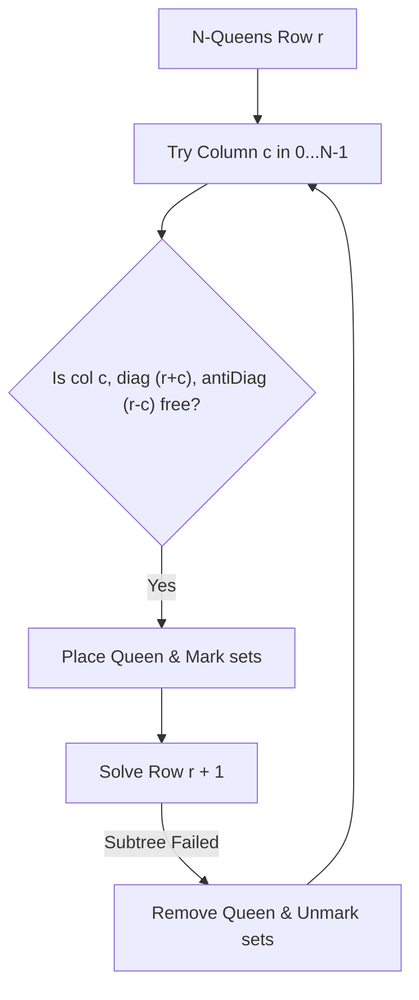

# 🧩 Advanced Backtracking Questions & Optimizations

## 🎯 Learning Objectives
- Solve complex 2D matrix constraints using recursive backtracking in JavaScript.
- Apply **Boolean Return Recurrence** for early-exit single-solution searches (e.g. Sudoku).
- Optimize N-Queens diagonal and anti-diagonal validity checks from $O(N)$ to $O(1)$ using Set or Bitmasks.
- Avoid memory limit errors on deep 2D search grids.

---

## 💡 Core Concept

Advanced backtracking requires tracking multi-dimensional constraints (rows, columns, diagonals, grid blocks) efficiently so each valid move validation takes $O(1)$ time.



---

## 💻 Complete JavaScript Implementations

### Problem 1: N-Queens (LeetCode 51)

```javascript
function solveNQueens(n) {
  const result = [];
  const cols = new Set();
  const diag = new Set();     // r - c
  const antiDiag = new Set(); // r + c
  const board = Array.from({ length: n }, () => new Array(n).fill('.'));

  function backtrack(r) {
    if (r === n) {
      result.push(board.map(row => row.join('')));
      return;
    }

    for (let c = 0; c < n; c++) {
      if (cols.has(c) || diag.has(r - c) || antiDiag.has(r + c)) {
        continue; // Conflict detected in O(1) time
      }

      // CHOOSE
      board[r][c] = 'Q';
      cols.add(c);
      diag.add(r - c);
      antiDiag.add(r + c);

      // EXPLORE
      backtrack(r + 1);

      // UNCHOOSE
      board[r][c] = '.';
      cols.delete(c);
      diag.delete(r - c);
      antiDiag.delete(r + c);
    }
  }

  backtrack(0);
  return result;
}

// Verification
console.log(solveNQueens(4));
// Output: 2 distinct board configurations for 4-Queens
```

### Problem 2: Word Search (LeetCode 79)

```javascript
function exist(board, word) {
  const rows = board.length;
  const cols = board[0].length;

  function dfs(r, c, index) {
    if (index === word.length) return true; // Word fully matched

    // Boundary and character match check
    if (
      r < 0 || r >= rows ||
      c < 0 || c >= cols ||
      board[r][c] !== word[index]
    ) {
      return false;
    }

    // CHOOSE: Mark visited in-place using placeholder character
    const temp = board[r][c];
    board[r][c] = '#';

    // EXPLORE in 4 directions
    const found =
      dfs(r + 1, c, index + 1) ||
      dfs(r - 1, c, index + 1) ||
      dfs(r, c + 1, index + 1) ||
      dfs(r, c - 1, index + 1);

    // UNCHOOSE: Restore original character
    board[r][c] = temp;

    return found;
  }

  for (let r = 0; r < rows; r++) {
    for (let c = 0; c < cols; c++) {
      if (board[r][c] === word[0] && dfs(r, c, 0)) {
        return true;
      }
    }
  }

  return false;
}

// Verification
const grid = [
  ['A','B','C','E'],
  ['S','F','C','S'],
  ['A','D','E','E']
];
console.log(exist(grid, "ABCCED")); // Output: true
```

### Problem 3: Sudoku Solver (LeetCode 37)

```javascript
function solveSudoku(board) {
  function isValid(r, c, char) {
    for (let i = 0; i < 9; i++) {
      // Check row & col
      if (board[r][i] === char || board[i][c] === char) return false;

      // Check 3x3 sub-box
      const boxRow = 3 * Math.floor(r / 3) + Math.floor(i / 3);
      const boxCol = 3 * Math.floor(c / 3) + (i % 3);
      if (board[boxRow][boxCol] === char) return false;
    }
    return true;
  }

  function solve() {
    for (let r = 0; r < 9; r++) {
      for (let c = 0; c < 9; c++) {
        if (board[r][c] === '.') {
          for (let ch = 1; ch <= 9; ch++) {
            const charStr = String(ch);
            if (isValid(r, c, charStr)) {
              board[r][c] = charStr; // CHOOSE

              if (solve()) return true; // Early exit on success

              board[r][c] = '.';      // UNCHOOSE
            }
          }
          return false; // No valid number fits cell
        }
      }
    }
    return true; // All cells populated successfully
  }

  solve();
}
```

---

## ⚠️ Common Pitfalls
- **Creating new Visited Matrices:** Creating a `new Array(rows).fill(0).map(...)` at every recursive step causes severe garbage collection pauses in JS. Modify the board in-place with a sentinel character like `'#'` instead.
- **Forgetting `return true` on Boolean Backtracking:** When searching for *any single valid solution* (like Sudoku), immediately propagate `return true` up the call stack once a valid leaf node is hit.

---

## ✅ Quick Reference / Cheatsheet

```text
Diagonals O(1) Math:
  Main Diagonal index: (row - col)
  Anti-Diagonal index: (row + col)

3x3 Grid Math (9x9 Sudoku):
  boxRow = 3 * Math.floor(r / 3) + Math.floor(i / 3)
  boxCol = 3 * Math.floor(c / 3) + (i % 3)
```

---

[← Previous: 09 Backtracking Pattern](./09-backtracking-pattern) | [Index](./index) | [Next: 11 Monotonic Stack →](./11-monotonic-stack)
