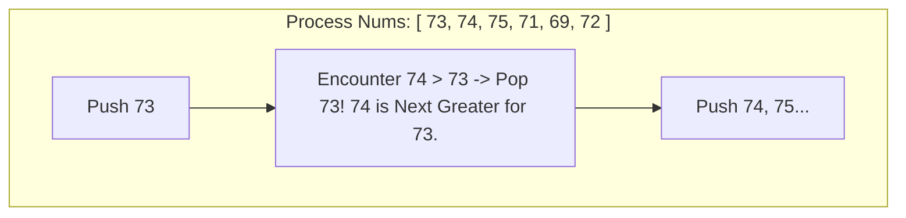

# 🥞 Monotonic Stack Pattern

## 🎯 Learning Objectives
- Differentiate between **Monotonic Decreasing Stack** (Next Greater Element) and **Monotonic Increasing Stack** (Next Smaller Element).
- Maintain monotonic invariants while pushing indices into an array stack in JavaScript.
- Avoid $O(N^2)$ brute-force comparisons for range/span queries.
- Solve LeetCode classics like *Daily Temperatures*, *Next Greater Element*, and *Largest Rectangle in Histogram*.

---

## 💡 Core Concept

A Monotonic Stack maintains its elements in strictly sorted order (either increasing or decreasing). As we iterate through an array, whenever we encounter an element that violates the stack's sorting order, we pop elements off the stack. The popping trigger identifies the **Next Greater** or **Next Smaller** element for all popped indices!



---

## 🛠️ Essential Templates (JavaScript)

### 1. Next Greater Element Template (Monotonic Decreasing Stack)

```javascript
/**
 * Finds the index of the next element greater than nums[i] for each i
 * @param {number[]} nums 
 * @returns {number[]} array of indices or values
 */
function nextGreaterElement(nums) {
  const result = new Array(nums.length).fill(-1);
  const stack = []; // Stores INDICES, not values!

  for (let i = 0; i < nums.length; i++) {
    // While stack has elements and current num > stack top element
    while (stack.length > 0 && nums[i] > nums[stack[stack.length - 1]]) {
      const poppedIndex = stack.pop();
      result[poppedIndex] = nums[i]; // nums[i] is next greater for poppedIndex
    }

    stack.push(i);
  }

  return result;
}
```

---

## 💻 Runnable JavaScript Examples

### Problem 1: Daily Temperatures (LeetCode 739)
*Given array `temperatures`, return array `ans` such that `ans[i]` is the number of days you have to wait after $i$-th day to get a warmer temperature.*

```javascript
function dailyTemperatures(temperatures) {
  const n = temperatures.length;
  const answer = new Array(n).fill(0);
  const stack = []; // Monotonic decreasing stack storing indices

  for (let i = 0; i < n; i++) {
    while (stack.length > 0 && temperatures[i] > temperatures[stack[stack.length - 1]]) {
      const prevIndex = stack.pop();
      answer[prevIndex] = i - prevIndex; // Days waited
    }
    stack.push(i);
  }

  return answer;
}

// Verification
console.log(dailyTemperatures([73, 74, 75, 71, 69, 72, 76, 73]));
// Output: [ 1, 1, 4, 2, 1, 1, 0, 0 ]
```

### Problem 2: Largest Rectangle in Histogram (LeetCode 84)

```javascript
function largestRectangleArea(heights) {
  const stack = []; // Monotonic increasing stack storing indices
  let maxArea = 0;
  const n = heights.length;

  for (let i = 0; i <= n; i++) {
    // Treat height after array end as 0 to flush remaining stack
    const currentHeight = i === n ? 0 : heights[i];

    while (stack.length > 0 && currentHeight < heights[stack[stack.length - 1]]) {
      const h = heights[stack.pop()];
      const w = stack.length === 0 ? i : i - stack[stack.length - 1] - 1;
      maxArea = Math.max(maxArea, h * w);
    }

    stack.push(i);
  }

  return maxArea;
}

// Verification
console.log(largestRectangleArea([2, 1, 5, 6, 2, 3])); // Output: 10
```

---

## ⚠️ Common Pitfalls
- **Storing Values Instead of Indices:** ALWAYS store **indices** in the stack. Storing raw values prevents computing distances (`i - poppedIndex`) and looking up corresponding values in auxiliary arrays.
- **Flushing Remaining Elements:** In histogram/span problems, elements left on the stack at loop completion must be evaluated. Adding a sentinel `0` or `-Infinity` at the end flushes the stack cleanly.

---

## ✅ Quick Reference / Cheatsheet

```text
Next Greater Element:
  Stack stores indices. Loop i: while (nums[i] > stack.top()): pop & record nums[i]. Push i.

Next Smaller Element:
  Stack stores indices. Loop i: while (nums[i] < stack.top()): pop & record nums[i]. Push i.
```

---

[← Previous: 10 Backtracking Questions](./10-backtracking-questions) | [Index](./index) | [Next: 12 Bit Manipulation →](./12-bit-manipulation)
