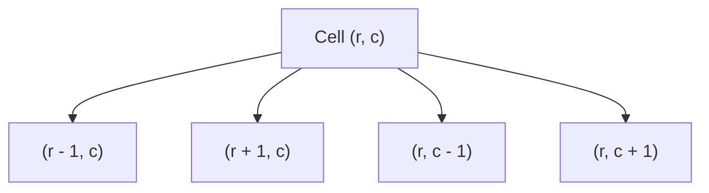

# 🗺️ Matrix BFS & DFS Problems (Part 1)

## 🎯 Learning Objectives
- Standardize 2D matrix traversal setup using clean `directions` vectors in JavaScript.
- Distinguish when to apply Recursive DFS vs Queue BFS on 2D grids.
- Track visited grid coordinates efficiently without high memory allocation overhead.
- Solve LeetCode classics like *Number of Islands*, *Max Area of Island*, and *Pacific Atlantic Water Flow*.

---

## 💡 Core Concept

A 2D Grid of dimensions $R \times C$ can be modeled as an implicit graph where cell $(r, c)$ has up to 4 neighbors: $(r+1, c)$, $(r-1, c)$, $(r, c+1)$, and $(r, c-1)$.



---

## 🛠️ Canonical Grid Traversal Template (JavaScript)

```javascript
// Universal 4-directional movement vectors
const DIRECTIONS = [
  [0, 1],  // Right
  [0, -1], // Left
  [1, 0],  // Down
  [-1, 0]  // Up
];

/**
 * Validates grid boundaries
 */
function isValidCell(r, c, rows, cols) {
  return r >= 0 && r < rows && c >= 0 && c < cols;
}
```

---

## 💻 Runnable JavaScript Examples

### Problem 1: Number of Islands (LeetCode 200)

```javascript
function numIslands(grid) {
  if (!grid || grid.length === 0) return 0;
  const rows = grid.length;
  const cols = grid[0].length;
  let islandCount = 0;

  function dfs(r, c) {
    // Boundary and water check
    if (r < 0 || r >= rows || c < 0 || c >= cols || grid[r][c] === '0') {
      return;
    }

    // Mark current land as visited in-place
    grid[r][c] = '0';

    // Recurse in 4 directions
    dfs(r + 1, c);
    dfs(r - 1, c);
    dfs(r, c + 1);
    dfs(r, c - 1);
  }

  for (let r = 0; r < rows; r++) {
    for (let c = 0; c < cols; c++) {
      if (grid[r][c] === '1') {
        islandCount++;
        dfs(r, c); // Sink the connected island
      }
    }
  }

  return islandCount;
}

// Verification
const grid1 = [
  ["1","1","1","1","0"],
  ["1","1","0","1","0"],
  ["1","1","0","0","0"],
  ["0","0","0","0","0"]
];
console.log(numIslands(grid1)); // Output: 1
```

### Problem 2: Max Area of Island (LeetCode 695)

```javascript
function maxAreaOfIsland(grid) {
  const rows = grid.length;
  const cols = grid[0].length;
  let maxArea = 0;

  function dfs(r, c) {
    if (r < 0 || r >= rows || c < 0 || c >= cols || grid[r][c] === 0) {
      return 0;
    }

    grid[r][c] = 0; // Sink land

    return 1 + dfs(r + 1, c) + dfs(r - 1, c) + dfs(r, c + 1) + dfs(r, c - 1);
  }

  for (let r = 0; r < rows; r++) {
    for (let c = 0; c < cols; c++) {
      if (grid[r][c] === 1) {
        maxArea = Math.max(maxArea, dfs(r, c));
      }
    }
  }

  return maxArea;
}

// Verification
const grid2 = [
  [0,0,1,0,0],
  [0,1,1,1,0],
  [0,1,0,0,0]
];
console.log(maxAreaOfIsland(grid2)); // Output: 4
```

### Problem 3: Pacific Atlantic Water Flow (LeetCode 417)

```javascript
function pacificAtlantic(heights) {
  if (!heights || heights.length === 0) return [];
  const rows = heights.length;
  const cols = heights[0].length;

  const pacific = Array.from({ length: rows }, () => new Array(cols).fill(false));
  const atlantic = Array.from({ length: rows }, () => new Array(cols).fill(false));

  function dfs(r, c, visited, prevHeight) {
    if (
      r < 0 || r >= rows || c < 0 || c >= cols ||
      visited[r][c] || heights[r][c] < prevHeight
    ) {
      return;
    }

    visited[r][c] = true;

    dfs(r + 1, c, visited, heights[r][c]);
    dfs(r - 1, c, visited, heights[r][c]);
    dfs(r, c + 1, visited, heights[r][c]);
    dfs(r, c - 1, visited, heights[r][c]);
  }

  // 1. Flow outwards from borders
  for (let r = 0; r < rows; r++) {
    dfs(r, 0, pacific, heights[r][0]);         // Left border (Pacific)
    dfs(r, cols - 1, atlantic, heights[r][cols - 1]); // Right border (Atlantic)
  }
  for (let c = 0; c < cols; c++) {
    dfs(0, c, pacific, heights[0][c]);         // Top border (Pacific)
    dfs(rows - 1, c, atlantic, heights[rows - 1][c]); // Bottom border (Atlantic)
  }

  // 2. Intersection of both sets
  const result = [];
  for (let r = 0; r < rows; r++) {
    for (let c = 0; c < cols; c++) {
      if (pacific[r][c] && atlantic[r][c]) {
        result.push([r, c]);
      }
    }
  }

  return result;
}
```

---

## ⚠️ Common Pitfalls
- **Infinite Recursion on Grids:** Always mark visited nodes **before** or immediately upon entering the cell, otherwise connected adjacent nodes call each other endlessly!
- **Call Stack Limits on Large Grids:** For grids larger than $500 \times 500$, recursive DFS will throw `Maximum call stack size exceeded` in JS. Convert the solution to Queue-based BFS.

---

## ✅ Quick Reference / Cheatsheet

```text
Direction Vectors:
  DIRS = [[0,1], [0,-1], [1,0], [-1,0]]

Sink Island Technique:
  dfs(r, c): grid[r][c] = '0' before expanding 4 neighbors

Multi-Ocean / Multi-Border Traversal:
  Traverse backwards from ocean boundaries inward to find reachable cells
```

---

[← Previous: 12 Bit Manipulation](./12-bit-manipulation) | [Index](./index) | [Next: 14 Advanced Graph BFS/DFS Part 2 →](./14-bfs-dfs-problems-part2)
