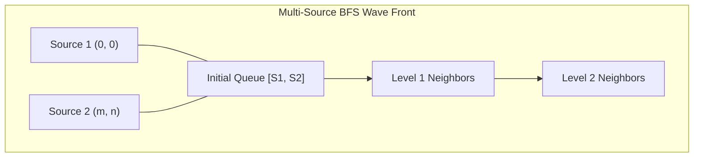

# 🌊 Advanced Graph BFS & DFS Patterns (Part 2)

## 🎯 Learning Objectives
- Master **Multi-Source BFS** to simulate simultaneous wave expansions (e.g., rotten oranges, distance transform).
- Implement 2-Color Graph Bipartition checks using DFS/BFS.
- Solve shortest path transformation problems using BFS word mutation graphs.
- Optimize queue state tracking in JavaScript.

---

## 💡 Core Concept

While standard BFS starts from a single source node, **Multi-Source BFS** pushes all initial active source nodes into the queue at step 0. The BFS queue naturally processes all sources level-by-level simultaneously!



---

## 💻 Runnable JavaScript Examples

### Problem 1: Rotting Oranges (Multi-Source BFS — LeetCode 994)

```javascript
function orangesRotting(grid) {
  const rows = grid.length;
  const cols = grid[0].length;
  const queue = [];
  let freshCount = 0;

  // 1. Step 0: Collect all rotten oranges (Multi-Source initialization)
  for (let r = 0; r < rows; r++) {
    for (let c = 0; c < cols; c++) {
      if (grid[r][c] === 2) {
        queue.push([r, c]);
      } else if (grid[r][c] === 1) {
        freshCount++;
      }
    }
  }

  if (freshCount === 0) return 0; // No fresh oranges to rot

  let minutes = 0;
  const DIRS = [[0, 1], [0, -1], [1, 0], [-1, 0]];
  let head = 0; // Pointer index for O(1) queue pop

  // 2. BFS Level by Level Expansion
  while (head < queue.length && freshCount > 0) {
    const levelSize = queue.length - head;
    minutes++;

    for (let i = 0; i < levelSize; i++) {
      const [r, c] = queue[head++];

      for (const [dr, dc] of DIRS) {
        const nr = r + dr;
        const nc = c + dc;

        if (nr >= 0 && nr < rows && nc >= 0 && nc < cols && grid[nr][nc] === 1) {
          grid[nr][nc] = 2; // Make orange rotten
          freshCount--;
          queue.push([nr, nc]);
        }
      }
    }
  }

  return freshCount === 0 ? minutes : -1;
}

// Verification
const oranges = [
  [2, 1, 1],
  [1, 1, 0],
  [0, 1, 1]
];
console.log(orangesRotting(oranges)); // Output: 4
```

### Problem 2: Is Graph Bipartite? (Graph Coloring — LeetCode 785)

```javascript
function isBipartite(graph) {
  const n = graph.length;
  const colors = new Array(n).fill(0); // 0: uncolored, 1: Color A, -1: Color B

  for (let i = 0; i < n; i++) {
    if (colors[i] !== 0) continue; // Already validated component

    const queue = [i];
    colors[i] = 1;

    while (queue.length > 0) {
      const node = queue.shift();

      for (const neighbor of graph[node]) {
        if (colors[neighbor] === 0) {
          colors[neighbor] = -colors[node]; // Color with opposite color
          queue.push(neighbor);
        } else if (colors[neighbor] === colors[node]) {
          return false; // Neighbor has identical color -> Not bipartite!
        }
      }
    }
  }

  return true;
}

// Verification
console.log(isBipartite([[1, 2, 3], [0, 2], [0, 1, 3], [0, 2]])); // Output: false
```

### Problem 3: Word Ladder (LeetCode 127)

```javascript
function ladderLength(beginWord, endWord, wordList) {
  const wordSet = new Set(wordList);
  if (!wordSet.has(endWord)) return 0;

  const queue = [[beginWord, 1]];
  const visited = new Set([beginWord]);

  while (queue.length > 0) {
    const [word, level] = queue.shift();
    if (word === endWord) return level;

    // Mutate each character from 'a' to 'z'
    for (let i = 0; i < word.length; i++) {
      for (let c = 97; c <= 122; c++) {
        const nextWord = word.slice(0, i) + String.fromCharCode(c) + word.slice(i + 1);

        if (wordSet.has(nextWord) && !visited.has(nextWord)) {
          visited.add(nextWord);
          queue.push([nextWord, level + 1]);
        }
      }
    }
  }

  return 0;
}

// Verification
console.log(ladderLength("hit", "cog", ["hot","dot","dog","lot","log","cog"])); // Output: 5
```

---

## ⚠️ Common Pitfalls
- **Using DFS for Shortest Path:** DFS explores deeply along one path first, which does NOT guarantee shortest distance in unweighted graphs. Always use **BFS** for shortest paths in unweighted graphs/grids.
- **Forgetting Disconnected Components:** In Graph Coloring (Bipartite), the graph may contain multiple disconnected components. Always outer-loop through `for (let i = 0; i < n; i++)`.

---

## ✅ Quick Reference / Cheatsheet

```text
Multi-Source BFS:
  Push ALL starting source nodes into queue before while loop begins

Shortest Path (Unweighted):
  Always use BFS queue! Step count = current level index in BFS tree

Bipartite Check:
  Set colors[i] = 1. Assign colors[neighbor] = -colors[node].
  If colors[neighbor] === colors[node] -> Conflict (return false)
```

---

[← Previous: 13 BFS + DFS Problems Part 1](./13-bfs-dfs-problems-part1) | [Index](./index) | [Next: 15 More DP Patterns →](./15-more-dp-patterns)
