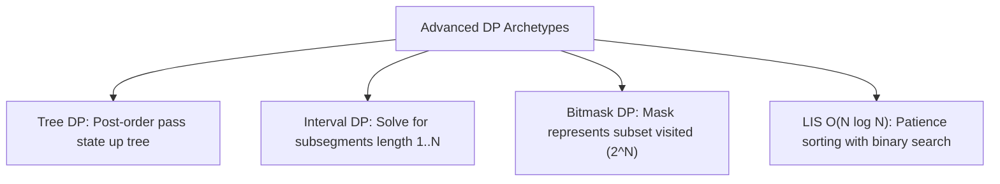

# 🚀 Advanced DP Patterns: Bitmask, Tree, & Interval DP

## 🎯 Learning Objectives
- Master **Tree DP** returning post-order state tuples `[includeNode, excludeNode]`.
- Implement **Interval / Partition DP** for subsegment problems like Burst Balloons.
- Solve **Bitmask DP** state compression for subset graph routing ($N \le 20$).
- Optimize Longest Increasing Subsequence (LIS) from $O(N^2)$ to $O(N \log N)$ using Binary Search.

---

## 💡 Core Concept & Advanced DP Taxonomy



---

## 💻 Runnable JavaScript Examples

### Pattern 1: Tree DP (House Robber III — LeetCode 337)

*Given a binary tree of houses where connected nodes trigger alarms, return max stolen money.*

```javascript
function robTree(root) {
  /**
   * Helper returns [robThisNode, skipThisNode]
   */
  function dfs(node) {
    if (!node) return [0, 0];

    const left = dfs(node.left);
    const right = dfs(node.right);

    // If we rob this node, we CANNOT rob children
    const robThis = node.val + left[1] + right[1];

    // If we skip this node, children can be robbed or skipped (take max)
    const skipThis = Math.max(left[0], left[1]) + Math.max(right[0], right[1]);

    return [robThis, skipThis];
  }

  const result = dfs(root);
  return Math.max(result[0], result[1]);
}
```

### Pattern 2: $O(N \log N)$ LIS via Patience Sorting (LeetCode 300)

```javascript
function lengthOfLIS(nums) {
  const tails = [];

  for (const num of nums) {
    // Binary search lower bound index for num in tails
    let low = 0;
    let high = tails.length - 1;
    let pos = tails.length;

    while (low <= high) {
      const mid = low + Math.floor((high - low) / 2);
      if (tails[mid] >= num) {
        pos = mid;
        high = mid - 1;
      } else {
        low = mid + 1;
      }
    }

    if (pos === tails.length) {
      tails.push(num); // Extend longest sequence
    } else {
      tails[pos] = num; // Replace element with smaller candidate
    }
  }

  return tails.length;
}

// Verification
console.log(lengthOfLIS([10, 9, 2, 5, 3, 7, 101, 18])); // Output: 4 ([2, 3, 7, 101])
```

### Pattern 3: Interval / Partition DP (Burst Balloons — LeetCode 312)

```javascript
function maxCoins(nums) {
  // Pad array with boundary sentinel 1s
  const arr = [1, ...nums, 1];
  const n = arr.length;
  const dp = Array.from({ length: n }, () => new Array(n).fill(0));

  // Loop over subsegment lengths
  for (let len = 2; len < n; len++) {
    for (let left = 0; left < n - len; left++) {
      const right = left + len;

      // Try bursting index k LAST in subsegment [left ... right]
      for (let k = left + 1; k < right; k++) {
        const coins = arr[left] * arr[k] * arr[right] + dp[left][k] + dp[k][right];
        dp[left][right] = Math.max(dp[left][right], coins);
      }
    }
  }

  return dp[0][n - 1];
}

// Verification
console.log(maxCoins([3, 1, 5, 8])); // Output: 167
```

### Pattern 4: Bitmask DP Template (Shortest Path Visiting All Nodes)

```javascript
function shortestPathLength(graph) {
  const n = graph.length;
  const targetMask = (1 << n) - 1;
  const queue = [];
  const visited = Array.from({ length: n }, () => new Set());

  // Push all nodes with initial bitmask
  for (let i = 0; i < n; i++) {
    const mask = 1 << i;
    queue.push([i, mask, 0]); // [node, mask, distance]
    visited[i].add(mask);
  }

  while (queue.length > 0) {
    const [node, mask, dist] = queue.shift();

    if (mask === targetMask) return dist; // All nodes visited!

    for (const neighbor of graph[node]) {
      const nextMask = mask | (1 << neighbor);
      if (!visited[neighbor].has(nextMask)) {
        visited[neighbor].add(nextMask);
        queue.push([neighbor, nextMask, dist + 1]);
      }
    }
  }

  return 0;
}
```

---

## ⚠️ Common Pitfalls
- **Tree DP Return Signatures:** Always return an array or object tuple from recursive Tree DP calls to avoid double-calculating subtrees.
- **Interval DP Loop Order:** Interval DP must loop by **subsegment length `len`** (smallest length first) so subproblems `dp[left][k]` and `dp[k][right]` are already populated!

---

## ✅ Quick Reference / Cheatsheet

```text
Tree DP (House Robber III):
  dfs(node) -> returns [robThis, skipThis]
  robThis = val + left.skip + right.skip
  skipThis = max(left.rob, left.skip) + max(right.rob, right.skip)

LIS O(N log N):
  Maintain tails array. Binary search location of num: replace if exists, push if num > all elements.

Interval DP:
  Loop len from 2 to N: loop left: right = left + len. Try last burst k in (left, right).
```

---

[← Previous: 14 Advanced Graph BFS/DFS Part 2](./14-bfs-dfs-problems-part2) | [Index](./index)
