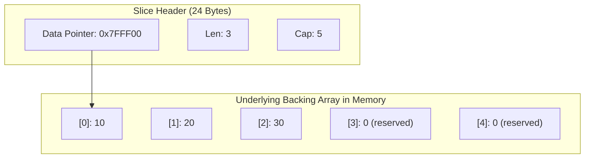
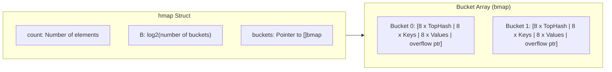
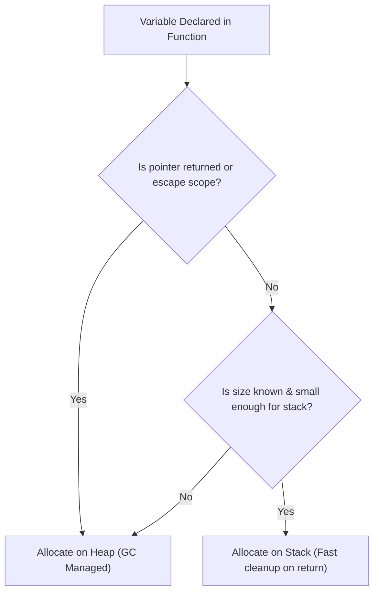

# 🧱 Type System, Memory Layout & Pointers

## 🎯 Learning Objectives

By the end of this module, you will understand:
- How Go's primitive and composite types are represented in physical memory.
- The internal structure of **Slices** (`SliceHeader`) and **Maps** (`hmap`).
- Pointer mechanics and why Go enforces pass-by-value across all function calls.
- The mechanics of **Stack vs. Heap** memory allocation.
- How Go's compiler executes **Escape Analysis** to optimize allocation performance.

---

## 🧠 Core Explanation

### 1. 🔍 Primitive Types & Zero Values

Go is statically typed and memory-safe. Every variable declared without an explicit initial value is automatically assigned its **Zero Value** by zeroing out its memory allocation.

| Type Category | Specific Types | Zero Value | Size in Memory |
|---|---|---|---|
| **Booleans** | `bool` | `false` | 1 byte |
| **Integers** | `int`, `int8`, `int16`, `int32`, `int64`, `uint...` | `0` | Platform dependent (`int` is 64-bit on 64-bit OS) |
| **Floats / Complex** | `float32`, `float64`, `complex64`, `complex128` | `0.0` | 4 or 8 bytes |
| **Pointers** | `*T` | `nil` | 8 bytes (64-bit) |
| **Slices** | `[]T` | `nil` (struct with 0 `ptr`, `len`, `cap`) | 24 bytes (3x 8-byte words) |
| **Maps / Channels** | `map[K]V`, `chan T` | `nil` (pointer to runtime header) | 8 bytes |
| **Interfaces** | `any`, `interface{}` | `nil` (struct with 0 type, 0 data) | 16 bytes |

---

### 2. ✂️ Slices vs. Arrays & `SliceHeader`

In Go, an **Array** (`[N]T`) is a fixed-size contiguous block of memory where the size is part of the type. Arrays are passed by value (copying all elements).

A **Slice** (`[]T`) is a lightweight dynamic view over an underlying array. A slice does not store elements itself; it is a 24-byte struct (on 64-bit systems) known internally as `reflect.SliceHeader`.

```go
type SliceHeader struct {
    Data uintptr // Pointer to the underlying array element
    Len  int     // Number of elements currently in the slice
    Cap  int     // Maximum number of elements before reallocation
}
```



#### Slice Capacity Growth (`append`)
When `append()` pushes the length beyond capacity (`len > cap`):
1. Go allocates a new, larger backing array.
2. For small slices (`cap < 256`), capacity **doubles** (`cap * 2`).
3. For larger slices (`cap >= 256`), capacity grows smoothly using a formula: `cap = cap + (cap + 3*256)/4`.
4. Existing elements are copied to the new memory block.

---

### 3. 🗺️ Map Internals (`hmap`)

A Go `map[K]V` is a pointer to a runtime `hmap` struct that implements a high-performance hash table using bucket arrays.



Key architectural details of `hmap`:
- **Buckets (`bmap`)**: Each bucket holds up to **8 key/value pairs**. Storing 8 keys followed by 8 values (rather than key/value alternating) eliminates memory alignment padding overhead.
- **TopHash**: High 8 bits of the key's hash code stored in a fast array for quick lookup before checking exact key equality.
- **Hash Collisions & Growth**: When the load factor exceeds **6.5** elements per bucket, or when overflow buckets become excessive, the map triggers incremental background resizing (`same-size` or `2x` expansion).
- **Concurrency Safety**: Go maps are **NOT thread-safe**. Concurrent reads and writes trigger an unrecoverable fatal runtime panic: `fatal error: concurrent map writes`.

---

### 4. 📌 Pointer Semantics & Pass-By-Value

**Go is strictly pass-by-value.** Every parameter passed to a function is copied.

When you pass a pointer (`*T`), the **pointer memory address itself is copied**, but it references the original underlying object in memory.

```go
func ModifyValue(val int) { val = 99 }       // Modifies local copy
func ModifyPointer(val *int) { *val = 99 }   // Dereferences copy of pointer, modifies target
```

- When you pass a `slice` or `map`, you pass a copy of the **header** (which contains a pointer to the backing array/hmap). Modifying slice elements inside a function mutates the caller's underlying array, but `append()`ing beyond capacity inside a function updates only the local slice header's pointer and capacity.

---

### 5. 🎯 Stack vs. Heap Allocation & Escape Analysis

Unlike C/C++ where developers manually manage `malloc`/`free`, or Java where object references default to the heap, Go's compiler automatically decides whether a variable lives on the **Stack** or the **Heap**.

- **Stack Allocation**: Extremely fast (bump allocator, stack frame pointer adjustment). Cleared instantly when function returns. Zero GC pressure.
- **Heap Allocation**: Managed by the Garbage Collector. Requires runtime synchronization and tri-color marking.

#### Escape Analysis Rules
The Go compiler performs static control-flow analysis during compilation (`go build -gcflags="-m"`). A variable **escapes to the heap** if:
1. A pointer to the variable is returned from a function.
2. The variable is passed to an `any` / `interface{}` parameter (e.g., `fmt.Println`), because the concrete type isn't known at compile time.
3. The variable size is too large for the stack or dynamically computed at runtime.
4. The variable is shared across goroutines.



---

## 💻 Working Examples

### Example 1: Slice Header Inspection & Append Behavior

```go
package main

import (
	"fmt"
	"unsafe"
)

// SliceHeader matches reflect.SliceHeader
type SliceHeader struct {
	Data uintptr
	Len  int
	Cap  int
}

func main() {
	// Create slice with len=3, cap=3
	s1 := make([]int, 3, 3)
	s1[0], s1[1], s1[2] = 10, 20, 30

	h1 := (*SliceHeader)(unsafe.Pointer(&s1))
	fmt.Printf("s1 -> Data: 0x%x, Len: %d, Cap: %d\n", h1.Data, h1.Len, h1.Cap)

	// Create sub-slice sharing the backing array
	s2 := s1[1:3]
	h2 := (*SliceHeader)(unsafe.Pointer(&s2))
	fmt.Printf("s2 -> Data: 0x%x, Len: %d, Cap: %d\n", h2.Data, h2.Len, h2.Cap)

	// Mutate s2 element -> affects s1 because Data pointers overlap!
	s2[0] = 999
	fmt.Println("s1 after s2 mutation:", s1) // Output: [10 999 30]

	// Trigger reallocation by exceeding capacity
	s1 = append(s1, 40)
	h1Realloc := (*SliceHeader)(unsafe.Pointer(&s1))
	fmt.Printf("s1 after append -> Data: 0x%x, Len: %d, Cap: %d\n", 
		h1Realloc.Data, h1Realloc.Len, h1Realloc.Cap)
}
```

---

### Example 2: Escape Analysis in Action

Save this to `main.go` and run `go build -gcflags="-m" main.go`:

```go
package main

type User struct {
	ID   int
	Name string
}

func CreateStackUser() User {
	u := User{ID: 1, Name: "Alice"} // Stays on Stack
	return u
}

func CreateHeapUser() *User {
	u := User{ID: 2, Name: "Bob"} // Escapes to Heap because pointer is returned
	return &u
}

func main() {
	_ = CreateStackUser()
	_ = CreateHeapUser()
}
```

**Compiler Escape Analysis Output:**
```text
./main.go:13:9: &u escapes to heap
./main.go:12:2: moved to heap: u
```

---

## ⚠️ Common Pitfalls

1. **Writing to a `nil` Map**:
   ```go
   var m map[string]int // m is nil!
   m["key"] = 42       // PANIC: assignment to entry in nil map
   // Fix: m = make(map[string]int)
   ```
2. **Assuming Sub-slices Duplicate Data**:
   Slicing `b := a[1:5]` retains a reference to `a`'s full backing array. Keeping a small slice of a massive 1GB array in memory prevents GC from reclaiming the entire 1GB array. (Use `bytes.Clone` or `copy()` to detach).
3. **Assuming Map Iteration Order is Fixed**:
   Go explicitly randomizes map iteration starting points to prevent code from relying on bucket layout ordering.

---

## 🔀 Language Comparisons

| Feature | Golang | C++ | Java |
|---|---|---|---|
| **Slices / Vectors** | `[]T` (24-byte view over array) | `std::vector<T>` (owns dynamic heap memory) | `ArrayList<T>` (heap array of references) |
| **Pointers** | Safe pointers (no pointer arithmetic) | Raw pointers + Smart pointers (`unique_ptr`) | Object references only |
| **Allocation Strategy** | Stack default; GC Heap on escape | Stack default; Manual / Smart-pointer Heap | Heap default for all objects |
| **Map Thread Safety** | Unsafe (Panics on race) | Unsafe (`std::unordered_map`) | Unsafe (`HashMap`), explicit `ConcurrentHashMap` |

---

## ✅ Quick Reference / Cheat-Sheet

```go
// Declarations & Zero Values
var a [5]int          // Array: fixed size, value type, zeroed
s := make([]int, 0, 10)// Slice: len 0, cap 10
m := make(map[string]int) // Map: initialized, ready for write

// Pointer Dereference & Address-of
val := 42
ptr := &val           // ptr is *int pointing to val
*ptr = 100            // val is now 100

// Escape Analysis Check Command
// go build -gcflags="-m" main.go
```

---

## 🚀 Navigation

- [← Overview & Index](./index)
- [Next Module: Structs, Interfaces & Structural Polymorphism →](./02-structs-interfaces-polymorphism)
