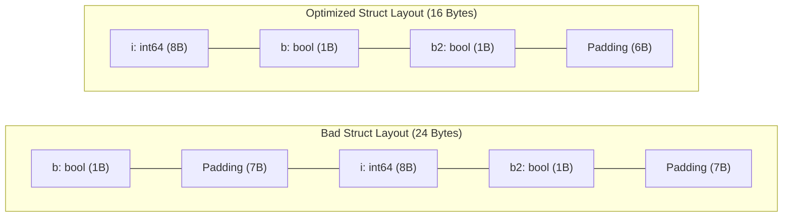
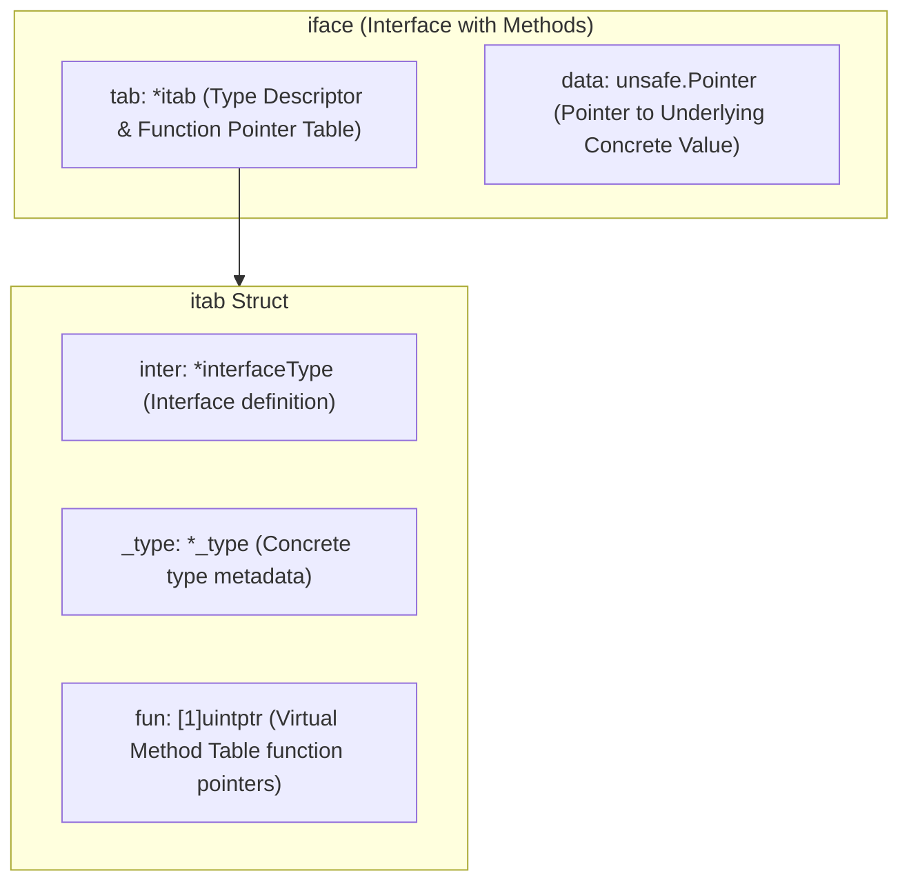
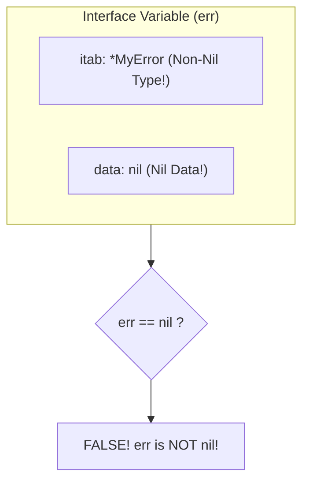

# 🧩 Structs, Interfaces & Structural Polymorphism

## 🎯 Learning Objectives

By the end of this module, you will understand:
- How Go structs order fields in memory and how to optimize struct alignment padding.
- Composition over inheritance using **Struct Embedding** and method promotion.
- How Go's **Implicit Interfaces** achieve compile-time structural polymorphism without explicit inheritance declarations.
- The runtime implementation of interfaces via **Fat Pointers** (`iface` and `eface`).
- The classic **`nil` Interface Trap** and how to avoid subtle bugs in production code.

---

## 🧠 Core Explanation

### 1. 🏗️ Struct Memory Alignment & Padding

Go structs store fields sequentially in memory. To optimize CPU word access, fields must align to addresses that are multiples of their size (e.g., an 8-byte `int64` must align on an 8-byte boundary on 64-bit architecture).

Improper field ordering introduces wasteful **Memory Padding**:



**Rule of Thumb**: Sort struct fields from **largest data type to smallest data type** to minimize padding bytes.

---

### 2. 🧱 Composition via Struct Embedding

Go intentionally excludes class-based single or multiple inheritance. Instead, Go uses **Composition** via **Struct Embedding**.

When a struct embeds an anonymous type, fields and methods of the embedded struct are automatically **promoted** to the outer struct:

```go
type Engine struct {
	Horsepower int
}
func (e Engine) Start() { fmt.Println("Vroom!") }

type Car struct {
	Engine // Embedded anonymous field
	Model  string
}

c := Car{Engine: Engine{Horsepower: 300}, Model: "Sedan"}
c.Start() // Promoted method invocation (equivalent to c.Engine.Start())
```

- **Overriding**: If `Car` defines its own `Start()` method, it masks `Engine.Start()`. However, `Car.Engine.Start()` remains explicitly accessible.

---

### 3. ⚙️ Method Sets & Receiver Rules

A method is simply a function with a special **Receiver** parameter:

```go
func (r T) ValueMethod()   // Value receiver
func (r *T) PointerMethod() // Pointer receiver
```

#### The Receiver Rule Table

| Receiver Type | Method Operates On | Called on Value (`T`) | Called on Pointer (`*T`) |
|---|---|---|---|
| **Value Receiver `(r T)`** | A copy of `T` | ✅ Allowed | ✅ Allowed (auto-dereferenced) |
| **Pointer Receiver `(r *T)`** | The original pointer `*T` | ✅ Allowed (if addressable) | ✅ Allowed |

**Interface Satisfaction Requirement**:
- Value values (`T`) satisfy interfaces requiring **only Value Receivers**.
- Pointer values (`*T`) satisfy interfaces requiring **both Value and Pointer Receivers**.

---

### 4. 🎭 Structural Interfaces & Fat Pointers (`iface` & `eface`)

Go interfaces are satisfied **implicitly** (duck typing verified at compile time). A type implements an interface simply by providing all methods defined in the interface signature—no `implements` keyword required.

At the runtime level, interface values are 16-byte **Fat Pointers** represented by two internal structs in the runtime:



1. **`iface`**: Used for interfaces that define methods (e.g., `io.Reader`). Contains an `itab` pointer (type info + method function pointers) and a `data` pointer to the concrete instance.
2. **`eface`**: Used for `any` / `interface{}` (empty interface). Contains a pointer to concrete type metadata (`_type`) and a `data` pointer.

---

### 5. ⚠️ The `nil` Interface Trap

An interface value is considered `nil` **ONLY IF BOTH** its type pointer (`itab`) AND its data pointer (`data`) are `nil`.

If you assign a `nil` concrete pointer to an interface variable, the interface's `itab` pointer holds type metadata while its `data` pointer is `nil`. **The interface itself is NOT `nil`!**



---

## 💻 Working Examples

### Example 1: Struct Embedding and Method Sets

```go
package main

import "fmt"

type Worker interface {
	Work()
}

type Logger struct{}

func (l *Logger) Log(msg string) {
	fmt.Println("[LOG]:", msg)
}

type Service struct {
	Logger // Embedded struct
	Name   string
}

// Work uses pointer receiver
func (s *Service) Work() {
	s.Log("Service " + s.Name + " is working") // Promoted s.Logger.Log()
}

func main() {
	svc := &Service{Name: "PaymentProcessor"}
	
	// Satisfies Worker interface because *Service has Work()
	var w Worker = svc
	w.Work()
}
```

---

### Example 2: Demonstrating & Fixing the `nil` Interface Bug

```go
package main

import "fmt"

type CustomError struct {
	Code int
}

func (e *CustomError) Error() string {
	return fmt.Sprintf("Error Code %d", e.Code)
}

func GetError(shouldFail bool) error {
	var err *CustomError = nil // Concrete nil pointer
	if shouldFail {
		err = &CustomError{Code: 500}
	}
	
	// WRONG: Returning concrete nil pointer assigned to interface 'error'
	// return err 

	// RIGHT: Explicitly return nil interface
	if err == nil {
		return nil
	}
	return err
}

func main() {
	err := GetError(false)
	if err != nil {
		fmt.Println("BUG TRIGGERED! err is not nil:", err)
	} else {
		fmt.Println("SUCCESS: err is nil")
	}
}
```

---

### Example 3: Type Assertions & Type Switches

```go
package main

import "fmt"

func ProcessValue(val any) {
	// Type Assertion (comma-ok pattern)
	if s, ok := val.(string); ok {
		fmt.Println("String value of length:", len(s))
		return
	}

	// Type Switch
	switch v := val.(type) {
	case int:
		fmt.Println("Integer squared:", v*v)
	case fmt.Stringer:
		fmt.Println("Stringer output:", v.String())
	default:
		fmt.Printf("Unknown type: %T\n", v)
	}
}

func main() {
	ProcessValue("Hello Go")
	ProcessValue(7)
}
```

---

## ⚠️ Common Pitfalls

1. **Returning Concrete `nil` Pointers as Interface Returns**:
   Always return explicit `nil` when no error occurs instead of returning a `nil` pointer of a custom error struct.
2. **Calling Pointer Receiver Methods on Unaddressable Values**:
   ```go
   type Counter struct{ Count int }
   func (c *Counter) Inc() { c.Count++ }

   // Map elements are NOT addressable!
   m := map[string]Counter{"a": {Count: 0}}
   // m["a"].Inc() // COMPILE ERROR: cannot call pointer method on unaddressable value
   ```

---

## 🔀 Language Comparisons

| Feature | Golang | Java | Rust | C++ |
|---|---|---|---|---|
| **Interface Binding** | Implicit (Compile-time duck typing) | Explicit (`implements`) | Explicit (`impl Trait for Type`) | Explicit (Abstract classes) |
| **Interface Layout** | Fat Pointer (16 bytes: `itab` + `data`) | Reference pointer to Heap Object | Fat Pointer (16 bytes: `vtable` + `data`) | `vptr` inside Object layout |
| **Inheritance** | None (Composition via embedding) | Single class inheritance | None (Trait composition) | Multiple inheritance |

---

## ✅ Quick Reference / Cheat-Sheet

```go
// Struct Alignment Optimization
type Optimized struct {
	Big   int64 // 8 bytes
	Ptr   *int  // 8 bytes
	Small int8  // 1 byte
	// 7 bytes padding at end
}

// Interface Type Switch
switch v := i.(type) {
case string:
	// v is string
case int:
	// v is int
default:
}
```

---

## 🚀 Navigation

- [← Module 01: Type System & Memory](./01-type-system-and-memory)
- [Next Module: Error Handling, Panic & Recovery →](./03-error-handling-patterns)
