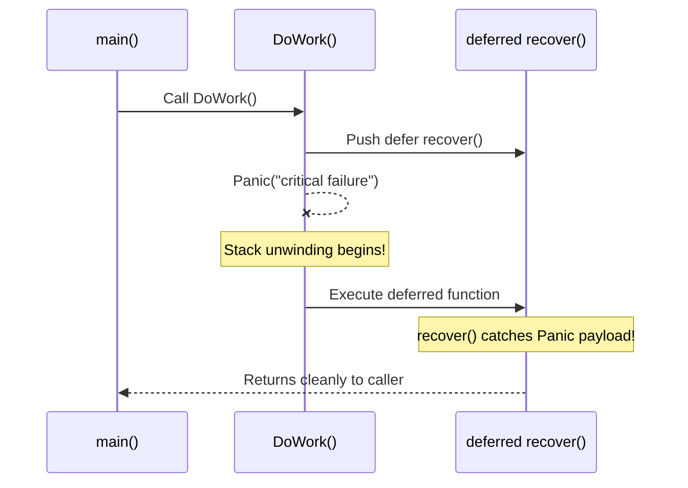

# 🚨 Error Handling, Panic & Recovery

## 🎯 Learning Objectives

By the end of this module, you will understand:
- Why Go treats **Errors as Values** rather than using try/catch exceptions.
- How to implement sentinel errors and custom error types.
- How to construct and inspect error trees using **Error Wrapping** (`%w`), `errors.Is()`, and `errors.As()`.
- The execution mechanics of **`defer`**, **`panic`**, and **`recover()`**.
- How to protect multi-threaded Go applications from unhandled goroutine panic crashes.

---

## 🧠 Core Explanation

### 1. 💡 Philosophy: Errors as Values

In Go, errors are normal values returned explicitly as the final return value of a function:

```go
type error interface {
	Error() string
}
```

By avoiding implicit exception unwinding (like C++ or Java exceptions), Go forces developers to explicitly make decisions at every failure boundary.

---

### 2. 🔗 Error Wrapping & Inspection (`errors.Is` & `errors.As`)

Since Go 1.13, errors can wrap lower-level cause errors to form an **Error Chain** using `%w` inside `fmt.Errorf()`:


#### Inspection Methods
- **`errors.Is(err, target)`**: Traverses the error chain recursively to check if any error in the chain matches `target` (or implements `Is(error) bool`).
- **`errors.As(err, &targetStructPtr)`**: Traverses the error chain to find the first error matching the concrete type of `targetStructPtr` and copies it into the target variable.

---

### 3. 🛡️ Defer, Panic, and Recover Mechanics

#### `defer` Execution Rules
- `defer` pushes a function call onto a stack. Deferred functions run in **LIFO (Last-In, First-Out)** order when the enclosing function returns.
- **Argument Evaluation**: Arguments to deferred functions are evaluated **immediately** when the `defer` statement is reached, not when the deferred function executes!

#### `panic` & `recover()` Flow
- **`panic(val)`**: Halts normal execution of the current goroutine, executes all deferred functions in the current stack frame, and unwinds the call stack upward executing deferred functions in caller frames.
- **`recover()`**: Catches a active panic and returns the panic payload. **Crucial Rule**: `recover()` returns a non-nil value **ONLY** when called directly inside a `defer` function!



---

## 💻 Working Examples

### Example 1: Idiomatic Error Wrapping, `errors.Is`, and `errors.As`

```go
package main

import (
	"errors"
	"fmt"
)

// Sentinel Error
var ErrNotFound = errors.New("record not found")

// Custom Error Type
type ValidationError struct {
	Field string
	Msg   string
}

func (e *ValidationError) Error() string {
	return fmt.Sprintf("validation failed on field '%s': %s", e.Field, e.Msg)
}

func RepositoryGet(id int) error {
	if id <= 0 {
		return &ValidationError{Field: "id", Msg: "must be positive"}
	}
	return ErrNotFound
}

func ServiceGet(id int) error {
	err := RepositoryGet(id)
	if err != nil {
		// Wrap error with contextual details using %w
		return fmt.Errorf("service failed to fetch user %d: %w", id, err)
	}
	return nil
}

func main() {
	err := ServiceGet(-1)

	// Check 1: Using errors.Is for sentinel errors
	if errors.Is(err, ErrNotFound) {
		fmt.Println("Matched Sentinel Error: ErrNotFound")
	}

	// Check 2: Using errors.As to extract custom struct error
	var valErr *ValidationError
	if errors.As(err, &valErr) {
		fmt.Printf("Matched Custom Error: Field=%s, Msg=%s\n", valErr.Field, valErr.Msg)
	}
}
```

---

### Example 2: Safe Goroutine Runner with Panic Recovery Middleware

In Go, an uncaught panic in **ANY** background goroutine crashes the entire application process! Wrapping background goroutines with panic recovery is a vital production pattern.

```go
package main

import (
	"fmt"
	"runtime/debug"
)

// SafeGo executes a background task with panic safety
func SafeGo(fn func()) {
	go func() {
		defer func() {
			if r := recover(); r != nil {
				fmt.Printf("[CRITICAL RECOVERY] Background goroutine panicked: %v\n", r)
				fmt.Println("Stack Trace:\n", string(debug.Stack()))
			}
		}()
		fn()
	}()
}

func main() {
	done := make(chan bool)

	SafeGo(func() {
		defer close(done)
		fmt.Println("Doing background work...")
		// Simulate unexpected memory nil pointer panic
		var ptr *int
		*ptr = 42
	})

	<-done
	fmt.Println("Main process survived goroutine panic!")
}
```

---

## ⚠️ Common Pitfalls

1. **Swallowing Errors**:
   ```go
   _ = db.Exec("DELETE FROM users") // BAD: Never ignore errors silently!
   ```
2. **Evaluating Defer Arguments Expecting Late Bindings**:
   ```go
   start := time.Now()
   defer fmt.Println("Duration:", time.Since(start)) // BAD: time.Since(start) evaluated IMMEDIATELY!
   
   // FIX: Wrap in anonymous function
   defer func() { fmt.Println("Duration:", time.Since(start)) }()
   ```
3. **Misusing `panic` for Flow Control**:
   `panic` is intended for unrecoverable errors (e.g., corrupted configuration at startup, missing essential system dependencies). Use `error` return values for expected domain failures.

---

## 🔀 Language Comparisons

| Concept | Golang | Java / C++ | Rust |
|---|---|---|---|
| **Primary Error Mechanism** | Explicit `(result, error)` returns | Exceptions (`try / catch / throw`) | `Result<T, E>` Enum matching |
| **Call Stack Unwinding** | `panic` / `recover()` | Exception propagation | `panic!` unwinding or abort |
| **Cleanup on Exit** | `defer` statements | `finally` block or RAII destructors | RAII (`Drop` trait) |

---

## ✅ Quick Reference / Cheat-Sheet

```go
// Error Wrapping & Checking
err := fmt.Errorf("context: %w", causeErr)
if errors.Is(err, sql.ErrNoRows) { /* ... */ }

var netErr net.Error
if errors.As(err, &netErr) { /* ... */ }

// Standard Panic Recovery Pattern
defer func() {
    if r := recover(); r != nil {
        log.Printf("Recovered from panic: %v", r)
    }
}()
```

---

## 🚀 Navigation

- [← Module 02: Structs & Interfaces](./02-structs-interfaces-polymorphism)
- [Next Module: Concurrency: Goroutines, Channels & CSP →](./04-concurrency-goroutines-channels)
