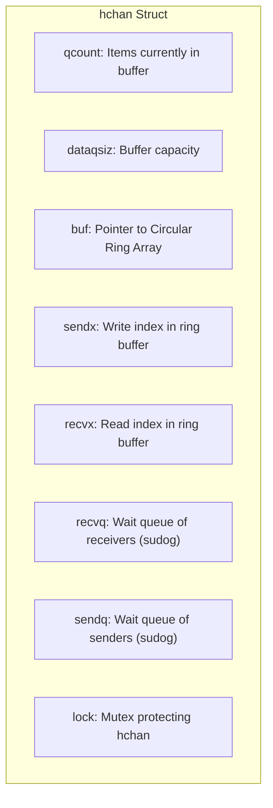
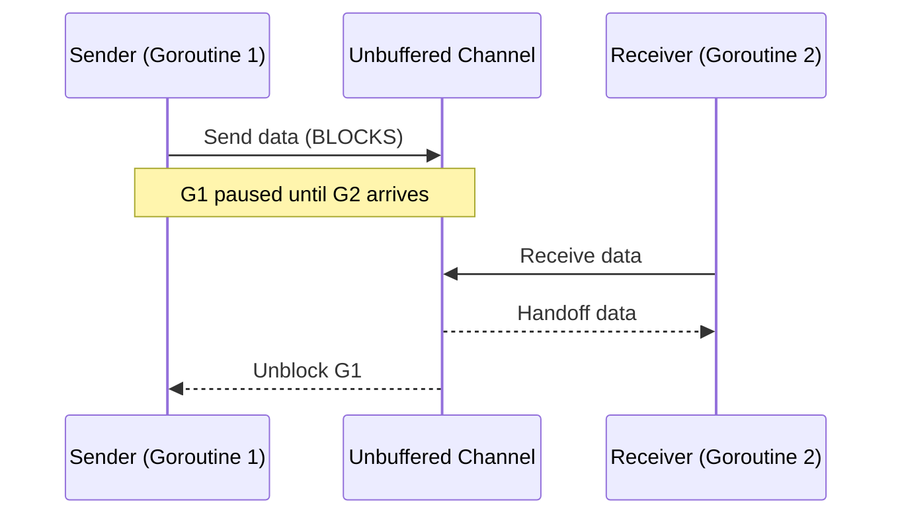

# ⚡ Concurrency: Goroutines, Channels & CSP

## 🎯 Learning Objectives

By the end of this module, you will understand:
- The theoretical foundation of **Communicating Sequential Processes (CSP)**.
- Why **Goroutines** scale to millions of concurrent tasks while OS threads do not.
- The internal architecture of Go **Channels** (`hchan`, `sudog`, ring buffers).
- The strict state table governing Nil, Open, and Closed channels.
- How to implement battle-tested concurrency patterns like **Worker Pools**, **Fan-Out/Fan-In**, and **Select Timeout Multiplexing**.

---

## 🧠 Core Explanation

### 1. 🌐 The CSP Philosophy

Classical concurrency relies on shared memory protected by locks (mutexes). Go adopts Tony Hoare's **Communicating Sequential Processes (CSP)** model:

> *"Do not communicate by sharing memory; instead, share memory by communicating."*

Instead of locking data structures to allow multi-threaded access, Go passes data ownership through synchronized channels.

---

### 2. 🪶 Goroutines vs. OS Threads

| Metric | OS Thread (Linux) | Go Goroutine |
|---|---|---|
| **Memory Allocation** | Fixed stack size (typically 1MB - 8MB) | Dynamic growable stack (starts at **2KB**) |
| **Creation Overhead** | ~1 millisecond (Kernel syscall `clone()`) | ~1 microsecond (User-space allocation) |
| **Context Switch Cost** | 1 - 2 microseconds (Kernel state save, CPU registers, CPU cache invalidation) | 10 - 100 nanoseconds (User-space register swap: SP, BP, PC) |
| **Max Concurrent Scale** | Thousands per system | **Millions** per process |

#### Stack Growing Mechanics
Goroutines start with a 2KB stack frame. When a call stack exceeds 2KB, the runtime allocates a new stack memory block of double size (`4KB`), copies existing stack frames over, updates internal pointers, and frees the old stack.

---

### 3. 📦 Channel Architecture (`hchan`)

A channel (`chan T`) is a pointer to a runtime `hchan` struct protected by an internal spinlock:



#### Unbuffered vs. Buffered Channels
- **Unbuffered Channels (`make(chan T)`)**: Capacity is 0. A send operation blocks until another goroutine executes a receive. It represents a **synchronous handoff**.



- **Buffered Channels (`make(chan T, N)`)**: Capacity is `N`. Sends append to `buf` without blocking as long as `qcount < dataqsiz`. Sends block only when `buf` is full (`qcount == dataqsiz`). Receives block only when `buf` is empty (`qcount == 0`).

---

### 4. 📜 The Channel Axioms State Table

Understanding the state machine of Go channels is critical to preventing panics and deadlocks:

| Operation | Nil Channel | Open Channel (with data/space) | Closed Channel |
|---|---|---|---|
| **Receive (`<-ch`)** | **Blocks forever** | Returns value immediately | Returns zero-value & `ok == false` |
| **Send (`ch <- v`)** | **Blocks forever** | Sends value immediately | **PANIC!** (`send on closed channel`) |
| **Close (`close(ch)`)** | **PANIC!** | Closes cleanly | **PANIC!** (`close of closed channel`) |

---

### 5. 🔀 Multiplexing with `select`

The `select` statement blocks until one of its channel communications is ready:
- If multiple channels are ready simultaneously, `select` picks one at **pseudo-random**.
- A `default:` case converts a blocking `select` into a non-blocking poll.

---

## 💻 Working Examples

### Example 1: High-Performance Worker Pool Pattern

```go
package main

import (
	"fmt"
	"sync"
	"time"
)

type Job struct {
	ID    int
	Value int
}

type Result struct {
	Job    Job
	Output int
}

func Worker(id int, jobs <-chan Job, results chan<- Result, wg *sync.WaitGroup) {
	defer wg.Done()
	for job := range jobs { // Loops until jobs channel is closed
		fmt.Printf("Worker %d processing job %d\n", id, job.ID)
		time.Sleep(10 * time.Millisecond) // Simulate CPU work
		results <- Result{Job: job, Output: job.Value * 2}
	}
}

func main() {
	const numJobs = 10
	const numWorkers = 3

	jobs := make(chan Job, numJobs)
	results := make(chan Result, numJobs)

	var wg sync.WaitGroup

	// Spawn Workers
	for w := 1; w <= numWorkers; w++ {
		wg.Add(1)
		go Worker(w, jobs, results, &wg)
	}

	// Enqueue Jobs
	for j := 1; j <= numJobs; j++ {
		jobs <- Job{ID: j, Value: j * 10}
	}
	close(jobs) // Signal workers no more jobs will be sent

	wg.Wait()      // Wait for all workers to finish
	close(results) // Close results channel for reader loop

	// Collect Results
	for res := range results {
		fmt.Printf("Result Job %d -> Output: %d\n", res.Job.ID, res.Output)
	}
}
```

---

### Example 2: Non-Blocking Select with Timeout Pattern

```go
package main

import (
	"fmt"
	"time"
)

func QueryDatabase(ch chan<- string) {
	time.Sleep(100 * time.Millisecond) // Simulate query delay
	ch <- "UserRecord: #404"
}

func main() {
	ch := make(chan string, 1)
	go QueryDatabase(ch)

	select {
	case res := <-ch:
		fmt.Println("Received DB Response:", res)
	case <-time.After(50 * time.Millisecond):
		fmt.Println("TIMEOUT EXPIRED: Query took too long!")
	}
}
```

---

## ⚠️ Common Pitfalls

1. **Goroutine Leaks**:
   If a background goroutine is blocked on receiving from a channel that nobody writes to, the goroutine remains in memory forever, leaking its stack and referenced objects.
2. **Closing Channels from the Receiver Side**:
   **Golden Rule**: *Only the sender should close a channel, never the receiver*, because sending to a closed channel panics.
3. **Loop Closure Variable Capture (Go < 1.22)**:
   ```go
   // Historically in Go < 1.22, 'v' was shared across iterations.
   // Fixed natively in Go 1.22+, but explicitly passing parameter is still good practice:
   for _, v := range data {
       go func(val string) {
           fmt.Println(val)
       }(v)
   }
   ```

---

## 🔀 Language Comparisons

| Feature | Golang | Erlang / Elixir | Node.js | Java |
|---|---|---|---|---|
| **Concurrency Model** | CSP (Channels & Shared Memory option) | Actor Model (Shared-Nothing Message Passing) | Single-Threaded Event Loop | OS Thread Pool / Virtual Threads (Project Loom) |
| **Message Passing** | Channels (`hchan`) | Mailboxes per Actor | Event Emitter / Event Queue | BlockingQueue |
| **Thread Preemption** | Async signal preemption | Preemptive reduction counting | Cooperative event loop | Kernel preemptive scheduling |

---

## ✅ Quick Reference / Cheat-Sheet

```go
// Channel Creation
ch := make(chan int)       // Unbuffered
bufCh := make(chan int, 5) // Buffered (cap=5)

// Idiomatic Safe Close Signal Pattern
done := make(chan struct{}) // 0-byte struct signal
close(done)                 // Broadcasts signal to all receivers!

// Non-blocking Channel Read
select {
case msg := <-ch:
    fmt.Println("Received:", msg)
default:
    fmt.Println("No message available immediately")
}
```

---

## 🚀 Navigation

- [← Module 03: Error Handling](./03-error-handling-patterns)
- [Next Module: Synchronization Primitives & Context Propagation →](./05-sync-and-context)
