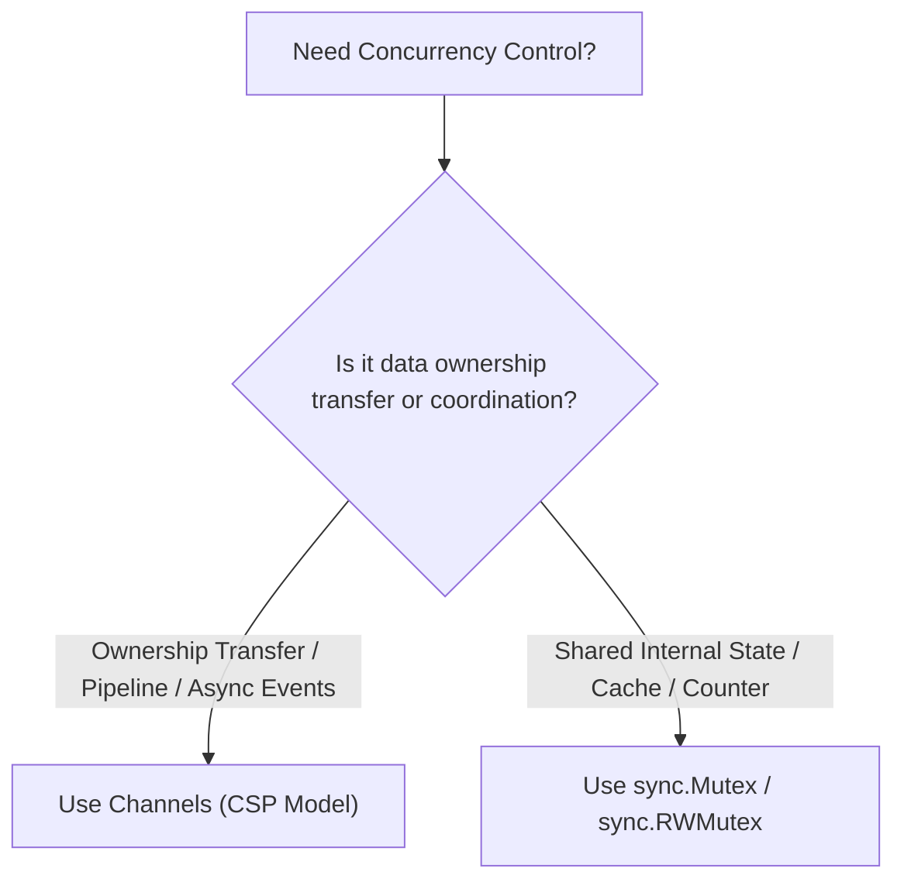
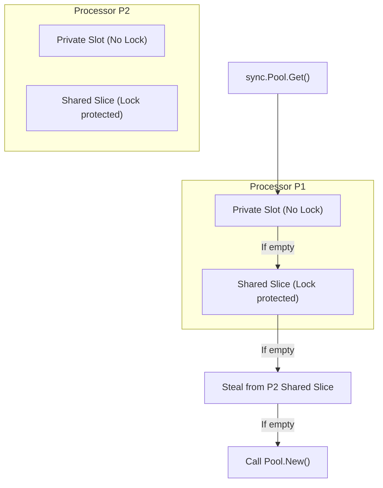
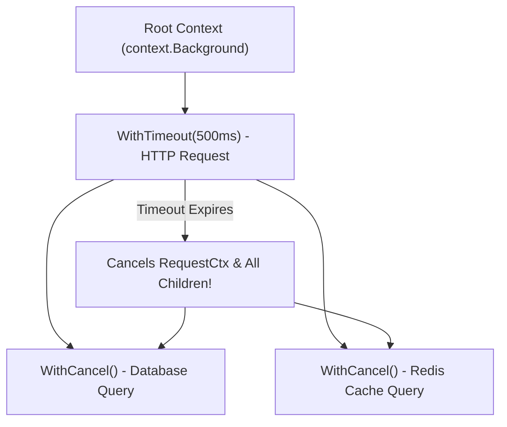

# 🔒 Synchronization Primitives & Context Propagation

## 🎯 Learning Objectives

By the end of this module, you will understand:
- The decision matrix for choosing between **Channels vs. `sync` Mutexes**.
- How `sync.Mutex` works under the hood (Normal vs. Starvation Mode).
- High-performance memory optimization using **`sync.Pool`** and lock-free **`sync/atomic`**.
- Hierarchical **`context.Context`** cancellation trees and deadline propagation.
- Rules for passing request-scoped values using `context.WithValue()`.

---

## 🧠 Core Explanation

### 1. ⚖️ Channels vs. `sync` Mutex Decision Matrix

A common question in Go is when to use Channels vs `sync` primitives:



| Scenario | Recommended Mechanism | Reason |
|---|---|---|
| **Passing ownership of data** | Channels | Clean producer/consumer handoff |
| **Worker pool distribution** | Channels | Natural queue multiplexing with `select` |
| **In-memory cache / map read-write** | `sync.RWMutex` | Minimal overhead for lock-based state |
| **Atomic counter increment** | `sync/atomic` | Hardware CPU lock-free instruction (CAS) |
| **Object reuse / GC reduction** | `sync.Pool` | Per-CPU Processor (`P`) local object cache |

---

### 2. 🔐 `sync.Mutex` & `sync.RWMutex`

#### `sync.Mutex` Internals & Modes
`sync.Mutex` is an 8-byte structure containing a 32-bit state bitmask and a semaphore:
1. **Normal Mode**: Waiting goroutines join a FIFO queue, but newly arriving goroutines spin on the CPU to compete for ownership. This offers higher throughput because spinning goroutines are already scheduled on a P CPU core.
2. **Starvation Mode**: If a waiting goroutine fails to acquire the mutex for more than **1 millisecond**, the mutex switches to Starvation Mode. Newly arriving goroutines are forbidden from spinning and join the tail of the FIFO queue immediately, handing control directly to the oldest waiter.

#### `sync.RWMutex`
Allows **N concurrent readers** OR **1 exclusive writer**:
- `RLock()` / `RUnlock()`: Acquire/release read locks. Multiple readers proceed concurrently without blocking each other.
- `Lock()` / `Unlock()`: Acquire/release write locks. Blocks all new readers and writers until unlocked.

---

### 3. ♻️ `sync.Pool` Object Caching

`sync.Pool` is a concurrent buffer that stores temporary objects to reduce GC allocation pressure.



- **GC Clearing**: Objects in `sync.Pool` are automatically evicted during Garbage Collection cycles. It is designed for **transient object caches** (e.g. `bytes.Buffer` reuse), NOT for persistent connection pools (like DB connections)!

---

### 4. 🌳 Context Propagation (`context.Context`)

`context.Context` carries deadlines, cancellation signals, and request-scoped key-value metadata across API boundaries and goroutine trees.



#### Context Tree Rules
- Canceling a parent context **automatically cancels all child contexts** derived from it.
- Canceling a child context does NOT cancel the parent context.
- Always call `defer cancel()` immediately after creating a context with `WithCancel`, `WithTimeout`, or `WithDeadline` to prevent context memory leaks.

---

## 💻 Working Examples

### Example 1: Context Deadline Propagation in HTTP & Database Stack

```go
package main

import (
	"context"
	"fmt"
	"time"
)

func QueryDatabase(ctx context.Context, query string) (string, error) {
	ch := make(chan string, 1)

	go func() {
		// Simulate heavy database operation
		time.Sleep(200 * time.Millisecond)
		ch <- "Query Result: User #123"
	}()

	select {
	case res := <-ch:
		return res, nil
	case <-ctx.Done(): // Triggered if parent context cancels or times out
		return "", ctx.Err() // Returns context.DeadlineExceeded
	}
}

func main() {
	// Create context with 100ms timeout (DB takes 200ms -> should trigger deadline error)
	ctx, cancel := context.WithTimeout(context.Background(), 100*time.Millisecond)
	defer cancel() // Ensures context resources are freed

	res, err := QueryDatabase(ctx, "SELECT * FROM users")
	if err != nil {
		fmt.Println("Database Call Failed:", err) // Output: context deadline exceeded
		return
	}
	fmt.Println("Success:", res)
}
```

---

### Example 2: Reducing Allocations with `sync.Pool`

```go
package main

import (
	"bytes"
	"fmt"
	"sync"
)

var bufferPool = sync.Pool{
	New: func() any {
		// Pre-allocate 4KB byte buffer
		return bytes.NewBuffer(make([]byte, 0, 4096))
	},
}

func ProcessLogMessage(msg string) string {
	// Fetch buffer from per-P pool (0 allocations)
	buf := bufferPool.Get().(*bytes.Buffer)
	buf.Reset()            // Reset length to 0 while keeping allocated capacity
	defer bufferPool.Put(buf) // Return buffer to pool when finished

	buf.WriteString("[INFO] ")
	buf.WriteString(msg)
	return buf.String()
}

func main() {
	out := ProcessLogMessage("User logged in successfully")
	fmt.Println(out)
}
```

---

## ⚠️ Common Pitfalls

1. **Copying `sync` Primitives by Value**:
   Passing a struct containing a `sync.Mutex` or `sync.WaitGroup` to a function by value copies the mutex's internal atomic state, rendering lock tracking completely invalid!
   ```go
   func Process(wg sync.WaitGroup) {} // BAD: Copies WaitGroup! Pass *sync.WaitGroup instead.
   ```
2. **`WaitGroup.Add()` Placement Error**:
   ```go
   for i := 0; i < 5; i++ {
       go func() {
           wg.Add(1) // BAD: Race condition! Main thread may reach wg.Wait() before wg.Add() runs!
           defer wg.Done()
       }()
   }
   // FIX: Call wg.Add(1) outside the goroutine before 'go func()' statement.
   ```
3. **Using `context.WithValue` for Required Business Parameters**:
   `WithValue` is meant strictly for request-scoped metadata across process boundaries (e.g., Request ID, JWT trace tokens). Pass domain parameters explicitly in function signatures!

---

## 🔀 Language Comparisons

| Feature | Golang | Java | C++ |
|---|---|---|---|
| **Context Propagation** | `context.Context` (Explicit parameter tree) | `ThreadLocal` / MDC | Explicit struct passing / `boost::asio::yield_context` |
| **Object Pooling** | `sync.Pool` (Built-in GC-aware per-CPU pool) | Apache Commons `GenericObjectPool` | Custom memory arenas / `boost::pool` |
| **Lock-free Atomics** | `sync/atomic` | `java.util.concurrent.atomic` | `std::atomic<T>` |

---

## ✅ Quick Reference / Cheat-Sheet

```go
// WaitGroup Pattern
var wg sync.WaitGroup
wg.Add(1)
go func() {
    defer wg.Done()
    // Work...
}()
wg.Wait()

// Context Timeout Pattern
ctx, cancel := context.WithTimeout(parentCtx, 2*time.Second)
defer cancel()

// Atomic CAS Operation
var count int64
atomic.AddInt64(&count, 1)
```

---

## 🚀 Navigation

- [← Module 04: Concurrency & Channels](./04-concurrency-goroutines-channels)
- [Next Module: Go Runtime: GMP Scheduler & Garbage Collector →](./06-runtime-gmp-and-gc)
