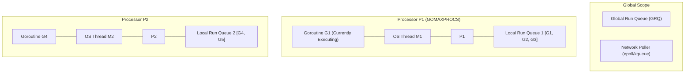
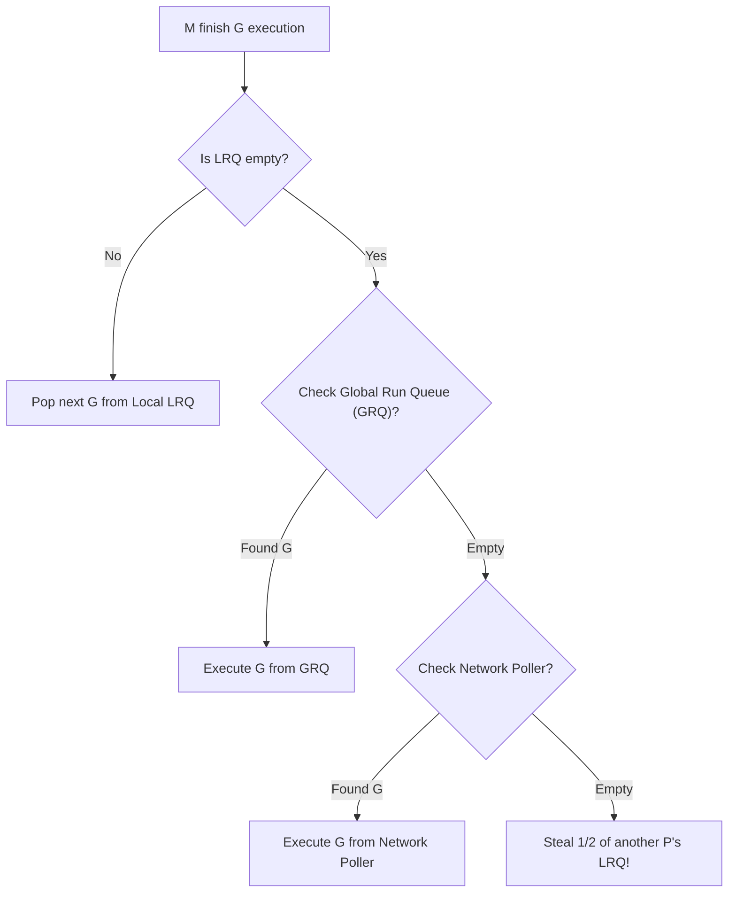
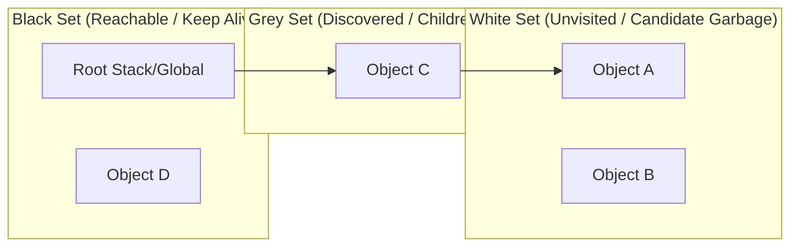

# ⚙️ Go Runtime: GMP Scheduler & Memory Management

## 🎯 Learning Objectives

By the end of this module, you will understand:
- The internal architecture of the Go **GMP M:N Scheduler**.
- How **Work Stealing**, **Syscall Handoffs**, and **Network Poller** achieve ultra-high CPU utilization.
- How **Async Signal Preemption** prevents goroutines from starving the CPU.
- The mechanics of Go's **Concurrent Tri-Color Mark-and-Sweep Garbage Collector**.
- How to tune GC pacing using **`GOGC`** and **`GOMEMLIMIT`** to eliminate OOM container crashes.

---

## 🧠 Core Explanation

### 1. ⚙️ The GMP Model Architecture

Go implements an **M:N User-Space Scheduler**, mapping $N$ Goroutines onto $M$ OS Threads using $P$ Processor contexts.



#### The Core Components
- **G (Goroutine)**: Represents a Go execution thread. Contains stack pointer, program counter (`PC`), and status (`_Gidle`, `_Grunnable`, `_Grunning`, `_Gwaiting`, `_Gsyscall`).
- **M (Machine)**: An OS kernel thread created via `clone()`. `M` requires an assigned `P` to execute Go code.
- **P (Processor)**: Represents a logical execution context/resource. The total number of `P` instances is fixed by `GOMAXPROCS` (defaults to host CPU core count). Each `P` owns a lock-free **Local Run Queue (LRQ)** holding up to 256 runnable goroutines.

---

### 2. 🔄 Scheduling Mechanics: Work Stealing & Syscalls



#### 1. Work Stealing Algorithm
When a processor `P1` exhausts its Local Run Queue:
1. It checks the Global Run Queue (GRQ) periodically (every 61 ticks to avoid GRQ starvation).
2. It checks the Network Poller for ready I/O goroutines.
3. If still empty, `P1` randomly picks another processor `P2` and **steals half** of `P2`'s LRQ items!

#### 2. Syscall Handoff (Blocking I/O)
When goroutine `G1` invokes a blocking OS syscall (e.g. read from disk file):
- Thread `M1` detaches from `P1`, taking `G1` into the OS kernel kernel space.
- A idle thread `M2` (or newly created thread) takes ownership of `P1` and continues executing the remaining goroutines in `P1`'s LRQ without pausing CPU execution!

#### 3. Asynchronous Signal Preemption (Go 1.14+)
Historically, Go relied on cooperative preemption during function call stack allocation checks. Since Go 1.14, the runtime uses **OS Signal Preemption (`SIGURG`)**. If a goroutine runs continuously for >**10ms**, the sysmon thread sends a `SIGURG` signal to `M`, forcing `M` to save `G`'s registers and push `G` back to the GRQ.

---

### 3. 🧹 Tri-Color Concurrent Garbage Collector

Go features a **Concurrent, Low-Latency Tri-Color Mark-and-Sweep GC**. It targets Stop-The-World (STW) pauses under **1 millisecond**.



#### Tri-Color Marking Phases
1. **Sweep Termination (STW)**: Prepares mark phase (~30 microseconds STW pause).
2. **Concurrent Marking**:
   - Roots (stacks, global variables) are added to the **Grey Set**.
   - Background GC worker goroutines pop objects from Grey, turn them **Black**, and add any referenced objects to Grey.
   - **Write Barrier**: If application code mutates a pointer during concurrent marking, a hybrid Write Barrier intercepts the write to ensure no reachable white object is hidden behind a black object.
3. **Mark Termination (STW)**: Completes mark phase (~30 microseconds STW pause).
4. **Concurrent Sweeping**: Reclaims memory of remaining **White** objects asynchronously.

---

### 4. 🎛️ GC Pacing: `GOGC` & `GOMEMLIMIT`

- **`GOGC` (Pacing Target)**: Sets the percentage ratio of new uncollected heap memory relative to reachable memory after the last GC. Default is `GOGC=100` (trigger next GC when heap doubles).
- **`GOMEMLIMIT` (Go 1.19+)**: Sets a **soft memory cap** (e.g. `GOMEMLIMIT=2GiB`). As memory approaches the limit, the runtime automatically increases GC frequency to prevent Linux OOM-killer crashes in Kubernetes containers.

---

## 💻 Working Examples

### Example 1: Monitoring Runtime Scheduler & Memory Stats

```go
package main

import (
	"fmt"
	"runtime"
	"time"
)

func PrintRuntimeStats() {
	var m runtime.MemStats
	runtime.ReadMemStats(&m)

	fmt.Println("=== RUNTIME METRICS ===")
	fmt.Printf("Active Goroutines : %d\n", runtime.NumGoroutine())
	fmt.Printf("GOMAXPROCS Cores  : %d\n", runtime.GOMAXPROCS(0))
	fmt.Printf("Heap Allocated    : %d KB\n", m.HeapAlloc/1024)
	fmt.Printf("Total GC Cycles   : %d\n", m.NumGC)
	fmt.Println("=======================")
}

func main() {
	PrintRuntimeStats()

	// Spawn 100,000 lightweight goroutines
	for i := 0; i < 100000; i++ {
		go func() {
			time.Sleep(1 * time.Second)
		}()
	}

	fmt.Println("\nAfter spawning 100,000 goroutines:")
	PrintRuntimeStats()
}
```

---

## ⚠️ Common Pitfalls

1. **Ignoring `GOMAXPROCS` in Containerized Environments**:
   In Docker/Kubernetes, `runtime.GOMAXPROCS` defaults to host node CPU count (e.g. 64 cores) even if container CPU limit is `2.0`. This causes massive thread context-switch contention! (Use `go.uber.org/automaxprocs` to align `GOMAXPROCS` with container limits).
2. **OOM Crashes from High Allocation Rates under Default `GOGC=100`**:
   Without setting `GOMEMLIMIT`, sudden allocation spikes can double the heap beyond container memory limits before `GOGC=100` triggers GC, causing SIGKILL container terminations.

---

## 🔀 Language Comparisons

| Runtime Feature | Golang | Java (JVM) | Erlang (BEAM) |
|---|---|---|---|
| **Scheduler Type** | User-Space M:N Work Stealing | 1:1 OS Thread (historically), Loom M:N | User-Space M:N Per-Process |
| **Preemption** | Async Signal (`SIGURG`, 10ms tick) | Kernel Preemptive | Reduction Counting (4000 ops) |
| **Garbage Collector** | Concurrent Tri-color (STW < 1ms) | Generational (ZGC / G1GC / Shenandoah) | Per-Process isolated GC (Zero STW) |

---

## ✅ Quick Reference / Cheat-Sheet

```bash
# Runtime Environment Variables
export GOMAXPROCS=4              # Set active P processor count
export GOGC=100                  # Trigger GC on 100% heap growth
export GOMEMLIMIT=1800MiB        # Soft memory cap to prevent OOM
```

```go
// Dynamic GOMAXPROCS Inspection
numCPU := runtime.NumCPU()
runtime.GOMAXPROCS(numCPU)
```

---

## 🚀 Navigation

- [← Module 05: Synchronization & Context](./05-sync-and-context)
- [Next Module: Generics & Type Constraints →](./07-generics-and-type-constraints)
