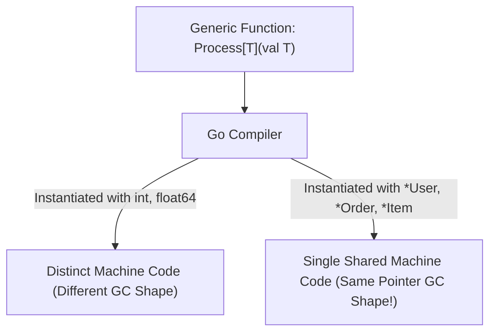

# 🧬 Generics & Type Constraints

## 🎯 Learning Objectives

By the end of this module, you will understand:
- The design goals and syntax of **Go Generics** introduced in Go 1.18.
- How to define type parameters on functions, structs, and custom data structures.
- How **Type Sets**, `comparable`, `any`, and the `~` underlying type operator work.
- The compiler implementation strategy: **GCShape Stenciling** and Dictionary passing.
- Limitations of Go generics compared to C++ templates or Java generics.

---

## 🧠 Core Explanation

### 1. 🧬 Why Generics Were Added

Before Go 1.18, developers writing reusable slice/map algorithms (like `Map`, `Filter`, `Keys`, `Min`/`Max`) had to choose between two undesirable trade-offs:
1. Copying and pasting identical code for every primitive type (`IntSlice`, `StringSlice`).
2. Using `any` (`interface{}`), which sacrificed compile-time type safety and incurred heavy heap allocation overhead due to interface boxing/unboxing.

Go Generics solve this by providing **compile-time type parameters** without dynamic reflection overhead.

---

### 2. 📐 Type Parameters & Constraints Syntax

```go
// Generic function definition
func Keys[K comparable, V any](m map[K]V) []K {
	keys := make([]K, 0, len(m))
	for k := range m {
		keys = append(keys, k)
	}
	return keys
}
```

#### Core Constraint Types
- **`any`**: Alias for `interface{}`. Accepts any type.
- **`comparable`**: Built-in interface constraint matching any type that supports `==` and `!=` operators (booleans, numbers, strings, pointers, channels, structs of comparable fields).

---

### 3. 🧩 Type Sets & The `~` Operator

Interfaces in Go 1.18+ serve a dual role: they define method signatures AND **Type Sets**.

```go
// Union constraint interface
type Number interface {
	~int | ~int64 | ~float64 // Matches int, int64, float64 or types derived from them
}
```

#### The `~` Approximation Operator
- Without `~int`: Matches ONLY the strict primitive type `int`.
- With `~int`: Matches `int` AND any custom type defined with `int` as its underlying type:
  ```go
  type UserID int // Underlying type is int -> satisfies ~int!
  ```

---

### 4. ⚙️ Compiler Implementation: GCShape Stenciling

Languages implement generics differently:
- **C++**: Full Monomorphization (generates separate machine code for every type instance $\to$ fast runtime, massive binary code bloat).
- **Java**: Type Erasure (erases types to `Object` at compile time $\to$ single code binary, heavy primitive boxing overhead).

**Go's Solution: GCShape Stenciling + Dictionaries**:



1. Types with identical Garbage Collection Memory Layout (**GCShape**) share a single generated machine code binary representation.
2. All pointer types (`*User`, `*Order`, `*string`) share a single machine code instantiation, avoiding binary size explosion while retaining static type safety!

---

## 💻 Working Examples

### Example 1: Reusable Functional Slice Helpers (`Map`, `Filter`, `Reduce`)

```go
package main

import "fmt"

// Map transforms slice elements from type T to type R
func Map[T any, R any](input []T, fn func(T) R) []R {
	output := make([]R, len(input))
	for i, v := range input {
		output[i] = fn(v)
	}
	return output
}

// Filter retains elements satisfying predicate function
func Filter[T any](input []T, predicate func(T) bool) []T {
	output := make([]T, 0)
	for _, v := range input {
		if predicate(v) {
			output = append(output, v)
		}
	}
	return output
}

func main() {
	numbers := []int{1, 2, 3, 4, 5, 6}

	// Filter even numbers
	evens := Filter(numbers, func(n int) bool {
		return n%2 == 0
	})
	fmt.Println("Evens:", evens) // Output: [2 4 6]

	// Map integers to string representations
	strEvens := Map(evens, func(n int) string {
		return fmt.Sprintf("Num#%d", n)
	})
	fmt.Println("Mapped Strings:", strEvens) // Output: [Num#2 Num#4 Num#6]
}
```

---

### Example 2: Generic Lock-Free / Thread-Safe Stack Data Structure

```go
package main

import (
	"fmt"
	"sync"
)

type Stack[T any] struct {
	mu    sync.Mutex
	items []T
}

func NewStack[T any]() *Stack[T] {
	return &Stack[T]{items: make([]T, 0)}
}

func (s *Stack[T]) Push(item T) {
	s.mu.Lock()
	defer s.mu.Unlock()
	s.items = append(s.items, item)
}

func (s *Stack[T]) Pop() (T, bool) {
	s.mu.Lock()
	defer s.mu.Unlock()

	var zero T
	if len(s.items) == 0 {
		return zero, false
	}

	idx := len(s.items) - 1
	item := s.items[idx]
	s.items = s.items[:idx]
	return item, true
}

func main() {
	// Instantiate int stack
	intStack := NewStack[int]()
	intStack.Push(100)
	intStack.Push(200)

	val, _ := intStack.Pop()
	fmt.Println("Popped int:", val) // 200

	// Instantiate string stack
	strStack := NewStack[string]()
	strStack.Push("Alpha")
	strVal, _ := strStack.Pop()
	fmt.Println("Popped string:", strVal) // Alpha
}
```

---

## ⚠️ Common Pitfalls

1. **Attempting Method-Level Type Parameters**:
   Go does **NOT** support defining type parameters directly on struct methods!
   ```go
   type MyStruct struct{}
   // COMPILE ERROR: syntax error: method must have no type parameters
   // func (m MyStruct) Process[T any](val T) {}
   
   // FIX: Define type parameters on receiver struct or use standalone function:
   // func Process[T any](m MyStruct, val T) {}
   ```
2. **Over-Engineering with Generics**:
   Do not use generics when a standard structural interface (like `io.Reader`) suffices. Generics are meant for container data structures and algorithmic utilities, not for business domain modeling.

---

## 🔀 Language Comparisons

| Concept | Golang | C++ | Java | Rust |
|---|---|---|---|---|
| **Compilation Strategy** | GCShape Stenciling | Full Monomorphization | Type Erasure | Full Monomorphization |
| **Binary Size Impact** | Low / Controlled | High (Code Bloat) | Minimal | High |
| **Method Type Params** | ❌ Unsupported | ✅ Supported | ✅ Supported | ✅ Supported |
| **Constraints Engine** | Type Sets & `~` | Concepts (C++20) | Bounds (`T extends Class`) | Traits (`T: Trait`) |

---

## ✅ Quick Reference / Cheat-Sheet

```go
// Constraint Definition
type Ordered interface {
	~int | ~float64 | ~string
}

// Generic Struct
type Container[T any] struct {
	Value T
}

// Map Keys Constraint (Must be comparable)
func GetValues[K comparable, V any](m map[K]V) []V { /* ... */ }
```

---

## 🚀 Navigation

- [← Module 06: Go Runtime & GC](./06-runtime-gmp-and-gc)
- [Next Module: Standard Library, Modules & Toolchain →](./08-stdlib-modules-and-toolchain)
