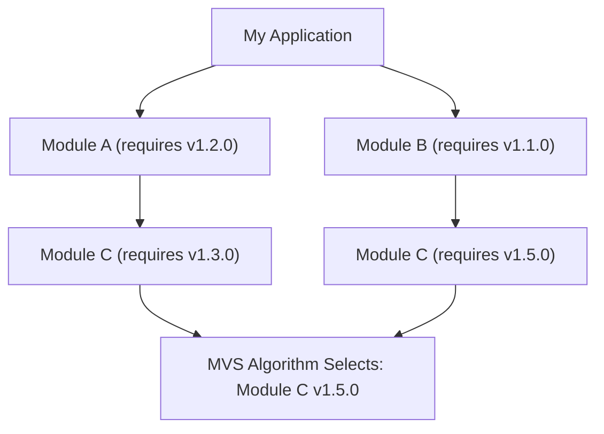
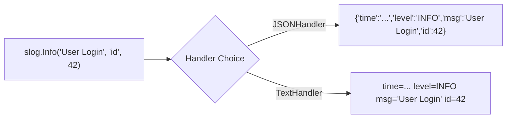

# 🛠️ Standard Library, Modules & Toolchain

## 🎯 Learning Objectives

By the end of this module, you will understand:
- The structure of **Go Modules** (`go.mod`, `go.sum`) and the **Minimal Version Selection (MVS)** algorithm.
- How to manage multi-module local projects using **Go Workspaces (`go.work`)**.
- Modern HTTP routing capabilities introduced in **Go 1.22+** (`net/http`).
- Production logging using the **`log/slog`** structured logging package.
- High-performance streaming data pipelines using **`io`** and **`bufio`**.

---

## 🧠 Core Explanation

### 1. 📦 Go Modules & Minimal Version Selection (MVS)

Go modules provide deterministic, hermetic dependency resolution.



#### Key Files
- **`go.mod`**: Defines the module path, Go language version target, and required dependencies.
- **`go.sum`**: Contains SHA-256 cryptographic checksums of module versions to guarantee build reproducibility and prevent tampering.
- **Minimal Version Selection (MVS)**: Unlike npm or Cargo (which pick the latest compatible semver version), Go's MVS picks the **oldest explicit version** that satisfies all dependency constraints in the graph, preventing unexpected upstream breaking changes.

---

### 2. 🌐 Modern HTTP Server Routing (Go 1.22+)

Go 1.22 revolutionized the standard `net/http` package by introducing **HTTP Method Matching** and **Path Parameter Extraction** directly into `http.ServeMux`:

```go
mux := http.NewServeMux()

// Go 1.22+ Pattern Matching Syntax: "METHOD /path/{parameter}"
mux.HandleFunc("GET /users/{id}", func(w http.ResponseWriter, r *http.Request) {
    userID := r.PathValue("id") // Extract path parameter directly!
    w.Write([]byte("User ID: " + userID))
})
```

---

### 3. 🪵 Structured Logging with `log/slog`

Introduced in Go 1.21, `log/slog` provides fast, structured logging with JSON or Text handlers:



---

### 4. 🌊 Streaming Abstractions: `io.Reader` & `io.Writer`

Go's I/O philosophy revolves around two tiny single-method interfaces:

```go
type Reader interface { Read(p []byte) (n int, err error) }
type Writer interface { Write(p []byte) (n int, err error) }
```

By chaining implementations (`bufio.Reader`, `gzip.Reader`, `crypto.Cipher`), Go processes arbitrary gigabyte streams with fixed, minimal memory buffers using `io.Copy()`.

---

## 💻 Working Examples

### Example 1: Production-Grade HTTP Server with Go 1.22+ Routing & `slog`

```go
package main

import (
	"encoding/json"
	"errors"
	"log/slog"
	"net/http"
	"os"
	"time"
)

// Response DTO
type UserResponse struct {
	ID    string `json:"id"`
	Email string `json:"email"`
}

// Middleware: Structured Logging
func LoggingMiddleware(logger *slog.Logger, next http.Handler) http.Handler {
	return http.HandlerFunc(func(w http.ResponseWriter, r *http.Request) {
		start := time.Now()
		next.ServeHTTP(w, r)
		logger.Info("HTTP Request Processed",
			"method", r.Method,
			"path", r.URL.Path,
			"duration_ms", time.Since(start).Milliseconds(),
		)
	})
}

func main() {
	// Initialize JSON Structured Logger
	logger := slog.New(slog.NewJSONHandler(os.Stdout, nil))

	mux := http.NewServeMux()

	// Go 1.22+ Route Handler with Method & Path Parameter
	mux.HandleFunc("GET /api/v1/users/{id}", func(w http.ResponseWriter, r *http.Request) {
		id := r.PathValue("id")
		if id == "" {
			http.Error(w, "Missing ID", http.StatusBadRequest)
			return
		}

		resp := UserResponse{
			ID:    id,
			Email: "user_" + id + "@example.com",
		}

		w.Header().Set("Content-Type", "application/json")
		json.NewEncoder(w).Encode(resp)
	})

	// Wrap Mux with Middleware
	handler := LoggingMiddleware(logger, mux)

	server := &http.Server{
		Addr:         ":8080",
		Handler:      handler,
		ReadTimeout:  5 * time.Second,
		WriteTimeout: 10 * time.Second,
	}

	logger.Info("Starting HTTP Server", "port", 8080)
	if err := server.ListenAndServe(); err != nil && !errors.Is(err, http.ErrServerClosed) {
		logger.Error("Server failed", "error", err)
	}
}
```

---

### Example 2: Streaming Data Pipeline (`io.Pipe` & `bufio`)

```go
package main

import (
	"bufio"
	"fmt"
	"io"
	"strings"
)

func main() {
	// Create an in-memory Pipe (Writer -> Reader)
	pr, pw := io.Pipe()

	// Writer Goroutine
	go func() {
		defer pw.Close()
		pw.Write([]byte("Line 1: Go Fundamentals\n"))
		pw.Write([]byte("Line 2: Standard Library Streaming\n"))
	}()

	// Reader: Process line by line with zero buffer allocations
	scanner := bufio.NewScanner(pr)
	for scanner.Scan() {
		line := scanner.Text()
		fmt.Println("STREAMED READ:", strings.ToUpper(line))
	}
}
```

---

## ⚠️ Common Pitfalls

1. **Unclosed `http.Response.Body`**:
   Failing to close `resp.Body` prevents TCP socket reuse in HTTP connection pools, leading to file descriptor exhaustion!
   ```go
   resp, err := http.Get("https://api.example.com")
   if err != nil { return err }
   defer resp.Body.Close() // MANDATORY!
   ```
2. **Using `http.DefaultClient`**:
   `http.DefaultClient` has **no timeout**, meaning blocked network calls can hang goroutines indefinitely. Always construct custom `&http.Client{Timeout: 10 * time.Second}`.

---

## 🔀 Language Comparisons

| Feature | Golang | Node.js (npm) | Rust (Cargo) |
|---|---|---|---|
| **Dependency Algorithm** | Minimal Version Selection (MVS) | Max Compatible SemVer | Max Compatible SemVer |
| **Integrity Checks** | `go.sum` (Global Checksum DB) | `package-lock.json` | `Cargo.lock` |
| **HTTP Server** | Built-in production-grade `net/http` | Needs Express / Fastify | Needs Tokio / Axum / Actix |

---

## ✅ Quick Reference / Cheat-Sheet

```bash
# Go Module Management
go mod init mymodule         # Initialize new module
go mod tidy                  # Prune unused dependencies & add missing ones
go work init ./app ./shared  # Initialize Go Workspace for multi-module repo
```

```go
// Go 1.22+ Router Matching
mux.HandleFunc("POST /items", CreateHandler)
mux.HandleFunc("GET /items/{id}", GetHandler)
```

---

## 🚀 Navigation

- [← Module 07: Generics & Type Constraints](./07-generics-and-type-constraints)
- [Next Module: Testing, Benchmarking & Performance Profiling →](./09-testing-profiling-and-benchmarking)
