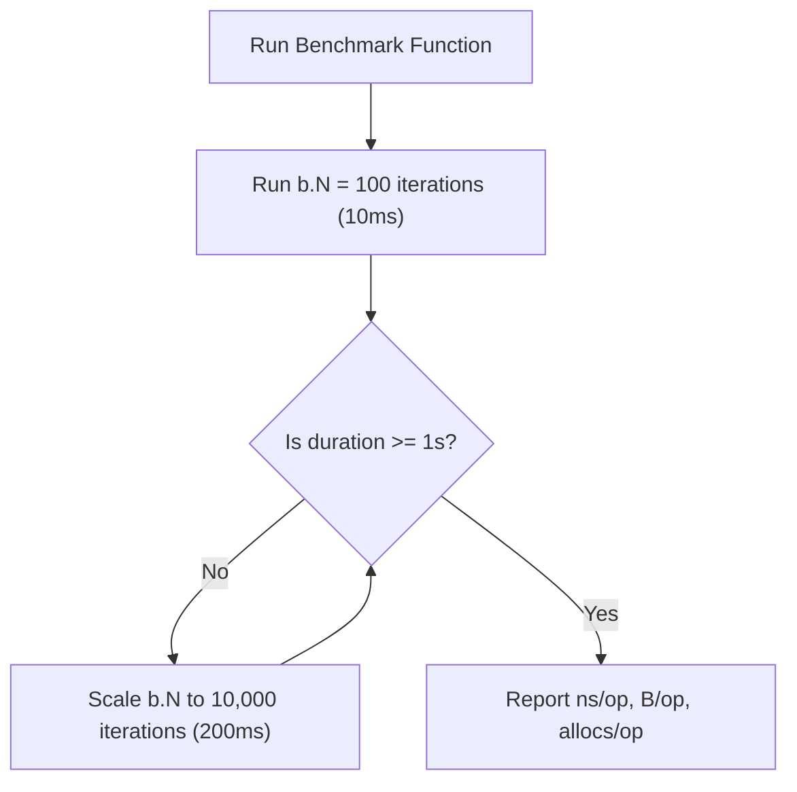
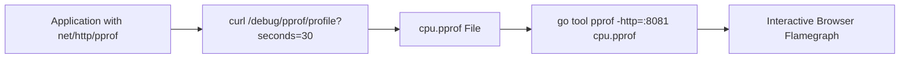

# 🧪 Testing, Benchmarking & Performance Profiling

## 🎯 Learning Objectives

By the end of this module, you will understand:
- How to write idiomatic **Table-Driven Tests** with parallel subtests (`t.Run()`).
- How to write memory allocation micro-benchmarks (`b.N`, `b.ReportAllocs()`).
- How to discover crash bugs using Go's native **Fuzz Testing (`f.Fuzz`)**.
- How the runtime **Data Race Detector (`-race`)** detects concurrent memory access bugs.
- How to profile CPU and Heap memory bottlenecks using **`pprof`** and **Execution Traces**.

---

## 🧠 Core Explanation

### 1. 📋 Table-Driven Testing Pattern

Go favors **Table-Driven Testing** over descriptive test method names. You define a slice of test cases containing inputs and expected outputs, then iterate over them using `t.Run()`:

```go
tests := []struct {
    name     string
    input    int
    expected int
}{
    {"Positive Number", 5, 25},
    {"Zero", 0, 0},
    {"Negative Number", -3, 9},
}
```

---

### 2. ⚡ Benchmarking Mechanics (`testing.B`)

Benchmarking functions take a `*testing.B` receiver. The Go runtime automatically tunes `b.N` (increasing iterations from 100 to 1,000,000+) until the benchmark runs for a statistically stable duration (default 1 second).



- **`b.ResetTimer()`**: Call before the `b.N` loop to discard time spent in setup/initialization.
- **`b.ReportAllocs()`**: Tracks total memory bytes allocated per operation (`B/op`) and heap allocations count (`allocs/op`).

---

### 3. 🚨 Data Race Detector (`-race`)

A **Data Race** occurs when two goroutines access the same memory location concurrently, and at least one of the accesses is a write.

Go includes a built-in race detector based on ThreadSanitizer:
```bash
go test -race ./...
go run -race main.go
```
The race detector instrumentates memory read/write instructions with 64-bit shadow memory checks.
- **Overhead**: Increases memory usage by 5x-10x and execution time by 2x-8x. **Never deploy `-race` binaries to production!**

---

### 4. 📊 Performance Profiling with `pprof`

`pprof` is Go's native profiling tool for CPU, Heap memory, Goroutine blocking, and Mutex contention:



---

## 💻 Working Examples

### Example 1: Table-Driven Test Suite with Subtests

```go
package main

import (
	"errors"
	"testing"
)

func Divide(a, b int) (int, error) {
	if b == 0 {
		return 0, errors.New("cannot divide by zero")
	}
	return a / b, nil
}

func TestDivide(t *testing.T) {
	// Table definition
	tests := []struct {
		name        string
		a, b        int
		wantResult  int
		expectError bool
	}{
		{name: "Valid division", a: 10, b: 2, wantResult: 5, expectError: false},
		{name: "Divide by zero", a: 10, b: 0, wantResult: 0, expectError: true},
		{name: "Negative inputs", a: -12, b: 3, wantResult: -4, expectError: false},
	}

	for _, tt := range tests {
		// Run subtest
		t.Run(tt.name, func(t *testing.T) {
			got, err := Divide(tt.a, tt.b)
			if (err != nil) != tt.expectError {
				t.Fatalf("Divide(%d, %d) unexpected error status: %v", tt.a, tt.b, err)
			}
			if got != tt.wantResult {
				t.Errorf("Divide(%d, %d) = %d; want %d", tt.a, tt.b, got, tt.wantResult)
			}
		})
	}
}
```

---

### Example 2: Allocation Micro-Benchmark (`fmt.Sprintf` vs `strings.Builder`)

```go
package main

import (
	"fmt"
	"strings"
	"testing"
)

// Benchmark fmt.Sprintf concatenation
func BenchmarkSprintf(b *testing.B) {
	b.ReportAllocs()
	for i := 0; i < b.N; i++ {
		_ = fmt.Sprintf("%s:%d", "user_id", i)
	}
}

// Benchmark strings.Builder concatenation
func BenchmarkStringBuilder(b *testing.B) {
	b.ReportAllocs()
	for i := 0; i < b.N; i++ {
		var sb strings.Builder
		sb.WriteString("user_id:")
		sb.WriteString("100")
		_ = sb.String()
	}
}
```

**Run Command**:
```bash
go test -bench=. -benchmem
```

**Sample Output**:
```text
BenchmarkSprintf-8        15204891    78.2 ns/op    16 B/op    2 allocs/op
BenchmarkStringBuilder-8  48201948    24.1 ns/op     8 B/op    1 allocs/op
```

---

### Example 3: Fuzz Testing (`f.Fuzz`)

```go
package main

import (
	"unicode/utf8"
	"testing"
)

func Reverse(s string) string {
	b := []byte(s)
	for i, j := 0, len(b)-1; i < len(b)/2; i, j = i+1, j-1 {
		b[i], b[j] = b[j], b[i]
	}
	return string(b)
}

func FuzzReverse(f *testing.F) {
	// Seed corpus
	f.Add("hello")
	f.Add("world")

	f.Fuzz(func(t *testing.T, orig string) {
		rev := Reverse(orig)
		doubleRev := Reverse(rev)

		if utf8.ValidString(orig) && doubleRev != orig {
			t.Errorf("Reversing twice failed! Orig: %q, DoubleRev: %q", orig, doubleRev)
		}
	})
}
```

**Run Command**:
```bash
go test -fuzz=FuzzReverse -fuzztime=10s
```

---

## ⚠️ Common Pitfalls

1. **Expensive Setup Inside `b.N` Loop**:
   ```go
   func BenchmarkProcess(b *testing.B) {
       // Setup...
       b.ResetTimer() // MANDATORY: Reset timer to exclude setup time!
       for i := 0; i < b.N; i++ {
           Process()
       }
   }
   ```
2. **Missing Parallel Subtest Safety**:
   When using `t.Parallel()` inside table-driven tests, you MUST capture the loop variable locally inside the loop (in Go < 1.22) to prevent subtests from executing against the final loop element.

---

## 🔀 Language Comparisons

| Feature | Golang | Java (JUnit) | Rust (Criterion) |
|---|---|---|---|
| **Built-in Framework** | Native `testing` package | Third-party (JUnit 5) | Built-in `cargo test`, external `criterion` |
| **Benchmarking** | Native `testing.B` | Third-party (JMH) | Benchmark harnesses |
| **Fuzzing** | Native `f.Fuzz` (Go 1.18+) | Third-party (Jazzer) | `cargo-fuzz` (libFuzzer) |
| **Profiling Tooling** | Built-in `pprof` & `trace` | Async-profiler / JProfiler | `perf` / `flamegraph` |

---

## ✅ Quick Reference / Cheat-Sheet

```bash
# Testing & Race Detector
go test -v -race ./...

# Run Benchmarks with Allocation Tracking
go test -bench=. -benchmem -run=^$

# Profile Heap Allocations
go test -bench=. -memprofile=mem.pprof
go tool pprof -http=:8081 mem.pprof

# Run Trace Web Visualization
go test -trace=trace.out
go tool trace trace.out
```

---

## 🚀 Navigation

- [← Module 08: Standard Library & Modules](./08-stdlib-modules-and-toolchain)
- [Next Module: Production Architecture & Language Comparisons →](./10-production-patterns-and-comparisons)
