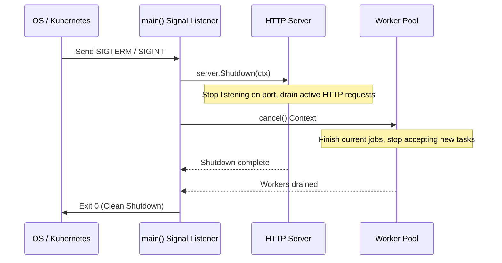
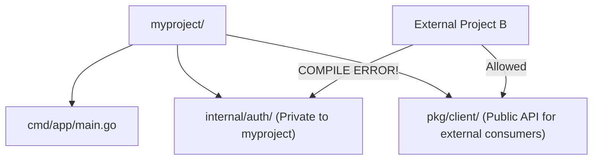

# 🚀 Production Architecture, Idioms & Language Comparisons

## 🎯 Learning Objectives

By the end of this module, you will understand:
- How to implement the **Functional Options Pattern** for clean API constructors.
- How to build robust **Graceful Shutdown** mechanics handling OS signals (`SIGINT`/`SIGTERM`).
- The enforcement rules of the **`internal/` package boundary**.
- How to package Go services into tiny, zero-dependency **`FROM scratch`** Docker containers.
- The definitive comparative tradeoffs between **Go, Rust, Java, and C++**.

---

## 🧠 Core Explanation

### 1. ⚙️ Functional Options Pattern

When constructing complex objects with optional settings, Go avoids constructor overloading (which doesn't exist in Go) or positional parameter proliferation using **Functional Options**:

```go
type Server struct {
    host string
    port int
    timeout time.Duration
}

type Option func(*Server)

func WithPort(p int) Option {
    return func(s *Server) { s.port = p }
}

func NewServer(opts ...Option) *Server {
    s := &Server{host: "localhost", port: 8080, timeout: 30 * time.Second} // Defaults
    for _, opt := range opts { opt(s) }
    return s
}
```

---

### 2. 🛡️ Graceful Shutdown Lifecycle

In production environments (Kubernetes, AWS ECS), containers receive a `SIGTERM` signal before being forcibly terminated (`SIGKILL`). Services must intercept `SIGTERM`, stop accepting new inbound connections, and drain active background tasks within a context deadline:



---

### 3. 📂 Standard Project Layout & `internal/` Boundary

Go enforces a special compile-time access rule for directories named **`internal/`**:
- Any package inside `internal/foo` can ONLY be imported by code inside the parent directory tree where `internal/` resides.
- Third-party projects attempting to import your `internal/` package will fail at **compile time** with an import error!



---

### 4. 🐳 Minimal Docker Containerization (`FROM scratch`)

Because Go compiles into static machine code without requiring a Virtual Machine or runtime interpreter, Go Docker containers can target `scratch` (an empty 0-byte image):

```dockerfile
# Build Stage
FROM golang:1.23-alpine AS builder
WORKDIR /app
COPY go.mod go.sum ./
RUN go mod download
COPY . .
# CGO_ENABLED=0 produces pure static binary
RUN CGO_ENABLED=0 GOOS=linux GOARCH=amd64 go build -ldflags="-w -s" -o server ./cmd/server

# Final Production Stage (Empty Image)
FROM scratch
# Copy CA certificates for HTTPS TLS validation
COPY --from=builder /etc/ssl/certs/ca-certificates.crt /etc/ssl/certs/
COPY --from=builder /app/server /server
EXPOSE 8080
ENTRYPOINT ["/server"]
```

- **Resulting Image Size**: **~10 MB - 15 MB total!**

---

## 💻 Working Examples

### Example 1: Complete Production Service with Functional Options & Graceful Shutdown

```go
package main

import (
	"context"
	"errors"
	"fmt"
	"log/slog"
	"net/http"
	"os"
	"os/signal"
	"syscall"
	"time"
)

// Server Configuration & Functional Options
type Server struct {
	addr    string
	timeout time.Duration
	logger  *slog.Logger
	server  *http.Server
}

type Option func(*Server)

func WithAddr(addr string) Option {
	return func(s *Server) { s.addr = addr }
}

func WithTimeout(d time.Duration) Option {
	return func(s *Server) { s.timeout = d }
}

func NewServer(opts ...Option) *Server {
	s := &Server{
		addr:    ":8080",
		timeout: 10 * time.Second,
		logger:  slog.New(slog.NewJSONHandler(os.Stdout, nil)),
	}
	for _, opt := range opts {
		opt(s)
	}

	mux := http.NewServeMux()
	mux.HandleFunc("GET /health", func(w http.ResponseWriter, r *http.Request) {
		w.WriteHeader(http.StatusOK)
		w.Write([]byte(`{"status":"UP"}`))
	})

	s.server = &http.Server{
		Addr:         s.addr,
		Handler:      mux,
		ReadTimeout:  s.timeout,
		WriteTimeout: s.timeout,
	}
	return s
}

func (s *Server) Start() error {
	// Graceful Shutdown Channel
	shutdownSig := make(chan os.Signal, 1)
	signal.Notify(shutdownSig, os.Interrupt, syscall.SIGTERM)

	// Async Server Start
	go func() {
		s.logger.Info("Server listening", "addr", s.addr)
		if err := s.server.ListenAndServe(); err != nil && !errors.Is(err, http.ErrServerClosed) {
			s.logger.Error("HTTP server failed", "error", err)
		}
	}()

	// Block until signal received
	sig := <-shutdownSig
	s.logger.Info("Shutdown signal received", "signal", sig.String())

	// Create 5-second deadline for active connections to finish
	ctx, cancel := context.WithTimeout(context.Background(), 5*time.Second)
	defer cancel()

	if err := s.server.Shutdown(ctx); err != nil {
		s.logger.Error("Forced server shutdown", "error", err)
		return err
	}

	s.logger.Info("Server shutdown cleanly")
	return nil
}

func main() {
	srv := NewServer(
		WithAddr(":9090"),
		WithTimeout(5*time.Second),
	)
	if err := srv.Start(); err != nil {
		fmt.Println("Error running server:", err)
	}
}
```

---

## 🔀 Language Comparison Matrix

The following matrix provides a senior-level architectural comparison across major systems languages:

| Feature Dimension | Golang | Rust | Java (JVM) | C++ |
|---|---|---|---|---|
| **Primary Goal** | Developer Velocity & Concurrency | Memory Safety without GC & Performance | Enterprise Ecosystem & OOP | Raw Hardware Control & Zero-Overhead |
| **Concurrency Primitive** | CSP (Goroutines & Channels) | Async/Await + Futures (Tokio) | Threads / Virtual Threads (Loom) | pthreads / `std::thread` / Atomics |
| **Memory Management** | Concurrent Tri-Color GC (STW < 1ms) | Compile-time Borrow Checker (No GC) | Generational GC (ZGC / G1GC) | Manual / Smart Pointers (`std::unique_ptr`) |
| **Compilation Speed** | **Ultra-Fast** (Single-pass compiler) | Slow (Deep monomorphization & borrow analysis) | Fast JIT compilation | Slow (Header expansion & template instantiation) |
| **Binary Output** | Single static binary (~10MB) | Single static binary (~5MB) | Jar / War (Requires ~200MB JVM runtime) | Single static / dynamic binary |
| **Learning Curve** | **Low** (25 keywords, simple spec) | High (Ownership, Lifetimes, Borrow Checker) | Medium (Object hierarchies & frameworks) | High (UB rules, pointers, template meta) |
| **Type System** | Static, Structural Interfaces, Generics | Static, Traits, Algebraic Enums, Generics | Static, Nominal Interfaces, Generics | Static, Classes, Templates, Concepts |

---

## ⚠️ Common Pitfalls

1. **Unnecessary CGO Dependency**:
   Importing `C` code (`import "C"`) disables Go's static cross-compilation (`GOOS`/`GOARCH`) and incurs dynamic function call overhead between Go and C stacks. Avoid CGO unless wrapping unavoidable native C libraries.
2. **Ignoring Docker CA Certificates**:
   Building `FROM scratch` without copying `/etc/ssl/certs/ca-certificates.crt` from the builder stage causes all outbound HTTPS network calls to fail with `x509: certificate signed by unknown authority`.

---

## ✅ Quick Reference / Cheat-Sheet

```bash
# Production Static Build Command
CGO_ENABLED=0 GOOS=linux GOARCH=amd64 go build \
  -ldflags="-w -s" \
  -o bin/server ./cmd/server

# Build Flags Explanation:
# -w : Omit DWARF debugging symbol table (reduces binary size by ~30%)
# -s : Omit symbol table and debug information
```

---

## 🚀 Navigation

- [← Module 09: Testing, Benchmarking & Profiling](./09-testing-profiling-and-benchmarking)
- [Return to Curriculum Index 🧭](./index)
