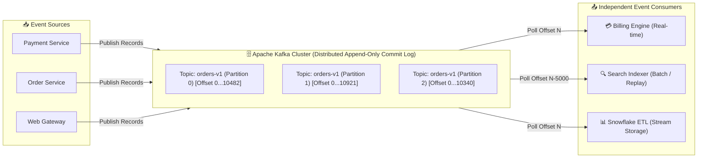

# 🧭 Apache Kafka — Overview & Curriculum

## 🎯 What Problem Apache Kafka Solves

In modern distributed systems, services need to communicate state changes asynchronously with low latency, massive throughput, and fault tolerance. Traditional point-to-point RPCs create tight coupling, and traditional message brokers (like RabbitMQ or ActiveMQ) treat messages as transient entities—deleting them once acknowledged. This model breaks down when multiple downstream systems (data warehouses, search indexes, fraud detectors, real-time analytics engines) need to consume the same event stream independently at their own pace, re-process historical data, or recover from outages without missing state transitions.

**Apache Kafka** solves this by fundamentally redefining messaging as a **distributed, immutable append-only commit log**. Instead of ephemeral queues, Kafka provides persistent event streams stored on disk across a cluster of brokers. Producers publish events to topics, and consumers read from log offsets. Because the log is immutable and retained according to configurable retention policies, any number of independent consumers can read the exact same data stream concurrently, rewind to historic points in time, or process real-time streams—all with sequential disk I/O performance reaching millions of events per second.

---

## 📋 Assumed Background

This guide is written specifically for **Senior Software Engineers, Systems Engineers, and Tech Leads**. 

- **What we assume you know**: OS fundamentals (virtual memory, page cache, file descriptors, syscalls), general CS distributed systems principles (consensus, leader-follower replication, CAP theorem, TCP/IP networking), basic concurrency (threads, locking, event loops), and standard system architecture patterns (REST, gRPC, relational & NoSQL databases).
- **What we do NOT assume**: Any prior operational or development experience with Apache Kafka, Zookeeper, or event-driven stream processing engines.

---

## 🗺️ Curriculum Roadmap

This curriculum is structured to take you from core log storage mechanics up to advanced stateful stream processing, transactional semantics, and enterprise production operations.

| Module | Title | Primary Focus & Core Concepts | Time Estimate |
| :--- | :--- | :--- | :--- |
| **[01. Storage Engine](./01-core-architecture-and-storage)** | 🧱 Core Architecture & Storage | Distributed commit logs, topics, partitions, segments, index files, zero-copy I/O (`sendfile`), OS page cache, log compaction. | 35 mins |
| **[02. Consensus & Metadata](./02-kraft-and-cluster-consensus)** | 👑 KRaft & Cluster Metadata | KRaft consensus protocol, Controller quorum, `@metadata` log, controller failover, post-ZooKeeper architecture (Kafka 4.x). | 30 mins |
| **[03. Producers](./03-producers-and-partitioning)** | 📥 Producers & Partitioning | Producer architecture, `RecordAccumulator`, memory pools, batching, compression (LZ4/ZSTD), partitioning strategies, idempotent producers. | 35 mins |
| **[04. Consumers](./04-consumers-and-consumer-groups)** | 📤 Consumers & Consumer Groups | Consumer group protocol, partition assignment (Eager, Cooperative, KIP-848 Broker-Side Assignor), offset tracking (`__consumer_offsets`), poll loop, heartbeats. | 40 mins |
| **[05. Replication](./05-replication-and-fault-tolerance)** | 🔄 Replication & Fault Tolerance | Partition leaders & followers, In-Sync Replicas (ISR), High Watermark (HW), Log End Offset (LEO), Leader Epochs, unclean leader election. | 35 mins |
| **[06. Transactions](./06-transactions-and-exactly-once)** | 🔐 Transactions & Exactly-Once | Delivery semantics (At-Most-Once, At-Least-Once, Exactly-Once), Transaction Coordinator, 2PC over logs, `read_committed` isolation, Zombie fencing. | 40 mins |
| **[07. Integration & Governance](./07-kafka-connect-and-schema-evolution)** | 🔌 Kafka Connect & Schema Registry | Source/Sink Connectors, Connect Workers, Schema Registry, SerDe (Avro/Protobuf), Schema compatibility rules (Backward, Forward, Full). | 35 mins |
| **[08. Stream Processing](./08-kafka-streams-and-stateful-processing)** | 🌊 Kafka Streams & Stateful Processing | Stream-Table Duality (`KStream` vs `KTable`), RocksDB local state stores, changelog topics, windowing (Tumbling/Hopping/Sliding), joins, late data. | 45 mins |
| **[09. Operations & Tuning](./09-production-operations-and-tuning)** | 🛠️ Production Operations & Tuning | OS page cache tuning, GC (G1/ZGC), critical JMX metrics (Lag, Under-Replicated Partitions), SASL/mTLS security, Tiered Storage architecture. | 40 mins |
| **[10. Ecosystem & Design](./10-comparisons-and-architectural-patterns)** | 🔀 Comparisons & System Design | Kafka vs RabbitMQ vs Pulsar vs Redpanda vs WarpStream, Change Data Capture (Debezium), Outbox Pattern, Event Sourcing & CQRS. | 35 mins |

**Total Estimated Completion Time**: ~6 hours of detailed, hands-on self-study.

---

## 📖 Core Glossary

Bookmark these foundational terms before diving into Module 1:

- **Broker**: A single Kafka daemon server process running in a cluster. Responsible for receiving events, writing them to disk segments, serving read requests to consumers, and replicating logs.
- **Topic**: A logical stream or category to which records are published. Analagous to a table in a relational database.
- **Partition**: A single ordered, immutable log sequence of records belonging to a topic. Topics are split into 1 or more partitions to distribute storage and processing throughput across multiple brokers.
- **Offset**: A monotonic integer assigned sequentially to each record within a partition. It acts as the immutable coordinate and logical offset of the message in the partition.
- **Record (Message)**: The fundamental unit of data in Kafka. Consists of a Key, Value, Timestamp, Headers, and Metadata (offset, partition, payload size).
- **ISR (In-Sync Replicas)**: The subset of partition replica brokers that are actively keeping up with the leader broker within a configurable time window (`replica.lag.time.max.ms`).
- **HW (High Watermark)**: The highest offset across a partition that has been successfully replicated to all members of the ISR. Consumers can only read records up to the High Watermark.
- **KRaft (Kafka Raft)**: The built-in consensus protocol that manages cluster metadata, leader elections, and topic metadata natively within Kafka, replacing external ZooKeeper dependencies entirely in Kafka 4.x.
- **Consumer Group**: A named set of consumer instances working cooperatively to consume data from a topic. Each partition in the topic is assigned to exactly one consumer instance within the group at any given time.
- **Log Segment**: The underlying binary disk file (`.log`) where messages are stored on the broker filesystem, alongside sparse index files (`.index`, `.timeindex`).

---

## 🚀 Getting Started

Begin with **[Module 01: Core Architecture & Storage Engine](./01-core-architecture-and-storage)** to learn how Kafka achieves gigabyte-per-second throughput by leveraging sequential disk access, OS page cache, and zero-copy data transfer.
