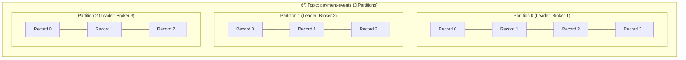
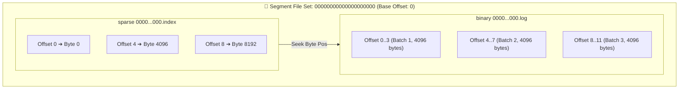
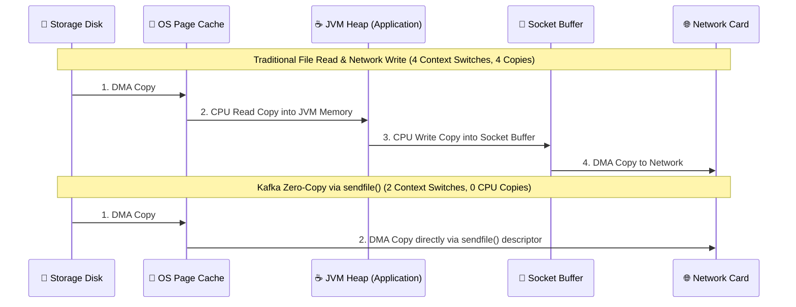
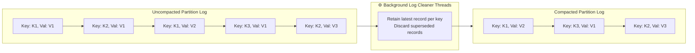

# 🧱 Core Architecture & Storage Engine

## 🎯 Learning Objectives

By the end of this module, you will be able to:
- Explain why Kafka achieves enterprise-grade I/O throughput using sequential disk writes and the Linux Kernel Page Cache.
- Deconstruct the filesystem layout of a Kafka broker down to raw `.log`, `.index`, and `.timeindex` segment files.
- Contrast traditional random-access disk I/O (B-Trees) with Kafka's append-only commit log storage architecture.
- Trace how zero-copy transfer (`sendfile`) eliminates CPU copy context switches between disk storage and network sockets.
- Configure log retention, segment rolling rules, and log compaction for state-reconstruction workloads.

---

## 💡 Core Explanation

### 1. Topics, Partitions, and the Append-Only Commit Log

In Kafka, data is organized into **Topics**. However, a topic is purely a logical abstraction. Physically, a topic is divided into one or more **Partitions**.

A partition is an **ordered, immutable, append-only sequence of records**. 



Key guarantees of this storage model:
1. **Strict Total Ordering Within a Partition**: Record ordering is guaranteed *only* within a single partition. There is no global order across multiple partitions.
2. **Monotonic Offsets**: Every record appended to a partition is assigned a strictly increasing 64-bit integer called an **Offset**. Offsets are never reused or changed.
3. **Immutable Writes**: Once a record is written to a partition, it cannot be modified in place. Deletions occur only through background log retention routines.

### 2. Physical File System Layout & Log Segments

Brokers store partition data on disk in directory trees named `<topic>-<partition_id>`. For example, partition 0 of topic `orders` lives in a directory called `orders-0/`.

Because a single log partition can grow to terabytes in size, Kafka breaks the log into smaller **Log Segments**. A segment consists of three primary files:

1. **`00000000000000000000.log`**: The binary data file containing raw record batches.
2. **`00000000000000000000.index`**: A memory-mapped sparse index mapping logical record offsets to absolute physical byte positions within the `.log` file.
3. **`00000000000000000000.timeindex`**: A sparse index mapping timestamps to offsets, enabling fast time-based record lookups (`offsetsForTimes`).

The filename of a segment corresponds to the **base offset**—the offset of the first record contained in that segment padded to 20 digits.



#### Why Sparse Indexing Matters
Traditional databases build dense indexes (an entry for every single primary key), which consumes massive RAM. Kafka uses **Sparse Indexing**: an index entry is written only after a configurable byte threshold (`index.interval.bytes`, default 4KB) of records are written to the `.log` file.

When a consumer requests offset `6`:
1. Kafka performs a fast in-memory binary search on the `.index` file to find the highest index entry $\le 6$ (Offset `4` $\rightarrow$ Byte `4096`).
2. Kafka seeks directly to Byte `4096` in the `.log` file.
3. Kafka scans sequentially forward from Byte `4096` until it reaches Offset `6`.

This keeps memory requirements for broker log indexes extremely small—allowing millions of partitions to fit in memory.

---

### 3. High Performance Mechanical Engineering: Page Cache & Zero-Copy

A common misconception is that Kafka relies heavily on Java heap space or custom memory caches to achieve high performance. In reality, Kafka's storage architecture delegates memory management to the **Linux Kernel Page Cache**.

#### Sequential Disk Access vs. Random Access
Modern magnetic disks (HDDs) and SSDs perform orders of magnitude better under sequential read/write patterns than random access. Sequential disk I/O often matches network throughput limits (100MB/s–1GB/s+). By restricting all writes to appending to the active log segment, Kafka completely eliminates disk seek penalties.

```
Disk Performance Comparison:
- Random Disk I/O (B-Tree index update):   ~100 - 200 I/O operations/sec (Seek bound)
- Sequential Disk I/O (Kafka Append Log): ~100,000+ records/sec (Bus / DMA bound)
```

#### Traditional vs. Zero-Copy `sendfile` Network Paths
When a standard database serves data to a network client, data undergoes 4 context switches and 3 memory buffer copies across user space and kernel space.



Kafka utilizes Java's `FileChannel.transferTo()`, which exposes the Linux `sendfile()` system call. Data moves **directly from the OS Page Cache to the Network Interface Card (NIC) via Direct Memory Access (DMA)**, completely bypassing the JVM heap!

Benefits of Zero-Copy:
- **Zero JVM GC Overhead**: Data packets never enter Java memory, eliminating garbage collection pauses.
- **Extreme Memory Efficiency**: If 1,000 consumers read the same partition simultaneously, the OS Page Cache serves all 1,000 requests from the *exact same physical memory page* without copying data into user space even once.

---

### 4. Log Compaction Mechanics

By default, Kafka deletes segments when they exceed time (`log.retention.hours=168`) or size (`log.retention.bytes`). However, for state-reconstruction workloads (e.g. user profile updates, database CDC streams), Kafka provides **Log Compaction** (`cleanup.policy=compact`).

In a compacted topic, Kafka guarantees that it will retain at least the **last known value for every message key** within a partition log.



#### Tombstones
To delete a key entirely in a compacted topic, a producer writes a **Tombstone** record: a record with key `K` and a `null` value. During compaction, the cleaner retains the tombstone for a configurable grace period (`delete.retention.ms`) to allow consumers to observe the deletion, before purging it from disk completely.

---

## 🛠️ Working Examples & Hands-On Commands

### 1. Inspecting Partition Directories on the Broker Filesystem

Run the following inside a Kafka broker container or host to view the physical segment breakdown:

```bash
# List physical storage files for topic 'order-events' partition 0
ls -la /var/lib/kafka/data/order-events-0/

# Output:
# -rw-r--r-- 1 kafka kafka 10485760 Jul 23 01:00 00000000000000000000.index
# -rw-r--r-- 1 kafka kafka 1073741824 Jul 23 01:00 00000000000000000000.log
# -rw-r--r-- 1 kafka kafka 10485756 Jul 23 01:00 00000000000000000000.timeindex
# -rw-r--r-- 1 kafka kafka       10 Jul 23 01:00 leader-epoch-checkpoint
```

### 2. Dumping and Parsing Raw Segment Files

Kafka includes a CLI tool (`DumpLogSegments`) to inspect raw log entries and sparse index contents:

```bash
# Dump raw record batch headers and payloads from a log segment
kafka-run-class.sh kafka.tools.DumpLogSegments \
  --files /var/lib/kafka/data/order-events-0/00000000000000000000.log \
  --print-data-log

# Dump index mapping (Offset -> Position)
kafka-run-class.sh kafka.tools.DumpLogSegments \
  --files /var/lib/kafka/data/order-events-0/00000000000000000000.index \
  --verify-index-only
```

Example output snippet from `DumpLogSegments`:
```text
Starting dump of log /var/lib/kafka/data/order-events-0/00000000000000000000.log
baseOffset: 0 lastOffset: 3 count: 4 baseSequence: 0 producerId: 1002 producerEpoch: 0 partitionLeaderEpoch: 1 isTransactional: false position: 0 CreateTime: 1784770000000 size: 284 magic: 2 compresscodec: LZ4 crc: 394821034 isvalid: true
| offset: 0 isValid: true crc: null payload: {"order_id": "ORD-9901", "amount": 49.99}
| offset: 1 isValid: true crc: null payload: {"order_id": "ORD-9902", "amount": 12.50}
```

### 3. Topic Configuration Parameters for Storage Engine

```bash
# Create a compacted topic with 512MB max segment size
kafka-topics.sh --bootstrap-server localhost:9092 \
  --create --topic customer-profiles \
  --partitions 6 \
  --replication-factor 3 \
  --config cleanup.policy=compact \
  --config segment.bytes=536870912 \
  --config min.cleanable.dirty.ratio=0.5 \
  --config delete.retention.ms=86400000
```

---

## ⚠️ Common Pitfalls & Misconceptions

1. **Myth: Kafka requires expensive NVMe SSDs to perform well.**
   *Reality*: Because Kafka performs sequential I/O and relies heavily on the Linux Page Cache, multi-disk SATA HDDs in RAID 10 often match or beat single SSD performance for pure log append throughput at a fraction of the cost.
2. **Pitfall: Creating tens of thousands of partitions per broker.**
   *Reality*: Each partition corresponds to physical file handles (`.log`, `.index`, `.timeindex`) and metadata overhead in memory. Having too many partitions per broker (>4,000 per broker) causes high end-to-end latency, slow controller failover, and file handle exhaustion (`Too many open files`).
3. **Misconception: Log Compaction runs synchronously in real time.**
   *Reality*: Compaction is performed asynchronously in the background by `CleanerThread` workers. A topic configured with `cleanup.policy=compact` will still contain duplicate keys in its active (unclosed) segment until segments roll over and dirty ratio thresholds are met.

---

## 🔀 Structural Comparisons

| Property | Traditional RDBMS (B-Tree Index) | Traditional Message Queue (RabbitMQ) | Apache Kafka Commit Log |
| :--- | :--- | :--- | :--- |
| **Primary Storage Structure** | Balanced B+ Tree / LSM Tree | Transient RAM queues + disk paging | Immutable Append-Only Segment Logs |
| **Access Pattern** | Random Read / Write | Queue Push / Pop | Sequential Append / Linear Scan |
| **Data Lifecycle** | Mutable (In-place updates) | Deleted immediately upon ACK | Retained by time, size, or compaction |
| **Consumer Reading Model** | Query execution engine | Destructive dequeue | Non-destructive offset read |
| **Network Read Efficiency** | App layer buffer copies | App layer buffer copies | Zero-copy Kernel `sendfile()` |

---

## ✅ Quick Reference / Cheat-Sheet

```text
Log Directory:     /var/lib/kafka/data/<topic>-<partition_id>/
Active Segment:    The current .log file receiving appends.
Segment Roll:      Occurs when segment.bytes (default 1GB) or segment.ms (default 7 days) is hit.
Index Interval:    index.interval.bytes (default 4096) controls sparse index resolution.

Key Broker Configs:
  log.dirs=/var/lib/kafka/data              # Storage mount points (can specify CSV for multiple disks)
  log.segment.bytes=1073741824              # 1 GB per segment file
  log.retention.hours=168                   # Delete segments older than 7 days
  log.cleaner.threads=2                     # Parallel threads dedicated to log compaction
```

---

[← Previous](./00-index.mdx) | [Index](./00-index.mdx) | [Next →](./02-kraft-and-cluster-consensus)
