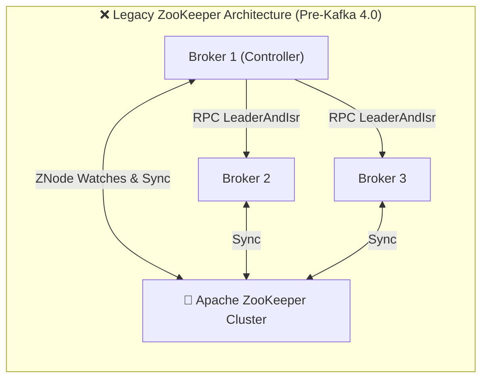
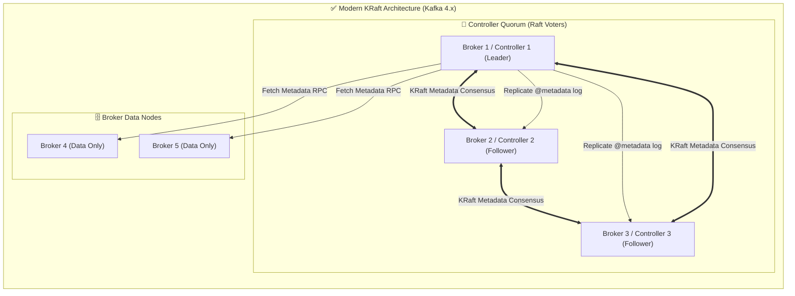
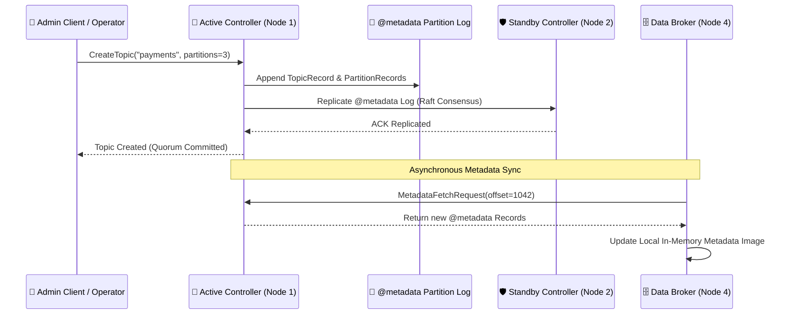
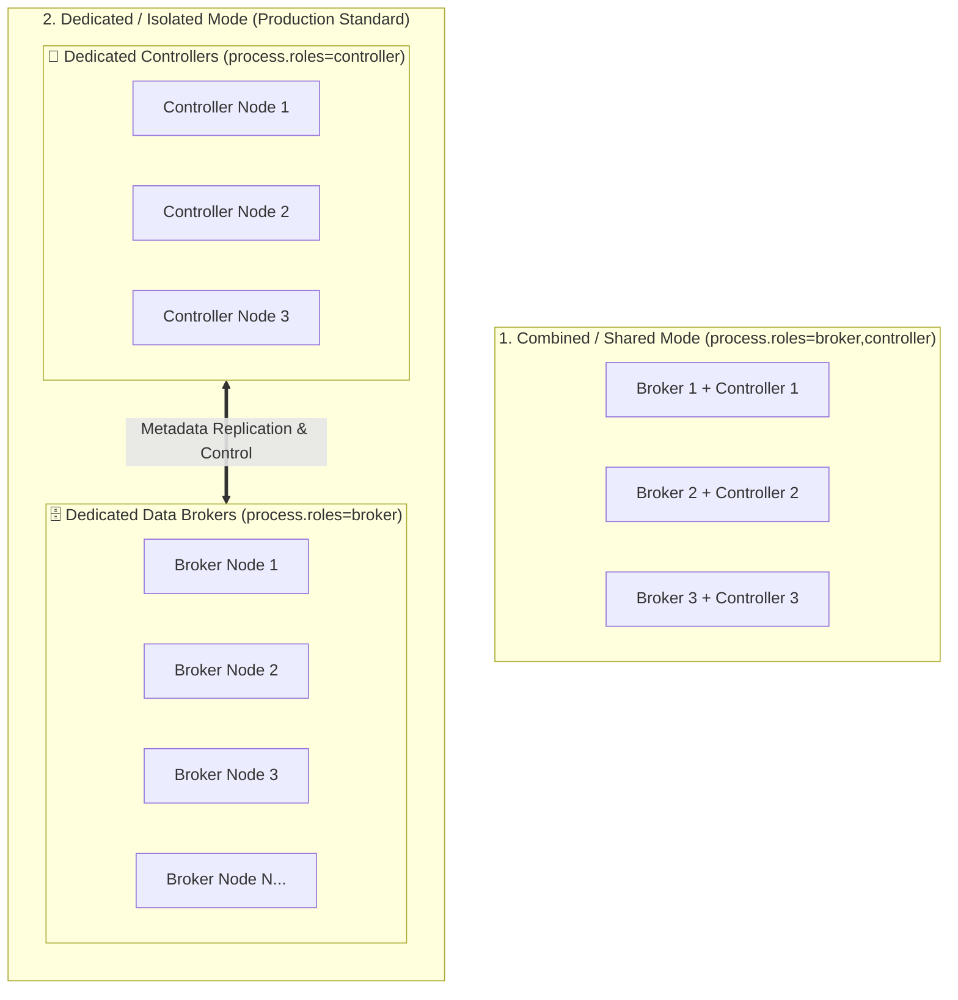

# 👑 KRaft & Cluster Consensus

## 🎯 Learning Objectives

By the end of this module, you will be able to:
- Contrast legacy ZooKeeper-based cluster metadata management with modern KRaft (Kafka Raft) consensus.
- Explain the role of the Active Controller, Controller Quorum, and metadata log (`@metadata`).
- Describe how metadata updates propagate to broker nodes via event-driven log replication.
- Format a new KRaft cluster, configure quorum voters, and inspect cluster metadata state.
- Diagnose controller failover scenarios and quorum split-brain prevention mechanics.

---

## 💡 Core Explanation

### 1. The Evolution: Why ZooKeeper Was Replaced by KRaft

Historically (Kafka 0.8 through 3.x), Apache Kafka relied on **Apache ZooKeeper** to store cluster metadata (topic configs, partition replica assignments, ACLs) and to elect a single broker as the **Controller**.



#### Why ZooKeeper Created System Bottlenecks:
1. **Dual State Problem**: Metadata existed in two places—ZooKeeper's ZNode tree and the active Controller broker's RAM. Syncing state across both engines was complex and error-prone.
2. **Metadata Scaling Limits**: As clusters scaled to hundreds of thousands of partitions, ZooKeeper watches overflowed. Failover of the Controller required reloading all cluster state from ZooKeeper, taking **minutes or hours**.
3. **Operational Complexity**: Administrators had to manage, monitor, and secure two separate distributed systems (ZooKeeper + Kafka).

#### The KRaft Solution (Kafka 4.x Standard)
In **Apache Kafka 4.x**, ZooKeeper has been **completely removed**. Cluster consensus and metadata management are performed natively by Kafka brokers using a customized implementation of the Raft consensus algorithm called **KRaft** (Kafka Raft Metadata Mode - KIP-500).



---

### 2. KRaft Architecture & The `@metadata` Partition

Under KRaft, metadata is no longer stored in hierarchical tree nodes. Instead, metadata is stored in an internal, single-partition Kafka topic called **`@metadata`**.

#### 1. The Active Controller (Raft Leader)
The controller quorum elects an **Active Controller** using Raft consensus rules:
- The Active Controller handles all metadata mutation requests (e.g. `CreateTopics`, `DeleteTopics`, `AlterPartition`).
- It appends metadata records directly to its local `@metadata` partition log.

#### 2. Metadata Records
Every metadata change is an event record written to the `@metadata` log:
- `RegisterBrokerRecord`: Broker registration and liveness heartbeat.
- `TopicRecord`: Topic creation metadata.
- `PartitionRecord`: Partition replica assignment and current Leader/ISR state.
- `ConfigRecord`: Dynamic configuration updates.

#### 3. Event-Driven Metadata Propagation
Other controllers (standbys) and data brokers continuously fetch records from the Active Controller's `@metadata` log—just like regular Kafka consumers polling a topic!



#### Why KRaft Provides Sub-Second Failover
Because all controllers and data brokers maintain an **active, memory-mapped metadata image** continuously updated by tailing the `@metadata` log:
- When the Active Controller crashes, the quorum elects a new leader in **milliseconds**.
- The new leader already has 100% of the metadata in memory—**zero loading time required!**

---

### 3. Controller Modes: Shared vs. Isolated Roles

Kafka brokers can be configured to run in one of two role configurations (`process.roles`):

1. **Combined / Shared Mode (`process.roles=broker,controller`)**:
   A single process acts as both a data broker (handling client topic I/O) and a controller quorum voter. Ideal for small-to-medium clusters or local development.
2. **Isolated Node Mode (`process.roles=controller` or `process.roles=broker`)**:
   Dedicated controller nodes handle cluster consensus only (no user topic storage), while dedicated broker nodes handle data storage. Mandatory for high-throughput enterprise production clusters.



```text
Production Node Layout (Isolated Roles):
- 3 Dedicated Controller Nodes (process.roles=controller) -> Lightweight, CPU/RAM optimized.
- N Data Broker Nodes (process.roles=broker)               -> Disk I/O & Network throughput optimized.
```

---

## 🛠️ Working Examples & Hands-On Commands

### 1. Formatting a KRaft Cluster (Generating Cluster ID)

Before starting a KRaft cluster, a unique Cluster UUID must be generated and applied to format the metadata log directory on all nodes:

```bash
# Step 1: Generate a unique Cluster ID
export KAFKA_CLUSTER_ID=$(kafka-storage.sh random-cluster-id)
echo "Generated Cluster ID: $KAFKA_CLUSTER_ID"
# Output example: MkU3OEVBNTcwQTE0NENBQU

# Step 2: Format the storage directories for a KRaft node
kafka-storage.sh format \
  --cluster-id $KAFKA_CLUSTER_ID \
  --config /etc/kafka/kraft-broker.properties
```

### 2. Single-Node Combined KRaft Config (`server.properties`)

```properties
# Process role definition (combined broker and controller)
process.roles=broker,controller

# Unique Node ID (replaces broker.id)
node.id=1

# Quorum Voter list (NodeID@Host:Port)
controller.quorum.voters=1@localhost:9093

# Network Listeners
listeners=PLAINTEXT://localhost:9092,CONTROLLER://localhost:9093
inter.broker.listener.name=PLAINTEXT
controller.listener.names=CONTROLLER

# Storage directory
log.dirs=/var/lib/kafka/kraft-combined-logs
```

### 3. Dedicated Controller Node Config (`kraft-controller.properties`)

```properties
# Process role definition (Controller ONLY)
process.roles=controller

node.id=1
controller.quorum.voters=1@ctrl1.internal:9093,2@ctrl2.internal:9093,3@ctrl3.internal:9093

listeners=CONTROLLER://ctrl1.internal:9093
controller.listener.names=CONTROLLER

log.dirs=/var/lib/kafka/kraft-controller-logs
```

### 4. Inspecting Quorum Status via CLI

Kafka provides the `kafka-metadata-quorum.sh` tool to monitor KRaft quorum health:

```bash
# Describe quorum status across voters
kafka-metadata-quorum.sh --bootstrap-server localhost:9092 describe --status
```

Example Output:
```text
ClusterId:              MkU3OEVBNTcwQTE0NENBQU
LeaderId:               1
LeaderEpoch:            4
HighWatermark:          12492
MaxFollowerLag:         0
MaxFollowerLagTimeMs:   12
CurrentVoters:          [{"id": 1, "dataEndpoint": "ctrl1:9093"}, {"id": 2, "dataEndpoint": "ctrl2:9093"}, {"id": 3, "dataEndpoint": "ctrl3:9093"}]
```

---

## ⚠️ Common Pitfalls & Misconceptions

1. **Pitfall: Deploying an Even Number of Controller Voters.**
   *Reality*: KRaft requires a majority vote ($Q = \lfloor N/2 \rfloor + 1$) to elect a leader and commit metadata. Deploying 4 controllers requires 3 nodes for a quorum—meaning it can only tolerate 1 failure, the exact same fault tolerance as a 3-node cluster! Always deploy an odd number of controllers (3 or 5).
2. **Misconception: Data brokers write data to the `@metadata` partition.**
   *Reality*: Only the Active Controller writes to `@metadata`. Data brokers read from `@metadata` to update their internal lookup tables.
3. **Pitfall: Formatting nodes with different Cluster IDs.**
   *Reality*: If you run `kafka-storage.sh format` with different generated Cluster IDs on nodes intended for the same cluster, nodes will reject connections with a `ClusterAuthorizationException` or `InconsistentClusterIdException`.

---

## 🔀 Structural Comparisons

| Feature | Legacy ZooKeeper Mode (Kafka < 4.0) | Modern KRaft Mode (Kafka 4.x Standard) |
| :--- | :--- | :--- |
| **Consensus Engine** | External Apache ZooKeeper cluster | Internal Raft implementation (KRaft) |
| **Metadata Storage** | ZNode Tree structure in ZooKeeper | Internal `@metadata` Kafka partition log |
| **Controller Failover Time** | Seconds to Minutes (ZNode reload) | Milliseconds (In-memory metadata image) |
| **Partition Scale Limit** | ~200,000 partitions per cluster | 1,000,000+ partitions per cluster |
| **Operational Overhead** | High (Managed 2 separate software stacks) | Low (Single binary, unified configuration) |

---

## ✅ Quick Reference / Cheat-Sheet

```text
Cluster ID Command:    kafka-storage.sh random-cluster-id
Directory Formatting:  kafka-storage.sh format -t <CLUSTER_ID> -c <CONFIG_FILE>
Quorum Status Tool:    kafka-metadata-quorum.sh --bootstrap-server <HOST:PORT> describe --status

Crucial KRaft Broker Configs:
  process.roles=controller,broker            # Roles assigned to this node
  node.id=1                                 # Unique integer node identifier
  controller.quorum.voters=1@h1:9093,2@h2:9093,3@h3:9093  # Voting quorum endpoints
  controller.listener.names=CONTROLLER       # Listener name dedicated to controller traffic
```

---

[← Previous](./01-core-architecture-and-storage) | [Index](./00-index.mdx) | [Next →](./03-producers-and-partitioning)
