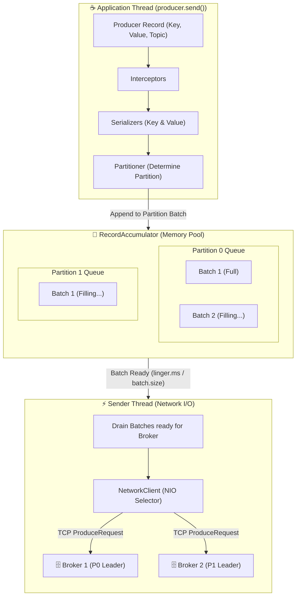
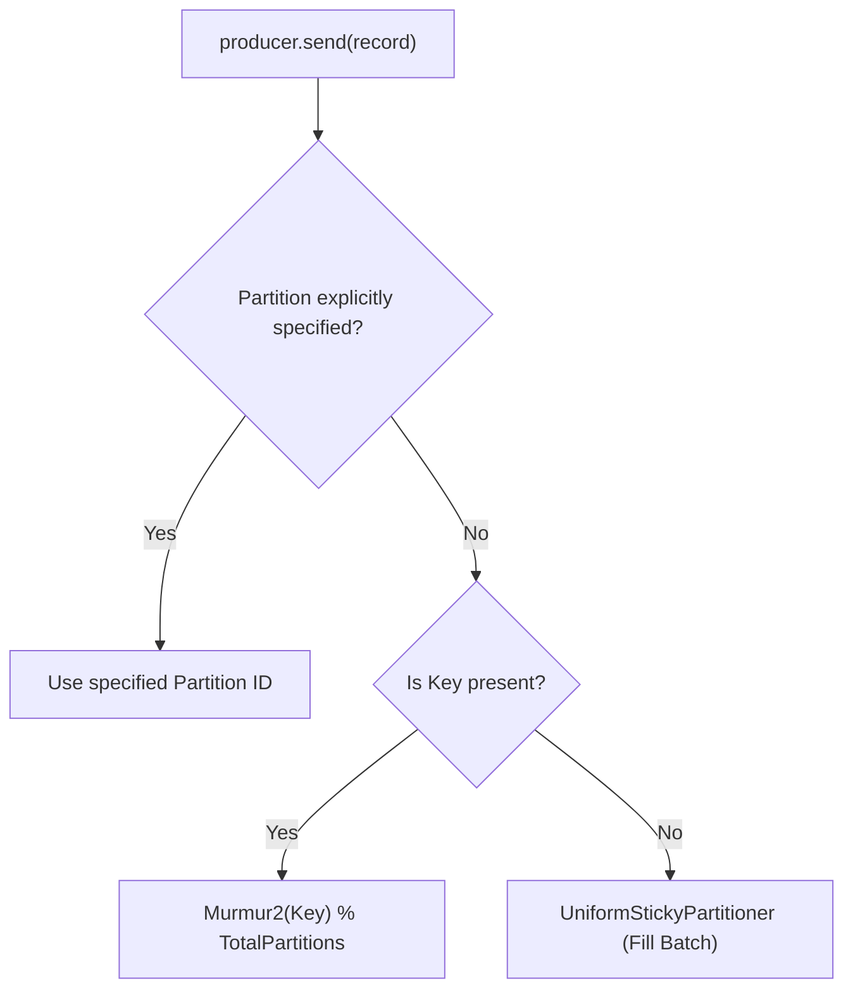
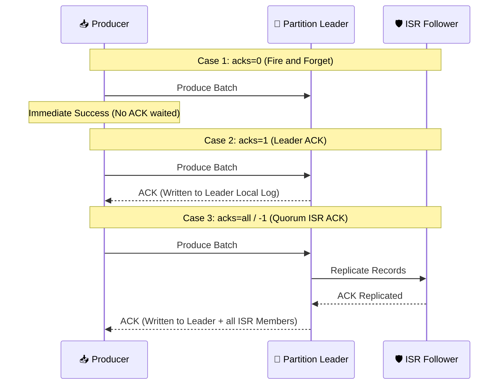
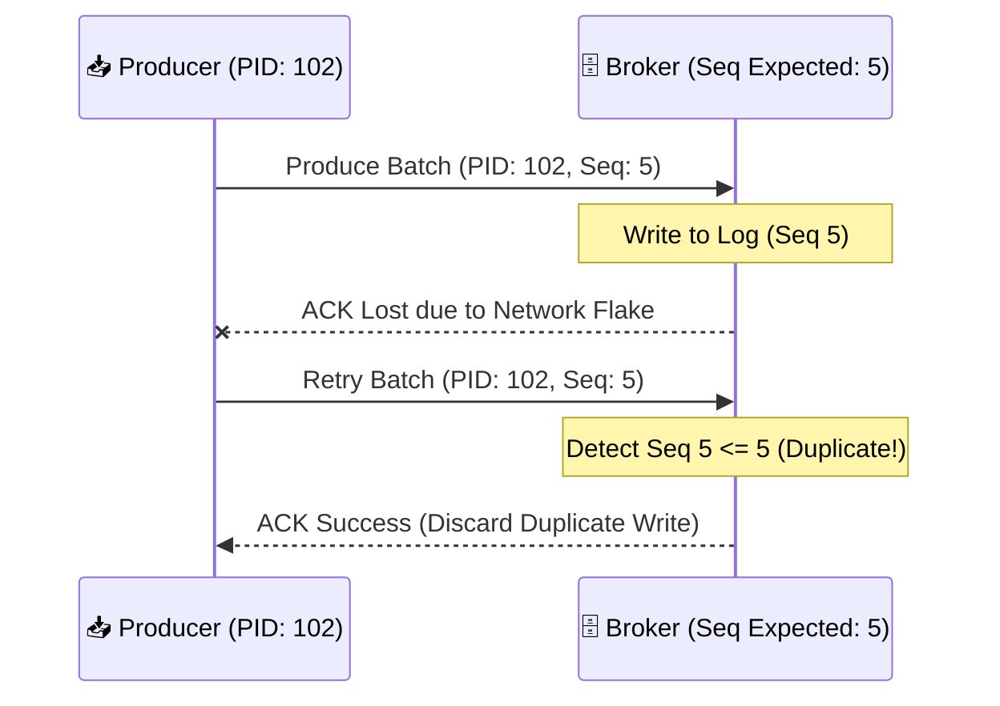

# 📥 Producers & Partitioning Strategies

## 🎯 Learning Objectives

By the end of this module, you will be able to:
- Deconstruct the internal execution thread model of `KafkaProducer` (`Main Thread` vs `Sender Thread`).
- Tune `RecordAccumulator` parameters (`batch.size`, `linger.ms`, `buffer.memory`) to maximize throughput and control latency.
- Evaluate compression algorithms (Snappy, LZ4, ZSTD) for different workload characteristics.
- Select and implement partitioning strategies (Default Murmur2, Sticky Partitioner, Custom Partitioner).
- Configure producers for zero data loss (`acks=all`) and exactly-once duplicate prevention (`enable.idempotence=true`).

---

## 💡 Core Explanation

### 1. KafkaProducer Internal Thread Architecture

A common misconception is that calling `producer.send()` immediately issues a network socket call to the Kafka broker. In reality, `KafkaProducer` is an **asynchronous, memory-buffered engine** operating across two decoupled threads:

1. **Application Thread (Main Thread)**: Intercepts records, serializes keys/values, evaluates partition assignments, and appends records into an in-memory queue (`RecordAccumulator`).
2. **Sender Thread (Background I/O Thread)**: Drains batches from `RecordAccumulator`, constructs broker-specific Produce Requests, and executes non-blocking socket I/O over TCP.



#### Memory Management & `BufferPool`
To prevent Garbage Collection (GC) pressure caused by constantly allocating and freeing byte arrays during high throughput, `RecordAccumulator` allocates a fixed pool of off-heap/direct memory buffers governed by `buffer.memory` (default 32MB).

If the application produces records faster than the `Sender` thread can transmit them to brokers, `producer.send()` will block for up to `max.block.ms` (default 60 seconds) before throwing a `TimeoutException`.

---

### 2. Batching Mechanics & Latency/Throughput Tuning

Producer batching is governed by two crucial configurations:

- **`batch.size`**: The maximum size in bytes allocated for a single batch per partition (default 16 KB).
- **`linger.ms`**: The maximum amount of time the `Sender` thread will wait for additional records to arrive before transmitting an incomplete batch (default 0 ms).

```text
Tradeoff Matrix:
- Low Latency Focus:  linger.ms=0           -> Transmit batches immediately (Lower throughput, higher CPU)
- High Throughput:    linger.ms=10-50ms     -> Wait to fill batch.size (Higher compression ratio, massive throughput)
                      batch.size=131072 (128KB)
```

---

### 3. Compression Algorithms: Snappy vs. LZ4 vs. ZSTD

Kafka compresses data at the **batch level** on the producer before sending it over the network. Compression stays compressed on the broker disk, and is only decompressed when consumed by the client!


| Algorithm | Compression Ratio | CPU Overhead (Producer) | CPU Overhead (Consumer) | Best Use Case |
| :--- | :--- | :--- | :--- | :--- |
| **None** | 1.0x | None | None | Microsecond local networks |
| **Snappy** | Moderate (~2.5x) | Very Low | Very Low | General enterprise text/JSON workloads |
| **LZ4** | Moderate-High (~2.8x) | Extremely Low | Extremely Low | High-throughput streaming (Default recommended) |
| **ZSTD** | Exceptional (~4.0x) | Moderate | Low | Log aggregation & archival streams |

---

### 4. Partitioning Strategies

When a producer sends a record, the partition is determined by the following logic:



1. **Explicit Partition Assignment**: If `partition_id` is set on `ProducerRecord`, it is routed directly to that partition.
2. **Key-Based Hashing (Default)**: If a Key is provided, Kafka computes the 32-bit `Murmur2` hash of the key:
   `Partition = (Utils.murmur2(key) & 0x7fffffff) % numPartitions`
   *Guarantee*: All records sharing the exact same key land on the exact same partition, preserving strict chronological ordering for that key.
3. **Sticky Partitioning (`UniformStickyPartitioner`)**: If no Key is provided, Kafka batches records for a single partition until `batch.size` or `linger.ms` is reached, then switches to the next partition. This avoids fragmenting small batches across all partitions.

---

### 5. Delivery Guarantees (`acks`) & Idempotence

#### Acknowledgement Levels (`acks`)
`acks` controls how many broker replicas must acknowledge receiving the record batch before the producer considers the write successful:



- **`acks=0`**: Producer returns success immediately. High risk of data loss.
- **`acks=1`**: Producer waits for Leader to write to local log. Risk of data loss if Leader crashes before Followers replicate.
- **`acks=all` (or `-1`)**: Producer waits for Leader AND all active In-Sync Replicas (ISR) to commit the batch. Combined with broker config `min.insync.replicas=2`, this guarantees zero data loss.

#### Idempotent Producer Mechanics (`enable.idempotence=true`)
Under network retries (e.g. ACK lost due to network partition), a producer might resend a batch, causing **duplicate messages** on the broker.



How Idempotence Works:
1. Each producer is assigned a 64-bit **Producer ID (PID)** by the broker.
2. Every batch includes a monotonically increasing **Sequence Number**.
3. The broker tracks sequence numbers per PID per partition. If a batch arrives with `Seq <= ExpectedSeq`, the broker ACKs the batch but **discards duplicate entry** from log storage.

---

## 🛠️ Working Examples & Production Code

### 1. Robust Java Producer Implementation

```java
import org.apache.kafka.clients.producer.*;
import org.apache.kafka.common.serialization.StringSerializer;
import java.util.Properties;
import java.util.concurrent.Future;

public class HighThroughputProducer {
    public static void main(String[] args) {
        Properties props = new Properties();
        // 1. Connection & SerDe
        props.put(ProducerConfig.BOOTSTRAP_SERVERS_CONFIG, "localhost:9092");
        props.put(ProducerConfig.KEY_SERIALIZER_CLASS_CONFIG, StringSerializer.class.getName());
        props.put(ProducerConfig.VALUE_SERIALIZER_CLASS_CONFIG, StringSerializer.class.getName());

        // 2. Durability & Idempotence (Zero Data Loss + Duplicate Prevention)
        props.put(ProducerConfig.ACKS_CONFIG, "all");
        props.put(ProducerConfig.ENABLE_IDEMPOTENCE_CONFIG, "true");
        props.put(ProducerConfig.RETRIES_CONFIG, Integer.MAX_VALUE);
        props.put(ProducerConfig.MAX_IN_FLIGHT_REQUESTS_PER_CONNECTION, 5); // Ordered retries!

        // 3. Batching & High Throughput Tuning
        props.put(ProducerConfig.BATCH_SIZE_CONFIG, 64 * 1024); // 64 KB Batch
        props.put(ProducerConfig.LINGER_MS_CONFIG, 20);         // Wait up to 20ms
        props.put(ProducerConfig.COMPRESSION_TYPE_CONFIG, "lz4"); // High performance compression
        props.put(ProducerConfig.BUFFER_MEMORY_CONFIG, 64 * 1024 * 1024L); // 64 MB Total Buffer

        try (Producer<String, String> producer = new KafkaProducer<>(props)) {
            for (int i = 0; i < 1000; i++) {
                String key = "user_" + (i % 10);
                String value = "{\"event\": \"click\", \"id\": " + i + "}";

                ProducerRecord<String, String> record = 
                    new ProducerRecord<>("user-analytics", key, value);

                // Asynchronous Send with Callback
                producer.send(record, new Callback() {
                    @Override
                    public void onCompletion(RecordMetadata metadata, Exception e) {
                        if (e != null) {
                            System.err.println("Failed to deliver record: " + e.getMessage());
                        } else {
                            System.out.printf("Delivered to Partition: %d, Offset: %d%n",
                                metadata.partition(), metadata.offset());
                        }
                    }
                });
            }
            producer.flush(); // Ensure all buffered records sent before close
        }
    }
}
```

### 2. Custom Key Partitioner Example

```java
import org.apache.kafka.clients.producer.Partitioner;
import org.apache.kafka.common.Cluster;
import org.apache.kafka.common.utils.Utils;
import java.util.Map;

public class VIPCustomerPartitioner implements Partitioner {
    @Override
    public int partition(String topic, Object key, byte[] keyBytes, 
                          Object value, byte[] valueBytes, Cluster cluster) {
        int numPartitions = cluster.partitionsForTopic(topic).size();
        
        // VIP Customer keys always go to Partition 0 (Dedicated high-capacity worker)
        if (key != null && key.toString().startsWith("VIP_")) {
            return 0;
        }
        
        // Non-VIP keys hash across remaining partitions (1 ... numPartitions - 1)
        return (Utils.toPositive(Utils.murmur2(keyBytes)) % (numPartitions - 1)) + 1;
    }

    @Override public void close() {}
    @Override public void configure(Map<String, ?> configs) {}
}
```

---

## ⚠️ Common Pitfalls & Misconceptions

1. **Pitfall: Out-of-order records during retries.**
   *Reality*: Historically, setting `retries > 0` with `max.in.flight.requests.per.connection > 1` could reorder messages on retry. With `enable.idempotence=true` (enabled by default in modern Kafka), Kafka supports up to `max.in.flight.requests.per.connection=5` while maintaining strict ordering.
2. **Pitfall: Modifying partition count on a key-partitioned topic.**
   *Reality*: The hash partition formula is `Murmur2(key) % numPartitions`. Increasing the partition count changes the modulus base, breaking key-to-partition mapping for historic keys!
3. **Misconception: `producer.send()` throws an exception on network failure.**
   *Reality*: `producer.send()` returns a `Future<RecordMetadata>`. Network errors occur asynchronously on the `Sender` thread and are delivered to the `Callback` or thrown when calling `.get()` on the Future.

---

## 🔀 Structural Comparisons

| Producer Config | Default | Low Latency Profile | High Throughput Profile | Maximum Reliability Profile |
| :--- | :--- | :--- | :--- | :--- |
| `acks` | `all` | `1` | `all` | `all` |
| `enable.idempotence` | `true` | `false` | `true` | `true` |
| `linger.ms` | `0` | `0` | `20 - 100` | `10` |
| `batch.size` | `16384` (16KB) | `8192` (8KB) | `131072` (128KB) | `65536` (64KB) |
| `compression.type` | `none` | `none` | `lz4` or `zstd` | `snappy` |
| `max.in.flight...` | `5` | `5` | `5` | `1` or `5` (with idempotence) |

---

## ✅ Quick Reference / Cheat-Sheet

```properties
# Essential Zero Data Loss Producer Config Preset:
acks=all
enable.idempotence=true
retries=2147483647
max.in.flight.requests.per.connection=5
min.insync.replicas=2  # (Set on Broker / Topic level)

# High Throughput Config Preset:
compression.type=lz4
linger.ms=20
batch.size=65536
buffer.memory=67108864
```

---

[← Previous](./02-kraft-and-cluster-consensus) | [Index](./00-index.mdx) | [Next →](./04-consumers-and-consumer-groups)
