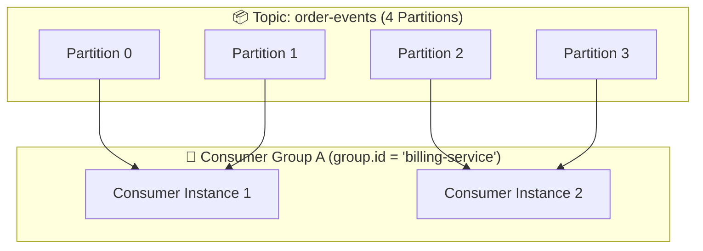
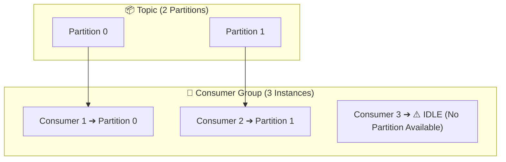
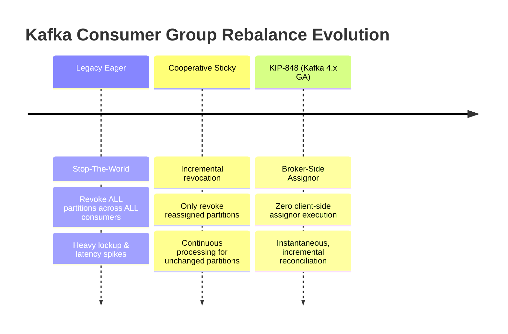
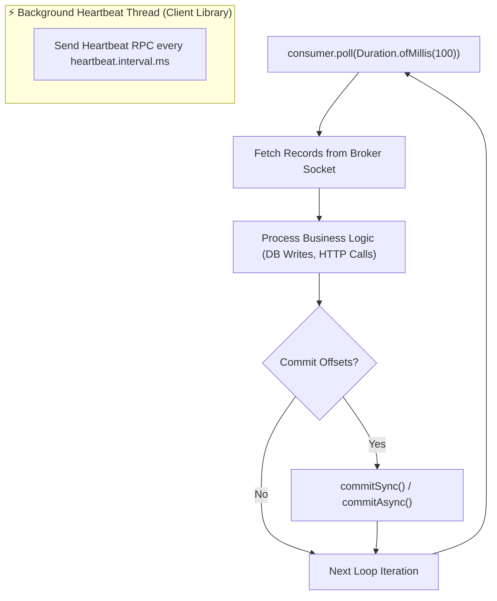
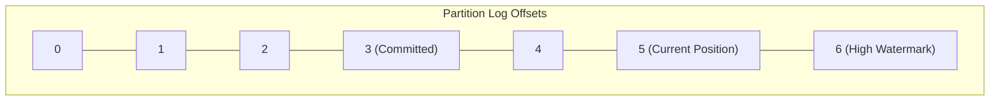

# 📤 Consumers & Consumer Groups

## 🎯 Learning Objectives

By the end of this module, you will be able to:
- Explain how Consumer Groups achieve horizontal scalability and high availability for event stream processing.
- Contrast legacy Client-Side Eager Rebalancing with modern Cooperative Sticky Rebalancing and KIP-848 Broker-Side Assignors.
- Design resilient consumer application poll loops while tuning liveness parameters (`session.timeout.ms`, `max.poll.interval.ms`).
- Implement manual offset management (`commitSync`, `commitAsync`) and inspect the internal `__consumer_offsets` topic.
- Leverage Static Group Membership (`group.instance.id`) to eliminate unnecessary rebalances during Kubernetes pod rolling restarts.

---

## 💡 Core Explanation

### 1. The Consumer Group Abstraction & Partition Assignment Rule

While a single consumer can read from a topic, real-world systems scale by forming a **Consumer Group**—a collection of consumer processes sharing a common `group.id`.

#### The Golden Rule of Partition Assignment:
> **Each partition within a topic is assigned to EXACTLY ONE consumer instance within a consumer group at any given point in time.**



#### Consumer Scaling Dynamics:
- **Number of Consumers = Partitions**: Ideal 1:1 mapping. Maximum parallel processing.
- **Number of Consumers < Partitions**: Consumers handle multiple partitions (e.g. 2 consumers for 4 partitions).
- **Number of Consumers > Partitions**: Excess consumers remain **IDLE** waiting for another instance to fail. Adding more consumers than partitions provides zero extra processing capacity!



---

### 2. Partition Rebalance Protocols: Legacy vs. KIP-848 (Kafka 4.x)

When a consumer joins or leaves a group (or topic partition count changes), Kafka triggers a **Rebalance** to reassign partitions.

#### Evolution of Rebalancing Protocols:



#### 1. Legacy Eager Rebalancing (Stop-the-World)
Every consumer in the group revokes ALL assigned partitions, stops consuming data completely, and waits for a designated Group Leader consumer to recalculate assignments and distribute them back via the broker.

#### 2. Cooperative Incremental Rebalancing (`CooperativeStickyAssignor`)
Instead of revoking all partitions globally, consumers continue processing unaffected partitions. Only partitions migrating to another instance are paused and handed over incrementally over 2 mini-rebalance rounds.

#### 3. Modern KIP-848 Protocol (Broker-Side Group Coordinator - Kafka 4.x Standard)
In Kafka 4.x, partition assignment computation moves from client applications to the broker's **Group Coordinator**:
- Eliminates heavy `JoinGroup` / `SyncGroup` RPC rounds.
- Consumer instances send heartbeats containing their current assignments; the broker returns target assignments incrementally.
- Enables clusters with thousands of active consumers per group with **sub-second rebalance times**.

---

### 3. The Consumer Poll Loop & Liveness Architecture

Kafka consumers are single-threaded loop engines (or single-threaded per partition consumer instance). The single thread must alternate between executing business logic and issuing heartbeats to the broker.



#### Three Crucial Liveness Timers:

| Configuration | Default | Purpose & Failover Behavior |
| :--- | :--- | :--- |
| **`session.timeout.ms`** | 45,000 ms (45s) | If broker receives NO background heartbeats for this duration, it considers the consumer dead/crashed and triggers a rebalance. |
| **`heartbeat.interval.ms`**| 3,000 ms (3s) | Frequency at which background heartbeat thread pings broker Group Coordinator. Must be `<= (session.timeout.ms / 3)`. |
| **`max.poll.interval.ms`**| 300,000 ms (5m) | Maximum allowed time spent processing records inside business logic between calls to `poll()`. If business logic takes longer than this limit, consumer leaves group voluntarily! |

---

### 4. Offset Management & The `__consumer_offsets` Topic

How does a consumer group pick up where it left off after a restart or crash? By tracking the **Committed Offset**.

#### The Offset Sequence
- **Current Position**: The offset of the next record the consumer will fetch on the next `poll()`.
- **Committed Offset**: The highest offset successfully processed and acknowledged back to the Kafka cluster for that consumer group and partition.



#### Internal Storage: `__consumer_offsets`
Offsets are stored in a internal, log-compacted Kafka topic named **`__consumer_offsets`** (50 partitions by default).
- Key: `[group.id, topic, partition_id]`
- Value: `[offset, metadata, timestamp]`

#### Auto-Commit vs. Manual Commit

```java
// ❌ Dangerous: Auto-Commit (Risk of Data Loss)
props.put(ConsumerConfig.ENABLE_AUTO_COMMIT_CONFIG, "true");
props.put(ConsumerConfig.AUTO_COMMIT_INTERVAL_MS_CONFIG, "5000");

// ✅ Recommended: Manual Commit (At-Least-Once Delivery)
props.put(ConsumerConfig.ENABLE_AUTO_COMMIT_CONFIG, "false");
```

- **`commitSync()`**: Blocks until broker acknowledges offset write to `__consumer_offsets`. Retries automatically. Safe, but degrades loop throughput if called per message.
- **`commitAsync()`**: Non-blocking offset commit. Higher throughput, but cannot retry failed commits (to avoid overwriting newer offsets with older commits).

---

### 5. Static Group Membership (`group.instance.id`)

In containerized environments (Kubernetes), restarting a pod causes a transient consumer departure and re-join, triggering unnecessary group rebalances.

By supplying a unique **`group.instance.id`** (Static Membership):
- The broker recognizes the returning pod by its static identity.
- The broker grants a grace period (`session.timeout.ms`) for the instance to rejoin **WITHOUT triggering a partition rebalance!**

---

## 🛠️ Working Examples & Production Code

### 1. Robust Manual Commit Consumer Loop (Java)

```java
import org.apache.kafka.clients.consumer.*;
import org.apache.kafka.common.TopicPartition;
import org.apache.kafka.common.serialization.StringDeserializer;

import java.time.Duration;
import java.util.*;

public class ProductionConsumerLoop {
    public static void main(String[] args) {
        Properties props = new Properties();
        props.put(ConsumerConfig.BOOTSTRAP_SERVERS_CONFIG, "localhost:9092");
        props.put(ConsumerConfig.GROUP_ID_CONFIG, "payment-processor-v1");
        props.put(ConsumerConfig.KEY_DESERIALIZER_CLASS_CONFIG, StringDeserializer.class.getName());
        props.put(ConsumerConfig.VALUE_DESERIALIZER_CLASS_CONFIG, StringDeserializer.class.getName());

        // Disable auto-commit for explicit at-least-once processing
        props.put(ConsumerConfig.ENABLE_AUTO_COMMIT_CONFIG, "false");
        props.put(ConsumerConfig.AUTO_OFFSET_RESET_CONFIG, "earliest");

        // Static Membership (K8s pod identity)
        props.put(ConsumerConfig.GROUP_INSTANCE_ID_CONFIG, "payment-processor-pod-1");

        // Cooperative Sticky Rebalance Strategy
        props.put(ConsumerConfig.PARTITION_ASSIGNMENT_STRATEGY_CONFIG,
            CooperativeStickyAssignor.class.getName());

        // Liveness Parameters
        props.put(ConsumerConfig.SESSION_TIMEOUT_MS_CONFIG, 45000);
        props.put(ConsumerConfig.MAX_POLL_INTERVAL_MS_CONFIG, 300000);
        props.put(ConsumerConfig.MAX_POLL_RECORDS_CONFIG, 500); // Control batch size

        try (KafkaConsumer<String, String> consumer = new KafkaConsumer<>(props)) {
            consumer.subscribe(Collections.singletonList("orders-v1"));

            while (true) {
                ConsumerRecords<String, String> records = consumer.poll(Duration.ofMillis(100));

                for (ConsumerRecord<String, String> record : records) {
                    // Process record (e.g. database operation)
                    processOrder(record.key(), record.value());
                }

                // Commit offsets synchronously after processing full batch
                if (!records.isEmpty()) {
                    consumer.commitSync();
                }
            }
        }
    }

    private static void processOrder(String key, String value) {
        // Business logic execution
    }
}
```

### 2. Inspecting Consumer Group Lag via CLI

```bash
# Describe Consumer Group lag and partition assignments
kafka-consumer-groups.sh --bootstrap-server localhost:9092 \
  --describe --group payment-processor-v1
```

Example Output:
```text
GROUP                 TOPIC       PARTITION  CURRENT-OFFSET  LOG-END-OFFSET  LAG             CONSUMER-ID                                     HOST            CLIENT-ID
payment-processor-v1  orders-v1   0          10480           10500           20              payment-processor-pod-1-39482103                /10.0.1.42      client-1
payment-processor-v1  orders-v1   1          8920            8920            0               payment-processor-pod-2-94821034                /10.0.1.43      client-2
```

### 3. Resetting Consumer Offsets via CLI

```bash
# Rewind consumer group offsets back to earliest available offset for a topic
kafka-consumer-groups.sh --bootstrap-server localhost:9092 \
  --group payment-processor-v1 \
  --topic orders-v1 \
  --reset-offsets --to-earliest --execute
```

---

## ⚠️ Common Pitfalls & Misconceptions

1. **Pitfall: Long-running database operations causing `CommitFailedException`.**
   *Reality*: If your loop takes longer than `max.poll.interval.ms` (e.g. 5 minutes) to process a single `poll()` batch, the Group Coordinator assumes the consumer thread is dead, kicks it out of the group, and triggers a rebalance. Subsequent calls to `commitSync()` fail with `CommitFailedException`!
   *Fix*: Reduce `max.poll.records` (e.g. from 500 to 50) or process batches asynchronously using worker thread pools.
2. **Misconception: `auto.offset.reset=earliest` rewinds a running consumer group.**
   *Reality*: `auto.offset.reset` applies **ONLY when no committed offset exists** in `__consumer_offsets` for that consumer group. If a committed offset exists, `auto.offset.reset` is completely ignored!
3. **Pitfall: Shared single `KafkaConsumer` instance across multiple threads.**
   *Reality*: Unlike `KafkaProducer` (which is thread-safe), `KafkaConsumer` is **NOT thread-safe**! Calling `.poll()` or `.commit()` on the same consumer instance from concurrent threads throws a `ConcurrentModificationException`.

---

## 🔀 Structural Comparisons

| Feature | Auto-Commit (`enable.auto.commit=true`) | Manual Synchronous (`commitSync`) | Manual Asynchronous (`commitAsync`) |
| :--- | :--- | :--- | :--- |
| **Delivery Semantics** | At-Most-Once / Unpredictable | At-Least-Once | At-Least-Once |
| **Data Loss Risk** | High (Commits offset before processing completes) | None (Commits strictly after processing) | Low (Possible if out-of-order commits occur) |
| **Duplicate Risk** | High (Process crash between auto-commits) | Low (Duplicates only on worker crash before commit) | Low |
| **Loop Latency Overhead** | None | Moderate (Blocks loop for broker RTT ACK) | Zero (Fire and forget write) |

---

## ✅ Quick Reference / Cheat-Sheet

```text
Lag Formula:           LAG = LOG-END-OFFSET - CURRENT-OFFSET
Group Describe Tool:   kafka-consumer-groups.sh --bootstrap-server <HOST:PORT> --describe --group <ID>
Offset Reset Tool:     kafka-consumer-groups.sh --bootstrap-server <HOST:PORT> --group <ID> --reset-offsets ...

Recommended Production Consumer Config:
  enable.auto.commit=false
  auto.offset.reset=earliest
  session.timeout.ms=45000
  max.poll.interval.ms=300000
  max.poll.records=100
  group.instance.id=<unique-pod-id>
  partition.assignment.strategy=org.apache.kafka.clients.consumer.CooperativeStickyAssignor
```

---

[← Previous](./03-producers-and-partitioning) | [Index](./00-index.mdx) | [Next →](./05-replication-and-fault-tolerance)
