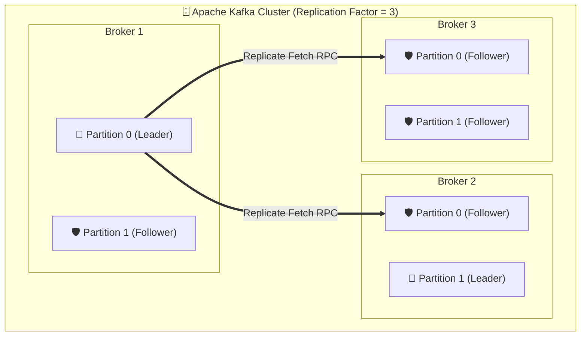
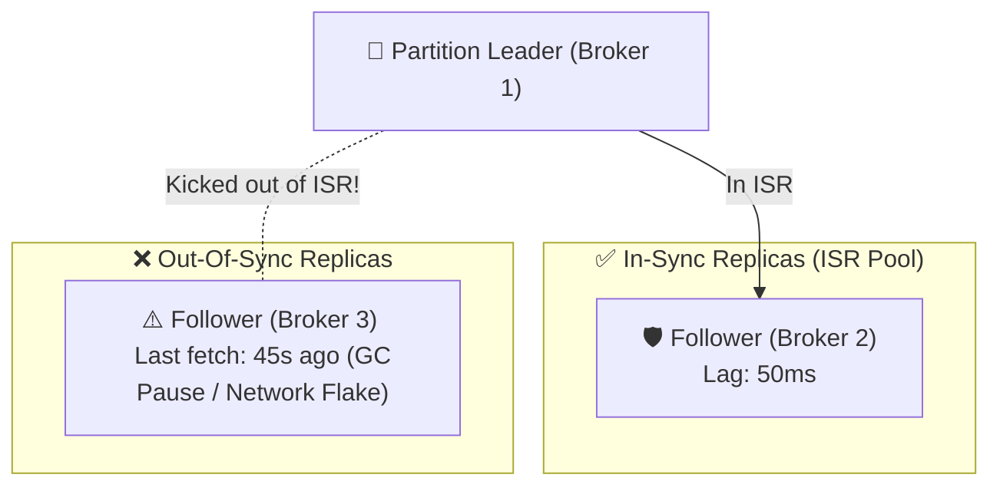
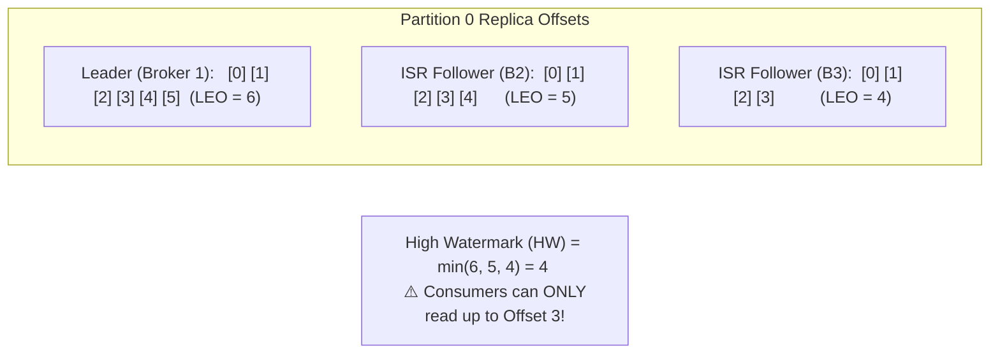
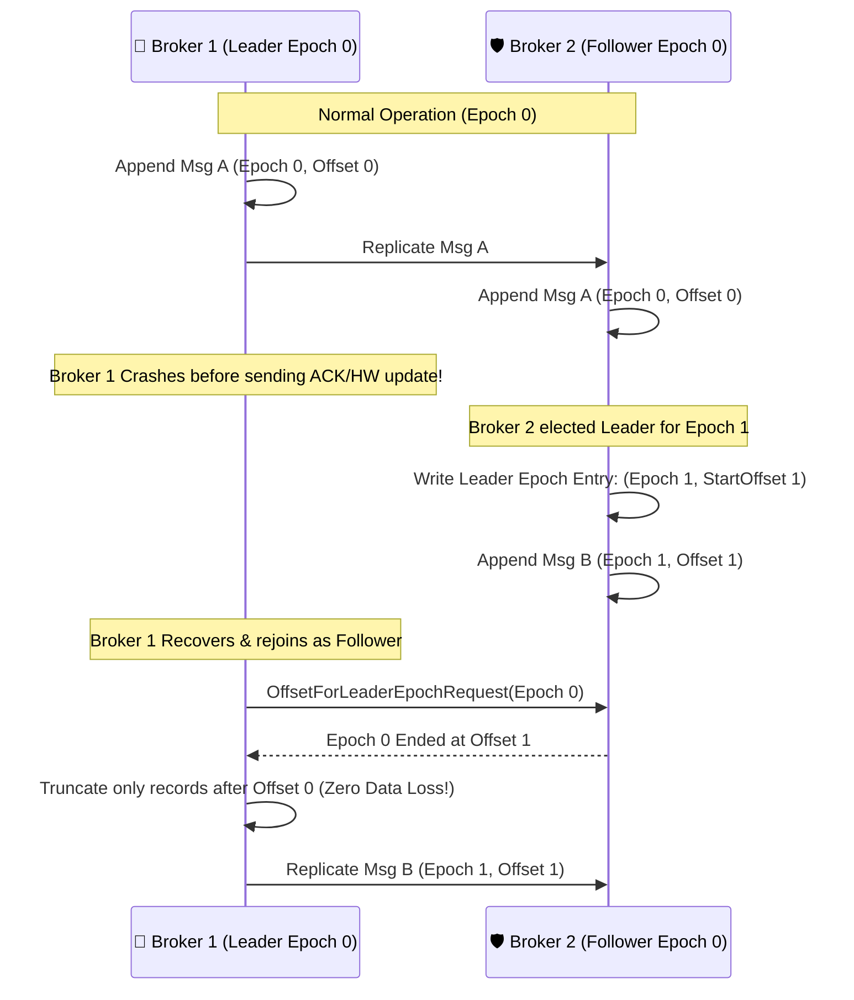
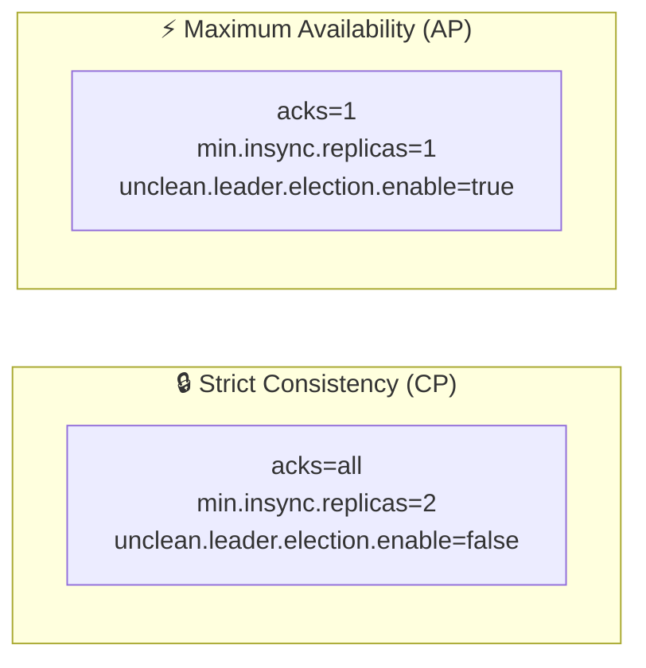

# 🔄 Replication & Fault Tolerance

## 🎯 Learning Objectives

By the end of this module, you will be able to:
- Trace the lifecycle of data replication between Partition Leaders and Follower brokers.
- Define In-Sync Replicas (ISR) and calculate cluster availability bounds using `replica.lag.time.max.ms`.
- Contrast Log End Offset (LEO) with High Watermark (HW) to explain why consumers can only read committed messages.
- Explain how Leader Epochs prevent silent log corruption and phantom data loss during broker crashes.
- Evaluate the tradeoffs between CAP consistency and availability using `min.insync.replicas` and `unclean.leader.election.enable`.

---

## 💡 Core Explanation

### 1. Partition Leader and Followers Topology

To ensure high availability and prevent data loss when brokers fail, Kafka replicates partitions across multiple brokers. The number of copies created is governed by the **Replication Factor** (`replication.factor`).

For any partition, one broker is designated as the **Leader**, and the remaining brokers act as **Followers**:



#### Roles in Replication:
- **Partition Leader**: Receives ALL client produce and consume requests for that partition. Writes records directly to its local log.
- **Follower Replicas**: Do NOT serve client traffic (by default). They act purely as internal consumers, issuing `FetchRequest` RPCs to the Leader to fetch new records and write them to their local logs.
- **Preferred Leader**: The first replica listed in the replica assignment array. Kafka attempts to keep preferred leaders active to ensure uniform CPU/I/O load balancing across brokers (`auto.leader.rebalance.enable=true`).

---

### 2. In-Sync Replicas (ISR) Mechanics

Not all follower replicas are guaranteed to be healthy or up-to-date. Kafka divides followers into two operational categories: **In-Sync Replicas (ISR)** and **Out-of-Sync Replicas**.

#### What Makes a Replica "In-Sync"?
A follower replica is part of the ISR if it actively fetches data from the Partition Leader and keeps up within a configurable time window:

`Time Since Last Fetch <= replica.lag.time.max.ms (default: 30,000 ms / 30s)`



#### Dynamic ISR Shrinking & Expansion:
1. If Broker 3 experiences a 40-second Java Garbage Collection pause, the Leader detects no fetch requests from Broker 3.
2. The Leader issues a metadata update to the KRaft Controller to **shrink the ISR** (removing Broker 3).
3. Once Broker 3 recovers and catches up to the Leader's log end offset, it is **re-added to the ISR**.

---

### 3. Log End Offset (LEO) vs. High Watermark (HW)

Kafka uses two tracking pointers to govern data durability and consumer visibility within each partition:

- **Log End Offset (LEO)**: The offset of the next record to be written to a specific replica's local log. Every replica (Leader and Followers) has its own local LEO.
- **High Watermark (HW)**: The minimum LEO across **ALL members of the ISR**. 

`High Watermark (HW) = min(LEO of all ISR members)`



#### The Consumer Visibility Guarantee:
> **Consumers are strictly prohibited from reading records beyond the High Watermark.**

Why? If a consumer were allowed to read record at Offset `5` (which exists only on the Leader), and the Leader immediately crashed before Followers replicated Offset `5`, that message would disappear—causing dirty reads and phantom data loss!

---

### 4. Preventing Silent Data Loss: Leader Epochs vs. Legacy HW Truncation

In legacy Kafka (pre-0.11), brokers truncated logs based purely on High Watermark during failover. Under specific crash sequences, this caused **silent log divergence and data loss** even when `acks=all` was used.

Kafka solved this permanently by introducing **Leader Epochs** (`leader-epoch-checkpoint`).

#### How Leader Epochs Work:
Every time a new leader is elected for a partition, the KRaft Controller increments the **Leader Epoch** (a 32-bit integer). The leader writes a checkpoint entry: `[Epoch ID, Start Offset]`.



With Leader Epochs:
- Rejoining followers do NOT blindly truncate to their old High Watermark.
- Instead, they query the new Leader for the exact end offset of the shared Leader Epoch.
- This guarantees **exact log convergence across replicas** without losing acknowledged messages.

---

### 5. CAP Theorem Tradeoffs: `min.insync.replicas` & Unclean Elections

Kafka allows system designers to configure where their system sits on the **Consistency vs. Availability** spectrum (CAP Theorem).



#### 1. Zero Data Loss Configuration (`min.insync.replicas`)
- **Config**: `acks=all` (producer) + `min.insync.replicas=2` (topic/broker config on a 3-replica topic).
- **Behavior**: The Leader will refuse write requests (throwing `NotEnoughReplicasException`) if the size of the ISR pool drops below 2.
- **Tradeoff**: Sacrifices write availability if 2 out of 3 brokers crash, but guarantees **100% durability** for accepted writes.

#### 2. Unclean Leader Election (`unclean.leader.election.enable`)
- What happens if all ISR members crash, leaving only an out-of-sync follower alive?
- **`unclean.leader.election.enable=false` (Default / CP Mode)**: The topic partition remains **OFFLINE** until an ISR member comes back online. Zero data loss, but writes/reads are blocked.
- **`unclean.leader.election.enable=true` (AP Mode)**: Kafka elects the out-of-sync follower as Leader. Partition stays online, but **all messages present on the old leader that were not replicated to this follower are permanently destroyed!**

---

## 🛠️ Working Examples & Hands-On Commands

### 1. Inspecting Partition Replicas and ISR Status via CLI

```bash
# Describe topic replica assignments and ISR state
kafka-topics.sh --bootstrap-server localhost:9092 \
  --describe --topic payment-transactions
```

Example Output:
```text
Topic: payment-transactions  TopicId: 9f8a2c1b-4d3e  PartitionCount: 3  ReplicationFactor: 3  Configs: min.insync.replicas=2
  Topic: payment-transactions  Partition: 0  Leader: 1  Replicas: 1,2,3  Isr: 1,2,3
  Topic: payment-transactions  Partition: 1  Leader: 2  Replicas: 2,3,1  Isr: 2,3
  Topic: payment-transactions  Partition: 2  Leader: 3  Replicas: 3,1,2  Isr: 3,1,2
```
*Notice Partition 1*: Broker 1 is listed in `Replicas` (1,2,3) but is absent from `Isr` (2,3)—indicating Broker 1 is currently lagging or recovering.

### 2. Configuring Topic-Level Durability Rules

```bash
# Set min.insync.replicas=2 and disable unclean leader election
kafka-configs.sh --bootstrap-server localhost:9092 \
  --entity-type topics --entity-name payment-transactions \
  --alter --add-config min.insync.replicas=2,unclean.leader.election.enable=false
```

### 3. Rebalancing Preferred Leaders

If leadership becomes imbalanced across brokers after a cluster maintenance window, trigger a preferred leader election:

```bash
# Trigger automated preferred leader election across all topics
kafka-leader-election.sh --bootstrap-server localhost:9092 \
  --election-type PREFERRED --all-topic-partitions
```

---

## ⚠️ Common Pitfalls & Misconceptions

1. **Pitfall: Setting `min.insync.replicas` equal to `replication.factor`.**
   *Reality*: If `replication.factor=3` and `min.insync.replicas=3`, a single broker failure or transient network hiccup causes writes to fail immediately with `NotEnoughReplicasException`! Always set `min.insync.replicas = replication.factor - 1` (e.g. 2 for RF=3).
2. **Misconception: `acks=all` means writing to ALL replicas in the cluster.**
   *Reality*: `acks=all` means writing to all **CURRENT IN-SYNC REPLICAS (ISR)**. If the ISR has shrunk to 1 broker (because 2 crashed), `acks=all` will succeed with only 1 copy written unless `min.insync.replicas` is configured!
3. **Pitfall: Followers serving client read requests incorrectly.**
   *Reality*: In standard Kafka setups, Followers do not serve client reads. (Kafka 2.4+ added KIP-392 allowing consumers to fetch from closest replicas in multi-AZ cloud setups, but the Partition Leader remains the sole write authority).

---

## 🔀 Structural Comparisons

| Cluster Scenario | ISR Count | Producer `acks=all` Result | Read Availability | Write Availability |
| :--- | :--- | :--- | :--- | :--- |
| **All 3 Brokers Healthy** (RF=3, MinISR=2) | 3 | ✅ Success | Available | Available |
| **1 Broker Crashed** (RF=3, MinISR=2) | 2 | ✅ Success | Available | Available |
| **2 Brokers Crashed** (RF=3, MinISR=2) | 1 | ❌ `NotEnoughReplicasException` | Available | ❌ Blocked |
| **All Replicas Crashed** (Unclean=false) | 0 | ❌ Unavailable | ❌ Blocked | ❌ Blocked |
| **All Replicas Crashed** (Unclean=true) | 0 | ⚠️ Data Loss on restart | ⚠️ Dirty Reads | ⚠️ Overwrites historic data |

---

## ✅ Quick Reference / Cheat-Sheet

```text
LEO (Log End Offset):  Offset of next message to be written on a specific replica.
HW (High Watermark):   Highest offset replicated to ALL ISR members. Max offset consumers can read.
ISR (In-Sync Replicas): Replicas fetching from Leader within replica.lag.time.max.ms.

Zero Data Loss Formula:
  Topic Config:      replication.factor = 3
  Topic Config:      min.insync.replicas = 2
  Topic Config:      unclean.leader.election.enable = false
  Producer Config:   acks = all
  Producer Config:   enable.idempotence = true
```

---

[← Previous](./04-consumers-and-consumer-groups) | [Index](./00-index.mdx) | [Next →](./06-transactions-and-exactly-once)
