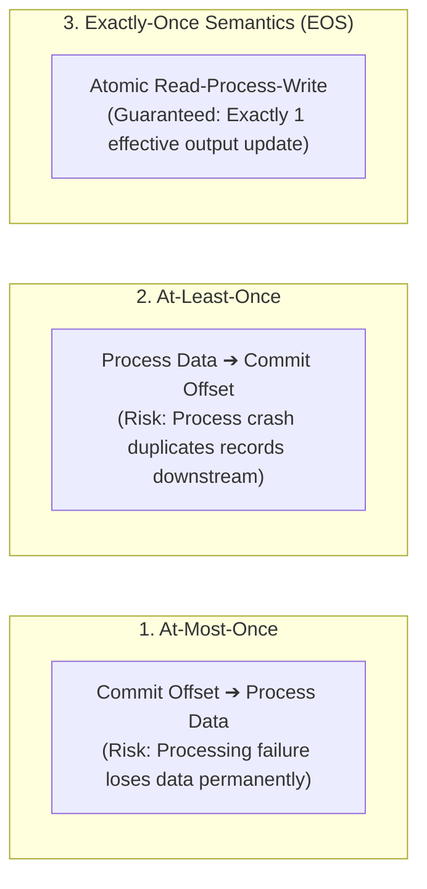
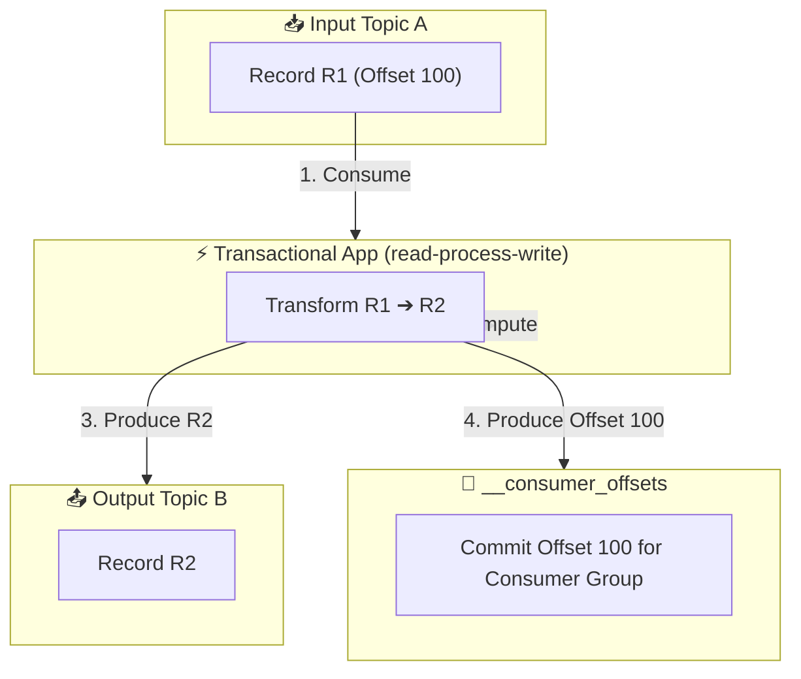
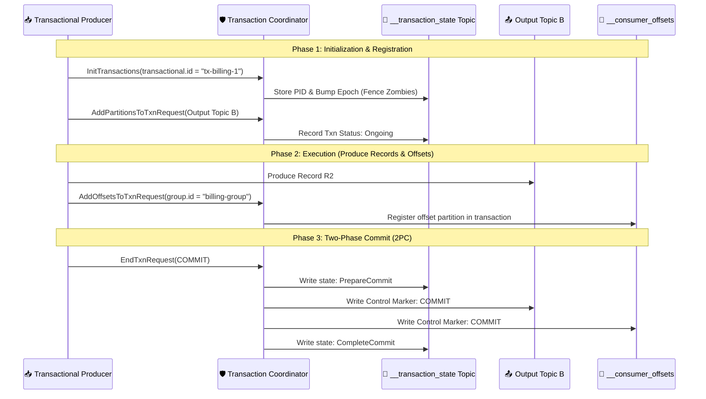
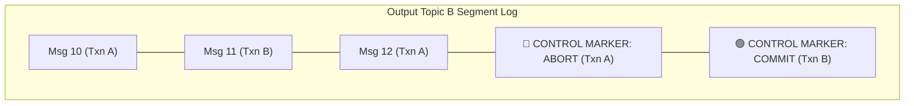
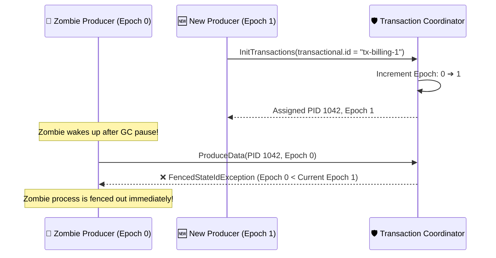

# 🔐 Transactions & Exactly-Once Semantics (EOS)

## 🎯 Learning Objectives

By the end of this module, you will be able to:
- Distinguish between At-Most-Once, At-Least-Once, and Exactly-Once (EOS) processing semantics.
- Trace the execution flow of atomic `read-process-write` transaction pipelines across multiple Kafka topics.
- Deconstruct the two-phase commit (2PC) log protocol implemented by the Transaction Coordinator and `__transaction_state` topic.
- Explain how Transactional Producer IDs (`transactional.id`) and Producer Epochs prevent "Zombie Producer" writes.
- Configure producers and consumers (`isolation.level=read_committed`) to filter out aborted transaction data.

---

## 💡 Core Explanation

### 1. The Three Delivery Semantics

In messaging and stream processing, system guarantees fall into three strict categories:



1. **At-Most-Once**: Messages may be lost, but are never duplicated. (Achieved via `acks=0` or auto-committing offsets prior to processing).
2. **At-Least-Once**: Messages are guaranteed never to be lost, but may be reprocessed and duplicated if crashes occur. (Achieved via `acks=all` + manual commits after processing).
3. **Exactly-Once Semantics (EOS)**: End-to-end guarantee that records flowing through a `read-process-write` pipeline are processed **exactly once**, as if no failure or network retry ever occurred.

---

### 2. The Core Pattern: Read-Process-Write Loop

The primary use case for Kafka Transactions is the **Stream Processing Loop**:
1. Read record $R_1$ from Input Topic A (Offset $O_1$).
2. Transform $R_1$ into Output Record $R_2$ in memory.
3. Write $R_2$ to Output Topic B.
4. Commit Input Offset $O_1$ back to `__consumer_offsets`.



> 🔒 **Transaction Boundaries**: Step 3 (Produce R2) and Step 4 (Produce Offset) must be ATOMIC!

#### The Atomicity Challenge
If step 3 succeeds (Record $R_2$ written to Topic B), but the process crashes before step 4 (Offset $O_1$ committed), the restarted consumer will re-read Offset $O_1$ and produce a **duplicate Record $R_2$** to Topic B!

Kafka Transactions solve this by making **Step 3 (Writing to Output Topic) and Step 4 (Committing Consumer Offset) atomic**. Either both succeed, or both are aborted.

---

### 3. Transaction Architecture & The Transaction Coordinator

Kafka implements transactions using two special broker components:

1. **Transaction Coordinator**: A specialized module running inside Kafka brokers responsible for managing transaction state machines.
2. **`__transaction_state` Topic**: An internal, log-compacted topic that stores the persistent state of all active and completed transactions across the cluster.



---

### 4. Control Markers & Consumer Isolation Levels

How do consumers handle data written by a transactional producer while a transaction is still ongoing or subsequently aborted?

#### Control Markers
When a transaction is committed or aborted, the Transaction Coordinator writes a special 0-byte record called a **Control Marker** (`COMMIT` or `ABORT`) directly into the target log partition segments.



#### Consumer Isolation Levels (`isolation.level`)

- **`read_uncommitted` (Default)**: Consumer reads ALL records written to the log partition sequentially, including messages from active or aborted transactions.
- **`read_committed`**: Consumer filters out messages from aborted transactions and suppresses uncommitted messages until the corresponding `COMMIT` control marker is encountered!

```text
Reading Log under isolation.level = read_committed:
- Consumer reads Msg 11 (Txn B) -> Committed -> Returned to application.
- Consumer sees Msg 10 & 12 (Txn A) -> Aborted -> SILENTLY DISCARDED!
```

---

### 5. Zombie Fencing via Producer Epochs

What happens if a transactional producer experiences a long network pause (or GC pause), the system assumes it died, and a new instance of the producer starts up with the same `transactional.id`?

If the old producer wakes up, it could attempt to write duplicate transactional records—an issue known as the **Zombie Producer Problem**.



#### Fencing Rule:
Every transactional producer MUST be configured with a unique, static **`transactional.id`**. When `initTransactions()` is called:
1. The Transaction Coordinator looks up the `transactional.id`.
2. It increments the **Producer Epoch** associated with that ID.
3. Any future write requests from the old producer (carrying the old epoch) are **rejected with a `ProducerFencedException`**, forcing the zombie process to terminate immediately!

---

## 🛠️ Working Examples & Production Code

### 1. Complete Transactional `read-process-write` Loop (Java)

```java
import org.apache.kafka.clients.consumer.*;
import org.apache.kafka.clients.producer.*;
import org.apache.kafka.common.TopicPartition;
import org.apache.kafka.common.serialization.StringDeserializer;
import org.apache.kafka.common.serialization.StringSerializer;

import java.time.Duration;
import java.util.*;

public class TransactionalStreamProcessor {
    public static void main(String[] args) {
        String inputTopic = "raw-orders";
        String outputTopic = "sanitized-orders";
        String consumerGroupId = "order-sanitizer-group";
        String transactionalId = "tx-order-sanitizer-1";

        // 1. Configure Transactional Producer
        Properties prodProps = new Properties();
        prodProps.put(ProducerConfig.BOOTSTRAP_SERVERS_CONFIG, "localhost:9092");
        prodProps.put(ProducerConfig.KEY_SERIALIZER_CLASS_CONFIG, StringSerializer.class.getName());
        prodProps.put(ProducerConfig.VALUE_SERIALIZER_CLASS_CONFIG, StringSerializer.class.getName());
        prodProps.put(ProducerConfig.TRANSACTIONAL_ID_CONFIG, transactionalId); // Enable Transactions!
        prodProps.put(ProducerConfig.ENABLE_IDEMPOTENCE_CONFIG, "true");

        Producer<String, String> producer = new KafkaProducer<>(prodProps);

        // 2. Configure Read-Committed Consumer
        Properties consProps = new Properties();
        consProps.put(ConsumerConfig.BOOTSTRAP_SERVERS_CONFIG, "localhost:9092");
        consProps.put(ConsumerConfig.GROUP_ID_CONFIG, consumerGroupId);
        consProps.put(ConsumerConfig.KEY_DESERIALIZER_CLASS_CONFIG, StringDeserializer.class.getName());
        consProps.put(ConsumerConfig.VALUE_DESERIALIZER_CLASS_CONFIG, StringDeserializer.class.getName());
        consProps.put(ConsumerConfig.ENABLE_AUTO_COMMIT_CONFIG, "false");
        consProps.put(ConsumerConfig.ISOLATION_LEVEL_CONFIG, "read_committed"); // Filter aborted txns!

        Consumer<String, String> consumer = new KafkaConsumer<>(consProps);

        // Initialize Producer Transactions (Fences older instances, registers PID)
        producer.initTransactions();
        consumer.subscribe(Collections.singletonList(inputTopic));

        try {
            while (true) {
                ConsumerRecords<String, String> records = consumer.poll(Duration.ofMillis(100));
                if (records.isEmpty()) continue;

                try {
                    // Start Transaction Boundary
                    producer.beginTransaction();

                    Map<TopicPartition, OffsetAndMetadata> offsetsToCommit = new HashMap<>();

                    for (ConsumerRecord<String, String> record : records) {
                        // Business Logic: Transform data
                        String sanitizedValue = record.value().toUpperCase();

                        // Produce transformed record to output topic within transaction
                        producer.send(new ProducerRecord<>(outputTopic, record.key(), sanitizedValue));

                        // Track input offsets
                        offsetsToCommit.put(
                            new TopicPartition(record.topic(), record.partition()),
                            new OffsetAndMetadata(record.offset() + 1)
                        );
                    }

                    // Send Consumer Offsets to Transaction Coordinator
                    producer.sendOffsetsToTransaction(offsetsToCommit, consumer.groupMetadata());

                    // Commit the Transaction atomically!
                    producer.commitTransaction();

                } catch (ProducerFencedException e) {
                    System.err.println("Fatal: Another instance started with same transactional.id!");
                    producer.close();
                    consumer.close();
                    break;
                } catch (Exception e) {
                    System.err.println("Error processing batch, aborting transaction: " + e.getMessage());
                    // Abort Transaction: Rolls back produced records & consumer offsets
                    producer.abortTransaction();
                }
            }
        } finally {
            producer.close();
            consumer.close();
        }
    }
}
```

---

## ⚠️ Common Pitfalls & Misconceptions

1. **Pitfall: Re-using `transactional.id` across parallel worker instances.**
   *Reality*: Every concurrent instance of a producer MUST have a unique `transactional.id` (e.g. `tx-processor-pod-0`, `tx-processor-pod-1`). If two running workers share the exact same `transactional.id`, they will continuously fence each other out of the cluster!
2. **Misconception: Kafka Transactions work across external databases (PostgreSQL/MySQL).**
   *Reality*: Kafka's 2PC transaction protocol operates strictly **within the boundaries of Kafka topics**. It cannot coordinate atomic commits with external databases unless paired with a 2PC XA manager or Change Data Capture (CDC) outbox pattern.
3. **Pitfall: Forgetting `isolation.level=read_committed` on downstream consumers.**
   *Reality*: By default, standard consumers use `isolation.level=read_uncommitted`. Downstream consumers will read records from uncommitted or aborted transactions unless explicitly configured to use `read_committed`!

---

## 🔀 Structural Comparisons

| Processing Semantic | Producer Config | Consumer Isolation Level | Performance Impact | Failure Recovery |
| :--- | :--- | :--- | :--- | :--- |
| **At-Most-Once** | `acks=0` | `read_uncommitted` | Lowest Latency / Highest Throughput | Data loss accepted |
| **At-Least-Once** | `acks=all`, `idempotence=true` | `read_uncommitted` | High Throughput | Duplicates possible on restart |
| **Exactly-Once (EOS)** | `acks=all`, `transactional.id=XYZ` | `read_committed` | Slightly higher latency (~3-5% overhead for 2PC markers) | Zero duplicates, zero data loss |

---

## ✅ Quick Reference / Cheat-Sheet

```properties
# Transactional Producer Requirements:
transactional.id=tx-unique-instance-id  # Static identity per worker instance
enable.idempotence=true                  # Mandated automatically
acks=all                                 # Mandated automatically

# Transactional Consumer Requirements:
isolation.level=read_committed           # Filter out aborted transaction messages
enable.auto.commit=false                 # Consumer offsets managed via sendOffsetsToTransaction
```

---

[← Previous](./05-replication-and-fault-tolerance) | [Index](./00-index.mdx) | [Next →](./07-kafka-connect-and-schema-evolution)
