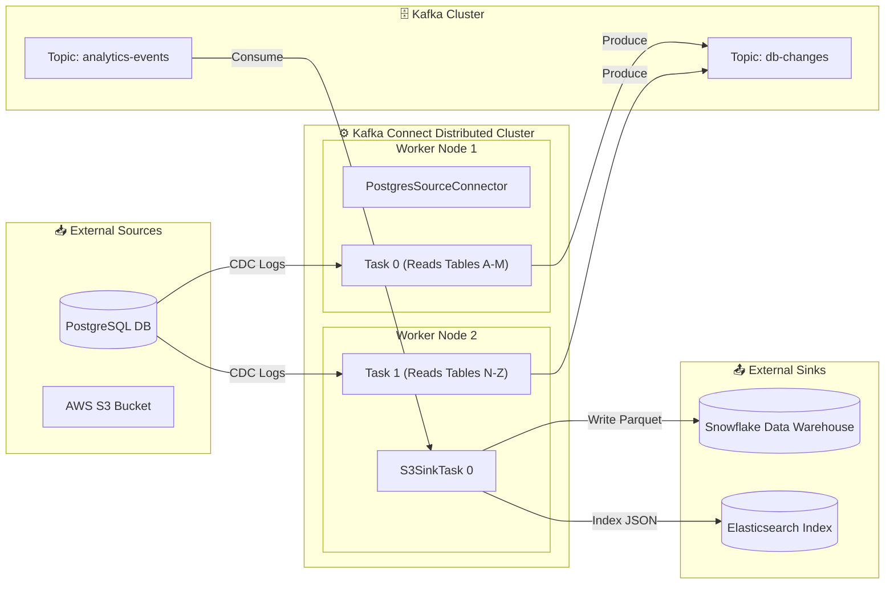
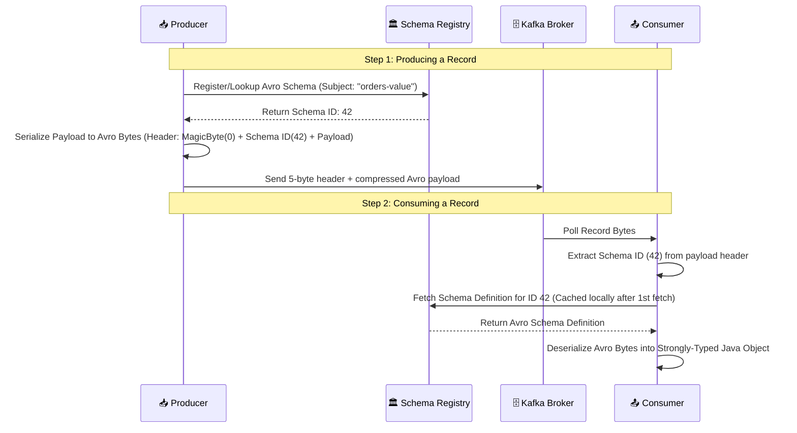
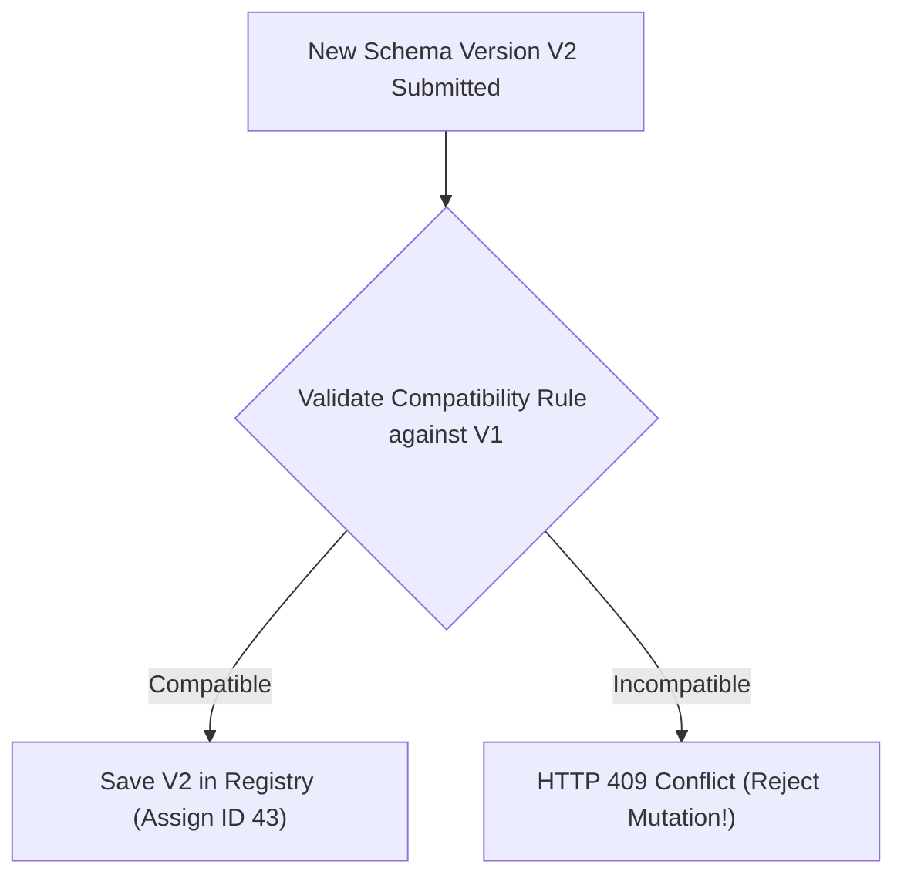

# 🔌 Kafka Connect & Schema Evolution

## 🎯 Learning Objectives

By the end of this module, you will be able to:
- Deconstruct the execution topology of Kafka Connect (Workers, Connectors, Tasks, and Single Message Transforms).
- Contrast Standalone Mode with Distributed Mode for enterprise data integration pipelines.
- Trace how the Confluent / Karapace Schema Registry decouples payload metadata from raw byte streams.
- Select and configure binary serialization formats (Apache Avro, Protocol Buffers, JSON Schema).
- Apply Schema Evolution compatibility rules (Backward, Forward, Full) to prevent downstream consumer breaking changes.

---

## 💡 Core Explanation

### 1. Kafka Connect Architecture

Writing custom code for every data source (PostgreSQL, MongoDB) and data sink (S3, Snowflake, Elasticsearch) leads to brittle, unmaintainable microservices. 

**Kafka Connect** is a scalable, fault-tolerant framework built explicitly for streaming data between Apache Kafka and external systems.



#### Core Components of Kafka Connect:

1. **Connector**: Defines *where* data comes from or goes to, how many tasks to break the workload into, and configuration validation. Does NOT process records directly.
2. **Task**: The actual data parallel processing worker unit created by the Connector. Tasks fetch data from source systems or write data to sink systems.
3. **Worker**: The physical JVM daemon process running the Kafka Connect framework.
4. **Converters**: Converts data between Connect internal data structures (`Schema` + `Struct`) and raw byte payloads written to Kafka (`Avro`, `Protobuf`, `JSON`).
5. **Single Message Transforms (SMT)**: Lightweight, inline record modification chains (e.g. drop fields, rename keys, route to dynamic topics).

---

### 2. Standalone Mode vs. Distributed Mode

| Operating Mode | Scalability | Fault Tolerance | State Storage | Best Use Case |
| :--- | :--- | :--- | :--- | :--- |
| **Standalone Mode** | Single JVM process | None (If worker dies, pipeline dies) | Local disk property files | Local dev, agent log shipping |
| **Distributed Mode** | Multi-node cluster | Automatic task rebalancing on worker crash | Internal Kafka topics (`connect-configs`, `connect-offsets`, `connect-status`) | Enterprise production pipelines |

#### Distributed Mode Internal Topics:
In Distributed Mode, workers form a cluster using Kafka's internal Group Coordinator mechanism. Cluster state is stored natively in three Kafka topics:
- **`connect-configs`**: Compacted topic storing connector configuration JSONs.
- **`connect-offsets`**: Compacted topic storing source connector read positions.
- **`connect-status`**: Compacted topic tracking worker and task status.

---

### 3. Data Governance & The Schema Registry

In a loose event-driven architecture, producers and consumers are developed by independent teams. If a producer team renames or deletes a field in a JSON payload, downstream consumers will crash at runtime with deserialization errors!

To enforce strict data contracts without coupling services, Kafka uses a **Schema Registry**.



#### Why Schema Registry Achieves Extreme Wire Efficiency:
In standard JSON, every record transmits repetitive field names (`"customer_first_name": "Alice"`, `"order_timestamp": 1784770000`).

With Avro/Protobuf + Schema Registry:
- Field names are stripped entirely from the wire payload!
- Payload contains ONLY raw binary values prefixed with a **5-byte header**: `[1 byte Magic Byte] + [4 bytes Schema ID]`.
- Reduces payload size over the network by **60% - 90%** compared to JSON!

---

### 4. Schema Evolution Compatibility Rules

As business requirements change, schemas must evolve. The Schema Registry validates schema mutations against historical versions before accepting them.



#### The Primary Compatibility Modes:

| Compatibility Mode | Definition | Upgrade Order | Rules for Schema Changes |
| :--- | :--- | :--- | :--- |
| **`BACKWARD`** *(Default)* | Consumer with **V2** schema can read records produced with **V1**. | Upgrade **Consumers** first | Can **delete** fields. Can add **optional** fields (with default values). |
| **`FORWARD`** | Consumer with **V1** schema can read records produced with **V2**. | Upgrade **Producers** first | Can **add** fields. Can delete **optional** fields. |
| **`FULL`** | Schemas are both Backward AND Forward compatible (V1 ↔ V2). | Upgrade in **any order** | Can ONLY add/remove **optional** fields with defaults. |
| **`NONE`** | No compatibility checks performed. | Manual coordination | Dangerous. Risk of breaking downstream consumers. |

---

## 🛠️ Working Examples & Hands-On Commands

### 1. Creating a Postgres Source Connector via REST API (Distributed Connect)

Submit a JSON payload to the Kafka Connect REST API (`POST http://localhost:8083/connectors`):

```json
{
  "name": "postgres-order-source",
  "config": {
    "connector.class": "io.confluent.connect.jdbc.JdbcSourceConnector",
    "tasks.max": "2",
    "connection.url": "jdbc:postgresql://postgres.internal:5432/orderdb",
    "connection.user": "kafka_connect",
    "connection.password": "SecretPassword123",
    "mode": "incrementing",
    "incrementing.column.name": "id",
    "topic.prefix": "postgres-",
    "table.whitelist": "orders,order_items",
    
    "value.converter": "io.confluent.connect.avro.AvroConverter",
    "value.converter.schema.registry.url": "http://schema-registry.internal:8081",
    
    "transforms": "unwrap,dropSysCols",
    "transforms.unwrap.type": "org.apache.kafka.connect.transforms.ExtractField$Key",
    "transforms.unwrap.field": "id"
  }
}
```

### 2. Defining an Apache Avro Schema (`order_value.avsc`)

```json
{
  "type": "record",
  "namespace": "com.company.orders",
  "name": "OrderValue",
  "doc": "Schema for customer order transaction events",
  "fields": [
    { "name": "order_id", "type": "string", "doc": "Unique order UUID" },
    { "name": "customer_id", "type": "long" },
    { "name": "total_amount", "type": "double" },
    { 
      "name": "order_status", 
      "type": {
        "type": "enum",
        "name": "OrderStatus",
        "symbols": ["PENDING", "COMPLETED", "CANCELLED"]
      }
    },
    { 
      "name": "discount_code", 
      "type": ["null", "string"], 
      "default": null, 
      "doc": "Optional discount code applied to order (BACKWARD compatible addition)" 
    }
  ]
}
```

### 3. Inspecting Schema Registry via CLI

```bash
# List registered schema subjects
curl -s http://localhost:8081/subjects | jq .

# Output:
# [ "postgres-orders-value", "user-analytics-value" ]

# Check compatibility level for a subject
curl -s http://localhost:8081/config/postgres-orders-value | jq .

# Output:
# { "compatibilityLevel": "BACKWARD" }
```

---

## ⚠️ Common Pitfalls & Misconceptions

1. **Pitfall: Adding a mandatory field without a default value in `BACKWARD` mode.**
   *Reality*: If you add a new field without a default value, consumers reading old records (produced prior to your change) will fail because the old records don't contain that field. Always provide a `"default": ...` attribute when adding fields in Backward compatible schemas!
2. **Pitfall: Running heavy Single Message Transforms (SMTs) in Connect tasks.**
   *Reality*: SMTs run inline inside the Connect task thread. Performing complex cryptographic hashing, external HTTP REST calls, or heavy CPU transformations inside SMTs degrades Connect throughput. Perform complex transformations downstream in Kafka Streams or Flink instead.
3. **Misconception: Schema Registry stores all event data.**
   *Reality*: Schema Registry stores **ONLY schema definitions** (`.avsc` / `.proto` JSON structures). Zero event records are stored in the Schema Registry; events stay inside Kafka broker partition logs.

---

## 🔀 Structural Comparisons

| Serialization Format | Human Readable | Payload Size Efficiency | Schema Evolution Enforcement | Best Use Case |
| :--- | :--- | :--- | :--- | :--- |
| **JSON (Raw)** | ✅ Yes | ❌ Low (Heavy text, field keys repeated) | ❌ None (Ad-hoc) | Debugging, rapid prototyping |
| **JSON Schema** | ✅ Yes | 🟡 Moderate | ✅ Enforced via Registry | REST API parity |
| **Apache Avro** | ❌ No (Binary) | ✅ High (Dense binary, 5-byte header) | ✅ Native Registry support | General enterprise streaming |
| **Protocol Buffers** | ❌ No (Binary) | ✅ High (Dense binary) | ✅ Native Registry support | gRPC microservices integration |

---

## ✅ Quick Reference / Cheat-Sheet

```text
Connect REST API:
  GET  /connectors                    # List active connectors
  POST /connectors                    # Submit new connector JSON
  GET  /connectors/<name>/status      # Check task status (RUNNING, FAILED)
  POST /connectors/<name>/restart     # Restart failed connector tasks

Avro Magic Byte Header Layout:
  Byte 0:       Magic Byte (0x00)
  Bytes 1-4:    32-bit Big-Endian Schema ID integer
  Bytes 5-End:  Binary Avro payload bytes
```

---

[← Previous](./06-transactions-and-exactly-once) | [Index](./00-index.mdx) | [Next →](./08-kafka-streams-and-stateful-processing)
