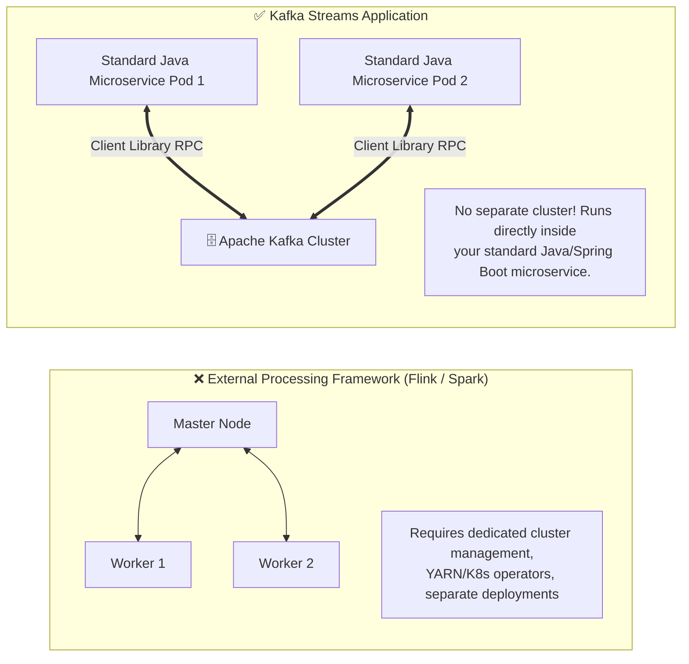
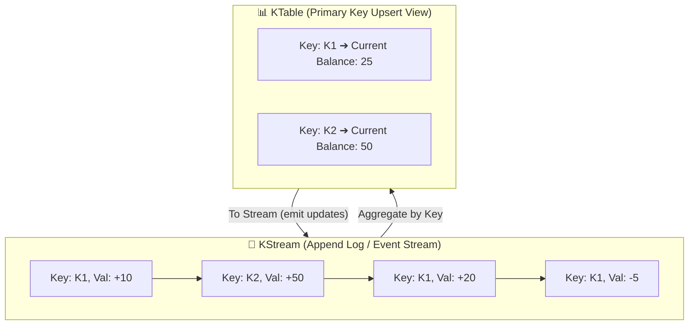
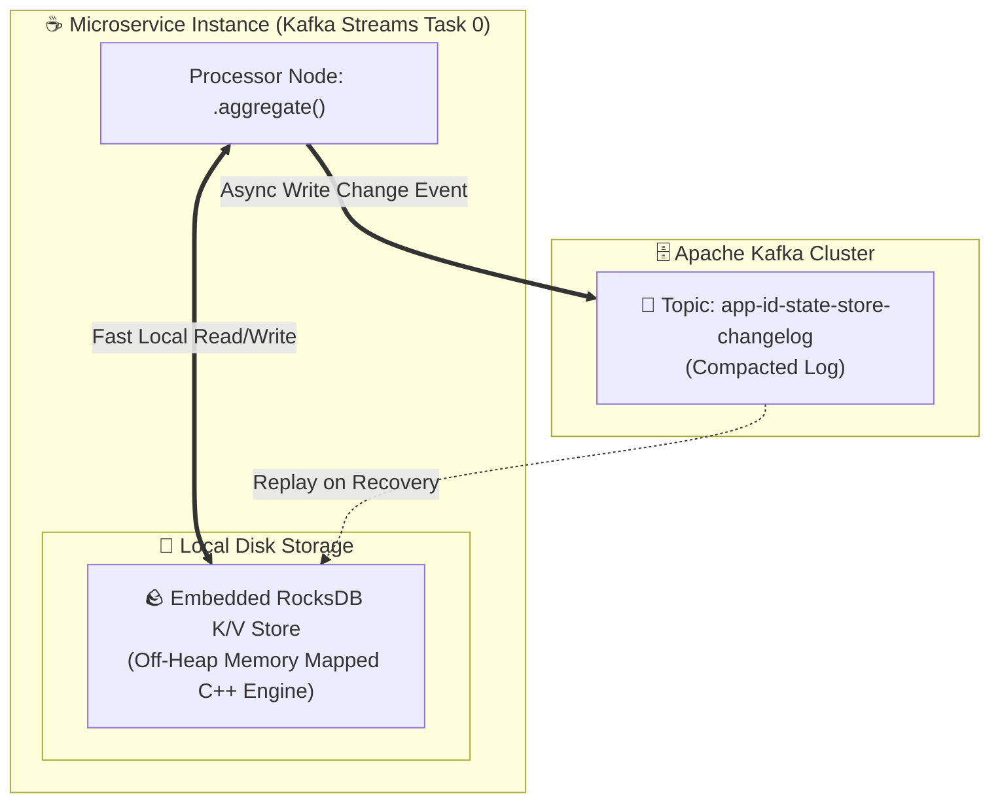

# 🌊 Kafka Streams & Stateful Processing

## 🎯 Learning Objectives

By the end of this module, you will be able to:
- Explain the Stream-Table Duality and contrast `KStream`, `KTable`, and `GlobalKTable`.
- Deconstruct the execution topology of a Kafka Streams application down to Stream Threads, Tasks, and Processor Nodes.
- Implement stateful operations (aggregations, counts, windowing) backed by embedded **RocksDB** local state stores.
- Trace state recovery mechanics using internal **Changelog Topics** and Standby Replicas.
- Execute windowed joins (Stream-Stream, Stream-Table) while handling out-of-order events using Grace Periods.

---

## 💡 Core Explanation

### 1. What is Kafka Streams?

Unlike external cluster-based processing engines (like Apache Flink or Apache Spark Streaming), **Kafka Streams** is a lightweight, client library written in Java/Scala.



Key Architectural Advantages:
- **No Processing Cluster Needed**: Runs natively inside standard application containers (Spring Boot, Quarkus, Kubernetes Pods).
- **Elastic Scaling**: Leverages Kafka's Consumer Group protocol. Adding a microservice instance automatically rebalances stream tasks across instances.
- **Exactly-Once Stream Processing**: Built-in support for EOS (`processing.guarantee=exactly_once_v2`).

---

### 2. The Stream-Table Duality (`KStream` vs `KTable` vs `GlobalKTable`)

The fundamental concept behind stateful event processing is the **Stream-Table Duality**: A stream can be viewed as a table, and a table can be viewed as a stream.

```text
Stream-Table Duality:
- A Stream (KStream) is a changelog of events (Insert / Append log).
- A Table (KTable) is a snapshot of current state (Primary Key update lookup).
```



#### Comparison of Stream/Table Abstractions:

| Abstraction | Behavior | Partition Partitioning | Use Case |
| :--- | :--- | :--- | :--- |
| **`KStream<K, V>`** | Represents an unbounded stream of individual, independent record events. | Partitioned by record Key | Clickstreams, sensor readings, transaction logs |
| **`KTable<K, V>`** | Represents a changelog table. Each record is an **UPSERT** (update if key exists, insert if new, delete if null value). | Partitioned 1:1 with input topic partitions | User balances, current account state, profile lookup |
| **`GlobalKTable<K, V>`** | Represents a complete, unpartitioned table replicated across **ALL application instances**. | Fully replicated on every worker | Small, static reference lookup data (e.g. zip codes, exchange rates) |

---

### 3. Stateful Processing & Embedded RocksDB State Stores

When performing stateful operations (e.g. `count()`, `aggregate()`, `windowedBy()`), Kafka Streams does NOT hold state in JVM heap memory (which would risk OutOfMemory errors and long GC pauses).

Instead, each task maintains an **Embedded RocksDB Key-Value State Store** stored on the local disk filesystem!



#### State Fault Tolerance & Changelog Topics:
What happens if the physical server hosting the RocksDB state store crashes?
1. Every state store modification is automatically replicated to an internal, log-compacted Kafka topic called a **Changelog Topic** (`<app-id>-<state-store-name>-changelog`).
2. When the task is reassigned to another microservice instance during failover, the new instance creates a fresh RocksDB instance and **replays the Changelog Topic** to rebuild the exact local state in seconds!
3. **Standby Replicas** (`num.standby.replicas=1`): Instructs standby workers to continuously tail the changelog topic in real time—enabling **instantaneous failover with 0-second state recovery time!**

---

### 4. Windowing Strategies & Out-of-Order Data

When computing aggregations over time (e.g. "count clicks per user per 5-minute window"), Kafka Streams provides four distinct window types:

```mermaid
flowchart TD
    subgraph Tumbling ["1. Tumbling Window (Fixed, Non-overlapping)"]
        direction LR
        W1["[00:00 - 00:05]"] --- W2["[00:05 - 00:10]"] --- W3["[00:10 - 00:15]"]
    end

    subgraph Hopping ["2. Hopping Window (Fixed size, Overlapping hop)"]
        direction LR
        H1["[00:00 - 00:05]"]
        H2["[00:01 - 00:06]"]
        H1 -.- H2
    end

    subgraph Sliding ["3. Sliding Window (Driven by record timestamps)"]
        S1["Window anchored around event time t ± delta"]
    end

    subgraph Session ["4. Session Window (Inactivity gap threshold)"]
        SS1["[User Active...]"] --- Gap["Inactivity Gap > 15m"] --- SS2["[User Active...]"]
    end
```



#### Handling Late & Out-of-Order Data (Grace Periods)
In real-world networks, mobile devices or network hiccups cause records to arrive late (out of order).

```java
// Define 5-minute tumbling window with a 1-minute Grace Period
TimeWindows.ofSizeWithNoGrace(Duration.ofMinutes(5))
           .grace(Duration.ofMinutes(1));
```

- **Event Time vs Processing Time**: Kafka Streams evaluates windows strictly using **Event Time** (timestamp embedded inside record header), NOT broker wall-clock processing time.
- **Grace Period**: Records arriving within the window time plus the grace period update the existing window result. Records arriving *after* `WindowEnd + GracePeriod` are dropped as expired.

---

## 🛠️ Working Examples & Production Code

### 1. Real-Time Order Aggregation Pipeline (Java)

```java
import org.apache.kafka.common.serialization.Serdes;
import org.apache.kafka.streams.*;
import org.apache.kafka.streams.kstream.*;
import java.time.Duration;
import java.util.Properties;

public class OrderAggregationTopology {
    public static void main(String[] args) {
        Properties config = new Properties();
        config.put(StreamsConfig.APPLICATION_ID_CONFIG, "order-analytics-app-v1");
        config.put(StreamsConfig.BOOTSTRAP_SERVERS_CONFIG, "localhost:9092");
        config.put(StreamsConfig.DEFAULT_KEY_SERDE_CLASS_CONFIG, Serdes.String().getClass().getName());
        config.put(StreamsConfig.DEFAULT_VALUE_SERDE_CLASS_CONFIG, Serdes.Double().getClass().getName());
        
        // Enable Exactly-Once Semantics v2
        config.put(StreamsConfig.PROCESSING_GUARANTEE_CONFIG, StreamsConfig.EXACTLY_ONCE_V2);
        
        // Configure Standby Replicas for instant state failover
        config.put(StreamsConfig.NUM_STANDBY_REPLICAS_CONFIG, 1);

        StreamsBuilder builder = new StreamsBuilder();

        // 1. Source KStream: Read raw order amounts (Key: customer_id, Value: amount)
        KStream<String, Double> orderStream = builder.stream("raw-orders");

        // 2. Stateful Processing: Aggregate total spend per customer in 5-minute tumbling windows
        KTable<Windowed<String>, Double> aggregateStore = orderStream
            .groupByKey()
            .windowedBy(TimeWindows.ofSizeWithNoGrace(Duration.ofMinutes(5))
                                   .grace(Duration.ofMinutes(1)))
            .aggregate(
                () -> 0.0, // Initializer
                (key, newAmount, total) -> total + newAmount, // Aggregator
                Materialized.<String, Double, org.apache.kafka.streams.state.WindowStore<org.apache.kafka.common.utils.Bytes, byte[]>>
                    as("customer-spend-store")
                    .withKeySerde(Serdes.String())
                    .withValueSerde(Serdes.Double())
            );

        // 3. Sink Stream: Format output and write to downstream analytics topic
        aggregateStore
            .toStream()
            .map((windowedKey, totalSpend) -> 
                new KeyValue<>(
                    windowedKey.key() + "@" + windowedKey.window().startTime().getEpochSecond(),
                    "Total spend: $" + totalSpend
                )
            )
            .to("customer-spend-summary", Produced.with(Serdes.String(), Serdes.String()));

        // Start Kafka Streams Execution Thread
        KafkaStreams streams = new KafkaStreams(builder.build(), config);
        
        // Clean shutdown hook
        Runtime.getRuntime().addShutdownHook(new Thread(streams::close));
        streams.start();
    }
}
```

### 2. KStream-KTable Join Example (Enriching Events)

```java
// KStream (Orders) JOIN KTable (Customer Profiles)
KStream<String, OrderEvent> orders = builder.stream("orders-topic");
KTable<String, CustomerProfile> profiles = builder.table("customer-profiles-topic");

KStream<String, EnrichedOrder> enrichedStream = orders.join(profiles,
    (order, profile) -> new EnrichedOrder(order, profile.getEmail(), profile.getTier()),
    Joined.with(Serdes.String(), new OrderSerde(), new ProfileSerde())
);

enrichedStream.to("enriched-orders");
```

---

## ⚠️ Common Pitfalls & Misconceptions

1. **Pitfall: Performing KStream-KStream joins without partition alignment (Co-partitioning).**
   *Reality*: To join two streams (`Stream A` and `Stream B`), both input topics MUST be **co-partitioned**: they must have the exact same number of partitions and use the exact same key partitioning strategy. If partition counts differ, Kafka Streams throws a `TopologyException` or silently computes incorrect joins!
   *Fix*: Call `.repartition()` prior to executing the join.
2. **Pitfall: Storing large object graphs inside RocksDB without tuning off-heap memory.**
   *Reality*: By default, RocksDB allocates off-heap native C++ memory for block caches and memtables. In multi-task Kubernetes pods with restricted RAM limits, unconstrained RocksDB instances will trigger **Linux OOM-Kills** on the container process!
3. **Misconception: `KTable` stores all historic events for a key.**
   *Reality*: `KTable` stores **ONLY the latest value** for each key (just like a relational database primary key table). Historic intermediate values are overwritten.

---

## 🔀 Structural Comparisons

| Feature | `KStream` | `KTable` | `GlobalKTable` |
| :--- | :--- | :--- | :--- |
| **Semantics** | Event Stream (Append) | Primary Key Table (Upsert) | Replicated Reference Table |
| **Null Value Handling** | Processed as record | Processed as **Tombstone (Delete key)** | Processed as **Tombstone (Delete key)** |
| **Partition Topology** | Partitioned across tasks | Partitioned 1:1 with input topic | Fully replicated on EVERY node |
| **Memory Footprint** | Stateless (Minimal memory) | Local RocksDB store (Partition bounded) | Local RocksDB store (Full dataset size) |
| **Join Capability** | Joins with KStream / KTable | Joins with KStream / KTable | Can be joined without co-partitioning! |

---

## ✅ Quick Reference / Cheat-Sheet

```text
Essential Dependencies:  kafka-streams, kafka-clients
Processing Guarantee:    StreamsConfig.PROCESSING_GUARANTEE_CONFIG = "exactly_once_v2"
State Storage Path:      /tmp/kafka-streams/<application.id>/ (Default disk path)

Topology Nodes:
  Source Node:    builder.stream("topic")  -> Consumes from Kafka
  Processor Node: .filter(), .map(), .groupByKey(), .aggregate() -> Transforms data
  Sink Node:      .to("topic")            -> Produces to Kafka
```

---

[← Previous](./07-kafka-connect-and-schema-evolution) | [Index](./00-index.mdx) | [Next →](./09-production-operations-and-tuning)
