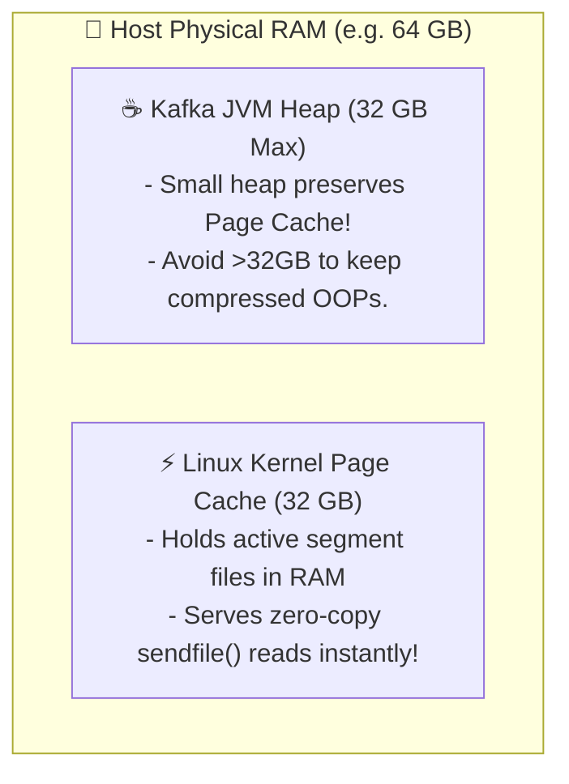
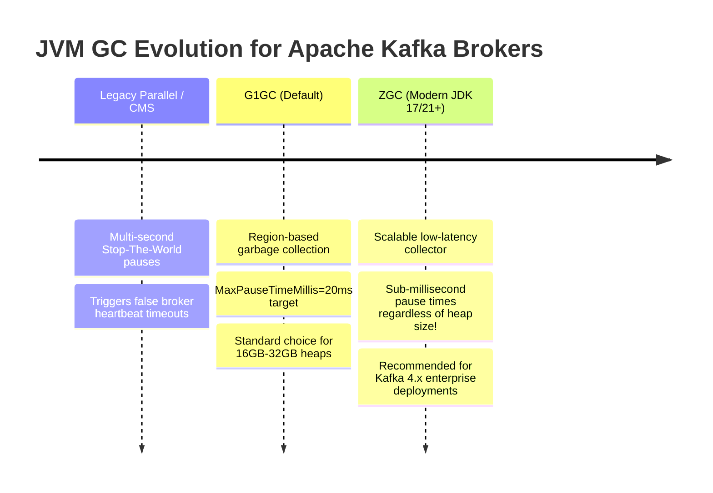
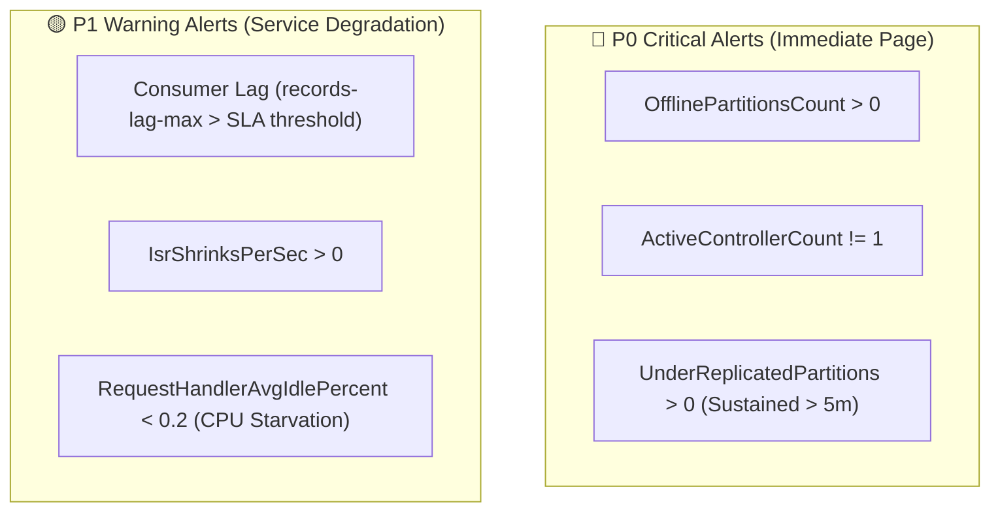
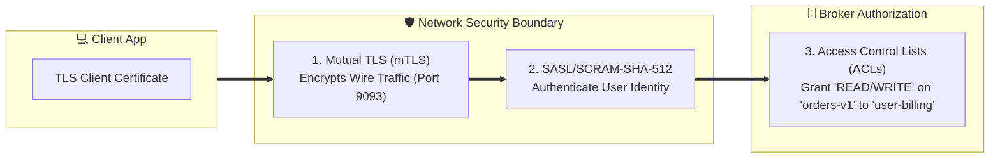
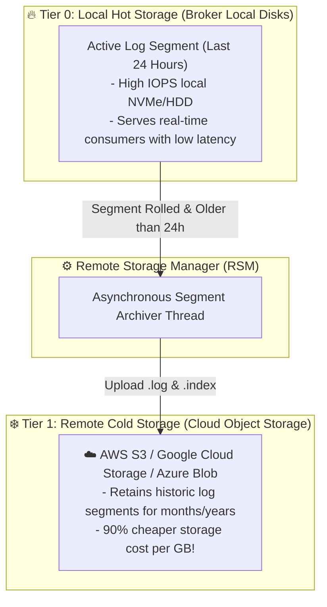

# 🛠️ Production Operations & Performance Tuning

## 🎯 Learning Objectives

By the end of this module, you will be able to:
- Tune Linux Kernel OS parameters (`vm.swappiness`, `vm.dirty_background_ratio`, file descriptors) for high-throughput I/O.
- Configure JVM Garbage Collection (G1GC vs ZGC) to prevent broker stop-the-world pauses.
- Build alerting dashboards around vital JMX metrics (Under-Replicated Partitions, Consumer Lag, Active Controller).
- Secure Kafka clusters using Mutual TLS (mTLS), SASL/SCRAM, and ACL authorization.
- Architect Tiered Storage to offload historical log segments to cloud object stores (AWS S3, GCS) cost-effectively.

---

## 💡 Core Explanation

### 1. Linux Kernel & OS Tuning for Maximum Disk I/O

Running Apache Kafka in production requires tuning the underlying Linux kernel to prevent disk I/O bottlenecks and memory swapping.



#### 1. Page Cache vs. JVM Heap Allocation Rule
> **Rule of Thumb**: Allocate no more than 50% of total physical RAM to the Kafka JVM heap (typically 16GB–32GB). Reserve the remaining 50%+ for the **Linux Kernel Page Cache**!

#### 2. Essential Kernel Parameters (`/etc/sysctl.conf`):

```ini
# Disable swapping completely (Swapping JVM memory to disk causes devastating latency spikes)
vm.swappiness = 1

# Dirty Page Flush Ratios: Force background kernel threads to flush dirty pages to disk early
vm.dirty_background_ratio = 5
vm.dirty_ratio = 10

# Virtual Memory Map Limits (Required for RocksDB and mmap index files)
vm.max_map_count = 1048576

# Network Socket Max Backlog & Buffer Tuning
net.core.somaxconn = 65535
net.ipv4.tcp_wmem = 4096 65536 16777216
net.ipv4.tcp_rmem = 4096 87380 16777216
```

#### 3. File Descriptors (`/etc/security/limits.conf`):
Each partition segment file (`.log`, `.index`, `.timeindex`) plus every active TCP socket requires a file descriptor.
```ini
kafka  soft  nofile  100000
kafka  hard  nofile  100000
```

---

### 2. JVM Garbage Collection: G1GC vs. ZGC

Long JVM Garbage Collection pauses are the #1 cause of false broker node failures, ISR shrinkage, and metadata timeouts.



#### Recommended JVM Options (`KAFKA_GC_LOG_OPTS`):

```bash
# Recommended G1GC Parameters (JDK 17+)
-XX:+UseG1GC
-XX:MaxGCPauseMillis=20
-XX:InitiatingHeapOccupancyPercent=45
-XX:G1ReservePercent=15
-XX:MinMetaspaceFreeRatio=50
-XX:MaxMetaspaceFreeRatio=80

# Alternative: Modern Low-Latency ZGC (JDK 21+)
-XX:+UseZGC
-XX:+ZGenerational
```

---

### 3. Critical Production JMX Metrics & Alerting Thresholds

Production monitoring requires polling Kafka's JMX MBeans and establishing real-time alerts.



#### Crucial JMX MBean Reference Table:

| Metric Name | MBean Object Name | Warning Threshold | Critical Threshold | Meaning & Action Required |
| :--- | :--- | :--- | :--- | :--- |
| **`UnderReplicatedPartitions`** | `kafka.server:type=ReplicaManager,name=UnderReplicatedPartitions` | `> 0` (for `> 5m`) | `> 10` | Replicas are lagging behind Leader. Check disk I/O, network bandwidth, or failed broker. |
| **`OfflinePartitionsCount`** | `kafka.controller:type=KafkaController,name=OfflinePartitionsCount` | `> 0` | `> 0` | Partitions have **NO active leader**. Reads/Writes to partition are failing! |
| **`ActiveControllerCount`** | `kafka.controller:type=KafkaController,name=ActiveControllerCount` | `!= 1` | `= 0` or `> 1` | Sum across cluster MUST equal 1. 0 means split-brain / missing controller quorum. |
| **`IsrShrinksPerSec`** | `kafka.server:type=ReplicaManager,name=IsrShrinksPerSec` | `> 0` (Spike) | `> 5` | Followers getting kicked out of ISR. Network partition or broker GC pause occurring. |
| **`RequestHandlerAvgIdlePercent`**| `kafka.server:type=KafkaRequestHandlerPool,name=RequestHandlerAvgIdlePercent` | `< 0.3` | `< 0.1` | Fraction of time request handler threads are idle. `< 0.1` means broker CPU is exhausted! |
| **`records-lag-max`** | `kafka.consumer:type=consumer-fetch-manager-metrics,name=records-lag-max` | High | High SLA breach | Consumer group is falling behind producer rate. Scale up consumer instances. |

---

### 4. Enterprise Security Architecture: Authentication, TLS, & ACLs

Kafka security encompasses three distinct layers: Encryption, Authentication, and Authorization.



#### 1. Security Protocols (`security.protocol`):
- **`PLAINTEXT`**: Unencrypted, unauthenticated (Local dev only).
- **`SSL` / `TLS`**: Encrypted wire traffic, optional client cert auth.
- **`SASL_PLAINTEXT`**: SASL auth over unencrypted channel.
- **`SASL_SSL`**: SASL auth over encrypted TLS tunnel (Production Standard).

#### 2. Access Control Lists (ACLs):
Kafka enforces fine-grained authorization rules via CLI or API.

```bash
# Grant Principal 'User:billing-app' READ authorization on Topic 'order-events'
kafka-acls.sh --bootstrap-server localhost:9092 \
  --add --allow-principal User:billing-app \
  --operation Read --operation Describe \
  --topic order-events \
  --group billing-service-group
```

---

### 5. Modern Tiered Storage Architecture

Historically, storing months or years of historical data in Kafka required attaching massive arrays of expensive local NVMe/SSD storage to broker nodes.

**Tiered Storage** (introduced in Kafka 3.x / 4.x - KIP-405) separates **compute from storage** by splitting log segments into two storage tiers:



> 💡 **Tiered Read Path**: Real-time consumers read from Tier 0 (Page Cache). Historical replay consumers stream directly from S3/Cold Storage!

Benefits of Tiered Storage:
- **Infinite Data Retention**: Store petabytes of event streams indefinitely without scaling broker disk counts.
- **Instant Broker Recovery**: Rejoining brokers only need to fetch Tier 0 local hot segments, reducing cluster recovery time from days to minutes.
- **Cost Reduction**: Replaces $0.08/GB enterprise block storage with $0.02/GB cloud object storage.

---

## 🛠️ Working Examples & Hands-On Commands

### 1. Enterprise Security Broker Configuration (`server.properties`)

```properties
# Listeners Configuration (Dual Ports: Internal Inter-Broker & External Client)
listeners=INTERNAL://kafka1.internal:9092,EXTERNAL://kafka1.internal:9093
advertised.listeners=INTERNAL://kafka1.internal:9092,EXTERNAL://kafka1.internal:9093
listener.security.protocol.map=INTERNAL:SSL,EXTERNAL:SASL_SSL

# Inter-Broker Communication
inter.broker.listener.name=INTERNAL

# TLS / SSL KeyStore and TrustStore Configuration
ssl.keystore.location=/var/private/ssl/kafka.server.keystore.jks
ssl.keystore.password=KeystoreSecret123
ssl.key.password=KeySecret123
ssl.truststore.location=/var/private/ssl/kafka.server.truststore.jks
ssl.truststore.password=TruststoreSecret123

# SASL Authentication Engine (SCRAM-SHA-512)
sasl.enabled.mechanisms=SCRAM-SHA-512
sasl.mechanism.inter.broker.protocol=SCRAM-SHA-512

# Authorizer Plugin (KRaft Standard Authorizer)
authorizer.class.name=org.apache.kafka.metadata.authorizer.StandardAuthorizer
super.users=User:admin
```

### 2. Monitoring JMX Metrics via JConsole or Prometheus Exporter

To expose JMX metrics over HTTP for Prometheus scraping, run the `jmx_prometheus_javaagent`:

```bash
# Export JMX metrics on port 7071
export KAFKA_OPTS="-javaagent:/opt/prometheus/jmx_prometheus_javaagent-0.20.0.jar=7071:/opt/prometheus/kafka-2_0_0.yml"
bin/kafka-server-start.sh config/kraft-broker.properties
```

Sample Prometheus Alerting Rule (`kafka_alerts.yml`):

```yaml
groups:
  - name: kafka_broker_alerts
    rules:
      - alert: KafkaUnderReplicatedPartitions
        expr: kafka_server_replicamanager_underreplicatedpartitions > 0
        for: 5m
        labels:
          severity: critical
        annotations:
          summary: "Kafka broker {{ $labels.instance }} has under-replicated partitions!"
          description: "Under-replicated partitions count is {{ $value }} for over 5 minutes."
```

---

## ⚠️ Common Pitfalls & Misconceptions

1. **Pitfall: Setting JVM Heap size to 64GB+ on large RAM servers.**
   *Reality*: Setting JVM heaps larger than 32GB disables compressed object pointers (`CompressedOOPs`), increasing memory overhead by 30%. Furthermore, huge heaps lead to massive Garbage Collection pause times. Keep JVM heaps `<= 32GB` and leave remaining RAM to the OS Page Cache!
2. **Pitfall: Neglecting `vm.swappiness` tuning on Linux hosts.**
   *Reality*: By default, Linux kernels swap aggressively (`vm.swappiness=60`). If the OS swaps parts of the JVM heap to disk during peak I/O, broker response times will jump from 2ms to **15,000ms**, triggering heartbeat timeouts and cascading ISR collapses!
3. **Misconception: TLS wire encryption reduces disk I/O performance.**
   *Reality*: TLS encrypts data moving over TCP network sockets between client and broker. It has **zero impact on disk storage format**—data stored on disk log segments remains unencrypted (unless application-level payload encryption or disk LUKS encryption is explicitly configured).

---

## 🔀 Structural Comparisons

| Security / Operating Profile | Dev / Sandbox | Enterprise Standard (Internal) | Zero-Trust Enterprise (Cloud/PCI-DSS) |
| :--- | :--- | :--- | :--- |
| **Listener Protocol** | `PLAINTEXT` | `SSL` (TLS 1.3) | `SASL_SSL` |
| **Authentication** | Anonymous | Mutual TLS Certs (mTLS) | SASL / SCRAM-SHA-512 or Kerberos |
| **Authorization** | Disabled | Standard ACLs | Standard ACLs + Audit Logging |
| **JVM Heap** | 2 GB | 16 GB (G1GC) | 32 GB (Generational ZGC) |
| **Storage Architecture** | Single Local Disk | Multi-disk RAID 10 Local Storage | Tiered Storage (Local Hot + S3 Cold) |

---

## ✅ Quick Reference / Cheat-Sheet

```properties
# Essential Linux OS Tuning:
sysctl -w vm.swappiness=1
sysctl -w vm.max_map_count=1048576
ulimit -n 100000

# Critical JMX Alert Metric MBeans:
# 1. UnderReplicatedPartitions: kafka.server:type=ReplicaManager,name=UnderReplicatedPartitions
# 2. OfflinePartitionsCount:   kafka.controller:type=KafkaController,name=OfflinePartitionsCount
# 3. ActiveControllerCount:    kafka.controller:type=KafkaController,name=ActiveControllerCount

# Tiered Storage Configuration Preset:
remote.log.storage.system.enable=true
remote.log.manager.class.name=org.apache.kafka.server.log.remote.storage.RemoteLogManager
```

---

[← Previous](./08-kafka-streams-and-stateful-processing) | [Index](./00-index.mdx) | [Next →](./10-comparisons-and-architectural-patterns)
