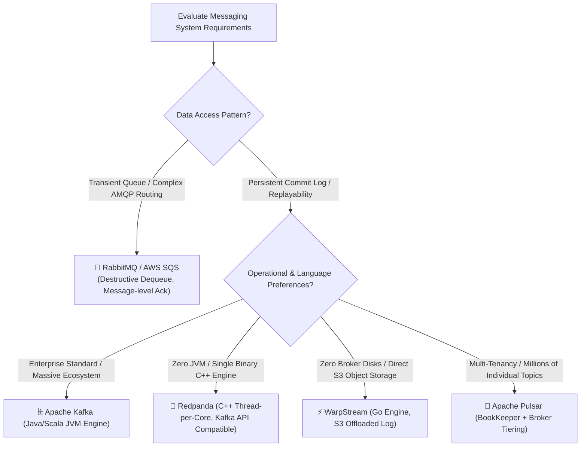
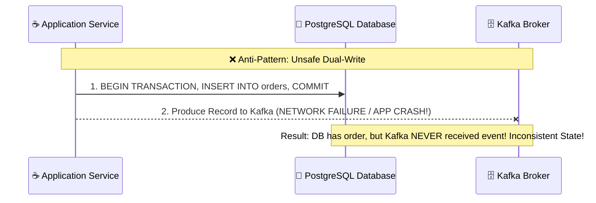
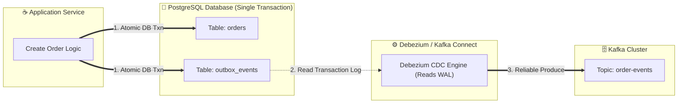
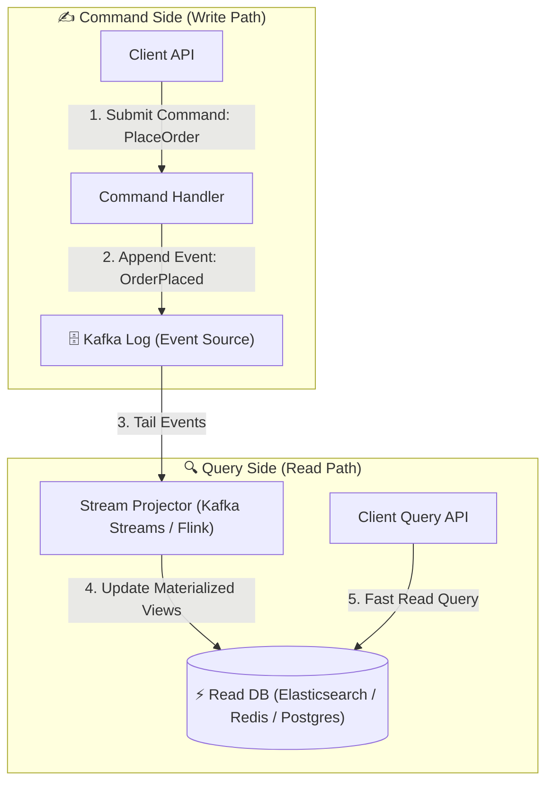
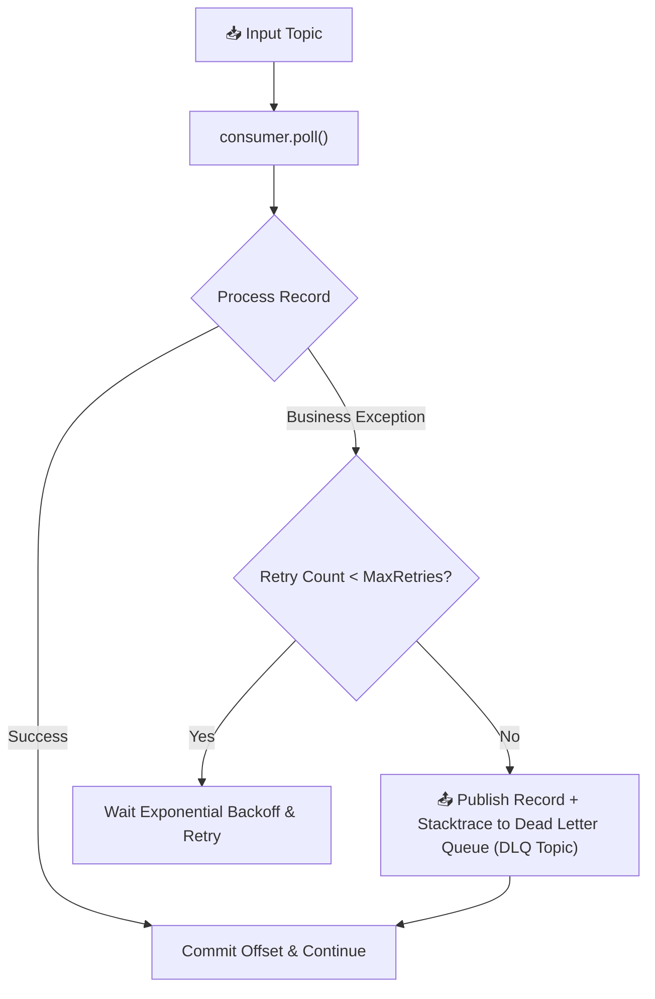
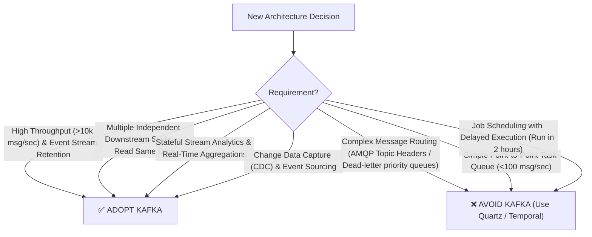

# 🔀 Comparisons & Architectural Patterns

## 🎯 Learning Objectives

By the end of this module, you will be able to:
- Compare Apache Kafka against traditional message brokers (RabbitMQ), streaming alternatives (Apache Pulsar), C++ engines (Redpanda), and cloud-native log engines (WarpStream).
- Implement the **Transactional Outbox Pattern** to prevent dual-write inconsistencies between RDBMS and event topics.
- Design Change Data Capture (CDC) architectures using Debezium to stream database mutations into Kafka.
- Architect Event-Sourced systems with CQRS (Command Query Responsibility Segregation) backed by Kafka log retention.
- Evaluate technical decision criteria to determine when to adopt or avoid Apache Kafka in production system designs.

---

## 💡 Core Explanation

### 1. Comparative Analysis: Kafka vs. Alternatives

Choosing the right messaging or streaming technology requires evaluating access patterns, state durability, routing complexity, and operational overhead.



#### Detailed Architecture Comparison Matrix:

| Feature | Apache Kafka (4.x) | RabbitMQ | Apache Pulsar | Redpanda | WarpStream |
| :--- | :--- | :--- | :--- | :--- | :--- |
| **Primary Paradigm** | Distributed Log | Transient Queue | Segmented Log Stream | Distributed Log | Cloud-Native Log |
| **Storage Architecture** | Broker Local Disks (KRaft) | RAM + Transient Disk Paging | Apache BookKeeper + Brokers | Broker Local Disks (Raft in C++) | AWS S3 / Object Storage Direct |
| **Data Lifecycle** | Non-destructive (Time/Compaction) | Destructive upon ACK | Non-destructive | Non-destructive | Non-destructive |
| **Kafka API Parity** | Native | ❌ None (AMQP / MQTT) | 🟡 Adapter | ✅ 100% Drop-in Wire Compatible | ✅ 100% Drop-in Wire Compatible |
| **JVM Dependency** | Yes (Java 17/21) | No (Erlang) | Yes (Java) | No (C++20 Seastar) | No (Go) |
| **Routing Flexibility** | Topic/Partition Key | Exchange Routing Keys | Topic / Tenant / Namespace | Topic/Partition Key | Topic/Partition Key |
| **Best Fit** | High Throughput Stream Analytics, CDC, Event Sourcing | Complex task routing, microservice RPC queues | Multi-tenant SaaS, millions of micro topics | Low-latency C++ Kafka API alternative | Low-cost S3 log storage, stateless brokers |

---

### 2. Core System Design Patterns

#### Pattern 1: The Transactional Outbox Pattern (Eliminating Dual-Write Failures)

When a service needs to write to an RDBMS (e.g. `INSERT INTO orders`) AND publish an event to Kafka (e.g. `order-created`), doing both directly in application code creates a **Dual-Write Vulnerability**:



#### The Outbox Pattern Solution:
Instead of publishing directly to Kafka, the application writes the event into an **Outbox Table** inside the *same atomic database transaction*. A CDC engine (like Debezium) then reads the Outbox table and publishes events to Kafka with **100% atomicity guarantee!**



---

#### Pattern 2: Change Data Capture (CDC) with Debezium

**Change Data Capture (CDC)** observes transaction log commits on relational databases (e.g. PostgreSQL WAL, MySQL Binlog) and streams exact row mutation events (`INSERT`, `UPDATE`, `DELETE`) into Kafka topics in real time.

```json
{
  "before": { "id": 101, "status": "PENDING", "amount": 49.99 },
  "after":  { "id": 101, "status": "SHIPPED", "amount": 49.99 },
  "source": { "version": "2.4.0", "connector": "postgresql", "db": "orderdb", "table": "orders" },
  "op": "u", 
  "ts_ms": 1784770000123
}
```
*Key benefit*: Zero modifications required to legacy application source code to turn traditional databases into real-time streaming sources!

---

#### Pattern 3: Event Sourcing & CQRS

In traditional CRUD systems, only the current state of an entity is stored (overwriting historic state). 

In **Event Sourcing**, state changes are stored as an immutable sequence of facts in a Kafka log. 

**CQRS (Command Query Responsibility Segregation)** separates write commands from read queries:



Benefits of CQRS + Event Sourcing with Kafka:
- **Complete Audit Trail**: Every historic state mutation is permanently retained in the append-only commit log.
- **Rewind and Re-project**: If a new analytics requirement is introduced, point a new projector to Offset 0 of the Kafka topic to build a new specialized database view from scratch!

---

#### Pattern 4: Dead Letter Queue (DLQ) & Error Handling

When processing event streams, malformed or poisonous records ("Poison Pills") cause consumer processing threads to crash repeatedly.



---

## 🛠️ Working Examples & Hands-On Commands

### 1. PostgreSQL Outbox DDL Schema & Debezium Outbox Transform

```sql
-- Create Outbox Table in PostgreSQL
CREATE TABLE outbox_events (
    id UUID PRIMARY KEY,
    aggregate_type VARCHAR(255) NOT NULL,
    aggregate_id VARCHAR(255) NOT NULL,
    type VARCHAR(255) NOT NULL,
    payload JSONB NOT NULL,
    created_at TIMESTAMP WITH TIME ZONE DEFAULT CURRENT_TIMESTAMP
);

-- Example Application Transaction:
BEGIN;

INSERT INTO orders (id, customer_id, total_amount, status)
VALUES ('b39a8c1f-4d3e', 4092, 199.99, 'PLACED');

INSERT INTO outbox_events (id, aggregate_type, aggregate_id, type, payload)
VALUES (
    'a11b2c3d-4e5f', 
    'Order', 
    'b39a8c1f-4d3e', 
    'OrderPlaced', 
    '{"order_id": "b39a8c1f-4d3e", "customer_id": 4092, "amount": 199.99}'
);

COMMIT;
```

### 2. Debezium Outbox Event Router Connector Configuration

```json
{
  "name": "debezium-outbox-connector",
  "config": {
    "connector.class": "io.debezium.connector.postgresql.PostgresConnector",
    "tasks.max": "1",
    "plugin.name": "pgoutput",
    "database.hostname": "postgres.internal",
    "database.port": "5432",
    "database.user": "debezium",
    "database.password": "dbz_password",
    "database.dbname": "orderdb",
    "table.include.list": "public.outbox_events",

    "transforms": "outbox",
    "transforms.outbox.type": "io.debezium.transforms.outbox.EventRouter",
    "transforms.outbox.route.by.field": "aggregate_type",
    "transforms.outbox.route.topic.replacement": "events-$--user-events"
  }
}
```

---

## ⚠️ Common Pitfalls & Misconceptions

1. **Pitfall: Treating Kafka as a traditional task queue.**
   *Reality*: Trying to implement individual message-level work queues with selective ACKs (like RabbitMQ or SQS) in standard Kafka is inefficient because partition consumption is sequential per offset.
   *Note*: Kafka 4.0 introduced **KIP-932 (Share Groups / Queues for Kafka)** to provide native message-level queueing alongside traditional partition streaming!
2. **Pitfall: Using dual-writes without an outbox table.**
   *Reality*: Writing to a database and then calling `producer.send()` in Java code *will* eventually fail when network hiccups or process crashes occur between the two writes, resulting in silent database-to-Kafka state drift.
3. **Misconception: Event Sourcing replaces relational databases entirely.**
   *Reality*: While Kafka stores the immutable log of events, executing complex ad-hoc SQL joins directly on log streams is inefficient. Event Sourcing works best when paired with specialized read-side databases via CQRS.

---

## 🔀 Decision Matrix: When to Use vs. Avoid Kafka



---

## ✅ Quick Reference / Cheat-Sheet

```text
Outbox Pattern Core Rule: Write application state AND event outbox record in ONE local DB transaction.
CDC Core Engine:           Debezium (Reads PostgreSQL WAL / MySQL Binlog -> Kafka Topics).
CQRS Pattern Rule:        Separate Write Path (Event Log) from Read Path (Materialized Views).
DLQ Pattern Rule:         Reroute non-retryable deserialization failures to a dedicated .DLQ topic.
```

---

[← Previous](./09-production-operations-and-tuning) | [Index](./00-index.mdx)
