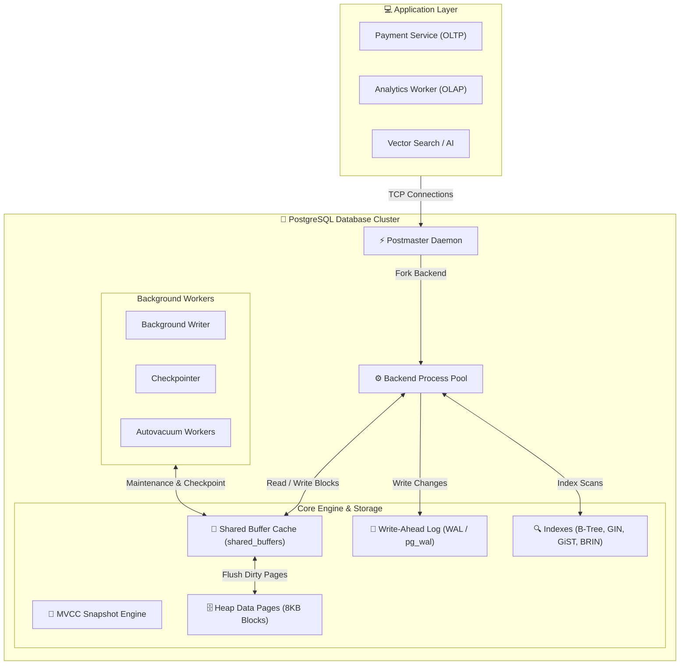

# 🧭 PostgreSQL — Overview & Curriculum

## 🎯 What Problem PostgreSQL Solves

Modern applications demand high transactional throughput, complex query support, strict ACID compliance, and data durability without sacrificing extensibility. Proprietary relational engines often lock users into expensive licensing models, while simpler relational databases sacrifice advanced concurrency control, rich indexing, or custom data types.

**PostgreSQL** solves this by offering an enterprise-grade, open-source **Object-Relational Database Management System (ORDBMS)** built on an append-only Multi-Version Concurrency Control (MVCC) heap engine. Designed from inception around extensibility and strict correctness, PostgreSQL isolates readers from writers using tuple versioning, provides extensible indexing frameworks (B-Tree, GIN, GiST, BRIN), supports advanced declarative partitioning, and ensures durable durability via Write-Ahead Logging (WAL). Whether serving high-write transactional OLTP workloads, complex analytical queries, spatial GIS processing, or vector search for AI applications, PostgreSQL acts as a resilient, highly tunable data foundation.

---

## 📋 Assumed Background

This curriculum is designed specifically for **Senior Software Engineers, Database Engineers, and Systems Architects**.

- **What we assume you know**: Core computer science concepts (process isolation, virtual memory, OS file caching, disk I/O, B-Tree algorithms), standard relational algebra (JOINs, GROUP BYs, transactions), and system design fundamentals (ACID properties, replication, load balancing).
- **What we do NOT assume**: Prior operational or low-level internal knowledge of PostgreSQL internals, memory tuning, MVCC row versioning details, WAL structures, or autovacuum tuning.

---

## 🗺️ Curriculum Roadmap

| Module | Title | Primary Focus |
| :--- | :--- | :--- |
| **01** | [Core Architecture & Physical Storage Layout](./01-architecture-and-storage) | Process model, shared memory layout, 8KB page structure, tuple headers, and TOAST. |
| **02** | [MVCC & Transaction Isolation](./02-mvcc-and-transaction-isolation) | Tuple versioning (`xmin`/`xmax`), snapshots, isolation levels, row/table locking, and SSI. |
| **03** | [Vacuuming, Bloat & Tuple Lifecycle](./03-vacuuming-and-bloat) | Dead tuple accumulation, Autovacuum mechanics, FSM/VM maps, and XID wraparound protection. |
| **04** | [Indexing Deep Dive & Internals](./04-indexing-deep-dive) | B-Tree page splits, GIN for JSONB/full-text, GiST, BRIN for time-series, and index maintenance. |
| **05** | [Query Planning, Execution & Optimization](./05-query-planning-and-execution) | Query rewriter, statistics engine, cost model, join algorithms (Nested Loop, Hash, Merge), and EXPLAIN ANALYZE. |
| **06** | [Write-Ahead Logging (WAL) & Crash Recovery](./06-wal-and-crash-recovery) | ARIES logging, LSN tracking, checkpoints, full_page_writes, and WAL archiving. |
| **07** | [Replication, High Availability & Connection Management](./07-replication-and-ha) | Streaming replication, logical replication, replication slots, Patroni HA, and PgBouncer. |
| **08** | [Declarative Partitioning & Sharding](./08-partitioning-and-sharding) | Range/List/Hash partitioning, static/dynamic pruning, partitionwise joins, and FDW sharding. |
| **09** | [Production Operations, Monitoring & Tuning](./09-production-operations-and-tuning) | Baseline configuration, `pg_stat_statements`, physical backups (PITR), and Row Level Security (RLS). |
| **10** | [Comparisons & Architectural Trade-offs](./10-comparisons-and-architectural-trade-offs) | PostgreSQL vs MySQL/InnoDB, Distributed SQL (CockroachDB/YugabyteDB), pgvector, and decision matrix. |

---

## ⏱️ Estimated Time Investment

- **Foundational Modules (01 - 03)**: ~90 minutes
- **Core Engineering Modules (04 - 06)**: ~90 minutes
- **Advanced Systems Modules (07 - 10)**: ~120 minutes
- **Total Self-Study Duration**: ~5 hours

---

## 📖 Key Glossary

| Term | Definition |
| :--- | :--- |
| **Heap** | The unstructured on-disk table file where row data (tuples) is stored in 8KB pages without pre-determined ordering. |
| **Tuple** | The physical representation of a row version inside an 8KB data page, containing system header fields (`xmin`, `xmax`, `ctid`) and data attributes. |
| **MVCC** | Multi-Version Concurrency Control. Technique allowing concurrent reads and writes by maintaining multiple historical row versions. |
| **XID** | Transaction ID. A 32-bit monotonically increasing counter assigned to mutating transactions. |
| **LSN** | Log Sequence Number. A 64-bit integer pointing to an exact byte position in the Write-Ahead Log (WAL) stream. |
| **WAL** | Write-Ahead Log. Append-only log file recording state changes before dirty pages are written to data heap files. |
| **TOAST** | The Oversized-Attribute Storage Technique. Mechanism used to compress and split large attribute values exceeding 2KB across separate storage tables. |
| **FSM** | Free Space Map. A binary tree structure tracking available free bytes in each 8KB heap page for fast insert placement. |
| **VM** | Visibility Map. Bitfield tracking heap pages that contain only tuples visible to all current and future transactions (skips vacuuming & enables Index-Only Scans). |
| **Autovacuum** | Background daemon process that periodically scans tables to remove dead tuple pointers, update statistics, and freeze transaction IDs. |
| **HOT** | Heap-Only Tuple optimization. Allows row updates on the same page without creating new index entries if no indexed columns change. |
| **SSI** | Serializable Snapshot Isolation. Algorithm using SIREAD locks to detect dependency cycles and guarantee true serializability without blocking. |

---

[Next → Core Architecture & Physical Storage Layout](./01-architecture-and-storage)
