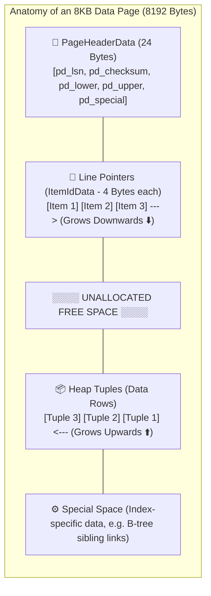
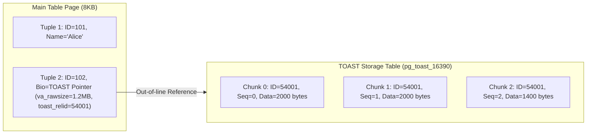

# 🏗️ Core Architecture & Physical Storage Layout

## 🎯 Learning Objectives

By the end of this module, you will be able to:
- Trace the lifecycle of a client connection through the Postmaster daemon and backend process model.
- Deconstruct the shared memory footprint (`shared_buffers`, WAL buffers) vs per-backend memory (`work_mem`).
- Inspect the raw physical file system layout (`$PGDATA`, database OIDs, `relfilenode` segment files).
- Dissect an 8KB data page down to `PageHeaderData`, Line Pointers (`ItemIdData`), and `HeapTupleHeaderData` bytes using `pageinspect`.
- Explain how TOAST compresses and stores out-of-line attributes exceeding 2KB.

---

## 💡 Core Explanation

### 1. Process Model & Shared Memory Architecture

Unlike database systems that use a single process with multiple threads (e.g., MySQL or SQL Server), PostgreSQL employs a **process-based concurrency model**.

```mermaid
flowchart TD
    subgraph ClientLayer ["Client Applications"]
        C1["App Worker 1"]
        C2["App Worker 2"]
    end

    subgraph OSProcess ["PostgreSQL Instance (OS Processes)"]
        PM["⚡ Postmaster Process (main)"]
        BE1["⚙️ Backend Process (PID 1021)"]
        BE2["⚙️ Backend Process (PID 1022)"]
        
        subgraph BGProcesses ["Background Processes"]
            BGW[" Background Writer"]
            CKP[" Checkpointer"]
            WALW[" WAL Writer"]
            AVWorker[" Autovacuum Launcher / Workers"]
            Arch[" Archiver"]
        end

        subgraph SharedMem ["Shared Memory Allocation"]
            SB["🧠 shared_buffers (Data Pages Cache)"]
            WB["💾 WAL Buffers"]
            SL["🔒 Shared Lock Table & ProcArray"]
        end
    end

    C1 -->|TCP Connection| PM
    PM -->|fork() Backend| BE1
    C2 -->|TCP Connection| PM
    PM -->|fork() Backend| BE2

    BE1 <-->|Read / Write 8KB Pages| SB
    BE2 <-->|Read / Write 8KB Pages| SB
    BE1 -->|Append Logs| WB
    BE2 -->|Append Logs| WB

    CKP <-->|Flush Dirty Pages| SB
    BGW <-->|Clean Dirty Pages| SB
    WALW <-->|Flush WAL Logs| WB
```

#### The Postmaster Daemon & Backends
- **Postmaster Daemon (`postgres`)**: The supervisor process that listens on port 5432. Upon receiving a client connection, it authenticates the user and executes a system `fork()` call to spawn a dedicated **Backend Process**.
- **Backend Process**: A dedicated OS process that handles stateful client communication, parses queries, plans execution, and executes commands. If a backend crashes due to a segmentation fault, the supervisor kills all backends and resets shared memory to guarantee integrity.

#### Background Processes
- **Checkpointer**: Periodically flushes dirty data pages from `shared_buffers` to disk, establishing safe recovery checkpoints.
- **Background Writer (bgwriter)**: Continuously writes dirty pages to disk in small batches to maintain a steady pool of clean buffers, preventing backend processes from waiting during allocation.
- **WAL Writer**: Periodically flushes buffered Write-Ahead Log entries to disk.
- **Autovacuum Launcher & Workers**: Periodically scans tables to reclaim dead tuples, update visibility maps, and update statistics.

#### Shared vs Backend-Local Memory
- **`shared_buffers`**: Memory shared across all backends. Holds 8KB data and index page blocks loaded from disk. Typically sized to 25% of total system RAM.
- **`work_mem`**: Local memory allocated *per sort or hash operation* within a single backend query (e.g., ORDER BY, DISTINCT, Hash Join). If a query performs 4 parallel hash joins, it can consume `4 * work_mem`.
- **`maintenance_work_mem`**: Memory allocated for maintenance commands (`VACUUM`, `CREATE INDEX`, `ALTER TABLE`).

---

### 2. Disk Storage Layout & Relfilenode Mapping

PostgreSQL stores all data under the directory path specified by `$PGDATA`.

```text
$PGDATA/
├── PG_VERSION
├── base/                   # Database data directories (keyed by DB OID)
│   ├── 1/                  # Template 1 DB
│   └── 16384/              # Production Application Database
│       ├── 16390           # Table Heap File (Main Fork)
│       ├── 16390_fsm       # Free Space Map Fork
│       ├── 16390_vm        # Visibility Map Fork
│       └── 16390.1         # Segment 2 (when main file exceeds 1 GB)
├── global/                 # System-wide tables (pg_database, pg_authid)
├── pg_wal/                 # Write-Ahead Log segment files (16 MB each)
├── pg_tblspc/              # Symlinks to custom tablespaces
└── postgresql.conf         # Main configuration file
```

- **Database OID**: Every database is assigned an Object Identifier (OID). Database tables live inside `$PGDATA/base/<DB_OID>/`.
- **Relfilenode**: Every table and index is mapped to a physical disk file named after its `relfilenode`. If a table is rewritten via `VACUUM FULL` or `TRUNCATE`, its `relfilenode` changes while its `oid` in `pg_class` remains constant.
- **1 GB File Segmentation**: File systems handle large files differently; PostgreSQL limits table segment files to exactly 1 GB (`1073741824 bytes`). If a table reaches 3.2 GB, Postgres creates files `16390`, `16390.1`, `16390.2`, and `16390.3`.

---

### 3. Anatomy of an 8KB Data Page

Tables in PostgreSQL are stored as unordered **Heaps**. Data I/O is performed in fixed **8 KB (8192 bytes)** blocks.



#### Page Header Fields
- `pd_lsn` (8 bytes): LSN of the last WAL record that modified this page (crucial for crash recovery).
- `pd_lower` (2 bytes): Byte offset pointing to the end of the Line Pointer array.
- `pd_upper` (2 bytes): Byte offset pointing to the start of the newest Heap Tuple.
- `pd_special` (2 bytes): Offset to index-specific special data at the page footer.

#### Line Pointers (`ItemIdData`)
- Each tuple on a page is referenced by a 4-byte Line Pointer at the top of the page.
- Contains an offset pointing to the tuple byte position and the length of the tuple.
- **Tuple Identifier (`ctid`)**: A tuple location is uniquely identified by `(BlockNumber, LinePointerIndex)`. For example, `(4, 2)` means Block 4, Line Pointer 2.

#### Tuple Header (`HeapTupleHeaderData`)
Each row on disk carries a mandatory 23+ byte header:
- `t_xmin` (4 bytes): Transaction ID that inserted this tuple version.
- `t_xmax` (4 bytes): Transaction ID that deleted or updated this tuple version (0 if active/live).
- `t_cid` / `t_xvac` (4 bytes): Command ID within the transaction.
- `t_ctid` (6 bytes): Points to itself if current, or points to the updated tuple version `(block, item)` if updated.
- `t_infomask` (2 bytes): Flags describing state (e.g., `HEAP_XMAX_COMMITTED`, `HEAP_HASNULL`).
- **Null Bitmap**: Optional variable-length bitset indicating NULL column values.

---

### 4. TOAST (The Oversized-Attribute Storage Technique)

Because PostgreSQL pages are strictly 8 KB, a single tuple cannot span across multiple pages natively. To store large values (such as `VARCHAR(100000)`, `JSONB`, or byte arrays), PostgreSQL uses **TOAST**.



- **Threshold**: When a row exceeds `TOAST_TUPLE_THRESHOLD` (2 KB / 2048 bytes), PostgreSQL attempts compression first (`pglz` or `lz4`).
- **Out-of-Line Storage**: If compressed size still exceeds threshold, large attributes are split into ~2000-byte chunks and moved to an auxiliary TOAST table (`pg_toast.pg_toast_<OID>`).
- **TOAST Pointer**: The main row replaces the column value with an 18-byte `varlena` header containing the TOAST OID and chunk references.

---

## 🛠️ Working Examples

### 1. Locating Physical Files & Measuring Relation Size

```sql
-- Enable inspect extensions
CREATE EXTENSION IF NOT EXISTS pageinspect;

-- Find physical file path for a table
SELECT 
    pg_relation_filepath('users') AS relative_filepath,
    pg_size_pretty(pg_relation_size('users')) AS table_size,
    pg_size_pretty(pg_total_relation_size('users')) AS total_size_with_indexes;

-- Query mapping of tables to physical OIDs and relfilenodes
SELECT 
    c.relname,
    c.oid AS table_oid,
    c.relfilenode,
    c.relpages,
    c.reltuples
FROM pg_class c
JOIN pg_namespace n ON n.oid = c.relnamespace
WHERE c.relname = 'users' AND n.nspname = 'public';
```

### 2. Low-Level Page Inspection with `pageinspect`

```sql
-- Create a test table and insert a row
CREATE TABLE dev_tuples (
    id SERIAL PRIMARY KEY,
    username TEXT,
    bio TEXT
);

INSERT INTO dev_tuples (username, bio) VALUES ('postgres_pro', 'Senior Systems Engineer');

-- Inspect the 8KB Page Header for Block 0
SELECT * FROM page_header(get_raw_page('dev_tuples', 0));
/*
 pd_lsn    | pd_checksum | pd_flags | pd_lower | pd_upper | pd_special | pd_pagesize
-----------+-------------+----------+----------+----------+------------+-------------
 0/1A4B890 |           0 |        0 |       28 |     8112 |       8192 |        8192
*/

-- Inspect Heap Tuples and Line Pointers on Block 0
SELECT 
    lp AS line_pointer,
    lp_off AS tuple_offset,
    lp_len AS tuple_length,
    t_xmin,
    t_xmax,
    t_field3 AS t_cid,
    t_ctid,
    t_infomask
FROM heap_page_items(get_raw_page('dev_tuples', 0));
```

### 3. Inspecting TOAST Storage

```sql
-- Create table with a large payload to trigger TOAST
CREATE TABLE toast_demo (
    id INT,
    large_payload TEXT
);

-- Insert a 100 KB string
INSERT INTO toast_demo VALUES (1, repeat('PostgreSQL Internals ', 5000));

-- Identify the TOAST table linked to toast_demo
SELECT 
    c.relname AS main_table,
    tc.relname AS toast_table,
    pg_size_pretty(pg_relation_size(tc.oid)) AS toast_size
FROM pg_class c
JOIN pg_class tc ON c.reltoastrelid = tc.oid
WHERE c.relname = 'toast_demo';
```

---

## ⚠️ Common Pitfalls & Misconceptions

### 1. Connection Spikes & Process Overhead
- **Misconception**: "PostgreSQL handles 5,000 idle direct connections as easily as MySQL."
- **Reality**: Because each connection is a separate OS process with its own stack and memory footprint (~2 MB to 10 MB per connection), opening thousands of connections causes severe CPU context switching and memory starvation. Always use a connection pooler (e.g., PgBouncer).

### 2. Misunderstanding `work_mem` Allocation
- **Misconception**: "Setting `work_mem = 1GB` means my system will use at most 1 GB."
- **Reality**: `work_mem` is allocated *per sort/hash operation per query*. A complex query executing 5 hash joins across 50 concurrent connections with `work_mem = 1GB` can attempt to allocate 250 GB of RAM, triggering the Linux OS Out-Of-Memory (OOM) killer.

---

## 🔀 Comparison: Connection Models

| Feature | PostgreSQL | MySQL (InnoDB) |
| :--- | :--- | :--- |
| **Concurrency Model** | Multi-Process (`fork()` per connection) | Multi-Threaded (One thread per connection) |
| **Memory Isolation** | High (Process crash isolated to backend) | Low (Thread crash can crash daemon) |
| **Idle Connection Cost** | High (~2-10 MB RAM + process handle) | Moderate (~256 KB per idle thread) |
| **Max Recommended Direct Concurrency** | 100 - 500 active backends | 1,000 - 5,000 active threads |
| **Connection Pooling Requirement** | **Mandatory** (PgBouncer) | Recommended |

---

## ✅ Quick Reference / Cheat-Sheet

```text
Data Directory:      $PGDATA/base/<db_oid>/<relfilenode>
Default Page Size:   8192 bytes (8 KB)
Segment File Limit:  1 GB (1073741824 bytes) per file
Tuple Header:        23 bytes minimum (t_xmin, t_xmax, t_cid, t_ctid)
TOAST Threshold:     2048 bytes (2 KB)

Key Memory Configs:
  shared_buffers = 25% of total system RAM
  work_mem = 64MB (Sane starting point for complex queries)
  maintenance_work_mem = 512MB to 2GB (Speeds up VACUUM and CREATE INDEX)
```

---

[← Previous](./00-index.mdx) | [Index](./00-index.mdx) | [Next →](./02-mvcc-and-transaction-isolation)
