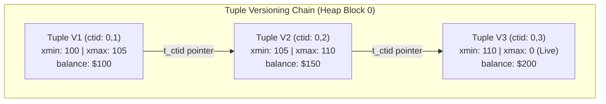
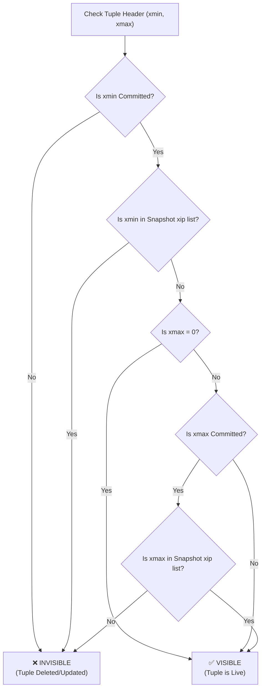
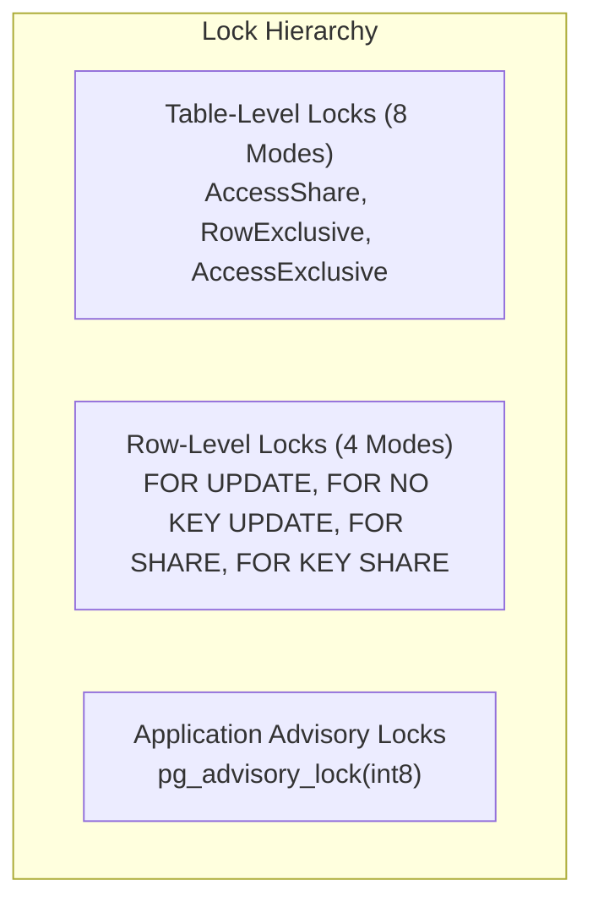

# 🔄 MVCC & Transaction Isolation

## 🎯 Learning Objectives

By the end of this module, you will be able to:
- Explain how PostgreSQL implements Multi-Version Concurrency Control (MVCC) without using undo logs.
- Evaluate tuple visibility against a transaction snapshot using `xmin`, `xmax`, and active transaction lists (`xip`).
- Differentiate between Read Committed, Repeatable Read, and Serializable isolation levels.
- Diagnose transaction lock contention using `pg_locks` and `pg_stat_activity`.
- Utilize Advisory Locks to implement application-level distributed synchronization.

---

## 💡 Core Explanation

### 1. The MVCC Engine: Append-Only Row Versioning

In traditional databases, updating a row overwrites it in-place and writes previous values to an Undo Log for readers. 

PostgreSQL uses an **append-only MVCC design**:
- An `UPDATE` is physically executed as a **`DELETE` of the old tuple version** followed by an **`INSERT` of a new tuple version**.
- Multiple versions of the same logical row exist concurrently on disk.
- Readers do not lock writers, and writers do not lock readers.



#### Tuple Header Metadata for Concurrency
Every tuple tracks its creation and deletion transaction IDs:
- **`xmin`**: The transaction ID (XID) that inserted this tuple.
- **`xmax`**: The transaction ID that deleted or replaced this tuple (set to `0` if live/unmodified).
- **`t_ctid`**: Tuple ID tuple pointer `(block, item)`. If a tuple is updated, its `t_ctid` points to the new version's physical location.

---

### 2. Snapshots & Visibility Rules

When a transaction reads data, PostgreSQL creates a **Snapshot** defining which transaction IDs are visible to it.

#### Snapshot Format: `xmin:xmax:xip_list`
Example: `100:105:101,103`
- `xmin = 100`: All transactions with XID `< 100` are committed and **visible**.
- `xmax = 105`: All transactions with XID `>= 105` were not started yet and are **invisible**.
- `xip_list = [101, 103]`: Active transactions in flight between `xmin` and `xmax`. Changes made by 101 and 103 are **invisible**.



---

### 3. Transaction Isolation Levels

PostgreSQL supports three standard SQL isolation levels built on top of MVCC:

| Isolation Level | Snapshot Creation Point | Prevents Non-Repeatable Read | Prevents Phantom Read | Prevents Serialization Anomaly |
| :--- | :--- | :---: | :---: | :---: |
| **Read Committed** (Default) | Re-taken at **every SQL statement** | ❌ | ❌ | ❌ |
| **Repeatable Read** | Taken once at **start of transaction** | ✅ | ✅ | ❌ |
| **Serializable** | Taken once at **start of transaction** + SSI | ✅ | ✅ | ✅ |

#### 1. Read Committed (Default)
Each query in a transaction sees data committed prior to that *specific query start time*. If Transaction B commits a change while Transaction A is executing, Transaction A's next SELECT sees B's committed data.

#### 2. Repeatable Read
The snapshot is frozen at the *first query of the transaction*.
- All queries see data committed *before the transaction started*.
- **Concurrent Update Error**: If Transaction A attempts to UPDATE a row that was updated and committed by Transaction B after A's snapshot was taken, PostgreSQL aborts A with:
  `ERROR: 40001: could not serialize access due to concurrent update`.

#### 3. Serializable (SSI - Serializable Snapshot Isolation)
Guarantees strict serializability without table locks using **SIREAD Locks**.
- Tracks dependency graphs between transactions (rw-antidependencies).
- If a cycle is detected in the dependency graph (indicating read-skew or write-skew anomalies), PostgreSQL aborts one of the transactions with a `40001` serialization failure.

---

### 4. Lock Architecture & Advisory Locks

PostgreSQL categorizes locks into **Table Locks**, **Row Locks**, and **Advisory Locks**.



#### Table Lock Modes & Conflicts
- **`AccessShare`**: Acquired by `SELECT`. Conflicts only with `AccessExclusive`.
- **`RowExclusive`**: Acquired by `UPDATE`, `INSERT`, `DELETE`. Conflicts with `Share`, `Exclusive`, `AccessExclusive`.
- **`AccessExclusive`**: Acquired by `ALTER TABLE`, `DROP TABLE`, `VACUUM FULL`. Conflicts with **ALL** other lock modes.

#### Application Advisory Locks
Explicit 64-bit integer application locks managed in shared memory without creating table rows.
- Useful for distributed job scheduling, background worker singletons, and preventing race conditions across microservices.

---

## 🛠️ Working Examples

### 1. Demonstrating Repeatable Read Serialization Failure

Execute these queries in two parallel `psql` terminal sessions:

```sql
-- Session 1
BEGIN ISOLATION LEVEL REPEATABLE READ;
SELECT balance FROM accounts WHERE id = 1; -- Snapshot taken here (e.g. balance = 100)

-- Session 2
BEGIN;
UPDATE accounts SET balance = 150 WHERE id = 1;
COMMIT;

-- Session 1 (Attempts to update the same row)
UPDATE accounts SET balance = balance + 50 WHERE id = 1;
-- ❌ OUTPUT: ERROR: 40001: could not serialize access due to concurrent update
ROLLBACK;
```

### 2. Lock Contention & Lock Wait Diagnostics

```sql
-- Find blocked queries, holding queries, and lock modes
SELECT 
    blocked_locks.pid AS blocked_pid,
    blocked_activity.usename AS blocked_user,
    blocked_activity.query AS blocked_statement,
    blocking_locks.pid AS blocking_pid,
    blocking_activity.usename AS blocking_user,
    blocking_activity.query AS current_statement_in_blocking_process
FROM pg_catalog.pg_locks blocked_locks
JOIN pg_catalog.pg_stat_activity blocked_activity ON blocked_activity.pid = blocked_locks.pid
JOIN pg_catalog.pg_locks blocking_locks 
    ON blocking_locks.locktype = blocked_locks.locktype
    AND blocking_locks.database IS NOT DISTINCT FROM blocked_locks.database
    AND blocking_locks.relation IS NOT DISTINCT FROM blocked_locks.relation
    AND blocking_locks.page IS NOT DISTINCT FROM blocked_locks.page
    AND blocking_locks.tuple IS NOT DISTINCT FROM blocked_locks.tuple
    AND blocking_locks.virtualxid IS NOT DISTINCT FROM blocked_locks.virtualxid
    AND blocking_locks.transactionid IS NOT DISTINCT FROM blocked_locks.transactionid
    AND blocking_locks.classid IS NOT DISTINCT FROM blocked_locks.classid
    AND blocking_locks.objid IS NOT DISTINCT FROM blocked_locks.objid
    AND blocking_locks.objsubid IS NOT DISTINCT FROM blocked_locks.objsubid
    AND blocking_locks.pid != blocked_locks.pid
JOIN pg_catalog.pg_stat_activity blocking_activity ON blocking_activity.pid = blocking_locks.pid
WHERE NOT blocked_locks.granted;
```

### 3. Distributed Job Locking with Advisory Locks

```sql
-- Non-blocking try-lock for background job execution
SELECT pg_try_advisory_lock(4294967299) AS lock_acquired;

-- If lock_acquired is true, execute critical section
DO $$
BEGIN
    IF pg_try_advisory_lock(4294967299) THEN
        RAISE NOTICE 'Executing single-instance background worker job...';
        -- Execute worker logic here
        PERFORM pg_advisory_unlock(4294967299);
    ELSE
        RAISE NOTICE 'Worker lock held by another process. Skipping execution.';
    END IF;
END $$;
```

---

## ⚠️ Common Pitfalls & Misconceptions

### 1. Long-Running Transactions & `xmin` Horizon Bloat
- **Pitfall**: Leaving an uncommitted transaction open (`idle in transaction`) for hours.
- **Consequence**: The open transaction holds back the global `xmin` snapshot horizon. Autovacuum **cannot remove dead tuples** deleted after that `xmin`, causing massive table bloat across the entire database!

### 2. Misunderstanding `SELECT FOR UPDATE` Range Locks
- **Misconception**: "`SELECT FOR UPDATE WHERE category = 'electronics'` locks future inserts into that category."
- **Reality**: `SELECT FOR UPDATE` locks **only existing physical tuples**. It does NOT prevent another session from executing `INSERT INTO products (category) VALUES ('electronics')`. Use **Serializable Isolation** to prevent phantom range inserts.

---

## 🔀 Comparison: MVCC Engines

| Metric | PostgreSQL | MySQL (InnoDB) |
| :--- | :--- | :--- |
| **Row Storage Mechanics** | Append-only (New row version written to Heap) | In-Place Update + Undo Log entry |
| **Garbage Collection** | Autovacuum sweeps dead tuples from Heap | Purge threads clean Undo Log segments |
| **Read Path Overhead** | Must evaluate snapshot against `xmin`/`xmax` | Reconstructs historical row version via Undo Log |
| **Index Updates** | Requires new index entry unless HOT-optimized | Secondary index points to Primary Clustered Key |
| **Serializable Engine** | SSI (Serializable Snapshot Isolation via SIREAD locks) | Next-Key Locks (Gap locks on index ranges) |

---

## ✅ Quick Reference / Cheat-Sheet

```text
Isolation Levels:
  SET TRANSACTION ISOLATION LEVEL READ COMMITTED;
  SET TRANSACTION ISOLATION LEVEL REPEATABLE READ;
  SET TRANSACTION ISOLATION LEVEL SERIALIZABLE;

Key System Views:
  pg_locks           -- Active and pending lock grants
  pg_stat_activity   -- Current running backend queries and transaction states

Retry Loop Rule:
  Applications using REPEATABLE READ or SERIALIZABLE must implement automatic
  retry logic for error code '40001' (serialization_failure).
```

---

[← Previous](./01-architecture-and-storage) | [Index](./00-index.mdx) | [Next →](./03-vacuuming-and-bloat)
