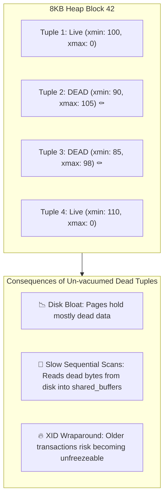
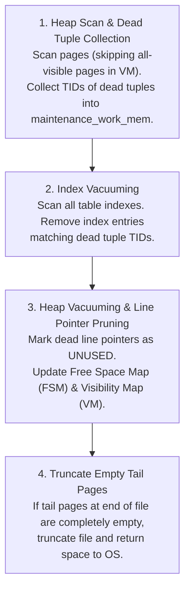
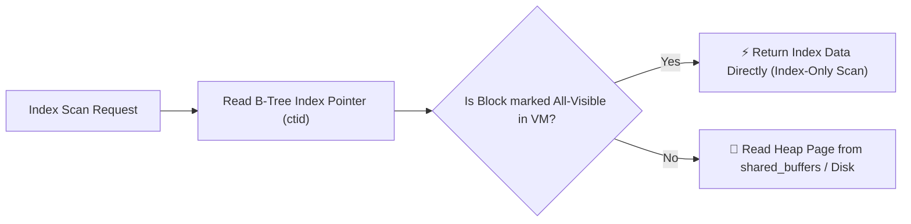
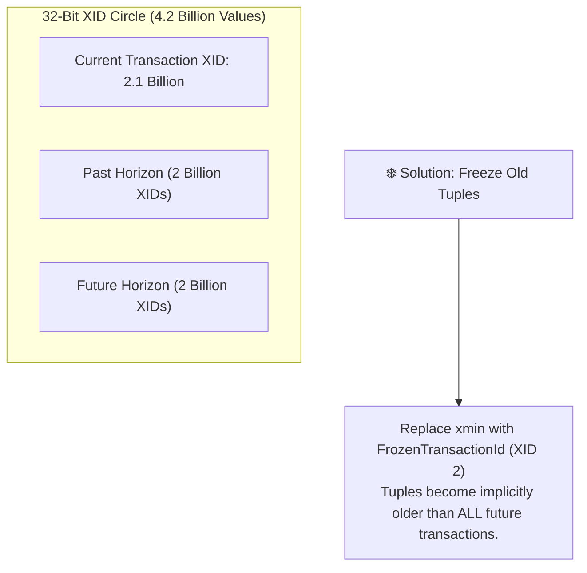

# 🧹 Vacuuming, Bloat & Tuple Lifecycle

## 🎯 Learning Objectives

By the end of this module, you will be able to:
- Explain why PostgreSQL append-only MVCC generates dead tuples and table bloat.
- Trace the internal execution phases of a `VACUUM` operation across heap pages, indexes, FSM, and VM.
- Explain the role of the **Visibility Map (VM)** in accelerating Index-Only Scans.
- Prevent catastrophic database shutdowns caused by **Transaction ID (XID) Wraparound**.
- Measure table/index bloat using `pgstattuple` and reclaim space using online compaction tools like `pg_repack`.

---

## 💡 Core Explanation

### 1. The Origin of Bloat: Dead Tuples

Because PostgreSQL updates and deletes rows by creating new versions and setting `xmax`, obsolete tuple versions remain physically stored on 8KB data pages.



A tuple becomes **Dead** when its `xmax` transaction is committed and is older than the oldest active transaction snapshot (`xmin` horizon). Dead tuples take up space until reclaimed by **VACUUM**.

---

### 2. The Internal Vacuum Execution Phases

A `VACUUM` run proceeds through four distinct execution steps:



1. **Phase 1: Heap Scan**: Scans heap pages, identifying dead tuples. It skips pages marked as **all-visible** in the Visibility Map.
2. **Phase 2: Index Sweep**: Scans every index on the table, removing index pointers that match collected dead tuple IDs (`ctid`).
3. **Phase 3: Heap Line Pointer Vacuuming**: Returns to heap pages, marks line pointers as `UNUSED`, updates page `pd_lower`/`pd_upper`, and updates the FSM.
4. **Phase 4: Tail Truncation**: Truncates empty pages at the end of the file if an `AccessExclusive` lock can be briefly acquired.

---

### 3. Auxiliary Data Structures: FSM & VM

Each table has two associated auxiliary fork files (`_fsm` and `_vm`):

#### 1. Free Space Map (`_fsm`)
- Binary tree tracking available free bytes in each 8KB page block.
- Used during `INSERT` commands to quickly find a page with enough space for a new tuple without scanning the heap file.

#### 2. Visibility Map (`_vm`)
Tracks two critical bits per page block:
- **All-Visible Bit**: Page contains only tuples visible to all current and future transactions.
  - *Impact*: Autovacuum skips scanning this page. **Index-Only Scans** use this bit to skip fetching heap pages entirely!
- **All-Frozen Bit**: Page contains only frozen tuples. Autovacuum anti-wraparound scans skip this page.



---

### 4. Transaction ID (XID) Wraparound & Freezing

PostgreSQL uses 32-bit unsigned integers for Transaction IDs (XIDs), providing $\sim 4.2$ billion XIDs.

- In modulo 32-bit arithmetic, any XID within 2 billion transactions in the past is "in the past", and any XID beyond 2 billion is "in the future".
- If a database runs for 2 billion transactions without freezing, old XIDs wrap around and suddenly appear to be in the future—causing **catastrophic data loss or shutdown**!



#### Autovacuum Freeze Controls
- **`autovacuum_freeze_max_age`** (Default: 200,000,000): When a table's oldest unfrozen XID exceeds this value, PostgreSQL launches an aggressive **Emergency Anti-Wraparound Autovacuum** that cannot be stopped.

---

### 5. Compaction: Standard VACUUM vs VACUUM FULL vs `pg_repack`

| Feature | Standard `VACUUM` | `VACUUM FULL` | `pg_repack` (Extension) |
| :--- | :--- | :--- | :--- |
| **Locking Required** | Concurrent (`ShareUpdateExclusiveLock`) — Readers/Writers allowed | Exclusive (`AccessExclusiveLock`) — **Blocks ALL reads and writes** | Light lock (`ShareUpdateExclusiveLock`) — Online execution |
| **Disk Space Needed** | 0 extra space | **2x Table Size** (Rewrites table file) | **2x Table Size** (Rewrites table file) |
| **Returns Space to OS** | No (Frees space inside pages for future PG inserts) | **Yes** (Shrinks disk file to exact size) | **Yes** (Shrinks disk file to exact size) |
| **Rewrites Relfilenode**| No | Yes | Yes |

---

## 🛠️ Working Examples

### 1. Measuring Exact Bloat with `pgstattuple`

```sql
CREATE EXTENSION IF NOT EXISTS pgstattuple;

-- Inspect tuple bloat metrics on a table
SELECT 
    table_len AS total_file_bytes,
    tuple_count AS live_tuple_count,
    tuple_len AS live_tuple_bytes,
    dead_tuple_count,
    dead_tuple_len AS dead_tuple_bytes,
    free_space AS free_bytes_in_pages,
    100.0 * dead_tuple_len / table_len AS dead_tuple_percent,
    100.0 * free_space / table_len AS free_space_percent
FROM pgstattuple('orders');
```

### 2. Tuning Autovacuum for High-Write Tables

```sql
-- Customize autovacuum scale factors for a high-volume transactional table
ALTER TABLE orders SET (
    autovacuum_vacuum_scale_factor = 0.02,     -- Vacuum when 2% of tuples are dead
    autovacuum_vacuum_threshold = 1000,         -- Base 1000 dead tuples threshold
    autovacuum_analyze_scale_factor = 0.01,    -- Analyze when 1% of tuples change
    autovacuum_vacuum_cost_limit = 2000         -- Grant higher I/O quota to this table worker
);

-- Inspect current table-level autovacuum overrides
SELECT relname, reloptions 
FROM pg_class 
WHERE reloptions IS NOT NULL AND relname = 'orders';
```

### 3. Monitoring Autovacuum & Freeze Status

```sql
-- Query tables closest to XID wraparound
SELECT 
    c.oid::regclass AS table_name,
    pg_size_pretty(pg_total_relation_size(c.oid)) AS total_size,
    age(c.relfrozenxid) AS xid_age,
    current_setting('autovacuum_freeze_max_age')::bigint - age(c.relfrozenxid) AS xids_until_forced_autovacuum
FROM pg_class c
JOIN pg_namespace n ON n.oid = c.relnamespace
WHERE c.relkind = 'r' AND n.nspname NOT IN ('pg_catalog', 'information_schema')
ORDER BY age(c.relfrozenxid) DESC
LIMIT 10;
```

---

## ⚠️ Common Pitfalls & Misconceptions

### 1. Misconception: "Standard VACUUM frees disk space back to the OS"
- **Reality**: Standard `VACUUM` marks dead tuple slots as free inside existing 8KB pages so new `INSERT`s can reuse them via the FSM. Disk usage reported by `ls -lh` or cloud volumes **will not decrease**. Only `VACUUM FULL` or `pg_repack` shrinks physical files back to the OS.

### 2. Disabling Autovacuum
- **Pitfall**: Turning off autovacuum globally (`autovacuum = off`) to "improve write performance".
- **Consequence**: Guaranteed system breakdown. Tables will experience severe bloat, query degradation, index bloat, and eventually an emergency shutdown due to XID wraparound.

---

## 🔀 Comparison: Garbage Collection

| Feature | PostgreSQL Autovacuum | MySQL (InnoDB) Purge Threads |
| :--- | :--- | :--- |
| **Dead Version Location** | In-place on data pages in Heap | Separate Undo Log pages |
| **Cleaning Target** | Heap pages & B-tree index pointers | Undo log records & clustered index |
| **Impact of Long Transactions**| Blocks dead tuple removal across entire table heap | Prevents Undo Log truncation (Undo log bloat) |
| **Index-Only Scan Reliance** | Requires Visibility Map (`_vm`) all-visible bits | Uses secondary index directly |

---

## ✅ Quick Reference / Cheat-Sheet

```text
Fork Files:
  <relfilenode>      -- Main heap storage
  <relfilenode>_fsm  -- Free Space Map (Insert slot lookup)
  <relfilenode>_vm   -- Visibility Map (All-visible & All-frozen bits)

Threshold Formula:
  Autovacuum triggers when:
  dead_tuples > autovacuum_vacuum_threshold + (autovacuum_vacuum_scale_factor * reltuples)

Emergency Commands:
  VACUUM (VERBOSE, ANALYZE) orders;  -- Verbose progress output
  SELECT * FROM pg_stat_progress_vacuum;  -- Real-time vacuum monitoring
```

---

[← Previous](./02-mvcc-and-transaction-isolation) | [Index](./00-index.mdx) | [Next →](./04-indexing-deep-dive)
