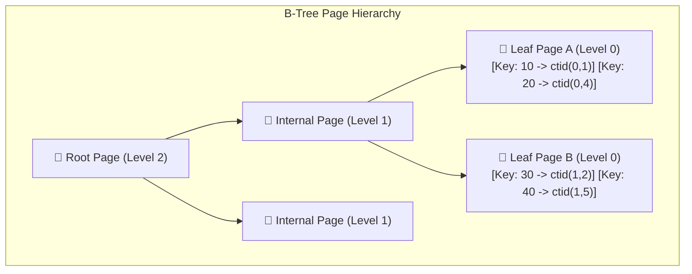
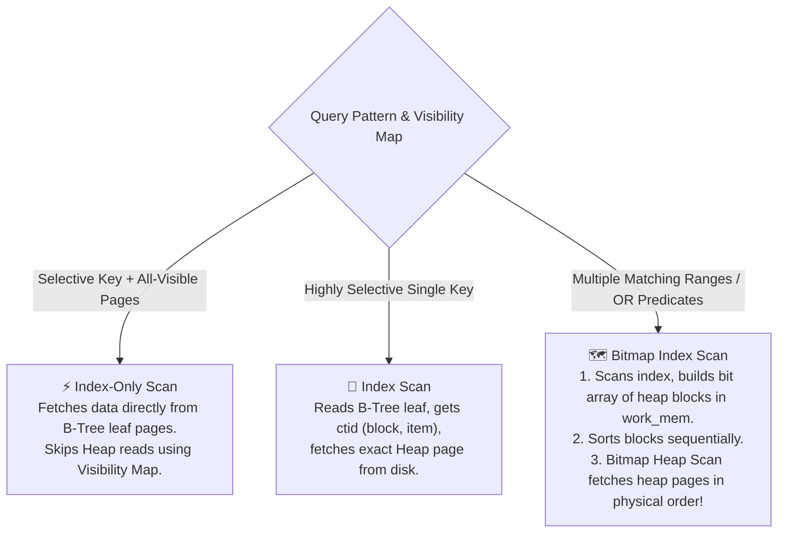
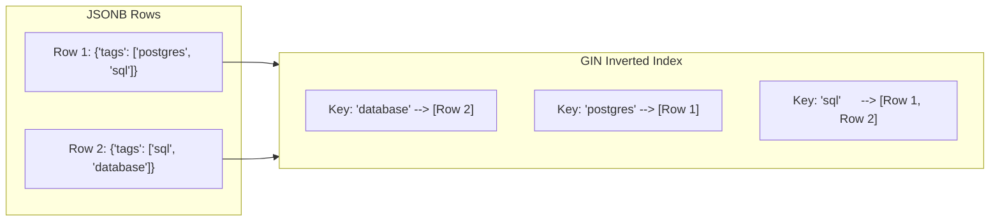
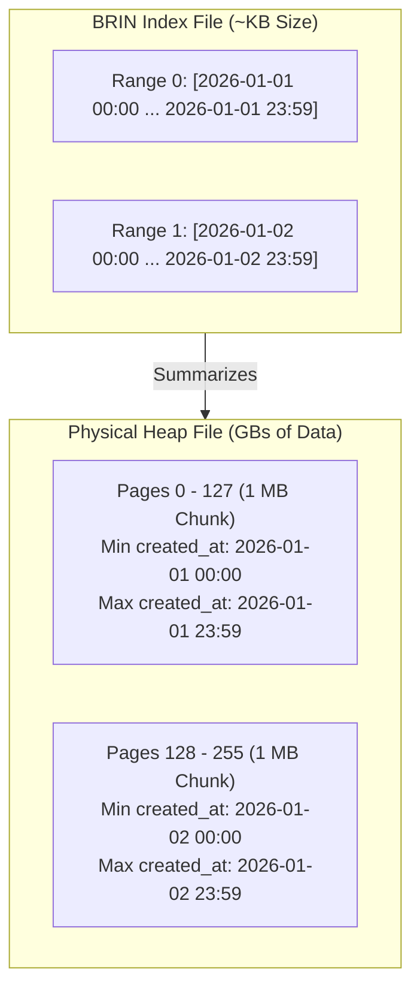

# 🔍 Indexing Deep Dive & Internals

## 🎯 Learning Objectives

By the end of this module, you will be able to:
- Trace the internal page structure and access paths of **B-Tree indexes** (Index Scan vs Bitmap Scan vs Index-Only Scan).
- Configure **GIN indexes** for high-performance JSONB containment (`@>`) and full-text search (`@@`).
- Utilize **GiST indexes** for spatial, geometric, and overlapping range queries.
- Deploy **BRIN indexes** on multi-gigabyte append-only time-series tables to achieve 99% index storage savings.
- Execute zero-downtime index creation (`CREATE INDEX CONCURRENTLY`) and clean up unused indexes using system statistics.

---

## 💡 Core Explanation

### 1. B-Tree Internals & Access Paths

B-Tree is the default index type in PostgreSQL (`nbtree` implementation). It maintains a self-balancing tree of sorted 8KB index pages.



#### Key B-Tree Characteristics
- **High Key**: Each leaf page contains a "High Key" defining the upper boundary of keys on that page.
- **Deduplication (PG 13+)**: Automatically compresses duplicate key values into a single key followed by a list of `ctid`s, reducing index size by up to 40%.

#### The Three Index Access Modes



---

### 2. GIN (Generalized Inverted Index)

GIN is an **inverted index** designed for data types containing multiple components per row (JSONB, Arrays, Full-Text Search).



- **Posting Lists & Posting Trees**: Maps each key/element to a list of matching row TIDs (`ctid`). If the list grows huge, GIN converts it into a B-Tree posting tree.
- **Fastupdate Buffer**: Postpones immediate GIN index updates by buffering changes in a pending list (`gin_pending_list_limit`), flushed asynchronously by autovacuum.

---

### 3. GiST (Generalized Search Tree)

GiST is a lossy, extensible tree structure suitable for non-linear, multi-dimensional data:
- **Use Cases**: PostGIS spatial data (points, polygons), geometric shapes, and range types (`tsrange`, `daterange`).
- **Overlapping Ranges**: Unlike B-Tree where keys strictly branch left/right, GiST nodes can overlap (`bounding box` logic).

---

### 4. BRIN (Block Range Index)

BRIN is engineered for massive time-series tables where data is naturally ordered on disk by insertion time (e.g. `created_at` or auto-incrementing `id`).



- **Mechanism**: Group pages into physical ranges (default 128 pages = 1 MB block). Stores **only the minimum and maximum value** for each range.
- **Footprint**: A B-Tree on 100 million rows might consume 2.5 GB, whereas a BRIN index consumes **under 500 KB**!

---

### 5. Advanced Indexing Strategies

#### 1. Covering Indexes (`INCLUDE`)
Allows non-key payload attributes to be stored directly in the B-Tree leaf pages without participating in tree search/sorting. Enables Index-Only Scans!

```sql
CREATE INDEX idx_users_email_inc ON users (email) INCLUDE (first_name, last_name);
```

#### 2. Partial Indexes
Indexes only a subset of table rows matching a `WHERE` predicate, dramatically reducing index size.

```sql
CREATE INDEX idx_orders_unprocessed ON orders (created_at) WHERE status = 'PENDING';
```

#### 3. Expression Indexes
Indexes the output of a function or expression.

```sql
CREATE INDEX idx_users_lower_email ON users (LOWER(email));
```

---

## 🛠️ Working Examples

### 1. B-Tree vs BRIN Storage & Performance Comparison

```sql
-- Create a 5-million row time-series benchmark table
CREATE TABLE telemetry (
    id BIGSERIAL,
    recorded_at TIMESTAMPTZ NOT NULL,
    device_id INT NOT NULL,
    payload NUMERIC
);

INSERT INTO telemetry (recorded_at, device_id, payload)
SELECT 
    g, 
    (random() * 1000)::int, 
    random() * 100
FROM generate_series('2025-01-01 00:00:00'::timestamptz, '2026-01-01 00:00:00'::timestamptz, '6 seconds'::interval) g;

-- Build B-Tree index vs BRIN index
CREATE INDEX idx_telemetry_btree ON telemetry (recorded_at);
CREATE INDEX idx_telemetry_brin ON telemetry USING brin (recorded_at) WITH (pages_per_range = 128);

-- Compare Index File Sizes
SELECT 
    c.relname AS index_name,
    pg_size_pretty(pg_relation_size(c.oid)) AS index_size
FROM pg_class c
WHERE c.relname IN ('idx_telemetry_btree', 'idx_telemetry_brin');
/*
     index_name       | index_size 
----------------------+------------
 idx_telemetry_btree  | 115 MB
 idx_telemetry_brin   | 64 kB
*/
```

### 2. High-Performance JSONB Querying with GIN

```sql
CREATE TABLE audit_logs (
    id SERIAL PRIMARY KEY,
    metadata JSONB NOT NULL
);

-- Build GIN jsonb_path_ops index (Optimized for @> containment operator)
CREATE INDEX idx_audit_metadata_path ON audit_logs USING gin (metadata jsonb_path_ops);

-- Query using JSONB containment operator (@>)
EXPLAIN ANALYZE
SELECT * FROM audit_logs 
WHERE metadata @> '{"environment": "production", "severity": "ERROR"}';
```

### 3. Zero-Downtime Indexing & Identifying Unused Indexes

```sql
-- Create index concurrently without blocking concurrent WRITEs
CREATE INDEX CONCURRENTLY idx_users_active_created ON users (created_at) WHERE is_active = true;

-- Find invalid indexes caused by interrupted CONCURRENTLY builds
SELECT 
    c.relname AS invalid_index_name,
    i.indisvalid
FROM pg_index i
JOIN pg_class c ON c.oid = i.indexrelid
WHERE NOT i.indisvalid;

-- Detect unused indexes consuming write overhead and disk space
SELECT 
    s.schemaname,
    s.relname AS table_name,
    s.indexrelname AS index_name,
    s.idx_scan AS number_of_scans,
    pg_size_pretty(pg_relation_size(s.indexrelid)) AS index_size
FROM pg_stat_user_indexes s
JOIN pg_index i ON i.indexrelid = s.indexrelid
WHERE s.idx_scan = 0 
  AND NOT i.indisunique 
  AND NOT i.indisprimary
ORDER BY pg_relation_size(s.indexrelid) DESC;
```

---

## ⚠️ Common Pitfalls & Misconceptions

### 1. Over-Indexing Tables
- **Pitfall**: Creating an index on every single column to "speed up all queries".
- **Consequence**: Every `INSERT`, `UPDATE`, and `DELETE` must write to the Heap AND update every single index. Over-indexing degrades write performance by up to 10x and disables **HOT (Heap-Only Tuple)** updates.

### 2. Forgetting `CONCURRENTLY` in Production
- **Pitfall**: Running `CREATE INDEX idx_name ON large_table(col);` during peak production hours.
- **Consequence**: Takes a `ShareLock` on the table, blocking all concurrent `INSERT`, `UPDATE`, and `DELETE` statements until index construction finishes!

---

## 🔀 Comparison: Index Selection Matrix

| Workload / Data Type | Recommended Index Type | Operators Supported | Memory / Size Footprint |
| :--- | :--- | :--- | :--- |
| **Unique Keys, Equality, Range** (`=`, `<`, `>`) | **B-Tree** | `=`, `<`, `<=`, `>`, `>=`, `BETWEEN`, `IN` | Moderate (Dense) |
| **JSONB, Arrays, Full-Text** | **GIN** | `@>`, `?`, `?|`, `?&`, `@@`, `&&` | Larger, but fast search |
| **PostGIS Spatial, Ranges** | **GiST** | `&&`, `@>`, `<@`, `~=`, `<->` (Distance) | Moderate (Lossy nodes) |
| **Sorted Time-Series (Append-only)** | **BRIN** | `=`, `<`, `>`, `BETWEEN` | **Tiny (~0.05% of B-Tree)** |

---

## ✅ Quick Reference / Cheat-Sheet

```text
Index Access Types:
  Index Scan       -- Direct B-Tree read + Heap fetch
  Index-Only Scan  -- B-Tree read only (Requires Visibility Map VM all-visible bit)
  Bitmap Scan      -- B-Tree scan -> work_mem bitmap -> Sorted physical Heap read

Maintenance Commands:
  CREATE INDEX CONCURRENTLY idx ON tbl (col);     -- Online build
  REINDEX INDEX CONCURRENTLY idx_name;            -- Rebuild bloat online
  ALTER INDEX idx_name SET (fillfactor = 90);    -- Leave 10% page free space for HOT updates
```

---

[← Previous](./03-vacuuming-and-bloat) | [Index](./00-index.mdx) | [Next →](./05-query-planning-and-execution)
