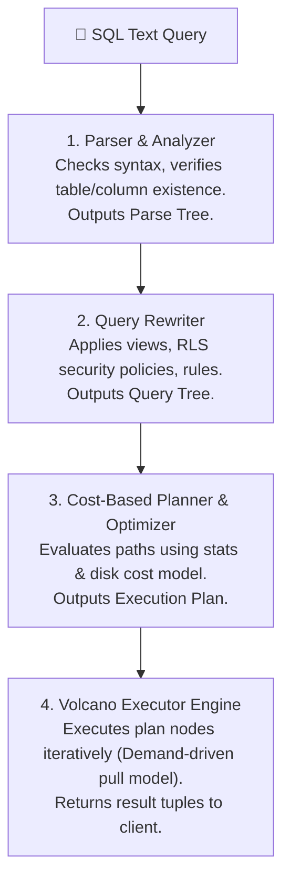
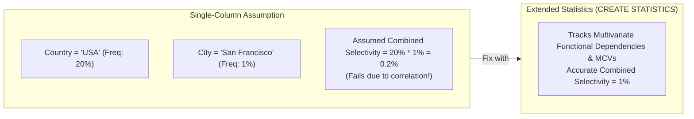
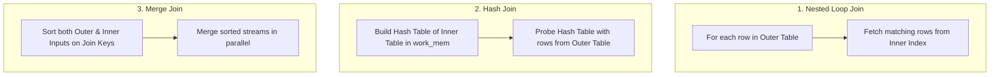

# ⚡ Query Planning, Execution & Optimization

## 🎯 Learning Objectives

By the end of this module, you will be able to:
- Deconstruct the four stages of query processing: Parsing, Rewriting, Planning, and Execution.
- Analyze how PostgreSQL calculates selectivity using Most Common Values (MCVs) and Histograms in `pg_statistic`.
- Compare the execution characteristics of **Nested Loop**, **Hash Join**, and **Merge Join** algorithms.
- Read and interpret `EXPLAIN (ANALYZE, BUFFERS, FORMAT JSON)` execution plans like a database expert.
- Fix inaccurate multi-column cardinality estimations using **Extended Statistics** (`CREATE STATISTICS`).

---

## 💡 Core Explanation

### 1. The Query Processing Pipeline

Every SQL query passed to a backend process traverses a strict four-stage pipeline:



#### The Volcano Iterator Model
The Executor operates on a demand-driven "Volcano" iterator model. Each plan node exposes a `ExecProcNode()` function. Parent nodes call `ExecProcNode()` on child nodes to pull tuples one at a time, minimizing memory consumption unless a materializing node (e.g. Hash or Sort) requires accumulating all tuples.

---

### 2. The Cost-Based Optimizer (CBO) & Disk Cost Parameters

PostgreSQL estimates the execution cost of competing query paths using a mathematical cost model calibrated by GUC settings:

| Parameter | Default Value | Description / Tuning Guidance |
| :--- | :--- | :--- |
| **`seq_page_cost`** | `1.0` | Cost of a sequential disk page fetch. Baseline anchor. |
| **`random_page_cost`** | `4.0` | Cost of a non-sequential random disk page fetch. **Set to `1.1` for NVMe SSDs!** |
| **`cpu_tuple_cost`** | `0.01` | CPU cost to process a single tuple header. |
| **`cpu_operator_cost`**| `0.0025`| CPU cost to evaluate a WHERE clause operator. |

```text
Total Cost = (Pages_seq * seq_page_cost) + (Pages_rnd * random_page_cost) + (Tuples * cpu_tuple_cost)
```

If `random_page_cost` is left at the default `4.0` on fast SSD storage, the planner will incorrectly penalize B-Tree index scans and choose slow sequential table scans instead!

---

### 3. Statistics Engine & Extended Statistics

The optimizer relies on table statistics gathered by `ANALYZE` and stored in system tables (`pg_statistic` / `pg_stats`).

#### Key Statistical Metrics
- **`null_frac`**: Fraction of column entries that are NULL.
- **`n_distinct`**: Estimated number of distinct values (negative values represent ratios).
- **`most_common_vals` (MCV)**: List of the most frequently occurring values.
- **`most_common_freqs`**: Frequency array corresponding to the MCVs.
- **`histogram_bounds`**: Array of boundary values dividing the rest of the column data into equal-frequency bins.



---

### 4. Join Algorithm Deep Dive

PostgreSQL implements three fundamental relational join algorithms:



#### 1. Nested Loop Join
- **How it works**: For every tuple in the outer relation, scans the inner relation.
- **Best for**: Small outer relation and indexed inner relation.

#### 2. Hash Join
- **How it works**: Reads the inner relation and builds an in-memory hash table in `work_mem`. Then scans the outer relation, hashing join keys to locate matches.
- **Spill to Disk**: If the hash table exceeds `work_mem`, it spills to temporary disk files, degrading performance.
- **Best for**: Joining large, unsorted datasets.

#### 3. Merge Join
- **How it works**: Both relations are sorted on the join key, then merged in a single coordinated pass.
- **Best for**: Large datasets where inputs are already sorted by an index.

---

## 🛠️ Working Examples

### 1. Dissecting an `EXPLAIN (ANALYZE, BUFFERS)` Plan

```sql
EXPLAIN (ANALYZE, BUFFERS, COSTS, FORMAT TEXT)
SELECT 
    u.id, 
    u.email, 
    o.total_amount
FROM users u
JOIN orders o ON o.user_id = u.id
WHERE u.created_at >= '2026-01-01' AND o.status = 'COMPLETED';
```

#### Sample Output Analysis
```text
Hash Join  (cost=125.50..450.20 rows=320 width=45) (actual time=1.240..4.150 rows=310 loops=1)
  Hash Cond: (o.user_id = u.id)
  Buffers: shared hit=85 read=12
  ->  Seq Scan on orders o  (cost=0.00..310.00 rows=1200 width=16) (actual time=0.050..2.100 rows=1180 loops=1)
        Filter: ((status)::text = 'COMPLETED'::text)
        Rows Removed by Filter: 4200
        Buffers: shared hit=60
  ->  Hash  (cost=110.00..110.00 rows=400 width=37) (actual time=1.100..1.100 rows=395 loops=1)
        Buckets: 1024  Batches: 1  Memory Usage: 32kB
        Buffers: shared hit=25 read=12
        ->  Bitmap Heap Scan on users u  (cost=12.00..110.00 rows=400 width=37) (actual time=0.200..0.900 rows=395 loops=1)
              Recheck Cond: (created_at >= '2026-01-01'::timestamptz)
              Buffers: shared hit=25 read=12
              ->  Bitmap Index Scan on idx_users_created  (cost=0.00..11.90 rows=400 width=0) (actual time=0.120..0.120 rows=395 loops=1)
```

- **`cost=125.50..450.20`**: Startup cost (125.50) to total estimated cost (450.20).
- **`actual time=1.240..4.150`**: Real execution time in milliseconds (First row returned at 1.24ms, final row at 4.15ms).
- **`Buffers: shared hit=85 read=12`**: 85 pages served from `shared_buffers` (RAM), 12 pages read from OS disk cache/physical disk.

### 2. Fixing Cardinality Estimates with Extended Statistics

```sql
CREATE TABLE location_data (
    id SERIAL PRIMARY KEY,
    state TEXT,
    city TEXT
);

-- Populate dataset with strong correlation (All 'San Francisco' entries are in 'CA')
INSERT INTO location_data (state, city)
SELECT 'CA', 'San Francisco' FROM generate_series(1, 50000);
INSERT INTO location_data (state, city)
SELECT 'NY', 'New York' FROM generate_series(1, 50000);

ANALYZE location_data;

-- Check planner estimate BEFORE extended statistics
EXPLAIN ANALYZE 
SELECT * FROM location_data WHERE state = 'CA' AND city = 'San Francisco';
-- Planner assumes independence: multiplies 50% * 50% = 25% (Estimates ~25,000 rows instead of 50,000)

-- Create Extended Statistics tracking multivariate dependencies
CREATE STATISTICS stats_location_state_city (dependencies, mcv) ON state, city FROM location_data;
ANALYZE location_data;

-- Check planner estimate AFTER extended statistics
EXPLAIN ANALYZE 
SELECT * FROM location_data WHERE state = 'CA' AND city = 'San Francisco';
-- Planner now accurately predicts 50,000 rows!
```

### 3. Tuning `work_mem` to Eliminate Disk Spills

```sql
-- Observe Hash Join or Sort spilling to disk in EXPLAIN output
-- "Sort Method: external merge  Disk: 14520kB"

-- Increase work_mem temporarily for current session
SET work_mem = '64MB';

-- Re-run query to confirm in-memory execution
-- "Sort Method: quicksort  Memory: 12450kB"
```

---

## ⚠️ Common Pitfalls & Misconceptions

### 1. Cost Units $\neq$ Execution Milliseconds
- **Misconception**: "A query plan cost of `1000` means the query will run in 1000 milliseconds."
- **Reality**: Cost values are arbitrary unitless estimations reflecting calculated I/O and CPU work. A cost of `1000` on an NVMe SSD might run in 2ms, while the same cost on slow EBS storage might take 500ms.

### 2. Default `random_page_cost = 4.0` on SSDs
- **Pitfall**: Leaving `random_page_cost` at its 1990s spinning-disk default of `4.0` when running on modern SSDs.
- **Consequence**: Forces the optimizer to avoid B-Tree index lookups and execute full sequential table scans. Always lower `random_page_cost` to `1.1` on SSD environments.

---

## 🔀 Comparison: Join Algorithms

| Join Algorithm | Pre-conditions | Memory Requirements | Best Suited Scenario |
| :--- | :--- | :--- | :--- |
| **Nested Loop** | None (Index on inner table helps) | Low ($\sim O(1)$) | Small outer table + indexed inner lookup |
| **Hash Join** | Equality predicate (`=`) | High (Fits inner relation in `work_mem`) | Large unsorted datasets |
| **Merge Join** | Equality or Inequality (`=`, `<`, `>`) + Inputs sorted | Low ($\sim O(1)$ if pre-sorted) | Pre-sorted inputs (B-Tree index order) |

---

## ✅ Quick Reference / Cheat-Sheet

```text
EXPLAIN Options:
  EXPLAIN (ANALYZE, BUFFERS, TIMING, FORMAT TEXT) SELECT ...;

Optimizer GUC Tuning:
  SET random_page_cost = 1.1;           -- Recommend for SSD / NVMe
  SET effective_cache_size = '48GB';    -- Total OS + PG buffer cache estimate
  SET work_mem = '64MB';                -- Increase to avoid temp disk spills

Extended Statistics:
  CREATE STATISTICS stat_name (dependencies, mcv) ON col1, col2 FROM tbl;
```

---

[← Previous](./04-indexing-deep-dive) | [Index](./00-index.mdx) | [Next →](./06-wal-and-crash-recovery)
