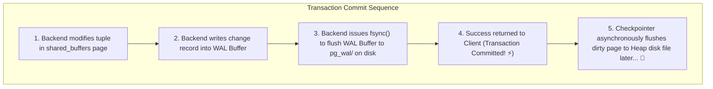
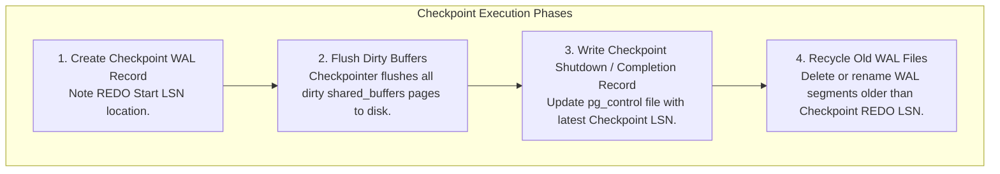
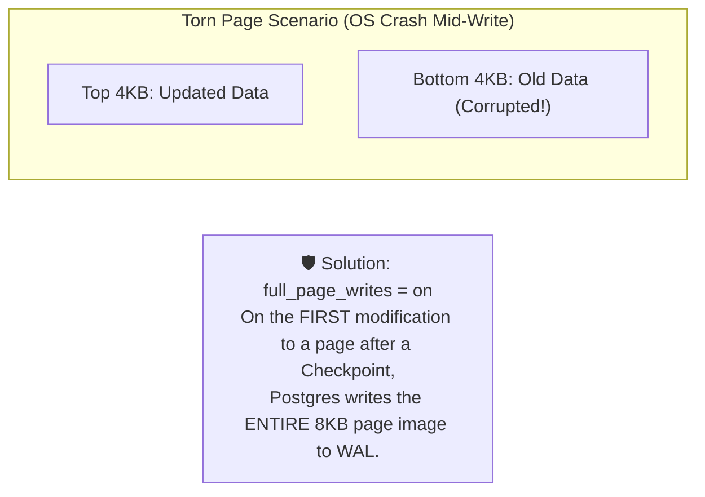

# 💾 Write-Ahead Logging (WAL) & Crash Recovery

## 🎯 Learning Objectives

By the end of this module, you will be able to:
- Explain how Write-Ahead Logging (WAL) guarantees ACID Durability and Atomicity without requiring synchronous heap writes.
- Decode 64-bit **Log Sequence Numbers (LSN)** and calculate database WAL write volume.
- Configure checkpoint frequency (`max_wal_size`, `checkpoint_completion_target`) to balance recovery time and disk I/O.
- Explain why **Full Page Writes (`full_page_writes`)** prevent torn-page memory corruption during hardware failure.
- Inspect binary WAL segment files using `pg_waldump`.

---

## 💡 Core Explanation

### 1. The Write-Ahead Logging (WAL) Principle

In database design, writing modified 8KB data pages to random disk locations synchronously during transaction commit is far too slow. 

PostgreSQL implements the **ARIES Write-Ahead Logging protocol**:
- State changes are recorded sequentially in an append-only log (**WAL**) before dirty data pages are flushed to table heap files.
- A transaction `COMMIT` returns success as soon as its WAL records are flushed to disk (`fsync`). Heap page writes are deferred asynchronously to background processes.



---

### 2. Log Sequence Numbers (LSN)

Every byte written to the WAL stream is identified by a 64-bit integer called a **Log Sequence Number (LSN)**.

#### LSN Format: `FileID/FileOffset`
Example LSN: `0/16B3718`
- `0`: High 32 bits (File ID / Volume segment multiplier).
- `16B3718`: Low 32 bits (Byte offset in hex within the current WAL segment).

#### Page LSN Matching (`pd_lsn`)
Every 8KB data page header stores `pd_lsn`—the LSN of the latest WAL record that updated that page. During crash recovery, Postgres compares page `pd_lsn` with WAL records to prevent re-applying changes already written to disk.

---

### 3. The Checkpoint Mechanism

A **Checkpoint** is a point in the WAL stream where PostgreSQL guarantees that all dirty data pages in `shared_buffers` modified before that LSN have been safely written to disk.



#### Checkpoint Throttling & Spikes
Flushing thousands of dirty buffers simultaneously causes severe disk I/O spikes. PostgreSQL smooths checkpoints using `checkpoint_completion_target` (Default `0.9`):
- If checkpoints occur every 15 minutes (`checkpoint_timeout = 15min`), Checkpointer spreads page writes evenly across $15 \times 0.9 = 13.5$ minutes!

---

### 4. Full Page Writes (`full_page_writes`)

File systems write data in 4KB blocks, whereas PostgreSQL pages are 8KB. If the OS crashes mid-write while writing an 8KB page to disk, the page becomes corrupted with 4KB of new data and 4KB of old data (**Torn Page**).



If a torn page occurs during a crash, recovery restores the intact full 8KB page image from the WAL before replaying subsequent delta records.

---

## 🛠️ Working Examples

### 1. Monitoring LSN & Calculating WAL Write Volume

```sql
-- Query current WAL insert LSN
SELECT pg_current_wal_lsn();

-- Calculate WAL volume generated over a 10-second period
DO $$
DECLARE
    lsn_start pg_lsn;
    lsn_end pg_lsn;
    bytes_written numeric;
BEGIN
    lsn_start := pg_current_wal_lsn();
    PERFORM pg_sleep(10);
    lsn_end := pg_current_wal_lsn();
    
    bytes_written := pg_wal_lsn_diff(lsn_end, lsn_start);
    RAISE NOTICE 'WAL Generation Rate: % MB/sec', round((bytes_written / 1024 / 1024 / 10)::numeric, 2);
END $$;
```

### 2. Tuning Checkpoint & WAL Parameters

```text
# postgresql.conf Production Tuning Baseline for High Writes

wal_level = replica                  # Enables streaming replication and archive support
max_wal_size = 16GB                  # Soft maximum size of WAL before forcing a checkpoint
min_wal_size = 2GB                   # Minimum WAL size retained for recycling
checkpoint_timeout = 15min           # Maximum time between automatic checkpoints
checkpoint_completion_target = 0.9   # Spread checkpoint I/O over 90% of duration
full_page_writes = on                # MANDATORY: Protects against page corruption on crash
wal_buffers = 16MB                   # Memory allocated for unwritten WAL data
```

### 3. Inspecting Binary WAL Files with `pg_waldump`

Run this utility from the OS command line to decode raw WAL records:

```bash
# Dump WAL record summary for segment file 000000010000000000000001
pg_waldump --rmname=Heap --summary /var/lib/postgresql/data/pg_wal/000000010000000000000001

# Inspect details of UPDATE records
pg_waldump --rmname=Heap /var/lib/postgresql/data/pg_wal/000000010000000000000001 | grep -i "UPDATE" | head -n 5
```

---

## ⚠️ Common Pitfalls & Misconceptions

### 1. Misconception: "Setting `fsync = off` improves performance safely"
- **Pitfall**: Turning off `fsync` in production to make `INSERT` statement benchmarks run faster.
- **Consequence**: Guaranteed unrecoverable database corruption! On OS or power failures, WAL buffers in kernel cache are lost, leaving table heap files in an inconsistent, torn state. **Never set `fsync = off` in production.**

### 2. `max_wal_size` Log Warnings
- **Warning**: Log entries stating `LOG: checkpoints are occurring too frequently (every 45 seconds)`.
- **Cause**: Transaction write volume is filling `max_wal_size` faster than `checkpoint_timeout`. Increase `max_wal_size` to 16GB or 32GB to avoid forced I/O checkpoints.

---

## 🔀 Comparison: WAL vs InnoDB Redo Log

| Feature | PostgreSQL WAL | MySQL (InnoDB) Redo Log |
| :--- | :--- | :--- |
| **File Structure** | Sequence of 16MB files in `pg_wal/` | Fixed-size ring buffer files (`ib_logfile0`) |
| **Torn Page Protection**| Full Page Writes (`full_page_writes`) into WAL | Doublewrite Buffer (`ibdata1` / `dblwr`) |
| **Addressing Unit** | 64-bit monotonically increasing LSN | 64-bit LSN |
| **Replication Use** | Same WAL stream used for recovery & streaming replication | Redo log for recovery; separate Binary Log (binlog) for replication |

---

## ✅ Quick Reference / Cheat-Sheet

```text
WAL Directory:       $PGDATA/pg_wal/ (16 MB segment files)
LSN Functions:
  pg_current_wal_lsn()             -- Current WAL location
  pg_wal_lsn_diff(lsn1, lsn2)      -- Difference in bytes between LSNs
  pg_walfile_name(lsn)             -- Returns 24-character file name for LSN

Checkpoint Monitoring:
  SELECT * FROM pg_stat_bgwriter;  -- View checkpoints_req vs checkpoints_timed
```

---

[← Previous](./05-query-planning-and-execution) | [Index](./00-index.mdx) | [Next →](./07-replication-and-ha)
