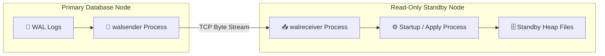
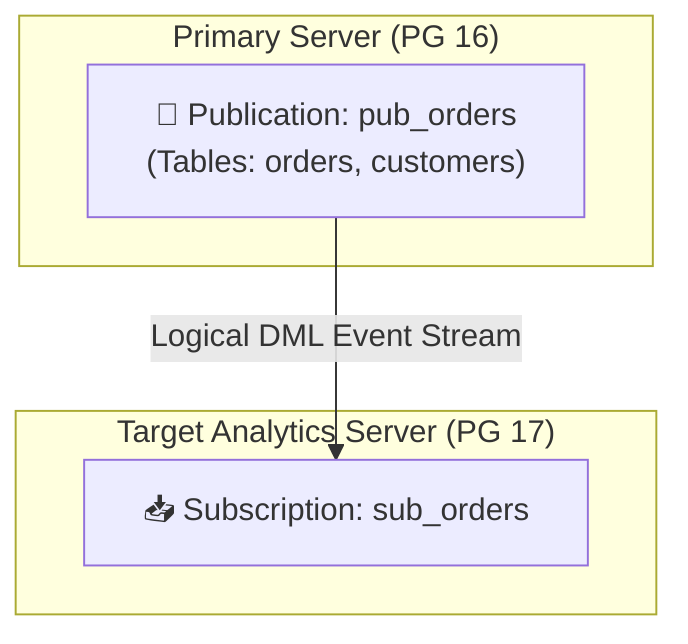
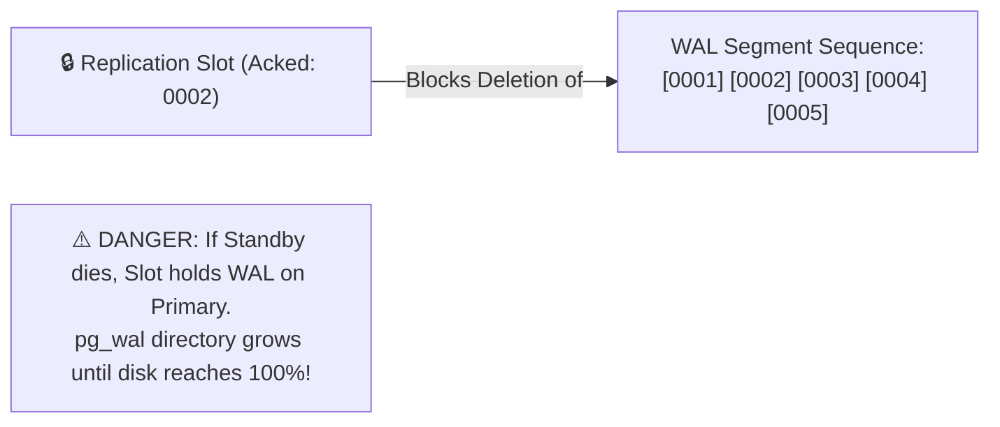
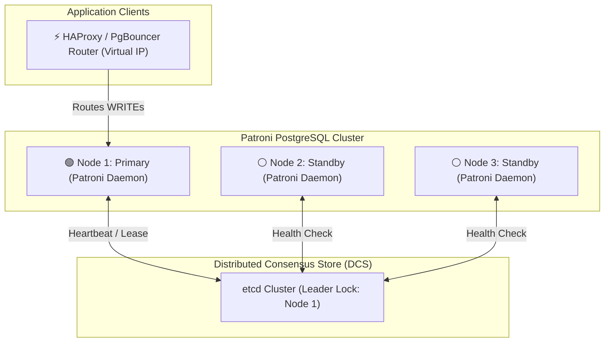
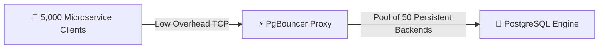

# 🌐 Replication, High Availability & Connection Management

## 🎯 Learning Objectives

By the end of this module, you will be able to:
- Contrast **Physical Streaming Replication** with **Logical Replication**.
- Configure `synchronous_commit` modes to manage trade-offs between write latency and zero data loss guarantees.
- Prevent primary database disk crashes caused by orphaned **Replication Slots**.
- Architect automated failover and consensus-driven High Availability using **Patroni** and `etcd`.
- Deploy **PgBouncer** in Transaction Pooling mode to scale database connections to 10,000+ clients.

---

## 💡 Core Explanation

### 1. Physical Streaming Replication

Physical Streaming Replication streams byte-for-byte WAL records from the Primary server to one or more Read-Only Standby servers via TCP connections (`walsender` and `walreceiver` processes).



#### Synchronous Commit Modes (`synchronous_commit`)
When `synchronous_standby_names` is configured, `synchronous_commit` controls when a transaction `COMMIT` returns success:

- **`off`**: Returns immediately without waiting for WAL to hit primary disk (Fastest, risk of losing last ~3x `wal_writer_delay` ms on crash).
- **`local`**: Returns after WAL is flushed to local primary disk.
- **`remote_write`**: Waits until standby receives WAL and writes it to OS buffer cache.
- **`on`** (Default): Waits until standby receives WAL and flushes it to **standby physical disk**.
- **`remote_apply`**: Waits until standby receives WAL and **applies the record** to standby memory/heap (Guarantees immediate read-your-writes consistency on standby!).

---

### 2. Logical Replication (Publications & Subscriptions)

Logical Replication decodes WAL records into logical DML events (INSERT, UPDATE, DELETE) using **Logical Decoding**.



#### Key Differences from Physical Replication
- **Cross-Version & Heterogeneous**: Can replicate between different major PostgreSQL versions (e.g. PG 14 to PG 17).
- **Selective Granularity**: Replicate specific tables, columns, or rows (`WHERE region = 'US'`).
- **Read-Write Targets**: Target tables are open for independent reads and writes.

---

### 3. Replication Slots: Preventing WAL Loss

A **Replication Slot** guarantees that the Primary server will **NEVER delete WAL segment files** required by a standby until the standby confirms receipt.



- **Safety Guard**: Set `max_slot_wal_keep_size` (e.g., `100GB`). If a standby falls behind further than this limit, the slot invalidates itself to protect primary disk space.

---

### 4. High Availability (HA) with Patroni & Consensus

Building enterprise HA requires automated leader election, health checking, and virtual IP / proxy routing. **Patroni** is the industry standard template using a Distributed Consensus Store (DCS) such as `etcd` or `Consul`.



- **Split-Brain Prevention**: Node 1 maintains a TTL key lease in `etcd`. If Node 1 loses network connectivity to `etcd`, Patroni immediately demotes Node 1 to read-only before another node is elected Primary.

---

### 5. Connection Pooling with PgBouncer

Because each PostgreSQL backend process consumes ~2–10 MB RAM and spawns an OS process, thousands of incoming client connections degrade database performance. **PgBouncer** acts as a lightweight proxy sitting in front of PostgreSQL.



#### PgBouncer Pooling Modes
1. **Session Pooling** (Default): Assigns a server backend connection to a client for the entire duration of the client's connection.
2. **Transaction Pooling** (Recommended): Assigns a server backend to a client **only for the duration of a single transaction**. Once `COMMIT` or `ROLLBACK` executes, the backend returns to the pool!
3. **Statement Pooling**: Assigns a server connection per SQL statement. (Breaks multi-statement transactions!).

---

## 🛠️ Working Examples

### 1. Setting Up Logical Replication

```sql
-- ON PRIMARY (Publisher)
CREATE PUBLICATION pub_sales_data 
FOR TABLE orders, order_items 
WHERE (status = 'COMPLETED');

-- ON TARGET (Subscriber)
-- Note: Table schema must exist on subscriber prior to subscription
CREATE SUBSCRIPTION sub_sales_data
CONNECTION 'host=primary.internal port=5432 dbname=appdb user=repuser password=secret'
PUBLICATION pub_sales_data;
```

### 2. Monitoring Replication Lag & Replication Slots

```sql
-- Query physical & logical replication lag on Primary
SELECT 
    client_addr AS standby_ip,
    application_name,
    state,
    sync_state,
    sync_priority,
    pg_wal_lsn_diff(pg_current_wal_lsn(), write_lsn) AS write_lag_bytes,
    pg_wal_lsn_diff(pg_current_wal_lsn(), flush_lsn) AS flush_lag_bytes,
    pg_wal_lsn_diff(pg_current_wal_lsn(), replay_lsn) AS replay_lag_bytes
FROM pg_stat_replication;

-- Query replication slots and alert on inactive slots
SELECT 
    slot_name,
    plugin,
    slot_type,
    active,
    wal_status,
    pg_size_pretty(pg_wal_lsn_diff(pg_current_wal_lsn(), restart_lsn)) AS bytes_retained
FROM pg_replication_slots;
```

### 3. Production `pgbouncer.ini` Configuration

```ini
[databases]
appdb = host=127.0.0.1 port=5432 dbname=appdb pool_size=50

[pgbouncer]
listen_addr = 0.0.0.0
listen_port = 6432
auth_type = scram-sha-256
auth_file = /etc/pgbouncer/userlist.txt

; Pooling Mode
pool_mode = transaction

; Connection Limits
max_client_conn = 10000
default_pool_size = 50
min_pool_size = 10
reserve_pool_size = 5
max_db_connections = 100
```

---

## ⚠️ Common Pitfalls & Misconceptions

### 1. Orphaned Replication Slots Filling Disk
- **Pitfall**: Creating a logical replication slot for a migration or standby, then abandoning the consumer without dropping the slot.
- **Consequence**: Primary retains all WAL segment files continuously. `pg_wal` grows to hundreds of gigabytes until disk is 100% full, crashing the database! Always set `max_slot_wal_keep_size`.

### 2. Transaction Pooling & Session-Level Features
- **Pitfall**: Using PgBouncer in `pool_mode = transaction` with applications relying on `SET SESSION TIMEZONE`, `LISTEN/NOTIFY`, or legacy prepared statements.
- **Consequence**: Session settings leak across client queries or fail with errors. Use PgBouncer 1.21+ (which supports protocol-level prepared statements) or use `SET LOCAL` within transaction blocks.

---

## 🔀 Comparison: Replication Architecture

| Feature | Physical Streaming Replication | Logical Replication |
| :--- | :--- | :--- |
| **Data Format** | Exact byte-level WAL records | Logical DML tuples (INSERT/UPDATE/DELETE) |
| **Standby Read-Write State**| Strict Read-Only | Read-Write allowed on subscriber |
| **Granularity** | Entire Database Cluster (All DBs) | Per-table, per-column, or row-level `WHERE` |
| **Cross-Version Support** | No (Primary & Standby must match major version) | **Yes** (Supports PG 12 $\rightarrow$ PG 17 migrations) |
| **DDL Replication** | Yes (Replicates all schema changes) | No (Requires manual DDL execution on target) |

---

## ✅ Quick Reference / Cheat-Sheet

```text
Replication Monitoring:
  SELECT * FROM pg_stat_replication;     -- View primary sender status
  SELECT * FROM pg_stat_wal_receiver;    -- View standby receiver status
  SELECT * FROM pg_replication_slots;    -- Check slot retention & health

Safety Settings:
  max_slot_wal_keep_size = 100GB         -- Invalidate abandoned slots before disk fills
  synchronous_commit = remote_apply      -- Immediate read-your-writes standby consistency
```

---

[← Previous](./06-wal-and-crash-recovery) | [Index](./00-index.mdx) | [Next →](./08-partitioning-and-sharding)
