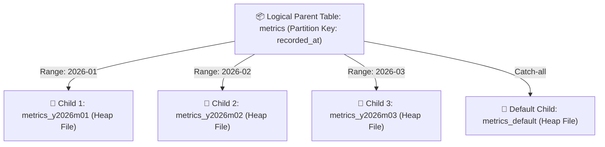
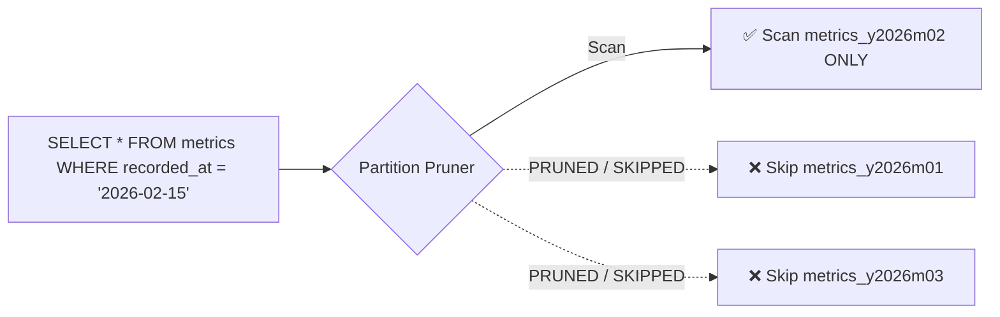
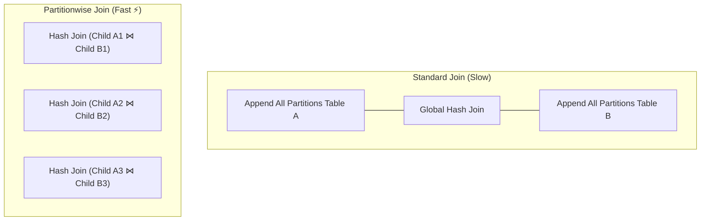
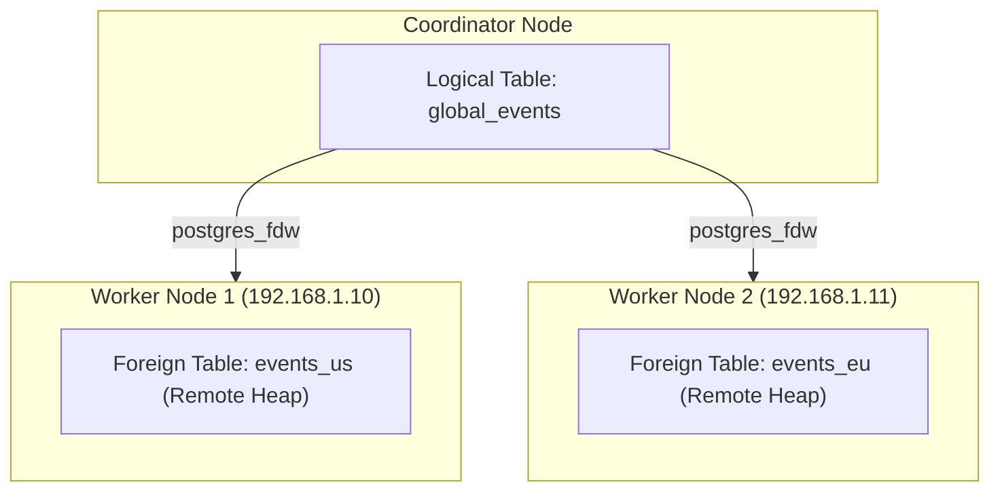

# 🧩 Declarative Partitioning & Sharding

## 🎯 Learning Objectives

By the end of this module, you will be able to:
- Design declarative **Range**, **List**, and **Hash** table partitioning strategies.
- Verify static and dynamic **Partition Pruning** using `EXPLAIN ANALYZE`.
- Enable **Partitionwise Joins** and **Partitionwise Aggregations** to accelerate query performance across large tables.
- Enforce Primary Key and Unique constraints on partitioned tables without schema errors.
- Query remote PostgreSQL database instances using **Foreign Data Wrappers (`postgres_fdw`)**.

---

## 💡 Core Explanation

### 1. Declarative Partitioning Mechanics

Declarative Partitioning splits a large logical table into smaller physical child tables (**Partitions**) while preserving a single query endpoint.



#### Partition Strategies
1. **Range Partitioning**: Maps rows into ranges defined by lower and upper bounds (Ideal for time-series and log data).
2. **List Partitioning**: Maps rows based on explicit discrete values (e.g. `region IN ('US-EAST', 'US-WEST')`).
3. **Hash Partitioning**: Maps rows by specifying a modulus and remainder on a hash of the partition key (Ideal for even load balancing).

---

### 2. Partition Pruning (Static vs Dynamic)

Partition Pruning is the optimizer capability to skip scanning child partitions that cannot possibly contain matching rows for a query predicate.



- **Static (Compile-Time) Pruning**: Occurs during query planning when query constants are known (`WHERE recorded_at >= '2026-01-01'`).
- **Dynamic (Run-Time) Pruning**: Occurs during query execution when predicates rely on parameterized subqueries or join variables (`WHERE recorded_at = current_date`).

---

### 3. Partitionwise Joins & Aggregations

When two tables are partitioned identically on their join keys, PostgreSQL can join corresponding partitions directly rather than joining the entire unified datasets.

```text
# Enable partitionwise operations in postgresql.conf or session
enable_partitionwise_join = on
enable_partitionwise_aggregate = on
```



---

### 4. Indexing & Primary Key Constraints Rule

In PostgreSQL, indexes are **local to each child partition**. There are no global cross-partition indexes.

#### The Primary Key Constraint Rule
If a partitioned table defines a `PRIMARY KEY` or `UNIQUE` constraint, **the Partition Key MUST be included in the constraint definition**.

```sql
-- ❌ FAILS: Primary Key missing partition key 'created_at'
CREATE TABLE orders (
    order_id BIGINT,
    created_at TIMESTAMPTZ NOT NULL,
    customer_id INT,
    PRIMARY KEY (order_id)
) PARTITION BY RANGE (created_at);
-- ERROR: unique constraint on partitioned table must include all partitioning columns

-- ✅ CORRECT: Includes partition key in composite primary key
CREATE TABLE orders (
    order_id BIGINT,
    created_at TIMESTAMPTZ NOT NULL,
    customer_id INT,
    PRIMARY KEY (order_id, created_at)
) PARTITION BY RANGE (created_at);
```

---

### 5. Horizontal Sharding with Foreign Data Wrappers (`postgres_fdw`)

For multi-node database scaling, PostgreSQL allows child partitions to be defined as **Foreign Tables** hosted on remote database servers using `postgres_fdw`.



---

## 🛠️ Working Examples

### 1. Complete Declarative Range Partitioning Setup

```sql
-- Create partitioned master table
CREATE TABLE sales (
    sale_id BIGINT GENERATED ALWAYS AS IDENTITY,
    sale_date DATE NOT NULL,
    region TEXT NOT NULL,
    amount NUMERIC(10,2),
    PRIMARY KEY (sale_id, sale_date)
) PARTITION BY RANGE (sale_date);

-- Create monthly child partitions
CREATE TABLE sales_y2026m01 PARTITION OF sales
    FOR VALUES FROM ('2026-01-01') TO ('2026-02-01');

CREATE TABLE sales_y2026m02 PARTITION OF sales
    FOR VALUES FROM ('2026-02-01') TO ('2026-03-01');

-- Create Default Partition for out-of-range values
CREATE TABLE sales_default PARTITION OF sales DEFAULT;

-- Insert records (Postgres automatically routes tuples to child tables)
INSERT INTO sales (sale_date, region, amount) VALUES 
('2026-01-15', 'US-EAST', 250.00),
('2026-02-10', 'EU-WEST', 450.00),
('2026-05-20', 'AP-SOUTH', 120.00); -- Routed to sales_default!
```

### 2. Demonstrating Partition Pruning with `EXPLAIN`

```sql
EXPLAIN ANALYZE
SELECT * FROM sales WHERE sale_date = '2026-01-15';

/*
Sample Plan Output:
Seq Scan on sales_y2026m01 sales  (cost=0.00..35.50 rows=10 width=45)
  Filter: (sale_date = '2026-01-15'::date)
Note: sales_y2026m02 and sales_default are completely absent from the plan!
*/
```

### 3. Setting Up Foreign Data Wrapper (`postgres_fdw`)

```sql
-- Enable FDW extension
CREATE EXTENSION IF NOT EXISTS postgres_fdw;

-- Define remote database server connection
CREATE SERVER remote_shard_node FOREIGN DATA WRAPPER postgres_fdw
OPTIONS (host '192.168.1.50', port '5432', dbname 'analytics_shard');

-- Create user mapping credentials
CREATE USER MAPPING FOR CURRENT_USER SERVER remote_shard_node
OPTIONS (user 'remote_app', password 'securepass123');

-- Import remote table schema into local database
IMPORT FOREIGN SCHEMA public FROM SERVER remote_shard_node INTO public;
```

---

## ⚠️ Common Pitfalls & Misconceptions

### 1. Over-Partitioning (The 10,000 Partition Trap)
- **Pitfall**: Creating daily partitions for 20 years across 50 tables, creating 100,000 child tables.
- **Consequence**: Query planning overhead explodes. The planner must lock and evaluate metadata for 100,000 tables, leading to query latency jumping from 2ms to 3,000ms just for planning! **Keep total active partitions under ~1,000 per database.**

### 2. Expecting Partitioning to Replace Indexes
- **Misconception**: "If I partition my table, I don't need B-Tree indexes."
- **Reality**: Partitioning narrows down I/O to a specific child table file (e.g. 10 GB down to 500 MB). Finding specific rows inside that 500 MB child table still requires B-Tree indexes!

---

## 🔀 Comparison: Partitioning & Sharding Engines

| Architecture Model | Implementation | Use Case / Limits |
| :--- | :--- | :--- |
| **Declarative Partitioning** | Built-in native PostgreSQL | Single instance; scaling down table sizes to speed up VACUUM & scans |
| **FDW Sharding** | Native `postgres_fdw` | Cross-instance querying; basic remote execution without auto-rebalancing |
| **Citus Extension** | Distributed PG extension | Enterprise multi-node distributed ACID transactions and auto-sharding |

---

## ✅ Quick Reference / Cheat-Sheet

```text
Partition Types:
  PARTITION BY RANGE (column)
  PARTITION BY LIST (column)
  PARTITION BY HASH (column)

Pruning & Performance GUCs:
  enable_partition_pruning = on         -- Enable static & dynamic pruning
  enable_partitionwise_join = on        -- Direct join of matching child partitions
  enable_partitionwise_aggregate = on   -- Aggregate per child partition before union

Constraint Rule:
  Primary & Unique keys on partitioned tables MUST include all partition key columns.
```

---

[← Previous](./07-replication-and-ha) | [Index](./00-index.mdx) | [Next →](./09-production-operations-and-tuning)
