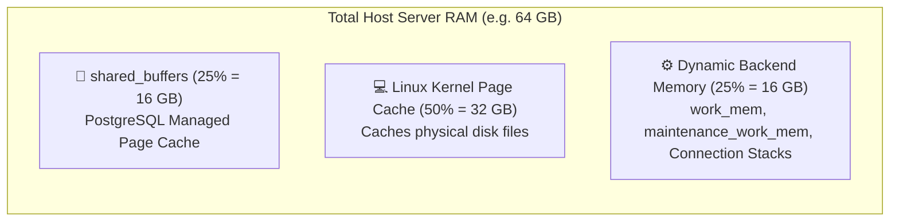
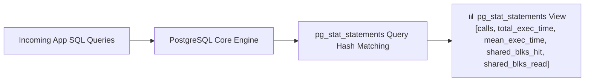
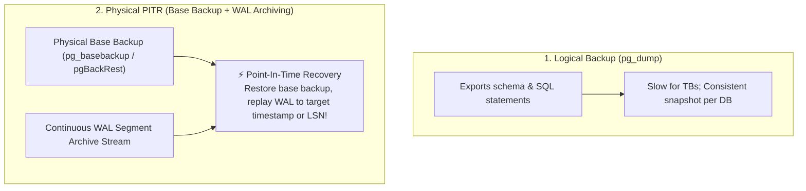
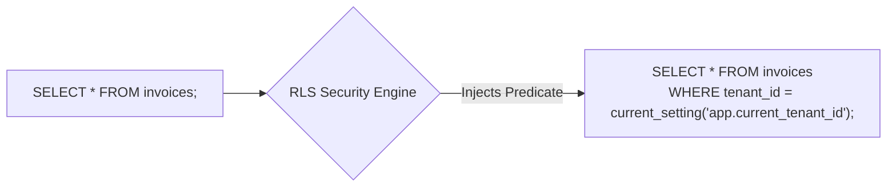

# ⚙️ Production Operations, Monitoring & Tuning

## 🎯 Learning Objectives

By the end of this module, you will be able to:
- Calculate optimal production memory and worker settings (`shared_buffers`, `effective_cache_size`, `work_mem`).
- Enable `pg_stat_statements` telemetry to identify slow queries, I/O bottlenecks, and buffer cache miss ratios.
- Implement physical backups and **Point-In-Time Recovery (PITR)** using continuous WAL archiving.
- Secure multi-tenant database schemas using **Row Level Security (RLS)** policies.
- Configure `pg_hba.conf` for secure SCRAM-SHA-256 client authentication.

---

## 💡 Core Explanation

### 1. Production Memory Allocation Model

PostgreSQL relies heavily on the underlying operating system Linux Kernel Page Cache rather than managing all database memory inside its own daemon space.



#### Key Parameter Formula Rules
1. **`shared_buffers`**: Recommended at **25% of total system RAM**. Setting this higher than 40% degrades performance due to double-buffering between Postgres and the OS page cache.
2. **`effective_cache_size`**: Set to **75% of total system RAM**. This does NOT allocate memory; it informs the optimizer of the total memory available for caching data (PG shared buffers + OS page cache).
3. **`work_mem`**: Allocated per sort/hash node per backend query. Sizing formula:
   ```text
   work_mem = RAM_free_for_queries / (max_connections * avg_sorts_per_query)
   ```
4. **`maintenance_work_mem`**: Set to **512 MB – 2 GB**. Speeds up `VACUUM`, `CREATE INDEX`, and `ALTER TABLE`.

---

### 2. Telemetry & Observability with `pg_stat_statements`

`pg_stat_statements` tracks execution statistics for all SQL statements executed across the server cluster.



#### Key Metrics to Track
- **Buffer Cache Hit Ratio**:
  ```text
  Hit Ratio = (shared_blks_hit / (shared_blks_hit + shared_blks_read)) * 100%
  ```
  *(Target: > 99% for OLTP workloads).*
- **Disk Spill Frequency**: Indicates when `work_mem` is undersized, forcing sorts and hash joins into temporary disk files (`temp_blks_written`).

---

### 3. Backup & Disaster Recovery: Logical vs Physical PITR



#### Point-In-Time Recovery (PITR) Mechanics
1. Take a periodic physical **Base Backup** (e.g. weekly using `pgBackRest` or `pg_basebackup`).
2. Continuously ship completed 16MB WAL segments to remote object storage (S3/GCS) via `archive_command`.
3. To recover from a disaster at `2026-07-23 04:15:00`, restore the last base backup and configure `recovery_target_time = '2026-07-23 04:15:00'`. PostgreSQL replays WAL up to that exact microsecond!

---

### 4. Multi-Tenant Security with Row Level Security (RLS)

Row Level Security (RLS) restricts which rows a database role can read or modify, providing hardware-level tenant isolation even if an application SQL injection vulnerability occurs.



---

## 🛠️ Working Examples

### 1. Production `postgresql.conf` Baseline (64GB RAM / 16 vCPU)

```text
# ------------------------------------------------------------------------------
# PostgreSQL Production Baseline Configuration (64GB RAM, 16 vCPUs, NVMe Storage)
# ------------------------------------------------------------------------------

# Memory Configuration
shared_buffers = 16GB                  # 25% of total RAM
effective_cache_size = 48GB            # 75% of total RAM
work_mem = 64MB                        # Memory per sort/hash operation
maintenance_work_mem = 2GB             # Vacuum & Index creation memory
huge_pages = try                       # Enable OS HugeTLB pages to reduce MMU overhead

# Checkpoint & WAL Tuning
wal_level = replica
max_wal_size = 32GB
min_wal_size = 4GB
checkpoint_timeout = 15min
checkpoint_completion_target = 0.9
archive_mode = on
archive_command = 'test ! -f /mnt/wal_archive/%f && cp %p /mnt/wal_archive/%f'

# Optimizer / Query Planner
random_page_cost = 1.1                 # Optimized for SSD / NVMe
effective_io_concurrency = 200         # Concurrent I/O operations for SSDs
default_statistics_target = 100

# Worker Process Concurrency
max_worker_processes = 16
max_parallel_workers_per_gather = 4
max_parallel_maintenance_workers = 4

# Telemetry
shared_preload_libraries = 'pg_stat_statements'
pg_stat_statements.track = all
pg_stat_statements.max = 10000
```

### 2. Identifying Slow Queries with `pg_stat_statements`

```sql
-- Enable extension
CREATE EXTENSION IF NOT EXISTS pg_stat_statements;

-- Top 5 queries by cumulative execution time
SELECT 
    query,
    calls,
    round(total_exec_time::numeric, 2) AS total_time_ms,
    round(mean_exec_time::numeric, 2) AS avg_time_ms,
    round((100.0 * shared_blks_hit / nullif(shared_blks_hit + shared_blks_read, 0))::numeric, 2) AS cache_hit_pct,
    temp_blks_written AS disk_spills
FROM pg_stat_statements
ORDER BY total_exec_time DESC
LIMIT 5;
```

### 3. Implementing Multi-Tenant Row Level Security (RLS)

```sql
-- Create multi-tenant table
CREATE TABLE tenant_documents (
    id SERIAL PRIMARY KEY,
    tenant_id INT NOT NULL,
    document_name TEXT,
    content TEXT
);

-- Enable Row Level Security
ALTER TABLE tenant_documents ENABLE ROW LEVEL SECURITY;

-- Create security policy restricting access based on session variable
CREATE POLICY tenant_isolation_policy ON tenant_documents
    FOR ALL
    USING (tenant_id = current_setting('app.current_tenant_id')::int);

-- Test isolation policy in session
SET LOCAL app.current_tenant_id = '42';
SELECT * FROM tenant_documents; -- Automatically restricted to tenant 42!
```

---

## ⚠️ Common Pitfalls & Misconceptions

### 1. Oversizing `shared_buffers` to 80% RAM
- **Pitfall**: Allocating 50 GB out of 64 GB RAM to `shared_buffers` like an Oracle or SQL Server installation.
- **Consequence**: Severe performance degradation! PostgreSQL relies on double-caching; writing dirty buffers from `shared_buffers` into OS memory causes double-buffering overhead and memory thrashing. Keep `shared_buffers` at 25%.

### 2. Relying on `pg_dump` as the Sole Backup Strategy
- **Pitfall**: Running a nightly `pg_dump` script on a 3 TB production database.
- **Consequence**: `pg_dump` takes 8 hours to execute, degrades production I/O performance, and provides zero protection against data loss between backup intervals. Use physical backups + WAL archiving for Point-In-Time Recovery.

---

## 🔀 Comparison: Backup Strategies

| Feature | Logical Backup (`pg_dump`) | Physical PITR (`pgBackRest`) |
| :--- | :--- | :--- |
| **Backup Format** | Plaintext SQL or custom tar archive | Raw binary data files + WAL stream |
| **Granularity** | Single table, schema, or database | Entire database cluster |
| **Restore Speed** | Very slow (Must re-run SQL statements & re-index) | Extremely fast (File copy block restore) |
| **Recovery Point Objective (RPO)** | Hours (Data lost since last dump) | **Seconds** (Replays WAL up to crash point) |

---

## ✅ Quick Reference / Cheat-Sheet

```text
Telemetry Views:
  pg_stat_statements       -- Query performance, execution counts, buffer hits
  pg_stat_activity         -- Active backends, wait events, query runtime
  pg_stat_user_tables      -- Dead tuple counts, sequential scans vs index scans

Security & Config:
  pg_hba.conf              -- Client authentication rules (host ssl all scram-sha-256)
  ALTER TABLE tbl ENABLE ROW LEVEL SECURITY;
```

---

[← Previous](./08-partitioning-and-sharding) | [Index](./00-index.mdx) | [Next →](./10-comparisons-and-architectural-trade-offs)
