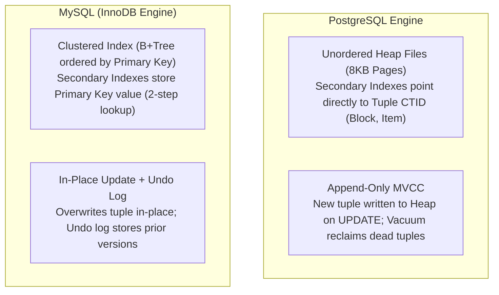
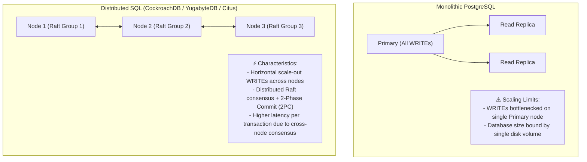
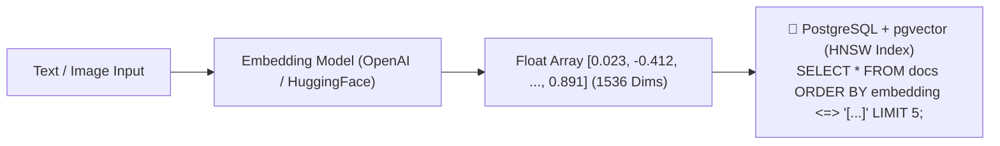

# ⚖️ Comparisons & Architectural Trade-offs

## 🎯 Learning Objectives

By the end of this module, you will be able to:
- Compare the internal architectural trade-offs between PostgreSQL (Heap + MVCC) and MySQL (InnoDB Clustered Index + Undo Logs).
- Evaluate when single-node PostgreSQL with read replicas reaches scale limits and requires Distributed SQL (CockroachDB, YugabyteDB, or Citus).
- Deploy **`pgvector`** for AI vector similarity search and evaluate its performance against dedicated vector databases (Pinecone, Milvus).
- Utilize a structured **Architectural Decision Matrix** to select the right database engine for your system requirements.

---

## 💡 Core Explanation

### 1. PostgreSQL vs MySQL (InnoDB): Deep Architecture

While both are enterprise open-source relational databases, their internal storage engines and concurrency models diverge significantly:



#### Detailed Architectural Comparison

| Architectural Dimension | PostgreSQL | MySQL (InnoDB) |
| :--- | :--- | :--- |
| **Table Storage Engine** | **Heap File** (Unordered data pages) | **Clustered Index** (B+Tree ordered by Primary Key) |
| **Secondary Index Lookups** | Direct read (`ctid` $\rightarrow$ Block, Item). Fast! | Two-step lookup (Secondary Index $\rightarrow$ Primary Key $\rightarrow$ Clustered Index) |
| **MVCC Implementation** | Append-only (New row versions written to Heap) | In-place update + Undo Log historical chain |
| **Garbage Collection** | Autovacuum sweeps dead tuples from Heap pages | Background purge threads truncate Undo Logs |
| **Process vs Thread** | Multi-process (`fork()` per connection) | Multi-threaded (Thread per connection) |
| **Extensibility** | **Extreme** (Custom types, FDWs, GIN/GiST/BRIN, C/Rust extensions) | Moderate (Pluggable storage engine API) |

---

### 2. Monolithic PG vs Distributed SQL (CockroachDB, YugabyteDB, Citus)

When a single PostgreSQL instance reaches scaling limits (e.g. multi-terabyte datasets exceeding write I/O capabilities), engineers evaluate **Distributed SQL**.



#### When to Stay on Monolithic PostgreSQL
- Data volume fits on a single host (up to ~5–10 TB with modern NVMe storage).
- Write volume is under ~20,000 TPS.
- Low-latency single-digit millisecond query response is paramount.

#### When to Migrate to Distributed SQL
- Data volume exceeds 10 TB and single-node backup/restore becomes unmanageable.
- Write throughput requires horizontal scaling across multiple physical nodes.
- Requirement for multi-region active-active deployments with strict zero RPO disaster recovery.

---

### 3. PostgreSQL as a Vector Database (`pgvector`)

With the rise of Generative AI and LLM embeddings, modern applications require vector similarity search. Rather than introducing a dedicated vector database (e.g., Pinecone, Milvus), PostgreSQL supports vector operations natively via **`pgvector`**.



#### `pgvector` Indexing Strategies
- **IVFFlat (Inverted File Flat)**: Groups vectors into clusters. Fast index build time, but lower recall if data changes rapidly.
- **HNSW (Hierarchical Navigable Small World)**: Builds a multi-layer graph of vectors. Offers **high recall (99%+) and low latency**, but consumes more RAM and takes longer to build.

---

## 🛠️ Working Examples

### 1. Vector Search with `pgvector` (HNSW Indexing)

```sql
-- Enable the vector extension
CREATE EXTENSION IF NOT EXISTS vector;

-- Create table storing 1536-dimensional embeddings (e.g. OpenAI text-embedding-3-small)
CREATE TABLE document_embeddings (
    id BIGSERIAL PRIMARY KEY,
    document_title TEXT,
    content TEXT,
    embedding vector(1536)
);

-- Build high-performance HNSW index using Cosine Distance
CREATE INDEX idx_document_embeddings_hnsw 
ON document_embeddings 
USING hnsw (embedding vector_cosine_ops)
WITH (m = 16, ef_construction = 64);

-- Execute Vector Similarity Nearest-Neighbor Search
SELECT 
    document_title,
    content,
    1 - (embedding <=> '[0.012, -0.045, 0.128, ...]'::vector) AS cosine_similarity
FROM document_embeddings
ORDER BY embedding <=> '[0.012, -0.045, 0.128, ...]'::vector
LIMIT 5;
```

---

## 🔀 Architectural Decision Matrix

Use this matrix to guide database selection for new architectural initiatives:

| System Requirement | Recommended Choice | Primary Rationale |
| :--- | :--- | :--- |
| **Standard OLTP Application** (E-commerce, SaaS, Banking) | **PostgreSQL** | Strict ACID guarantees, MVCC, rich data types, mature ecosystem. |
| **Read-Heavy Web App** ($> 90\%$ Reads, simple schema) | **MySQL / PostgreSQL** | Both excel with read replicas; MySQL has slight thread connection efficiency. |
| **Global Multi-Region Active-Write OLTP** | **CockroachDB / YugabyteDB** | Built-in Raft consensus, cross-region multi-master capability. |
| **High-Volume Time-Series** (IoT, Metrics) | **PostgreSQL + TimescaleDB** | Hypertable auto-partitioning, columnar compression (90% space reduction). |
| **Massive Analytical Data Warehouse** (Petabytes) | **ClickHouse / Snowflake** | Columnar storage, vectorised processing for OLAP aggregations. |
| **AI / RAG Embedding Search** (< 50M vectors) | **PostgreSQL + `pgvector`** | Keeps relational data and vector embeddings in a single ACID-compliant database! |

---

## ⚠️ Architectural Anti-Patterns

### 1. The "Micro-Database" Extension Explosion
- **Anti-Pattern**: Replacing dedicated specialized engines (Kafka, Redis, ClickHouse, Pinecone) with PostgreSQL extensions for *every single workload* until PostgreSQL becomes a fragile single point of failure.
- **Guideline**: Use extensions (`pgvector`, `TimescaleDB`) for low-to-medium scale to simplify operations. When vector search or stream queueing reaches massive enterprise scale, decouple into specialized engines.

### 2. Using PostgreSQL as a High-Throughput Queue
- **Anti-Pattern**: Implementing a job queue using `SELECT ... FOR UPDATE SKIP LOCKED` with millions of transient inserts and deletes per hour.
- **Consequence**: Generates severe table bloat, autovacuum thrashing, and index degradation. Use **Apache Kafka** or **RabbitMQ** for high-volume streaming queues.

---

## ✅ Quick Reference / Summary

```text
PostgreSQL Strengths:
  - Extensibility (Custom types, FDWs, pgvector, TimescaleDB, PostGIS)
  - Strict ACID correctness & Advanced Indexing (B-Tree, GIN, GiST, BRIN)
  - SSI (Serializable Snapshot Isolation)

PostgreSQL Limitations:
  - Multi-process model requires connection pooler (PgBouncer)
  - Append-only MVCC requires autovacuum maintenance to prevent bloat
  - Single-primary write bottlenecks require sharding / distributed SQL at scale

Final Pro-Tip for Senior Engineers:
  PostgreSQL is the safest default database choice for 95% of software applications.
  Tune shared_buffers, deploy PgBouncer, enforce indexes, keep autovacuum active,
  and PostgreSQL will reliably power your enterprise infrastructure for decades.
```

---

[← Previous](./09-production-operations-and-tuning) | [Index](./00-index.mdx)
