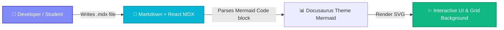
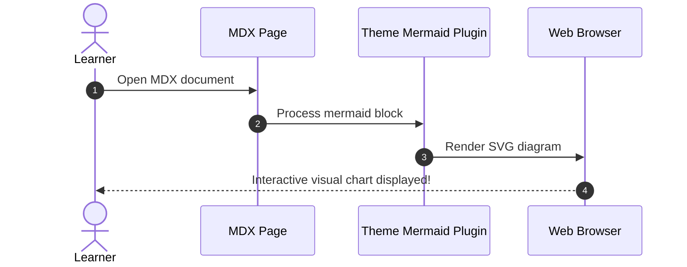

# 📊 MDX & Mermaid Diagram Demo

This page demonstrates that **Mermaid diagrams render directly in `.mdx` files** seamlessly alongside React components, tabs, admonitions, and cards in **GnosisEngine**.

---

## 🎨 Interactive MDX Mermaid Flowchart

The diagram below is rendered directly inside an `.mdx` document file:

---

## 🚀 Sequence Diagram in MDX

You can also include sequence diagrams in `.mdx` files:

---

## 💡 Key Features of MDX + Mermaid

:::tip Canvas Integration
All Mermaid diagrams are wrapped in responsive containers with rounded borders and auto-scrolling on smaller screens.
:::

| Feature | Support in `.md` | Support in `.mdx` |
| :--- | :---: | :---: |
| **Mermaid Flowcharts** | ✅ Yes | ✅ Yes |
| **Sequence Diagrams** | ✅ Yes | ✅ Yes |
| **Class Diagrams** | ✅ Yes | ✅ Yes |
| **React Components** | ❌ No | ✅ Yes |
| **Custom Styling** | ✅ Yes | ✅ Yes |
