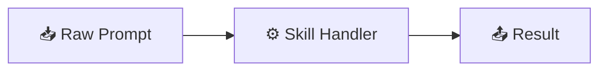

# 🛠️ Skill Creator Guide

This guide explains how to format your **Skill & AI Note Files** so they render beautifully on **GnosisEngine** when pushed to GitHub.

---

## 📝 Recommended Skill File Structure

Every skill file should be stored inside the `docs/` folder (or a subfolder like `docs/skills/`).

```markdown
---
sidebar_position: 1
id: my-new-skill
title: ⚡ My New Skill Title
description: Brief description of what this skill does.
---

# ⚡ My New Skill Title

## 📌 Overview
Provide a clear, high-level summary of the skill.

## 🛠️ Step-by-Step Implementation

1. **Step 1**: Initial setup
2. **Step 2**: Configuration
3. **Step 3**: Execution


```

---

## 💡 Best Practices

:::tip Markdown Formatting Tips

- **YAML Frontmatter**: Include `title`, `sidebar_position`, and `description` at the top of each `.md` file.
- **Diagrams**: Use ` ```mermaid ` code blocks for charts, flowcharts, or architecture diagrams.
- **Callout Boxes**: Use `:::note`, `:::tip`, `:::info`, or `:::warning` for important highlights.
- **Git Push**: Once created locally, push your `.md` files to your GitHub repository to update your public study docs.

:::
