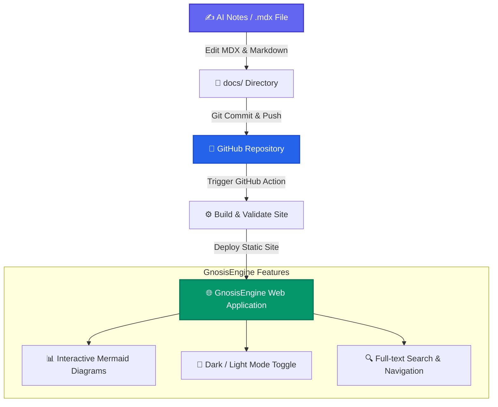
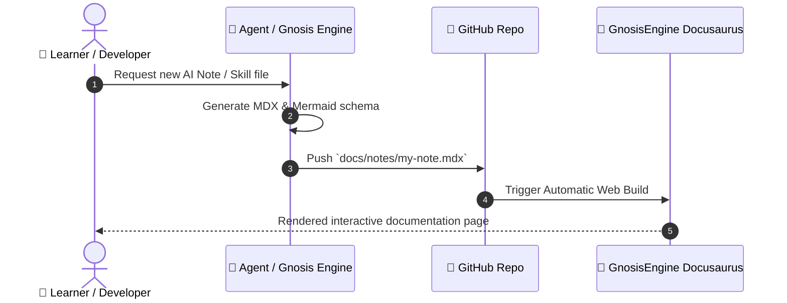
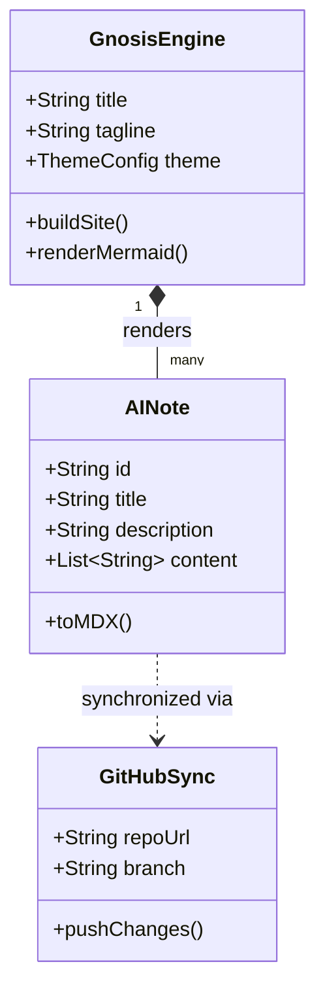

# 🧠 System Architecture & Workflow

This page demonstrates the interactive rendering capabilities of **GnosisEngine**, showcasing how **AI Notes (`.mdx`)**, Skill Files, Markdown documentation, and GitHub synchronization work together seamlessly.

---

## 🔄 AI Notes Lifecycle Flowchart

Below is a live **Mermaid Flowchart** illustrating the step-by-step lifecycle from creating a local AI note file to rendering it on your Docusaurus documentation site.

---

## ⚡ Skill Execution Sequence Diagram

Here is a **Mermaid Sequence Diagram** showing how AI agents or self-study workflows interact with the repository:

---

## 📑 Component Class Structure

---

## 📋 Summary of Architecture

:::note Key Takeaway

By combining **Docusaurus**, **Mermaid**, and **GitHub**, you get:
1. Version-controlled knowledge management.
2. Zero-friction visual diagrams embedded directly in text.
3. Production-ready web interface with grid background aesthetics.

:::
